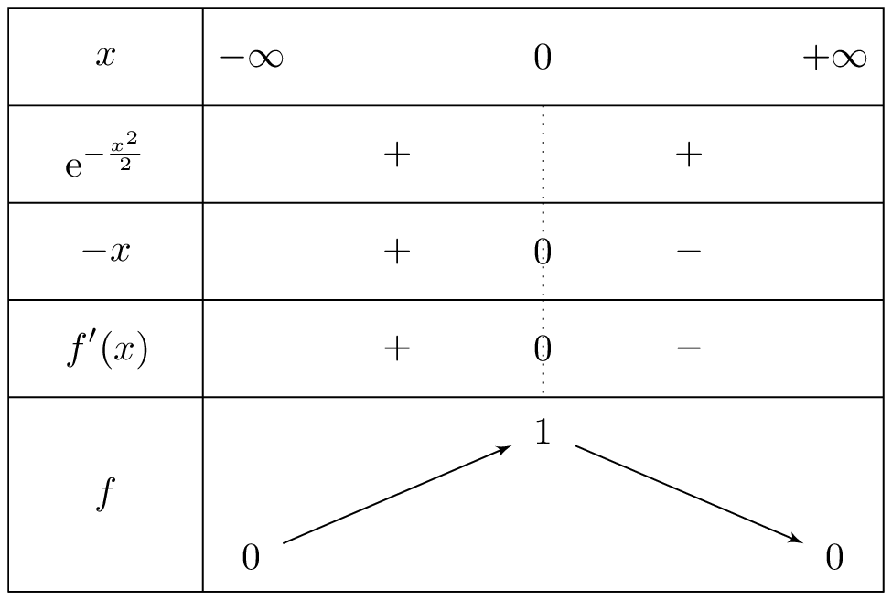
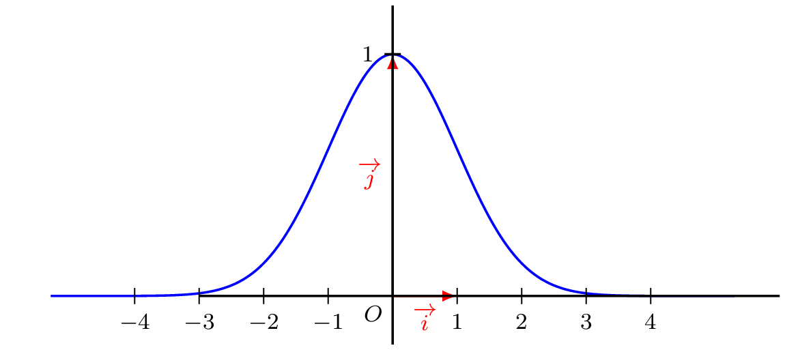
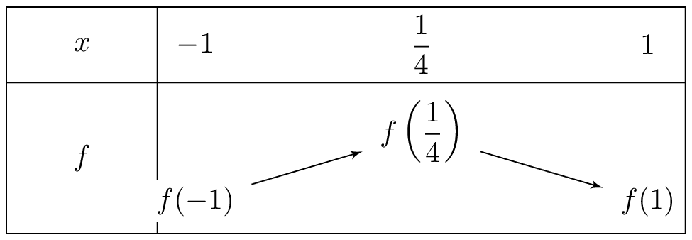

## Complément

::: {.bloc .thm}
Théorème (admis) :  
Soit $u$ une fonction définie et dérivable sur un intervalle $I$. Alors la fonction $e^u$ est définie et dérivable sur $I$ de dérivée $(e^u)'=u'\times e^u$.
:::

::: {.bloc .ex}

Exemple :   

On considère la fonction $f$ définie par $f(x)=e^{-\dfrac{x^2}{2}}$. Étudier les variations de $f$.

Afficher la correction :

$f$ est de la forme $e^u$ avec $u(x)=-\dfrac{x^2}{2}$. 

$u$ est clairement définie et dérivable sur $\mathbb{R}$ donc, d'après la proposition ci-dessus, $e^u$ aussi et on a :
$$f'(x)=\left(-\dfrac{x^2}{2}\right)'\times e^{-\dfrac{x^2}{2}}=-xe^{-\dfrac{x^2}{2}}$$

L'exponentielle étant strictement positive, on en déduit que $f'$ est du signe de $-x$ puis les variations de $f$ :

  

:::

::: {.bloc .rem}
Remarque :  
La fonction $f$ ci-dessus est de la famille des gaussiennes reconnaissables par leurs courbes en forme de cloche. Elles sont très présentes en mathématiques -- notamment dans les probabilités avec les lois normales --, apparaissant dans la résolution de nombreux problèmes issus de la physique, la chimie, la biologie, l'écologie, l'économie...

  

:::

::: {.bloc .ex}

Exemple :   

1. Soit la fonction $f$ définie sur $[-1;1]$ par : $f(x)=(-4x+3)e^{2x+1}$.
   a. Montrer que sur $[-1;1]$, on a : $f'(x)=2(1-4x)e^{2x+1}$.
   
   

Afficher la correction :

   On dérive $f(x)=(-4x+3)e^{2x+1}$ par la règle du produit :
   $$f'(x)=(-4)e^{2x+1}+(-4x+3)\cdot 2e^{2x+1} =\left(-4+2(-4x+3)\right)e^{2x+1}=(2-8x)e^{2x+1}$$
   

   b. Résoudre $f'(x)=0$ puis dresser le tableau de variations de $f$ sur $[-1;1]$. Préciser les valeurs exactes des bornes et des extremums éventuels.
   
   

Afficher la correction :

   On a $f'(x)=2(1-4x)e^{2x+1}$. Comme $e^{2x+1}>0$ pour tout $x$, on obtient : $f'(x)=0 \iff 1-4x=0 \iff x=\dfrac14$.

   Le signe de $f'(x)$ est positif pour $x<\dfrac14$ et négatif pour $x>\dfrac14$.
   
    

    
    

   $f(-1)=7e^{-1}$, $f\left(\dfrac14\right)=2e^{\dfrac32}$, $f(1)=-e^3$.

   Elle admet un maximum local en $x=\dfrac14$ de valeur $2e^{\dfrac32}$, et un minimum global de valeur $- e^{3}$.
   

   c. Déterminer l’équation de la tangente au point d’abscisse $0$.
   
   

Afficher la correction :

   $T_0 \,:\, y= f'(0)(x-0)+ f(0) \Longleftrightarrow T_0\:\, y= 2e x + 3e$
   

   d. La courbe $\mathcal{C}_f$ de la fonction $f$ coupe-t-elle l’axe des abscisses ? Si oui, en quel(s) point(s) ?
   
   

Afficher la correction :

   On résout $f(x)=0 \iff (-4x+3)e^{2x+1}=0$. Comme $e^{2x+1}\neq 0$, on obtient : $-4x+3=0 \iff x=\dfrac34$.  

   La courbe coupe donc l’axe des abscisses au point $\left(\dfrac34 \,;\, 0\right)$.
   

2. Soit la fonction $g$ définie sur $\mathbb{R}$ par : $g(x)=4e^{-3x+2}$. Montrer que la fonction $g$ vérifie la relation pour tout $x\in\mathbb{R}$ : $g'(x)+3g(x)=0$.

Afficher la correction :

$g'(x)=4(-3)e^{-3x+2}=-12e^{-3x+2}$.  

$g'(x)+3g(x)=-12e^{-3x+2}+3\cdot 4e^{-3x+2}=-12e^{-3x+2}+12e^{-3x+2}=0$.  

La relation est donc vérifiée pour tout $x\in\mathbb{R}$.

:::