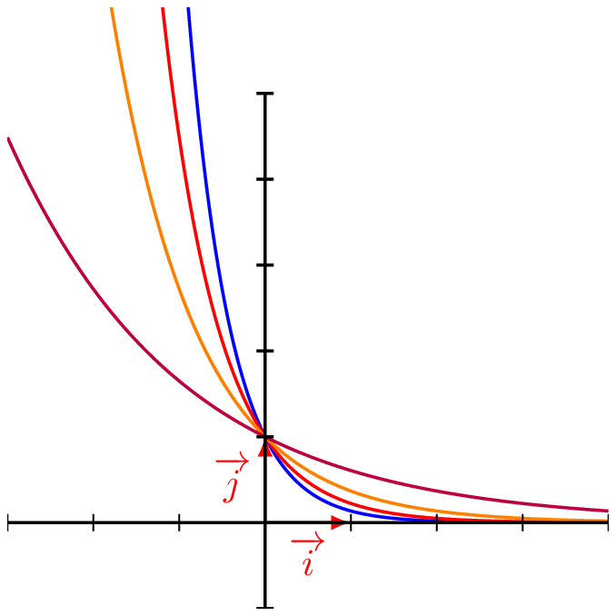
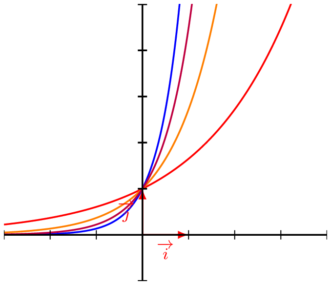

___

## Étude de la fonction : $x \longmapsto \exp(ax+b)$

::: {.bloc .thm}
Théorème :  
Soit $a$ et $b$ deux réels, et $f$ la fonction définie sur $\mathbb{R}$ par $$f(x)=e^{ax+b}$$
Alors $f$ est une fonction dérivable sur $\mathbb{R}$, et $$\forall x \in \mathbb{R},~~f'(x)=ae^{ax+b}$$
:::

Démonstration : 

application de la dérivée de la composée d'une fonction.

::: {.bloc .ex}

Exemple : Extrait bac STL  

Une catastrophe a rendu impropre à la consommation l'eau potable d'une commune. L'eau du réseau contient une substance chimique dont l'évolution de la concentration en fonction du temps $t$ écoulé depuis le début de la pollution est modélisée par la fonction $f$ telle que :
$$f(t)=30e^{-0,06t}$$
La fonction $f$ est définie sur $[0~;~+\infty[$.  
$f(t)$ est en mg$\cdot \text{L}^{-1}$ et $t$ en heures.

1. Calculer $f(0)$. Interpréter ce résultat.
   

Afficher la correction :

$f(0) = 30 e^{-0,06 \times 0} = 30 e^0 = 30$.  
Ainsi au début, il y a $30 \text{mg}\cdot \text{L}^{-1}$ de substance chimique.

2. Quelle est la concentration, à $10^{-2}$ près, de la substance chimique dans l'eau au bout d'une journée ?
   

Afficher la correction :

$f(24) = 30 e^{-0,06 \times 24} \approx 7,11$.  
Donc il ne reste que $7,11 \text{mg}$ par litre d'eau de substance chimique au bout d'une journée.

3. Démontrer que la fonction est décroissante sur $[0~;~+\infty[$
 

Afficher la correction :

$f$ est composée de fonctions dérivable sur $[0 \, ; \, +\infty[$, elle y est donc dérivable, et pour tout réel $t \geqslant 0$,
$$f'(t) = 30 \times (-0,06 e^{-0,06t}) = -1,8 e^{-0,06t}$$

Or la fonction exponentielle est strictement positive, donc pour tout $t \geqslant 0$, $e^{-0,06t} > 0$.  
D'où $f'(t) <0$.  

Ainsi $f$ est décroissante (heureusement !) sur son ensemble de définition.

4. L'eau sera à nouveau consommable si la concentration de la substance chimique dans l'eau est inférieure à 0,05 $mg\cdot L^{-1}$. Au bout de combien de temps pourra-t-on de nouveau consommer l'eau du robinet ? (On pourra utiliser la calculatrice).
:::

::: {.bloc .ex}

Exemple :Extrait DST   

Soit $f$ et $g$ deux fonctions définies sur $\mathbb{R}$ par $f(x)=e^{2x}$ et $g(x) = 2 e^x-1$.  
On note $\mathscr{C}_f$ et $\mathscr{C}_g$ les représentations graphiques respectives de $f$ et $g$.

1. Déterminer $f'(x)$ et $g'(x)$.

Afficher la correction :

Pour tout réel $x$, $f'(x) = 2e^{2x}$ et $g'(x)= 2e^x$

2. a. Démontrer que $\mathscr{C}_f$ et $\mathscr{C}_g$ ont un point commun d'abscisse $0$.

    

Afficher la correction :

    $f(0) =e^{2 \times 0} = e^0 = 1$ et $g(0) = 2 e^0 -1 = 2-1=1$  
    Ainsi les représentations graphiques de $f$ et $g$ ont en commun le point $(0\,;\,1)$.
    

   b. Démontrer qu'en ce point les courbes de $f$ et $g$ ont la même tangente $\Delta$ dont on déterminera l'équation.

    

Afficher la correction :

    $f'(0)= 2 e^{2 \times 0} = 2$ et $g'(0) = 2 e^0 = 2$.  
    Ainsi les représentations graphiques des fonctions $f$ et $g$ ont le point $(0~;~1)$ en commun et en ce point ont des tangentes ayant même coefficient directeur. 
    
    On en déduit que ces tangentes sont confondues, donc en ce point les deux représentations graphiques ont la même tangente.  

    Cette tangente a pour équation $y=f'(0)(x-0)+f(0)$.  
    Donc $\Delta:y=2x+1$
    

3. Soit $h$ la fonction définie par $h(x)=2e^x-2x-2$
   a. Déterminer l'expression de $h'(x)$
   
   

Afficher la correction :

   $h$ est dérivable sur $\mathbb{R}$ comme somme de fonctions dérivables sur $\mathbb{R}$.  

   Pour tout réel $x$, $h'(x)= 2e^x - 2=2(e^x - 1)$.
   

   b. Étudier le signe de $h'(x)$ et en déduire le tableau des variations de $h$.
   
   

Afficher la correction :

   Pour tout réel $x$, $h'(x) \geqslant 0 \Longleftrightarrow e^x-1 \geqslant 0 \Longleftrightarrow e^x \geqslant 1 \Longleftrightarrow x \geqslant 0$.  
   On déduit que :
   - $h'(x) \geqslant 0$ pour $x \geqslant 0$ e
   - $h'(x) \leqslant 0$ pour $x \leqslant 0$.  
   
   

  

   

   c. En déduire que pour tout réel $x$, $$2e^x -1 \geqslant 2x+1$$
   
   

Afficher la correction :

   D'après le tableau des variations, la fonction $h$ admet un minimum en $0$ qui vaut $0$.  

   Donc pour tout réel $x$, $h(x) \geqslant 0 \Longleftrightarrow 2e^x-2x-2 \geqslant 0 \Longleftrightarrow 2 e^x -1 \geqslant 2x+1$
   

   d. En déduire la position relative de $\mathscr{C}_g$ et de $\Delta$.
   
   

Afficher la correction :

   De la question précédente, on déduit que $g(x) \geqslant 2x+1$.  

   Ainsi, on déduit que la courbe représentant la fonction $g$ est au-dessus de sa tangente au point d'abscisse $0$.
   

4. Etudier la position relative de $\mathscr{C}_f$ et $\mathscr{C}_g$.

Afficher la correction :

Pour tout réel $x$, $$f(x) - g(x) = e^{2x} - 2e^x + 1 =(e^x -1)^2$

Ainsi pour tout réel $x$, $$f(x)-g(x) \geqslant 0$$. $ 

Donc $\mathscr{C}_f$ est au dessus de $\mathscr{C}_g$ sur $\mathbb{R}$.

:::

______________________________________

## Comparaison d'exponentielle k

Dans cette partie, on considère que $k$ et $k'$ deux réels strictement positifs.

::: {.bloc .thm}
Théorème :  
Soit $k <k'$ alors :

1. a. $e^{k x} \leqslant e^{k' x}$ pour $ x \in [0 \, ;\,+ \infty[$  
   b. $e^{k x} \geqslant e^{k' x}$ pour $ x \in ]-\infty\, ;\,0]$

  

2. a. $e^{-k x} \geqslant e^{-k' x}$ pour $x \in [0\, ;\,+ \infty[$  
   b. $e^{-k x} \leqslant e^{-k' x}$ pour $x \in ]-\infty\, ;\,0]$

   

:::

Démonstration : 

On le prouve pour $2$.  
Soit $k <k'$, alors $-k>-k'$.

(a) Soit $x < 0$. $k<k' \Longrightarrow -kx < -k'x \Longrightarrow e^{-kx} < e^{-k'x}$.  
On déduit alors que $e^{-k x} \leqslant e^{-k' x}$ pour $x \in ]-\infty\, ;\,0]$

(b) Soit $x \geqslant 0$. $k<k' \Longrightarrow -kx > -k'x \Longrightarrow e^{-kx} > e^{-k'x}$.  
On déduit alors que $e^{-k x} \geqslant e^{-k' x}$ pour $x \in [0\, ;\,+ \infty[$

::: {.bloc .rem}
Illustration graphiqu :  

::: {layout-ncol=2}
::: {#col-decroissantes style="text-align: center;"}

| Courbe | Équation |
|:---:|:---|
| $\mathscr{C}_1$ | $y = \exp(-2x)$ |
| $\mathscr{C}_2$ | $y = \exp(-1,5x)$ |
| $\mathscr{C}_3$ | $y = \exp(-x)$ |
| $\mathscr{C}_4$ | $y = \exp(-0,5x)$ |
:::

::: {#col-croissantes style="text-align: center;"}

| Courbe | Équation |
|:---:|:---|
| $\mathscr{C}_1$ | $y = \exp(2x)$ |
| $\mathscr{C}_2$ | $y = \exp(1,5x)$ |
| $\mathscr{C}_3$ | $y = \exp(x)$ |
| $\mathscr{C}_4$ | $y = \exp(0,5x)$ |
:::
:::
:::

