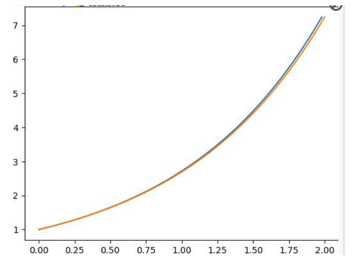

___

::: {.bloc .rem}
## Désintégration atomique et méthode d'Euler

A la toute fin du XIX ème siècle, Marie et Pierre Curie mettent en évidence des éléments radioactifs autres que l'uranium, le polonium et le radium. Des atomes de ces éléments radioactifs se désintègrent en permanence.

Dans un corps radioactif, les noyaux se désintègrent progressivement. Tous les noyaux ont la même probabilité de se désintégrer pendant un laps de temps donné. De plus les noyaux ne vieillissent pas : ils ont la même probabilité de se désintégrer quel que soit leur âge.


Soit $\Delta t$ un intervalle de temps. Le nombre de noyaux qui se désintègrent pendant le temps $\Delta t$ est proportionnel au temps $\Delta t$ et au nombre $N(t)$ de noyaux non désintégrés au temps $t$.

Soit $\Delta N(t)$ la variation du nombre de noyaux pendant le temps $\Delta t$. On admet l’égalité suivante :
$$\Delta N(t) \approx -kN(t)\Delta t \quad (k>0)$$
$$\dfrac{\Delta N(t)}{\Delta t} \approx -kN(t)$$


La constante $k$ dépend du matériau radioactif. Si on admet que la fonction $N$ est dérivable, on peut écrire :
$$\lim_{\Delta t \to 0} \dfrac{\Delta N(t)}{\Delta t} = N'(t)$$

On a donc l'équation différentielle :
$$N'(t) = -kN(t)$$

On recherche donc la fonction $N$ dont on connaît la valeur initiale (le nombre d’atomes non désintégrés au début de l’expérience) et qui vérifie cette relation. Ceci est par exemple appliqué pour la **datation au carbone 14**.
:::


::: {.bloc .rem}

## Construction d'une fonction par la méthode d'Euler

On considère une fonction $f$ définie sur $\mathbb{R}$, vérifiant pour tout réel $x$ :
$$f'(x)=f(x) \quad \text{et} \quad f(0)=1$$

On cherche à construire point par point cette fonction à l'aide de la méthode d'Euler (explicite) sur $[0\, ; +\infty[$.


### Principe de l'approximation :

En utilisant l'approximation affine d'une fonction, on a, pour tout $h$ suffisamment proche de $0$ :
$$f(x_n+h) \approx f(x_n) + h\,f'(x_n)$$

Comme ici $f'(x) = f(x)$, l'approximation devient :
$$f(x_n+h) \approx f(x_n) + h\,f(x_n)$$


### Algorithme et Suites

Soit $n\in\mathbb{N}$ fixé, on pose $h = \dfrac{b-a}{n}$ (le pas).
On définit alors la suite des abscisses $(x_k)$ et des ordonnées $(y_k)$ par :

$$\left\{\begin{array}{l}
x_0=0,\\[2pt]
x_{k+1}=x_k + h
\end{array}\right.
\qquad \text{et} \qquad
\left\{\begin{array}{l}
y_0=1,\\[2pt]
y_{k+1} = y_k + h \times y_k = (1+h)y_k
\end{array}\right.
$$

### Implémentation Python

Voici le script permettant de visualiser cette approximation :

```python
import matplotlib.pyplot as plt
from math import exp

def euler_f(x0, xf, y0, n):
    h = (xf - x0) / n  # le pas
    y = y0             # f(0) = 1
    x = x0
    Y = [y0]           # liste des ordonnées
    X = [x0]           # liste des abscisses
    
    for k in range(n):
        # Calcul de la prochaine ordonnée par Euler explicite
        y = y + h * y 
        x = x + h
        Y.append(y)
        X.append(x)
    return X, Y

# Construction de la solution sur [0;2] avec 100 pas
x, y = euler_f(0, 2, 1, 100)

plt.figure(figsize=(10, 6))
plt.plot(x, y, label="Approximation d'Euler")
plt.title("Construction de la fonction f(x) telle que f'=f et f(0)=1")
plt.xlabel("x")
plt.ylabel("y")
plt.grid(True)
plt.legend()
plt.show()
```

On obtient alors la courbe suivante (en bleu la solution exacte et en rouge l'approximation par la méthode avec $n=100$ sur l'intervalle $[0 \, ; \, 2]$

<div style="text-align: center;">
  
</div>


Pour tout $k \in [\![ 0 \, ; \, n-1 ]\!]$, puisque $f'(x)=f(x)$, on obtient
$$
y_{k+1} = f(x_{k+1}) = f(x_k+h) = f(x_k)+h\,f'(x_k) = y_k + h\,y_k = (1+h)\,y_k
$$

Ainsi, $(y_k)$ est une suite géométrique de raison $(1+h)$ et, pour tout $k \in [\![ 0 \, ; \, n ]\!]$,
$$
y_k = y_0\,(1+h)^k = (1+h)^k.
$$

:::


<div class="nav-pages">
  <a class="next" href="fct_exp.html">➡️</a>
</div>
