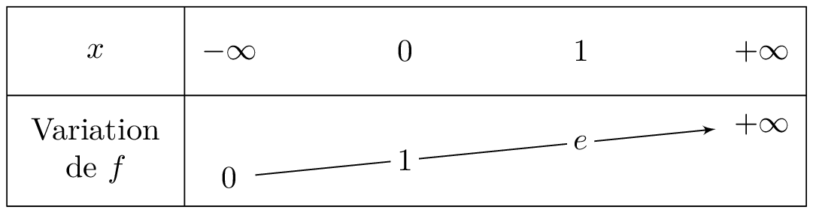
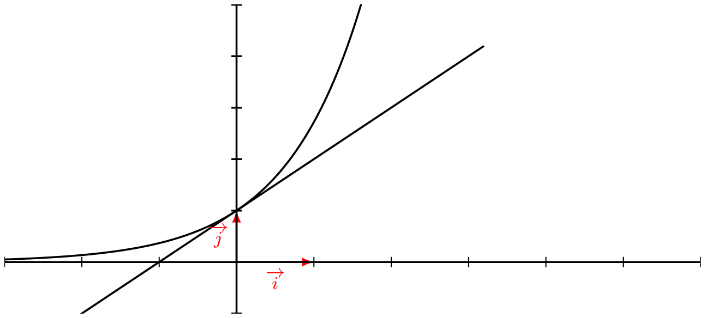

___

## Fonction exponentielle : Positivité

::: {.bloc .thm}
Théorème :  
Pour tout réel $x$, $e^x > 0$.

:::

Démonstration : 

Soit $x$ un réel, alors $e^x = \left(e^{\dfrac{x}{2}}\right)^2$.  

Le carré d'un nombre étant toujours positif et la fonction exponentielle ne s'annulant jamais, on en déduit la stricte positivité de la fonction exponentielle.

::: {.bloc .ex}

Exemple : 

Étudier les variations de la fonction $f$ définie par $f(x) = (1-x)e^x$, ainsi qu'une équation de la tangente au point d'abscisse $1$.

Afficher la correction :

$f$ est produit de fonctions dérivables sur $\R$, elle y est donc dérivable et \[\forall x \in \R, \quad  f'(x) = -\e^x + e^x(1-x)= -x \e^x\]
On sait que pour tout réel $x$, $\e^x > 0$, donc $f'$ est du signe de $-x$.\\
Donc 

- $x \geqslant 0 \Longleftrightarrow f'(x) \leqslant 0$
- $x \leqslant 0 \Longleftrightarrow f'(x) \geqslant 0$

Or le signe de la dérivée donne les variations de la fonction.

On déduit alors que $f$ est croissante sur $]-\infty~;~0]$ et décroissante sur $[0\, ; \, +\infty[$.

L'équation de la tangente au point d'abscisse $1$ est donnée par $$t_1:y = f'(1)(x-1) + f(1)$$
On déduit alors que l'équation de cette tangente est $$t_1:y =-\e(x-1) +  0 = -\e x + \e$$

:::

__________________

## Variation et applications

::: {.bloc .thm}
Théorème :  
La fonction exponentielle est strictement croissante sur $\mathbb{R}$.

:::

Démonstration : 

On a pour tout réel $x$, $\exp(x) = \exp'(x)$, or pour tout réel $x$ $\exp(x)>0$, il en est alors de même de la fonction dérivée de l'exponentielle.

Donc la fonction exponentielle est strictement croissante.

::: {.bloc .rem}
Tableau des variations :

  

Représentation graphique :

  

La droite d'équation $y=x+1$ est la tangente à la représentation graphique de la fonction $\exp$ en $x=0$.

En effet, l'équation de la tangente est donnée en ce point par $$T_0:y=\exp'(0)(x-0)+\exp(0)$$
avec $\exp'(0) = \exp(0) = 1$.

Or pour tout réel $x$, $x+1>x$.

On peut en déduire une relation (qu'il faut savoir redémontrer entièrement) que \[\forall x \in \R, \e^x > x\]

:::

::: {.bloc .rem}
Remarque :  
Ainsi pour deux réels $a$ et $b$ on a 
$$\e^a < \e^b \Longleftrightarrow a<b \et \e^a = \e^b \Longleftrightarrow a=b$$

Ces équivalences nous permettent de résoudre des équations et des inéquations mettant en jeu les nombres $\e^x$.

:::

______________________________________

### Résolution d'équations et inéquations

::: {.bloc .ex}

Exemples : Résolution d'équations 

1. Résoudre $(e^x-1)(e^x+3) = 0$
   

Correction :

Pour tout réel $x$,
$$(\e^x-1)(\e^x+3) = 0 \Longleftrightarrow \e^x=1 \ou \e^x=-3$$

Or la fonction exponentielle est strictement positive, donc $\e^x=-3$ n'admet aucune solution.

La fonction exponentielle est strictement croissante, donc $\e^x=1 \Longleftrightarrow x = 0$.

2. Résoudre $e^{x^2-2} - e^{2x} = 0$
   

Correction :

La fonction exponentielle étant strictement croissante, on a pour tout réel $x$ :

 $$\e^{x^2-2} = \e^{2x} \Longleftrightarrow x^2-2 = 2x \Longleftrightarrow x^2-2 -2x = 0$$

Ce dernier polynôme, admet comme discriminant $\Delta=(-2)^2-4\times 1 \times (-2) = 12 > 0$.

Donc l'équation admet deux solutions, qui sont après simplification $$x_1= \dfrac{1 - \sqrt{3}}{2} \et x_2=\dfrac{1+\sqrt{3}}{2}$$

:::

::: {.bloc .ex}

Exemples : Avec un chanegment de variable 

1. Résoudre $e^x + 1 = 2e^{-x}$ (changement de variable)
   

Correction :

Cette équation est équivalente à $$\e^{2x} + \e^x - 2 = 0$$

Soit en posant $X = \e^x$, avec $X >0$, l'équation s'écrit alors
$$X^2 + X - 2 = $$
Ce dernier polynôme, admet comme discriminant $\Delta=(1)^2-4\times 1 \times (-2) = 9 > 0$.

Donc les solutions sont, après simplification,  $X_1 = 1$ et $X_2 = -2$.

Or l'exponentielle est strictement positive, ainsi

$$\e^{x} + 1 = 2 \e^{-x} \Longleftrightarrow e^x = 1 \Longleftrightarrow x = 0$$

Donc $S=\{0\}$

:::

::: {.bloc .ex}

Exemples : Résolution d'inéquations 

1. Résoudre $(e^x-1)(e-e^x) > 0$
   

Correction :

  

On déduit que $S=]0\,;\,1[$

2. Résoudre l'inéquation $\e^{x^2+2x} \leqslant \e^{x+2}$.

Correction :

La fonction exponentielle étant strictement croissante, alors l'inéquation équivaut à résoudre
$$x^2+2x \leqslant x+2 \Longleftrightarrow x^2+x-2 \leqslant 0$$

D'après ce qui précède les solutions de $x^2+x-2$ sont $1$ et $-2$.

Ainsi $x^2+x-2$ est du signe de $-1$ à l'intérieur des racines.

On déduit que $x^2+x-2 \leqslant 0 \Longleftrightarrow x\in [-2~;~1]$.

Ainsi l'ensemble des solutions de  $\e^{x^2+2x} \leqslant \e^{x+2}$ est $S = [-2 \, ; \, 1]$

:::

::: {.bloc .rem}
Remarque importante :  
Dans chacun des exemples ci-dessous, on cherche à comparer deux exponentielles. C'est la seule solution propre pour résoudre équation et inéquations.

Penser que 
$$\e^a-\e^b = 0 \Longleftrightarrow a - b = 0 $$

est faux au sens où il manque toutes les étapes intermédiaires.

:::

 <a class="prev" href="nombre_e.html">⬅️</a>
  <a class="next" href="exp_u.html">➡️</a>

