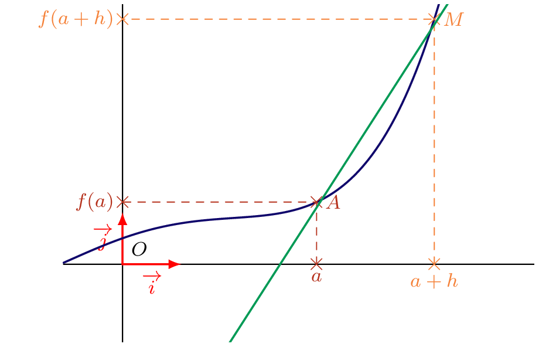
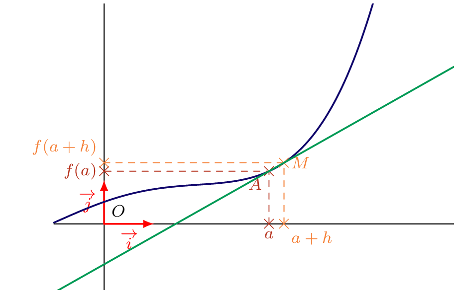
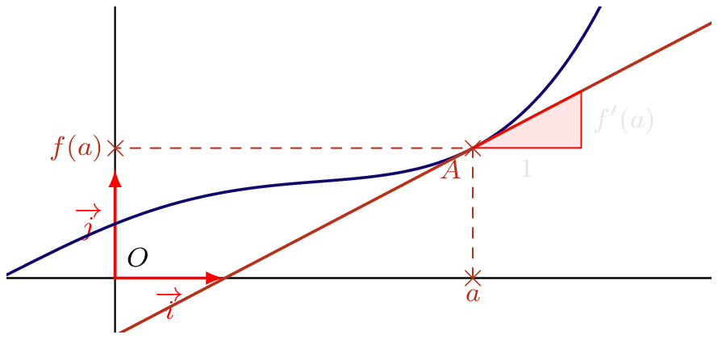
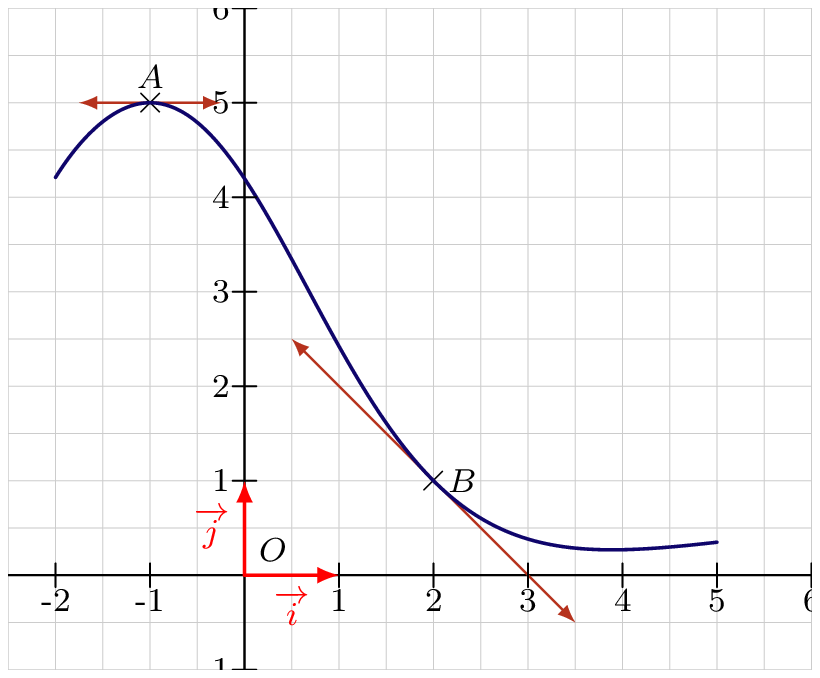

## Tangente à la représentation graphique d'une fonction

::: {.bloc .rem}
On considère une fonction $f$ définie sur $I$ non vide, et dérivable en $a \in I$.  
Faisons alors tendre $h$ vers $0$ (comme pour la définition du nombre dérivé).  
Le point $M$ se rapproche infiniment du point $A$ (sans pour autant être confondu avec le point $A$ !).

  
  

 L'ensemble de ces droites $(AM)$ forme un faisceau de droites.

On peut donc voir le nombre $f'(a)$ comme le coefficient directeur de la \og position limite \fg de ce faisceau de droites sécantes $(AM)$ lorsque le point $M$ se rapproche de $A$.

Cette droite \og limite \fg a un seul point de contact (dans un voisinage proche de $A$) avec $\mathcal{C}_f$, et tend donc à être la tangente en $A$ à $\mathscr{C}_f$.
:::

::: {.bloc .thm}
Théorème :  
Soit $f$ une fonction dérivable en $a$.  
$f'(a)$ est le coefficient directeur de la tangente au point d'abscisse $a$.
:::

{width=45%}

::: {.bloc .ex}

Exemple : **Déterminer graphiquement un nombre dérivé**  
*
Sur le graphique ci-dessous, on a tracé la courbe représentative $\mathcal{C}_f$ d'une fonction $f$ définie et dérivable en tout point de l'intervalle $[-2 \,;\, 5]$.  
On sait que :

- la tangente au point $A(-1\,;\, 5)$ à la courbe $\mathcal{C}_f$ est parallèle à l'axe des abscisses ;
- la tangente au point $B(2\,;\, 1)$ à la courbe $\mathcal{C}_f$ coupe l'axe des abscisses au point de coordonnées $C (3 \,;\, 0)$.

{width=45%}

Déterminons $f'(-1)$ et $f'(2)$.

Afficher la correction

Le nombre dérivé en $a$ est le coefficient directeur de la tangente au point d'abscisse $a$.

- La tangente en $-1$ étant parallèle à l'axe des abscisses, son coefficient directeur est nul.  
  Ainsi $f'(-1) = 0$.  
- La tangente en $B$ passe par les points $B(2, 1)$ et $(3, 0)$ :  
  Le coefficient directeur de $(BC)$ est $$\dfrac{1 - 0}{2 - 3} = -1$
   donc $f'(2) = -1$$

:::

::: {.bloc .thm}
Théorème :  
Soit $f$ une fonction dérivable en $a$, alors $\mathcal{C}_f$ admet une tangente au point d'abscisse $a$ d'équation :  
$$y = f'(a)(x - a) + f(a)$$
:::

Démonstration :

$f$ est dérivable en $a$, donc $f'(a)$ est le coefficient directeur de la tangente de $f$ en $a$.  
Elle admet donc une équation réduite de la forme :
$$y = f'(a)x + p$$

Le point $A(a\,;\,f(a))$ appartient à $\mathcal{C}_f$ donc vérifie cette équation :
$$f(a) = f'(a)a + p \Rightarrow p = f(a) - f'(a)a$$

Ainsi l'équation est :
$$y = f'(a)x + f(a) - f'(a)a = f'(a)(x - a) + f(a)$$

::: {.bloc .ex}
Exemple :  

Soit $f$ définie sur $D_f = ]0\,;\,+\infty[$ par $f(x) = \dfrac{1}{x^2}$.

1. Montrer que $f$ est dérivable en $3$.

Afficher la correction

Pour tout $h \neq 0$,
$$
\dfrac{f(3+h)-f(3)}{h} = \dfrac{\dfrac{1}{(h+3)^2}-\dfrac{1}{9}}{h}
= \dfrac{9-(h+3)^2}{9h(h+3)^2}
= -\dfrac{h+6}{9(h+3)^2}
$$

Or $$\lim_{h\to0}-\dfrac{h+6}{9(h+3)^2}=-\dfrac{6}{81}=-\dfrac{2}{27}$$
Donc $f$ est dérivable en $3$, avec $f'(3)=-\dfrac{2}{27}$ et $f(3)=\dfrac{1}{9}$

2. En déduire l'équation de la tangente au point d'abscisse $3$.

Afficher la correction

Soit $T_3$ l'équation de la tangente au point d'abscisse $3$ :

$$
\begin{aligned}
M(x \;\,y) \in T_3 &\Longleftrightarrow T_3 \, : \, y = f'(3)(x - 3) + f(3) \\
&\Longleftrightarrow T_3 \, : \, y = - \dfrac{2}{27}(x - 3) + \dfrac{1}{9} \\
&\Longleftrightarrow T_3 \, : \, y = f'(3)(x - 3) + f(3) = -\dfrac{2}{27}x + \dfrac{1}{3}
\end{aligned
$$

Donc l'équation cherchée est :  

$$
T_3 \,:\, y = - \dfrac{2}{27}x + \dfrac{1}{3}
$$

:::

----

## Approximation affine et déveloippement limité

::: {.bloc .rem}
Interprétation locale :  

Comme nous l'avons vu graphiquement, lorsque l'on effectue un \og zoom \fg sur le point $A(a\,;\,f(a))$, la courbe $\mathcal{C}_f$ et sa tangente $T_a$ finissent par paraître confondues. Sur un intervalle très petit autour de $a$, la courbe est presque indiscernable de sa tangente.

Mathématiquement, cela signifie que pour une petite variation $h$ autour de $a$, la valeur $f(a+h)$ est très proche de l'ordonnée du point de la tangente d'abscisse $a+h$.
:::

::: {.bloc .def}
Définition :  
Soit $f$ une fonction dérivable en $a$. On appelle \textbf{développement limité à l'ordre 1} de $f$ en $a$ (ou approximation affine) l'écriture :

$$
f(a+h) = f(a) + h f'(a) + h \epsilon(h) \quad \text{avec} \quad \lim_{h \to 0} \epsilon(h) = 0
$$

On écrit souvent l'approximation : $f(a+h) \approx f(a) + h f'(a)$.
:::

::: {.bloc .thm}
Propriété :  
Si $f$ est dérivable en $a$, alors pour $h$ proche de $0$, on peut approcher $f(a+h)$ par la fonction affine :

$$
f(a+h) \approx f(a) + h f'(a)
$$

Cette approximation est appelée approximation affine de $f$ au voisinage de $a$.
:::

Démonstration : 

Démontrons que c'est la meilleure approximation affine.

On cherche une fonction affine $g(h) = \alpha h + \beta$ qui soit proche de $f(a+h)$ au voisinage de $h=0$.

   - Pour que l'approximation soit cohérente en $h=0$, il faut que $f(a+0) = g(0)$, donc $f(a) = \beta$.
   - Soit $E$ la fonction erreur; c'est à dire la fonction définie par $$E(h) = f(a+h) - (f(a) + \alpha h)$$
Pour que cette approximation soit la meilleure possible, il faut que l'erreur tende vers $0$ plus vite que $h$, c'est-à-dire que $\lim_{h \to 0} \dfrac{E(h)}{h} = 0$.
Or 
  $$
  \dfrac{f(a+h) - f(a) - \alpha h}{h} = \dfrac{f(a+h) - f(a)}{h} - \alpha
  $$

Ainsi,  en passant à la limite quand $h \to 0$, on obtient par définition du nombre dérivé : $f'(a) - \alpha = 0$, soit $\alpha = f'(a)$.

La seule fonction affine satisfaisant cette précision est donc bien $h \longmapsto f(a) + h f'(a)$.

::: {.bloc .rem}
Remarque :  
Il est souvent utile, pour simplifier des calculs, de remplacer une fonction complexe par son approximation affine au voisinage d'un point remarquable.
:::

::: {.bloc .ex}

Exemple    

Estimation de $\sqrt{1,002}$ sans calculatrice.

Afficher la correction :

Soit $f(x) = \sqrt{x}$ au voisinage de $a=1$. On a $f(1)=1$ et $f'(1) = \dfrac{1}{2\sqrt{1}} = 0,5$.
En posant $h = 0,002$, on utilise l'approximation affine :
$$f(1+h) \approx f(1) + h f'(1)$$

$$\sqrt{1,002} \approx 1 + 0,002 \times 0,5 \approx 1,001$$

:::

  <a class="prev" href="definition.html">⬅️</a>
  <a class="next" href="DerivUsuelles.html">➡️</a>

