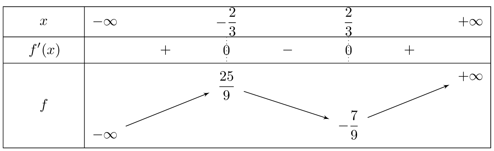
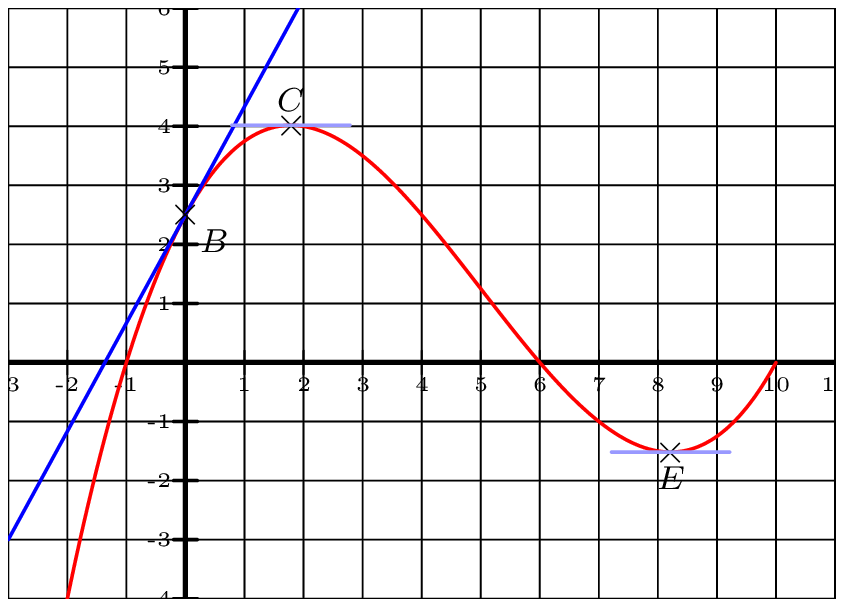
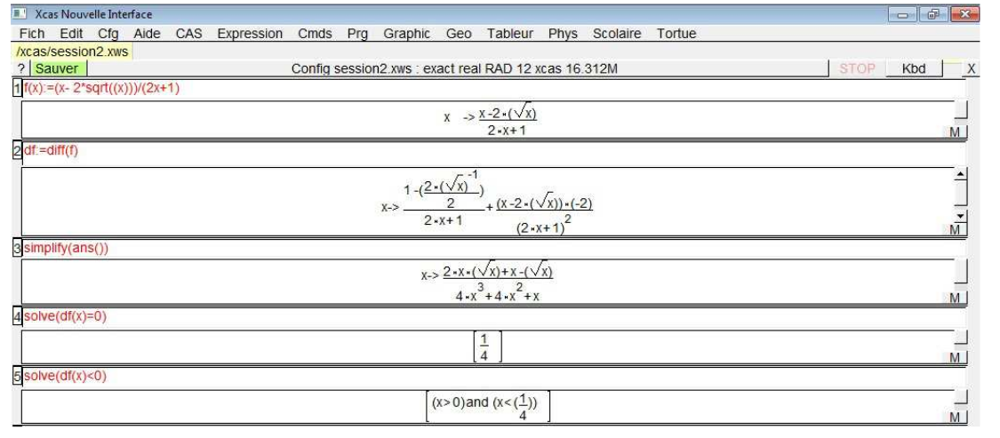
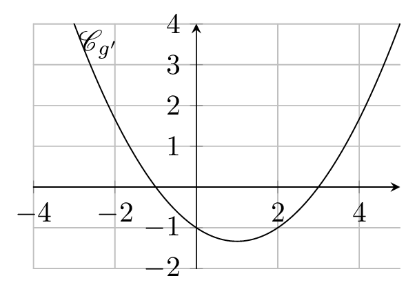

### Variation d'une fonction

::: {.bloc .thm}
Théorème (admis) :  
Soit $f$ une fonction dérivable sur un intervalle $I$, alors

1. $f$ est croissante sur $I$ si et seulement si, pour tout $x \in I$, $f'(x) \geqslant 0$ ;
2. $f$ est décroissante sur $I$ si et seulement si, pour tout $x \in I$, $f'(x) \leqslant 0$.
:::

::: {.bloc .rem}

Remarques importantes

* Caractérisation des fonctions constantes : Si $f'(x) = 0$ en tout point d'un **intervalle** $I$, alors $f$ est constante sur $I$. Ce résultat, bien qu'intuitif, repose sur des outils plus avancés (le théorème des accroissements finis).

* Importance de la notion d'intervalle : Les théorèmes liant le signe de la dérivée aux variations ne s'appliquent que sur un **intervalle**. Si le domaine est une réunion d'intervalles disjoints, le résultat peut être mis en défaut.

Contre-exemple : 

Considérons la fonction $f : x \longmapsto x + \dfrac{4}{x}$ définie sur $D_f = \mathbb{R}^*$.

$f$ est dérivable sur les intervalles $I_1 = ]-\infty \,;\, 0[$ et $I_2 = ]0 \,;\, +\infty[$.

Pour tout $x \in D_f$, on a :
$$f'(x) = 1 - \dfrac{4}{x^2} = \dfrac{x^2 - 4}{x^2} = \dfrac{(x-2)(x+2)}{x^2}$$

Sur l'union d'intervalles $K = [-2 \,;\, 0[ \cup ]0 \,;\, 2]$, on remarque que $f'(x) \leqslant 0$. 

On pourrait hâtivement penser que $f$ est décroissante sur $K$.

Pourtant :

* $f(-2) = -2 + \dfrac{4}{-2} = -4$
* $f(2) = 2 + \dfrac{4}{2} = 4$

On constate que $f(2) > f(-2)$ alors que $2 > -2$. La fonction n'est donc pas décroissante sur $K$. 

Cela illustre que la propriété de décroissance ne se "transmet" pas automatiquement d'un intervalle à un autre si le domaine est déconnecté.
:::

::: {.bloc .ex}

Exemple  Etudes varaitions d 'une fonction'  

On considère les fonctions $f$ et $g$ définies respectivement sur $\R$ et sur $D_g = \R-\{-2~;~2\}$ par $f(x) = 3x^3 -4x + 1$. 
Étudier les variations de $f$.

Afficher la correction

$f$ est une fonction polynôme donc dérivable sur $\R$. 
Pour tout $x \in \R$, $$f'(x) = 9x^2 - 4 = (3x - 2)(3x + 2).$$
$f'(x)$ est du signe de son coefficient dominant $9$, sauf entre les racines où il est du signe contraire. 

  

Ainsi, on peut conclure que : 

- $f$ est croissante sur $\left]-\infty~;~-\dfrac{2}{3} \right]$ et sur $\left[\dfrac{2}{3}~;~+ \infty \right[$ ;
- $f$ est décroissante sur $\left[-\dfrac{2}{3}~;~\dfrac{2}{3} \right[$.

:::

::: {.bloc .ex}

Exemple  A partir d'un graphique  

On considère une fonction $f$ définie et dérivable sur l'intervalle $[-2 ; 10 ]$ représentée graphiquement par la courbe $C_f$ ci-dessous. La droite $D$ est la tangente à $C_f$ au point $B$ et les tangentes aux points $C$ et $E$ sont parallèles à l'axe des abscisses.

  

1. Déterminer $f'(0)$, puis une équation de la tangente en $B$.
   
   

Afficher la correction

   $f'(0)$ est le coefficient directeur de la tangente au point d'abscisse $0$. 
   Graphiquement $$f'(0) = \dfrac{-2 - 2,5}{-2,5 - 0} = \dfrac{-4,5}{-2,5} = 1,8.$$ 
   De plus $D : y = 1,8x + 2,5$.
   

2. Déterminer le signe de $f'(x)$.
   
   

Afficher la correction

   Graphiquement $f$ est croissante sur $[-2 \, ; \, 1,8]$ et sur $[8,2 \, ; \,10]$, et décroissante sur $[1,8\, ; \,8,2]$. 
   On déduit alors que $f'(x) \geqslant 0$ pour $x \in [-2 \, ; \, 1,8] \cup [8,2 \, ; \, 10]$ puis que $f'(x) \leqslant 0$ pour $x \in [1,8\,;\,8,2]$.
   

3. Déterminer les variations d'une fonction dont $f$ est la fonction dérivée.
   
   

Afficher la correction

   $f$ est positive sur $[-1\, ; \,6]$, et négative sur $[-2 \, ; \, -1] \cup [6 \, ;\,10]$. 
   Donc la fonction dont $f$ est la dérivée est décroissante sur $[-2 \, ; \, -1]$, puis croissante sur $[-1~;~6]$, puis décroissante sur $[6 \, ; \, 10]$.
   

:::

::: {.bloc .rem}
Remarque :  
Il ne faut pas avoir constamment recours à la fonction dérivée pour étudier les variations d'une fonction. 
Soit par exemple la fonction définie par $f(x) = \dfrac{1}{x} +\dfrac{1}{\sqrt{x}}$. 
Les variations se déterminent facilement, puisqu'il s'agit de la somme de deux fonctions décroissantes, donc elle est décroissante. 
On peut montrer que sa dérivée est donnée par
$$
f'(x) \;=\; -\dfrac{1}{x^2}\;-\;\dfrac{1}{2x^{3/2}}
\;=\; -\,\dfrac{2\sqrt{x}+x}{2\,x^2\sqrt{x}}.
$$
Il faut un peu de maîtrise algébrique pour étudier le signe ...

:::

**Utilisation de Xcas** 

  

Ce qui nous permet de connaître les variations de la fonction.

::: {.bloc .ex}
Exemple : 

Soit $g$ une fonction définie et dérivable sur $[-3\,; \, 5]$ vérifiant $g(0)=2$.  
On note $g'$ sa fonction dérivée et on considère ci-dessous la représentation graphique de la fonction $g'$.

  

1. Soit $g''$ la dérivée de $g'$. Établir le tableau de signes de $g''(x)$.
 
   

Afficher la correction

   La fonction $g'$ est décroissante sur $]-\infty \, ; \, 1]$ et croissante sur $[1 \, ; \, +\infty[$. On en déduit alors que  

  

   

2. Décrire les variations de la fonction $g$.
   
   

Afficher la correction

   On déduit de la représentation graphique de $g'$ le tableau de signes suivant : 
   

  

 
   Ainsi : 
    
   - la fonction $g$ est croissante sur $]-\infty\, ; \, -1]$ et sur $[3\, ; \, +\infty[$ ;
   - la fonction $g$ est décroissante sur $[-1\, ; \, 3]$.
   

3. Soit $T_0$ la tangente à $\mathscr{C}_g$, la représentation graphique de $g$, au point d'abscisse $0$.
   
   En justifiant la réponse, dire si $T_0$ passe par le point $A(2\, ;\, 0)$. 
   

Afficher la correction

   Soit $M(x \, ; \, y)$ un point du plan. Alors
   $$
   M(x \, ; \,y) \in T_0 \Longleftrightarrow  T_0 : y = g'(0)(x-0)+g(0) \Longleftrightarrow  T_0 : y = -x+2.
   $$
   Or $-2+2 = 0$, donc le point de coordonnées $(2\, ; \, 0)$ appartient bien à la tangente $T_0$.
   

:::

  <a class="prev" href="composition.html">⬅️</a>
  <a class="next" href="extrema.html">➡️</a>

