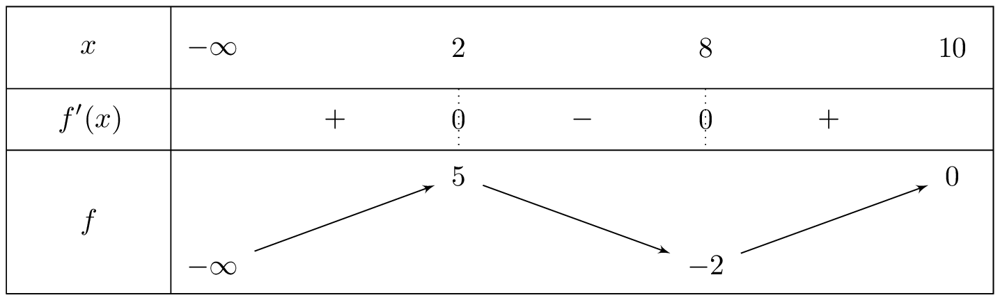
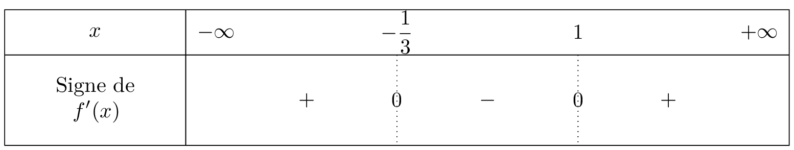
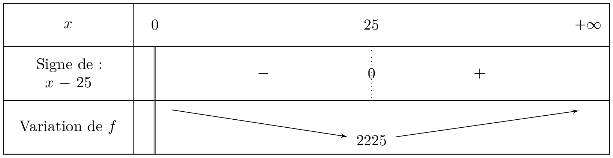

### Extrema locaux

::: {.bloc .def}
Définition :  

- On dit que $f$ admet $M$ comme maximum sur $I$ s’il existe un réel $a \in I$ tel que $f(a)=M$ et, pour tout $x \in I$, $f(x) \leqslant M$. 
- On dit que $f$ admet $m$ comme minimum sur $I$ s’il existe un réel $a \in I$ tel que $f(a)=m$ et, pour tout $x \in I$, $f(x) \geqslant m$. 
- On dit que $f$ admet un extremum si $f$ admet un maximum ou un minimum. 
- Si $f$ admet un minimum et un maximum, alors $f$ est dite bornée.

:::

::: {.bloc .ex}
Exemple :  
On considère la fonction $f$ définie sur $\R$ par $f(x) = \dfrac{x}{1+x^2}$. Montrer que $f$
 est borné

 

Afficher la correction :

  A l'aide de la calculatrice on conjecture que $f(x)$ est bornée par $\dfrac12$ et $-\dfrac12$.

  Pour tout réel $x$ :  

  - $\displaystyle \dfrac{1}{2} -f(x) =  \dfrac{1}{2} - \dfrac{x}{1+x^2}  = \dfrac{1+x^2-2x}{2(1+x^2)} = \dfrac{(x-1)^2}{2(1+x^2)} \geqslant 0$ ; 
  - $\displaystyle f(x)+\dfrac{1}{2} =  \dfrac{x}{1+x^2} + \dfrac{1}{2} =  \dfrac{x^2+1+2x}{2(1+x^2)} = \dfrac{(x+1)^2}{2(1+x^2)} \geqslant 0$. 
  On en déduit que, pour tout réel $x$, $f(x) \in \left[-\dfrac{1}{2} \, ; \, \dfrac{1}{2}\right]$, donc $f$ est bornée.

:::

::: {.bloc .ex}
Exemple :  
On considère la fonction $f$ définie sur $]-\infty \, ; \, 10]$ dont le tableau des variations est : 
   

  

 
La fonction $f$ : 
- admet un maximum en $2$, qui vaut $5$ ;  
- n'admet pas de minimum.

:::

::: {.bloc .def}
Définition :  
Soit $f$ une fonction définie sur un intervalle $I$, et $x_0 \in I$.  

1. On dit que $f$ admet un maximum (resp. minimum) local en $a$ s’il existe un intervalle ouvert $J$, $J \subset I$, tel que $f(a)$ soit le maximum (resp. minimum) de $f$ sur $J$. 
2. On dit que $f$ admet un extremum local en $a$, si $f$ admet un maximum ou un minimum local en $a$.
:::

::: {.bloc .ex}
Exemple :  
Dans l'exemple précédent :  
La fonction $f$ :

- admet un maximum en $2$ qui vaut $5$, c'est aussi un maximum local ;  
- admet un minimum local en $8$ qui vaut $-2$.
:::

::: {.bloc .thm}
Théorème :  
Soit $f$ une fonction dérivable sur un intervalle $I$ ouvert, et $x_0 \in I$. 
$f$ admet un extremum local en $x_0$ si et seulement si la dérivée s'annule en changeant de signe de part et d'autre de $x_0$.
:::

Démonstration : 

Soit $f$ une fonction dérivable sur un intervalle ouvert $I$.  

* On suppose que $f'$ s'annule en $x_0$ en changeant de signe et traitons le cas de l'existence d'un maximum :  
pour tout $x \in ]a~;~x_0]$, $f'(x) > 0$ et pour tout $x \in [x_0~;~b[$, $f'(x) < 0$.  
Donc $f$ est croissante sur $]a~;~x_0]$ et décroissante sur $[x_0~;~b[$.  
Elle admet donc un maximum local en $x_0$.

* On suppose que $f$ admet un maximum en $x_0$ sur un intervalle $]a~;~b[$.  
Ainsi, pour $h > 0$ : 
$$\dfrac{f(x_0 + h) - f(x_0)}{h} \leq 0$$
et pour $h < 0$ : 
$$\dfrac{f(x_0 + h) - f(x_0)}{h} \geq 0$$
Donc en faisant tendre $h$ vers $0$, on a : 
$$f'(x_0) \leq 0 \quad \text{et} \quad f'(x_0) \geq 0$$
Donc $f'(x_0) = 0$.

::: {.bloc .rem}
Remarque :  
La condition « en changeant de signe » pour montrer l'existence d'un extremum est très importante. 
En effet, considérons la fonction $f$ définie et dérivable sur $\R$ par $f(x) = x^3$. On a pour tout $x \in \R$, $f'(x) = 3x^2$ et $f'(0) =0$. Cela ne suffit pas pour conclure à l'existence d'un extremum. 
$f'$ est une fonction carrée, donc $f'(x)$ est toujours positif. La dérivée ne changeant pas de signe, la fonction $f$ n'admet pas d'extremum local en $0$.

:::

::: {.bloc .ex}

Exemple

En reprenant l'exemple de la fonction $g$ précédente, on a 
$$
g'(x) = 0 \Longleftrightarrow \left\{\begin{array}{l}
x=x_1\\
\text{ou}\\
x=x_2
\end{array} \right.
$$
De plus, les dérivées en $x_1$ et en $x_2$ s'annulent en changeant de signe, on déduit que la fonction $g$ admet des extrema en ces abscisses.  
Le tableau des variations permet de conclure que $g$ admet un minimum local en $x_1$ et un maximum local en $x_2$.

:::

::: {.bloc .ex}

Exemple

1. On considère la fonction définie sur $\mathbb{R}$ par $f(x)=x^3-x^2-x-1$. Déterminer la dérivée de $f$.
   

Afficher la correction :

$f$ est une fonction polynôme donc dérivable sur $\mathbb{R}$. Pour tout $x \in \mathbb{R}$, $f'(x)=3x^2-2x-1$.

2. Montrer que, pour tout réel $x$, $$f'(x)= 3 \left(x + \dfrac{1}{3} \right)(x-1).$$
  

Afficher la correction :

$f'(x)$ est une fonction polynôme de degré $2$ et $1$ est une racine évidente de ce trinôme ($3(1)^2 - 2(1) - 1 = 0$), donc il admet une seconde racine $x_2$ vérifiant $1 \times x_2 = \frac{c}{a} = -\dfrac{1}{3}$, soit $x_2=-\dfrac{1}{3}$.

On déduit du théorème de factorisation que, pour tout réel $x$ :
$$f'(x)=3 \left(x + \dfrac{1}{3} \right)(x-1)$$

3. a. La représentation graphique de $f$ admet-elle des extrema locaux ?

Afficher la correction :

$f'(x)$ est un polynôme du second degré ayant deux racines réelles distinctes. Il est donc du signe de son coefficient dominant ($a=3 > 0$) à l'extérieur des racines et du signe contraire à l'intérieur.

 

La dérivée s'annule et change de signe en $-1/3$ et en $1$, donc $f$ admet deux extrema locaux :

* En $-1/3$, la dérivée passe du positif au négatif : $f$ admet un **maximum local**.
* En $1$, la dérivée passe du négatif au positif : $f$ admet un **minimum local**.

b. Ces extrema sont-ils globaux ?

Afficher la correction :

On a $f(2) = 1$ et $f(1) = -2$. Comme $f(2) > f(1)$, le maximum local n'est pas global.  

De même, $f(-2) = -11$ et $f(-1/3) \approx -0,81$. 

Comme $f(-2) < f(-1/3)$, le minimum local n'est pas global.

:::

::: {.bloc .ex}
Exemple :  
On souhaite fabriquer des boîtes de rangement sans couvercle. Les boîtes auront la forme d’un parallélépipède rectangle de hauteur 16 cm et de base un rectangle ayant pour dimensions $x$ et $y$ exprimées en cm. Chaque boîte a un volume de 10 000 cm\up{3}.  

1. Montrer que $y=\dfrac{625}{x}$. 

Afficher la correction

D'après l'énoncé, $16xy=10000$, donc $y=\dfrac{10000}{16x} = \dfrac{625}{x}$.

1. Pour toute valeur de $x$, on note $f(x)$ l’aire de la boîte (du parallélépipède rectangle) sans le couvercle. Démontrer que pour tout  $x >0$, 
$$f(x)= \dfrac{20\, 000}{x} +32x + 625.$$

Afficher la correction

L'aire de la boîte est donnée par la somme des aires des deux parties latérales de côtés $16 \times x$, des deux parties latérales de côtés $16 \times y$ et du fond de la boîte de côté $x \times y$. 
Ainsi, pour tout $x \in \,]0 \, ; \,+ \infty[$,
$$f(x) = 2 \times 16x + 2 \times 16y + xy = 
32x + 32 \times \dfrac{625}{x} + x\dfrac{625}{x} = \dfrac{20\, 000}{x} +32x + 625.$$

1. Quelles dimensions doit-on donner à ces boîtes pour que leur surface ait une aire minimale ? 

Afficher la correction

$f$ est une fonction rationnelle donc dérivable sur son ensemble de définition. Pour tout réel $x >0$,
$$
f'(x)= -\dfrac{20\,000}{x^2} + 32
= \dfrac{32x^2-20\,000}{x^2}
= 32 \times \dfrac{x^2-625}{x^2}
= 32\times \dfrac{(x-25)(x+25)} {x^2}.
$$
Pour tout $x >0$, $\dfrac{32(x+25)}{x^2}>0$, donc $f'(x)$ est du signe de $(x-25)$. 
   

  

 
On déduit que les dimensions de la boîte pour que l'aire soit minimale sont $x=25$ et $y=\dfrac{625}{25}=25$. Donc le parallélépipède est à base carrée.

:::

  <a class="prev" href="applications.html">⬅️</a>

