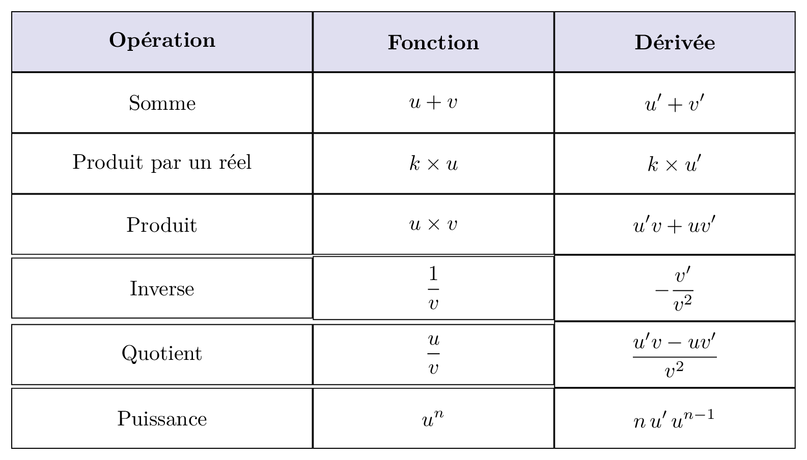

-----

### Somme, produit, quotient

::: {.bloc .thm}
Théorème : linéarité de la dérivation 
Soient $f$ et $g$ deux fonctions dérivables sur un intervalle $I$, et $k$ un réel, alors 
$$(f +g)'(x) = f'(x) + g'(x) \quad \et \quad (kf)'(x) = k.f'(x)$$
:::

Démonstration : 

Pour tout $a \in I$,  $k$ un réel et tout $h \neq 0$ tel que $a+h \in I$ on a 

- $\dfrac{(f+g)(a+h) - (f+g)(a)}{h}  = \dfrac{f(a+h) - f(a)}{h} +  \dfrac{g(a+h) - g(a)}{h}$.\\
Donc en faisant tendre $h$ vers $0$, on a $(f +g)'(a) = f'(a) + g'(a)$.
- $\dfrac{(k.f)(a+h) - (k.f)(a)}{h} = \dfrac{k.f(a+h) - k.f(a)}{h} = k\dfrac{f(a+h) - f(a)}{h}$.\\
Donc en faisant tendre $h$ vers $0$, on a $(kf)'(a) = kf'(a)$.

::: {.bloc .ex}
Exemple :  

- Déterminer la fonction dérivée de la fonction $f$ définie par $f(x)=3x+5$. 
  

Afficher la correction

  $f$ est dérivable sur $\R$ comme somme de fonctions dérivables sur $\R$. 
  Pour tout $x \in \R$, $$f'(x)= 3 \times 1+0= 3$$
  

- Déterminer la fonction dérivée de la fonction $g$ définie par $g(x) =4x^5 +\sqrt{x}$ 
  

Afficher la correction

  $g$ est dérivable sur $\R_+^*$ comme somme de fonctions dérivables sur $\R_+^*$. 
  Pour tout $x \in \R_+^*$,  $$g'(x)= 4 \times 5x^4 + \dfrac{1}{2\sqrt{x}}= 20x^4 + \dfrac{1}{2\sqrt{x}} $$
  

:::

::: {.bloc .thm}
Théorème : Dérivée d'un produit 
Soient $f$ et $g$ deux fonctions dérivables sur $I$, alors
$$
(fg)' = f'g + g'f
$$
:::

Démonstration : 

Pour tout $a \in I, h \neq 0$ tel que $a+h \in I$, on a 
$$
\begin{aligned}
\dfrac{f(a+h)g(a+h) - f(a)g(a)}{h}
&= \dfrac{f(a+h)g(a+h) - f(a+h)g(a) + f(a+h)g(a) - f(a)g(a)}{h}\\
&= \dfrac{f(a+h)\bigl(g(a+h) - g(a)\bigr)}{h} + \dfrac{g(a)\bigl(f(a+h) - f(a)\bigr)}{h}
\end{aligned}
$$
Ainsi, avec $h \rightarrow 0$, $\dfrac{f(a+h) - f(a)}{h} \rightarrow f'(a)$ et (par continuité de $f$) $f(a+h) \rightarrow f(a)$. 
Donc $(fg)'(a) = f'(a) g(a) +  f(a) g'(a)$.

::: {.bloc .ex}
Exemple :  
Soit $f$ une fonction définie par $$f(x) = (3x-4)(5x^2+7x -3)$$
$f$ est dérivable sur $\R$ comme produit de fonctions dérivables sur $\R$. 

$$
\begin{array}{l l l}
u(x) = 3x - 4 & \hphantom{\rule{1cm}{0pt}} & u'(x) = 3 \\
v(x) = 5x ^2 + 7x -3 & \hphantom{\rule{1cm}{0pt}} &v'(x) = 10x + 7 \\
\end{array}$$

Ainsi $f = uv$, donc $f' = u'v + v'u$. 
Donc pour tout $x \in \R$,
$$f'(x) = 3 (5x^2 +7x -3) + (3x -4)(10x + 7) = 15x^2 + 21x - 9 + 30x^2 -19 x -28 = 45 x^2 + 2x -37$$
:::

::: {.bloc .rem}
Remarque :  
Soient $u$ et $f$ définies et dérivables sur $I$ où pour tout $x \in I$, $$f(x)=(u(x))^2$$
Alors pour tout $x \in I$,$$f'(x) = u'(x) u(x) + u(x) u'(x) = 2 u'(x) u(x)$$
On déduit que $$\left(u^2 \right)' = 2 u' u \quad \et \quad (u^3)' = 3u' u^2$$
De façon générale, on peut montrer que $$(u^n)'=n u' u^{n-1}$$
:::

::: {.bloc .thm}
Théorème :  
Soit $f$ une fonction dérivable sur $I$ ne s'annulant pas sur $I$, alors
$$
\left(\dfrac{1}{f}\right)' = -\dfrac{f'}{f^2} 
$$
:::

Démonstration : 

Soit $f$ une fonction dérivable sur $I$ et telle que $f$ ne s'annule pas sur $I$. 
Alors pour tout $a \in I, h \neq 0$ tel que $a+h \in I$ :
$$
\begin{aligned}
\dfrac{\dfrac{1}{f(a+h)} - \dfrac{1}{f(a)}}{h}
&= \dfrac{ \dfrac{f(a)}{f(a) f(a+h)} - \dfrac{f(a+h)}{f(a) f(a+h)}}{h}\\
& =\dfrac{1}{f(a+h)f(a) } \cdot \dfrac{f(a) - f(a+h)}{h} \\
& = - \dfrac{1}{f(a+h)f(a)} \cdot \dfrac{f(a+h) - f(a)}{h}
\end{aligned}
$$
Donc en faisant tendre $h$ vers $0$ : 

- $f(a+h)f(a)$ tend vers $ f^2(a)$ (continuité de la fonction $f$) ;
-  $\dfrac{f(a+h) - f(a)}{h}$ tend vers le nombre dérivé $f'(a)$
  
Donc pour tout $a \in I$,  $\left(\dfrac{1}{f} \right)'(a) = - \dfrac{f'(a)}{f^2 (a)}$.

::: {.bloc .ex}
Exemple :  
Déterminer la dérivée de la fonction $f$ définie sur $]0\,;\, +\infty[$, par $$f(x) = \dfrac{1}{(3x^2-4)^2}$$

Afficher la correction

La fonction $f$ est rationnelle, donc dérivable sur tout intervalle de son ensemble de définition. 
On pose $u(x) = (3x^2- 4)^2 = 9x^4 -24x^2 + 16$, donc $u'(x) = 36x^3-48x$. 
Or $f= \dfrac{1}{u}$ , donc $f' = -\dfrac{u'}{u^2}$. 
Donc pour tout réel $x \in ]0\,;\, +\infty[$,
$$f'(x) = - \dfrac{36x^3-48x}{(3x^2-4)^4}$$

:::

::: {.bloc .thm}
Théorème :  
Soient $f$ et $g$ deux fonctions dérivables sur $I$, telles que $g$ ne s'annule pas sur $I$, alors

$$\left(\dfrac{f}{g}\right)' = \dfrac{f'g- g'f}{g^2}$$
:::

Démonstration : 

Soient $f$ et $g$ deux fonctions dérivables sur $I$, telles que $g$ ne s'annule pas sur $I$. 
Alors $\dfrac{f}{g} = f\times \dfrac{1}{g}$. 
Donc
$$
\left(\dfrac{f}{g} \right)' = \left(f \times \dfrac{1}{g} \right)' = f' \times \dfrac{1}{g} \;+\; f \times \left(\dfrac{1}{g} \right)' 
= \dfrac{f'}{g} - \dfrac{f \times g'}{g^2} 
=  \dfrac{f'g- g'f}{g^2}.
$$
D'où le résultat.

::: {.bloc .ex}
Exemple :  
Soit $f$ la fonction définie sur $D_f= \R\setminus\left\{\dfrac{4}{3}\right\}$ par $f(x) = \dfrac{2x^2-3}{(3x-4)^3}$. 

Afficher la correction

La fonction $f$ est une fonction rationnelle donc dérivable sur tout intervalle de son ensemble de définition. 

$$
\begin{array}{l l l}
\LH{u(x) = 2x^2 - 3} & \hphantom{\rule{1cm}{0pt}} & u'(x) = 4x \\
\LH{v(x) = (3x-4)^3} & \hphantom{\rule{1cm}{0pt}} &v'(x) = 9 (3x - 4)^2\\
\end{array}$$
Ainsi  $f = \dfrac{u}{v}$ donc $f' = \dfrac{u'v - v'u}{v^2}$. 
Donc pour tout $x \in D_f$,
$$
f'(x) 
= \dfrac{4x \,(3x-4)^3 - 9(3x - 4)^2 (2x^2 - 3)}{(3x-4)^6}
= \dfrac{4x \,(3x-4) - 9 (2x^2 - 3) }{(3x-4)^4}
= \dfrac{- 6x^2 -16x + 27 }{(3x-4)^4}.
$$

:::

{width=40%}

  <a class="next" href="composition.html">➡️</a>
    <a class="prev" href="lemmes.html">⬅️</a>

