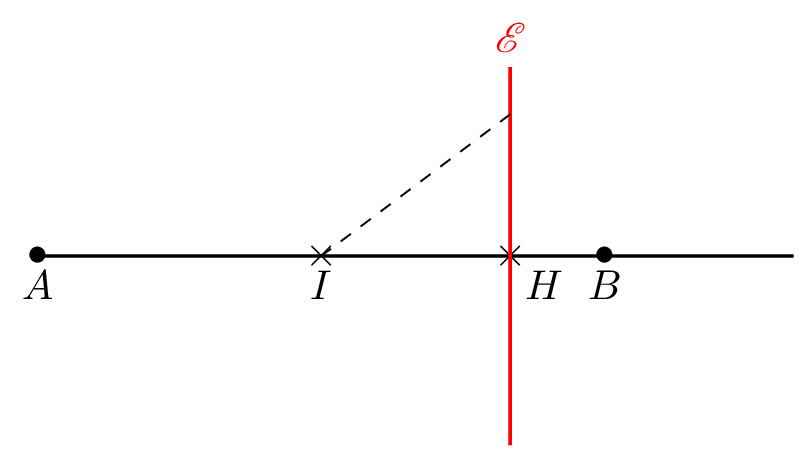

___

## Théorème de la médiane
::: {.bloc .thm}
Théorème de la médiane :  
Soient $A$ et $B$ deux points distincts du plan et $I$ le milieu de $[AB]$.  

Pour tout point $M$ du plan on a :
$$\ve{MA}.\ve{MB} = MI^2 - \dfrac{1}{4} AB^2$$
:::

Démonstration : 

$\ve{MA}.\ve{MB} = (\ve{MI} + \ve{IA}).(\ve{MI}+ \ve{IB}) = \ve{MI}^2 + \ve{MI} \left( \underbrace{\ve{IB} + \ve{IA}}_{=\ve{0}} \right) + \ve{IA}.\ve{IB}$.  
Or $\ve{IA}.\ve{IB} = \left(-\dfrac{1}{2} \ve{AB}\right) \cdot \left(\dfrac{1}{2} \ve{AB} \right) = -\dfrac{1}{4} \ve{AB}^2$.  
Ainsi $\ve{MA}.\ve{MB}=MI^2 -\dfrac{1}{4} AB^2$.

::: {.bloc .ex}

Exemple : 

On considère un triangle $ABC$ avec $I$ milieu de $[CB]$. On sait que $AB=3$, $AC=4$ et $BC=5$.  

Déterminons la mesure de $AI$.

Afficher la correction :

$\ve{AB}.\ve{AC} = \dfrac{1}{2} \left(BC^2 - AB^2-AC^2 \right)= \dfrac{1}{2} \left( 5^2 - 3^2-4^2 \right) = 0$.  
On déduit du théorème de la médiane que $AI^2 = \dfrac{1}{4} BC^2 = \dfrac{1}{4} \times 25$.  
$AI$ étant la mesure d'une longueur, elle est positive donc $AI = \sqrt{\dfrac{25}{4}} = \dfrac{5}{2}$.

:::

::: {.bloc .rem}
Remarque :  

* Dans l'exemple précédent, on retrouve l'idée que dans un triangle rectangle, la médiane issue de l'angle droit est de demi-mesure de l'hypoténuse.
* Cette relation permet de déterminer la mesure de la médiane connaissant les mesures des trois autres côtés.
:::

__________________

## Caractérisation du cercle

::: {.bloc .thm}
Propriété : Caractérisation vectorielle du cercle  
Soient $A$ et $B$ deux points distincts du plan et $I$ le milieu de $[AB]$ :
$$M \in \mathscr{C}(I, AI) \Longleftrightarrow \ve{MA}.\ve{MB} = 0$$
:::

Démonstration : 

$\ve{MA}.\ve{MB} = 0 \Longleftrightarrow MI^2 = \dfrac{1}{4} AB^2 \Longleftrightarrow MI = \dfrac{1}{2} AB$.  
Ainsi $M$ vérifie $\ve{MA}.\ve{MB} = 0$ si et seulement s'il appartient au cercle de centre $I$ et de rayon $AI = \dfrac{1}{2} AB$.

::: {.bloc .ex}

Exemple :  Équation de cercle 

Soient $A(3\,;\,4), B(5\,;\,1)$ et $\mathscr{C}$ le cercle de diamètre $[AB]$. Soit $M(x\,;\,y)$ un point du plan dans un repère orthonormé.

1. Exprimer le produit scalaire $\ve{MA}.\ve{MB}$ en fonction de $x$ et $y$ sous forme développée réduite.
   

Afficher la correction :

    $$\ve{MA}.\ve{MB} = \begin{pmatrix}
 3-x\\
 4-y \end{pmatrix}.  \begin{pmatrix}5-x\\
  1-y\end{pmatrix} = (3-x)(5-x)+(4-y)(1-y) = x^2-8x+y^2-5y+19$$
    

2. Déterminer l'équation de l'ensemble des points $M$ du plan vérifiant $\ve{MA}.\ve{MB} = 0$.
   

Afficher la correction :

$$
\begin{aligned}
 \ve{MA}.\ve{MB} = 0 &\Longleftrightarrow  x^2-8x+y^2-5y+19=0 \\
  & \Longleftrightarrow  (x-4)^2-16 +\left (y-\dfrac{5}{2}\right)^2-\left(\dfrac{5}{2}\right)^2+19=0 \\
  & \Longleftrightarrow  (x-4)^2 + \left(y-\dfrac{5}{2}\right)^2 = \dfrac{13}{4} \\
  & \Longleftrightarrow  (x-4)^2+\left(y-\dfrac{5}{2}\right)^2 = \left(\dfrac{\sqrt{13}}{2}\right)^2.
 \end{aligned}
 $$

 Donc l'ensemble cherché est le cercle de centre $\left(4\, ; \, \dfrac{5}{2} \right)$ et de rayon $\dfrac{\sqrt{13}}{2}$

:::

____________________

## Ligne de Niveau : f(M)=k

::: {.bloc .ex}

Exemple :  Ligne de niveau 

Soient $A$ et $B$ deux points du plan vérifiant $AB=6$ et soit $I$ le milieu de $[AB]$. On cherche l'ensemble $\mathscr{E}$ des points vérifiant $MA^2-MB^2=24$.

1. Justifier que $MA^2-MB^2=2\ve{IM}.\ve{AB}$.
   
   

Afficher la correction :

    $I$ milieu de $[AB]$, donc $\ve{IA} + \ve{IB}= \ve{0}$.

    Pour tout $M$ du plan, $$MA^2-MB^2=\ve{MA}^2-\ve{MB}^2=(\ve{MA}+\ve{MB}).(\ve{MA}- \ve{MB}) = (\ve{MI}+\ve{IA}+\ve{MI}+\ve{IB}).\ve{BA} = 2\ve{MI}.\ve{BA}=2\ve{IM}.\ve{AB}$$
    

2. Déterminer et construire $\mathscr{E}$.

    

Afficher la correction :

    
    - Soit $H=p_{\perp,(AB)}(M)$
        $$2\ve{IM}.\ve{AB} = 24  \Longleftrightarrow \ve{IM}.\ve{AB} = 12 \Longleftrightarrow \ve{IH}.\ve{AB} = 12$$

        

        
        

        Or $H \in (AB)$ donc les vecteurs $\ve{IH}$ et $\ve{AB}$ sont colinéaires, et le produit scalaire étant positif, les vecteurs sont de même sens. 
        
        Ainsi 

            
        - $H \in [IB)$
        - $12=\ve{IH}.\ve{AB} = IH \times AB$
        
        On déduit alors que $IH=2$ et $H \in [IB)$

    -  Soit $H$ le point de $(AB)$ vérifiant $HI=2$ et $H \in [IB)$.
        $$\ve{IM}.\ve{AB} = 12 \Longleftrightarrow (\ve{MH}+\ve{HI}).\ve{AB} = 12 \Longleftrightarrow \ve{MH}.\ve{AB} + \ve{HI}.\ve{AB}=12 \Longleftrightarrow \ve{MH}.\ve{AB} = 0$$
        Ainsi, les droites $(MH)$ et $(AB)$ sont perpendiculaires
    

:::

::: {.bloc .rem}
Remarque :  
Dans la question 2, on procède par Analyse-Synthèse. On cherche d'abord des conditions nécessaires, puis on vérifie la suffisance.

:::

  <a class="prev" href="Proprietes.html">⬅️</a>
  <a class="next" href="Bilans.html">➡️</a>

