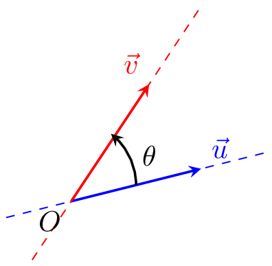
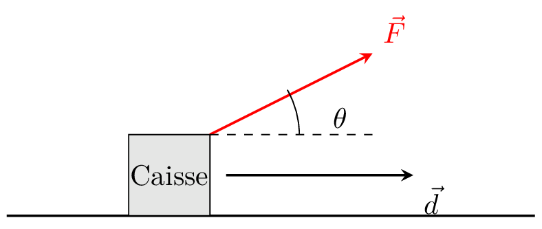

___

::: {.bloc .def}

Définition

Soient $\ve{u}$ et $\ve{v}$ deux vecteurs du plan. On appelle produit scalaire de $\ve{u}$ et $\ve{v}$ le nombre noté $\ve{u}.\ve{v}$, on lit u scalaire v, égal à : 

* $0$ si l'un des vecteurs $\ve{u}$ ou $\ve{v}$ est nul.
* $\|\ve{u} \| \|\ve{v} \| \times \cos( \theta)$ où $\theta$ est l'angle formé par les droites support des vecteurs $\ve{u}$ et $\ve{v}$

  

:::

::: {.bloc .ex}

Exemple

En physique :

* On appelle le travail d'une force l'énergie produite par cette force lors d'un déplacement rectiligne de $A$ vers $B$. Il est donné par $\ve{F}.\ve{AB}$
* On appelle puissance instantanée développée par une force $\ve{F}$ appliquée à un point de vitesse $\ve{v}$ : $\ve{F}.\ve{v}$

Un ouvrier tire une caisse de masse $m = 50$ kg sur un sol horizontal. Il exerce une force constante $\vec{F}$ de norme $100$ N, inclinée d'un angle de $\theta = 60^\circ$ par rapport à l'horizontale.
On suppose que le déplacement est de $d = 10$ m et qu'il est réalisé en $\Delta t = 20$ s.

  

1. Calculer le travail effectué par la force $\vec{F}$ pendant le déplacement.

Afficher la correction :

Le travail est donné par
$$W = \vec{F} \cdot \vec{d} = \|\vec{F}\| \cdot \|\vec{d}\| \cdot \cos(\theta) = 100 \times 10 \times 0,5 = 500\text{ J}$$

2. En déduire la puissance moyenne développée par cette force.

Afficher la correction :

La puissance moyenne est :
$$P = \dfrac{W}{\Delta t} = \dfrac{500}{20} = 25\text{ W}$$

3. Vérifier la puissance instantanée à l'aide de la formule $P = \vec{F} \cdot \vec{v}$.

Afficher la correction :

$$P = \vec{F} \cdot \vec{v} = \|\vec{F}\| \cdot \|\vec{v}\| \cdot \cos(\theta)$$
La vitesse vaut :
$$v = \dfrac{d}{\Delta t} = \dfrac{10}{20} = 0,5\text{ m.s}^{-1}$$
Ainsi 
$$P = 100 \times 0,5 \times 0,5 = 25\text{ W}$$

:::

::: {.bloc .rem}

Remarque

Lorsque le mouvement est rectiligne uniforme, puissance instantanée et puissance moyenne sont égales.
:::

::: {.bloc .rem}

Remarque

Soient $A$, $B$, $C$, $A'$, $B'$ et $C'$ six points de l'espace tels que $\ve{u}=\ve{AB}=\ve{A'B'}$, $\ve{v}=\ve{AC}=\ve{A'C'}$, alors
$$\ve{u}.\ve{v} = AB \times AC \times \cos\left(\widehat{BAC} \right) \qquad \et \qquad \ve{u}.\ve{v} = A'B' \times A'C' \times \cos\left(\widehat{B'A'C'} \right)$$

La valeur du produit scalaire ne dépend pas du choix des points $A$, $B$ et $C$ pour représenter les vecteurs $\ve{u}$ et $\ve{v}$.
:::

::: {.bloc .thm}

Théorème

Soient $\ve{u}$ et $\ve{v}$ deux vecteurs non nuls, alors 

1. $\ve{u}.\ve{v} = \|\ve{u}\|\times \|\ve{v}\|$ si et seulement si $\ve{u}$ et $\ve{v}$ sont colinéaires de même sens.
2. $\ve{u}.\ve{v} = -\|\ve{u}\|\times \|\ve{v}\|$ si et seulement si $\ve{u}$ et $\ve{v}$ sont colinéaires de sens contraire.

:::

Démonstration : 

1. $\ve{u}$ et $\ve{v}$ sont de même sens $\Longleftrightarrow \ve{u}.\ve{v} = \norm{\ve{u}} \times \norm{\ve{v}} \times \cos 0 \Longleftrightarrow \ve{u}.\ve{v} = \norm{\ve{u}} \times \norm{\ve{v}}$.
2. $\ve{u}$ et $\ve{v}$ sont de sens contraire $\Longleftrightarrow \ve{u}.\ve{v} = \norm{\ve{u}} \times \norm{\ve{v}} \times \cos \pi \Longleftrightarrow \ve{u}.\ve{v} = -\norm{\ve{u}} \times \norm{\ve{v}}$.
 

  <a class="next" href="orthogonalite.html">➡️</a>

