*"Les équations sont plus importantes pour moi, car la politique ne dure pas."*  
Albert Einstein

# Fonctions du second degré

## Exercice
::: {.bloc .exo}

Résoudre les équations suivantes :

- $(E_0)\,:\,(7x-2)(5-x)-(x+4)(7x-2)=0$
- $(E_1)\,:\,x^2=9$
- $(E_2)\,:\,x^2=-3$
- $(E_3)\,:\,(x-5)^2=3$
- $(E_4)\,:\,(5x-4)^2-(3x+7)^2$
- $(E_5)\,:\,(2x+1)^2+x(1-2x)=4x^2-1$
- $(E_6)\,:\,\frac{2x+3}{x-2} = 2$
- $(E_7)\,:\,(6x-3)^2 -(2x-1)=0$
:::

## Exercice
::: {.bloc .exo}

Résoudre dans $\R$ les inéquations suivantes :

- $(I_0)\,:\,(5x+3)(1-2x) > 0$
- $(I_1)\,:\,\frac{(5x + 3)(2x-1)}{x^2 - 4} < 0$
- $(I_2)\,:\,16a^4-9  < 0$
- $(I_3)\,:\,\frac{3x - 16}{5x - 2} \geqslant 3x + 8$
:::

## Exercice
::: {.bloc .exo}

Parmi les fonctions suivantes, déterminer celles qui sont des fonctions du second degré

- $f(x)= (3x-1)(2-3x)-5x$
- $g(x) =(x-3)(6x^2+x+1) - (3x^2-1)(2x+1)$
- $h(x)= \frac{x^3-x^2-5x+2}{x+2}$
- $i(x)= \sqrt{x^2+3}$
:::

## Exercice
::: {.bloc .exo}

Pour chacune des expressions suivantes, mettre sous forme canonique :

- $f(x)=2x^2+8x-1$
- $g(x)=2x^2+3x+4$
- $h(x)= -x^2+5x-7$
:::

## Exercice
::: {.bloc .exo}

On considère la fonction $f$  définie sur $\R$ par  
$$f(x)= 2(x-6)(x-2)$$
On note $\mathscr{C}_f$ sa courbe représentative dans un repère du plan.

1. Montrer que, pour tout réel $x$, $$f(x)= 2x^2-16x+24$$
2. Déterminer la forme canonique de $f$.
3. En utilisant la forme la plus adaptée de $f$  :
   1. Déterminer les coordonnées des points d'intersection de $\mathscr{C}$ avec les axes du repère.
   2. S est le point de $\mathscr{C}_f$ d'abscisse 4. Quelle est son
   ordonnée ?
   3. Déterminer les antécédents de 24 par $f$.
   4. Montrer que, pour tout réel $x$, $$f(x) >-8$$
      Que peut-on en déduire pour la fonction $f$ 
:::

## Exercice
::: {.bloc .exo}

Soit $f$  la fonction définie sur $\R$ par :
$$f(x)= x^2+12x+32$$
On note $\mathscr{C}_f$ sa courbe représentative dans un repère du plan.

1. Déterminer la forme canonique de $f$.
2. Déterminer une factorisation de $f$.
3. Répondre aux questions suivantes en utilisant la
forme de $f$  la plus adaptée.
   1. $S(-6\,;\, -4)$. Le point appartient-il à $\mathscr{C}_f$ ?
   2. En quels points $\mathscr{C}$ coupe-t-elle l'axe des abscisses ?
   3. Déterminer le ou les antécédent(s) de $32$ par $f$ .
   4. Montrer que $-4$ est le minimum de $f$
:::

## Exercice
::: {.bloc .exo}

Soit $f$ la fonction définie sur $\R$ par $$f(x)=(2x-3)^2+(x+5)(2x-3)$$

1. Déterminer une forme factorisée de $f$
2. Déterminer la forme développée réduite de $f$
3. Déterminer la forme canonique de $f$.
4. En utilisant la forme la plus adaptée de $f$  :
   1. Calculer $f(0)$, $f(\sqrt{3})$ et $f\left(\frac{5}{12}\right)$.
   2. Déterminer les racines de $f$.
   3. Déterminer les antécédents de 24 par $f$.
   4. Déterminer le minimum de $f$.
:::

____

# Équation du second degré - Racine évidente

## Exercice
::: {.bloc .exo}

Pour chacune des fonctions suivantes, dire si le nombre $x_0$ est une racine.

- $f(x)= 2x^2-5x+1$ et $x_0=1$
- $g(x)= 6x^2+x-1$ et $x_0=\frac{1}{3}$
- $h(x)= x^2-2x+2\sqrt{2}$ et $x_0=\sqrt{2}$
:::

## Exercice
::: {.bloc .exo}

Soient $m$ un réel et $f$ la fonction définie sur $\R$ par $$f(x)=(m-1)x^2+2mx+1-3m$$

1. Déterminer l'ensemble $D$ des valeurs de $m$ pour lesquelles $f$ est une fonction polynôme de degré $2$.
2. Montrer que, pour tout $m \in D$, $1$ est une racine de $f$.
3. Déterminer la valeur de $m$ pour la quelle $-2$ est une racine, puis factoriser $f$ dans ce cas.
:::

## Exercice
::: {.bloc .exo}

Pour chacune des équations suivantes, déterminer une racine évidente et factoriser.

- $(E_1)\,:\, x^2+x-2=0$
- $(E_2)\,:\, -6x^2-10x+4=0$
- $(E_3)\,:\, 2x^2+3x+2=0$
:::

## Exercice
::: {.bloc .exo}

1. Montrer que l'équation $-x^2+2x+1$ admet $1-\sqrt{2}$ comme racines
2. On considère $\varphi =\frac{1+\sqrt{5}}{2}$

   1. Montrer que $\varphi$ est solution de l'équation $x^2-x-1=0$
   2. En utilisant la méthode $f(x)-f(r)$ donner une forme factorisée de $x^2-x-1$.
   3. En déduire que l'autre racine est $-\frac{1}{\varphi}$
   4. Sans aucun calcul numérique, donner la valeur exacte de $\varphi^3$.
:::

## Exercice
::: {.bloc .exo}

Résoudre les équations du second degré suivantes :

- $(E_1)\,:\, -2x^2-5x+3=0$
- $(E_2)\,:\, 2x^2-x+3=0$
- $(E_3)\,:\, x^2+2\sqrt{3} x+3=0$
- $(E_4)\,:\, 2x(5+x)=9-2x$
- $(E_5)\,:\, x^2=x+1$
- $(E_6)\,:\, (x^2-16)+2(x-4)=0$
:::

## Exercice
::: {.bloc .exo}

1. Factoriser $x^2+3x+2$.
2. En déduire la résolution de 
$$(E_1):\, x^2+3x+2=5(x+1) \qquad et \qquad (E_2)\,:\, \frac{2}{x^2+3x+2} =\frac{1}{x+2}$$
:::

## Exercice
::: {.bloc .exo}

Résoudre les équations suivantes :

- $(E_1)\,:\, -\frac{-2x}{x^2+1} =3$
- $(E_2)\,:\, \frac{3}{x} - \frac{1}{2x-1} = 2$
- $(E_3)\,:\, \frac{3}{x^2} = \frac{1}{2x} +1$
- $(E_4)\,:\, x^3-x^2+4x=0$
- $(E_5)\,:\, \frac{6x^2-13x+5}{2x-1}=0$
- $(E_6) \,:\,\frac{1}{x} + \frac{2}{x+1} = \frac{3}{x-1}$
:::

## Exercice
::: {.bloc .exo}

On considère l'équation $(E)\,:\, \sqrt{5x+6}=x+2$

1. On suppose qu'il existe une solution $x_0$. Déterminer les valeurs possibles de $x_0$.
2. En déduire les solutions de l'équation.

\label{Equation avec radicaux et changement de variable}
:::

## Exercice
::: {.bloc .exo}

En utilisant la même méthode qu'à l'exercice précédent, résoudre les équations suivantes :

- $(E_1)\,:\, \sqrt{5x+6}=x+2$
- $(E_2)\,:\, \sqrt{x+4}=7-2x$
- $(E_3)\,:\, \sqrt{x+3} -\sqrt{x}= 1$
:::

## Exercice
::: {.bloc .exo}

1. Résoudre l'équation $(E_1)\,:\,3x^2-4x-4=0$
1. En déduire les solutions de $$(E_2)\,:\, 3x^4 -4x^2-4=0\qquad et \qquad (E_3)\,:\, 3x-4\sqrt{x}-4=0$$
:::

## Exercice
::: {.bloc .exo}

On considère la fonction $f: x \mapsto 2x^4 - 9x^3 + 14x^2 - 9x + 2$.

1. Le nombre 0 est-il racine de $f$ ?
2. Soit $r \in \mathbb{R}$. Montrer que si $r$ est une racine de $f$ alors $\frac{1}{r}$ est également une racine de $f$.
    1. Montrer que l'équation $f(x) = 0$ est équivalente à l'équation
    $$
    (E): 2\left(x^2 + \frac{1}{x^2}\right) - 9\left(x + \frac{1}{x}\right) + 14 = 0.
    $$
3. On pose $u = x + \frac{1}{x}$. Déduire de la question précédente que $ (E) $ est équivalente à
    $$
    (E'): 2u^2 - 9u + 10 = 0.
    $$
4. Résoudre $(E') $ et en déduire les solutions de $(E) $.
 
 
:::

## Exercice
::: {.bloc .exo}

On considère un rectangle $ABCD$ tel que $AB=4$, $AD=10$.

Soit $M$ un point variable du segment $[BC]$. Déterminer la ou les position(s) de $M$ sur le segment pour que le triangle $AMD$ soit rectangle en $M$.
:::

## Exercice
::: {.bloc .exo}

Soient $a$ et $b$ deux réels distincts et $P$ un polynôme définie sur $\R$ par $P(x)= a^2(b-x) +b^2(x-a) +x^2(a*-b)$.

Résoudre $P(x)=0$.
:::

___

# Lien coefficients - racines
## Exercice
::: {.bloc .exo}

Résoudre les équations suivantes en cherchant une racine évidente.

- $(E_1) : -5x^2 - 3x + 2 = 0$  
- $(E_2) : 2x^2 - x + 6 = 0$  
- $(E_3) : \sqrt{2}x^2 - 3x + 6 - 4\sqrt{2} = 0$
:::

## Exercice
::: {.bloc .exo}

Résoudre les systèmes suivants :  

$$(S_1) : \begin{cases}
u + v = 5 \\
uv = 12
\end{cases}
\quad ; \quad
(S_2) : \begin{cases}
u + v = 4 \\
uv = 1
\end{cases}
\quad ; \quad
(S_3) : \begin{cases}
u + v = -8 \\
uv = 12
\end{cases}$$
:::

## Exercice
::: {.bloc .exo}

1. Trouver deux entiers consécutifs dont la différence des carrés est 527.  
2. Trouver deux entiers consécutifs dont le produit est égal au double de la somme, s’ils existent.
:::

## Exercice
::: {.bloc .exo}

Déterminer les dimensions d'un rectangle dont l'aire est de 285 cm² et le périmètre 81 cm.
:::

## Exercice
::: {.bloc .exo}

On considère l'équation $2x^2 - 2x - 7 = 0$.

1. Sans aucun calcul, justifier que cette équation admet deux racines distinctes.  
2. Justifier que ces racines sont de signes contraires.  
3. On note $\alpha$ et $\beta$ les racines. Sans calculer $\alpha$ et $\beta$, déterminer la valeur de :  
   - $\alpha + \beta$  
   - $\alpha \beta$  
   - $\dfrac{1}{\alpha} + \dfrac{1}{\beta}$  
   - $\alpha^2 + \beta^2$
:::

## Exercice
::: {.bloc .exo}

(Extrait Évaluation)

On considère la fonction $f$ définie par $f(x)= 3x^2 - 5x - 7$.  
On admet que cette fonction admet deux racines distinctes $x_1$ et $x_2$, que l'on ne cherchera pas à calculer, avec $x_1 < x_2$.

1. Déterminer le signe de $x_1$ et le signe de $x_2$.  
2. Préciser celle dont la valeur absolue est la plus grande.
:::

## Exercice
::: {.bloc .exo}

Déterminer deux nombres réels $a$ et $b$ tels que :  
$$(S_1) : \begin{cases}
a + b + ab = -\dfrac{5}{3} \\
a^2b + ab^2 = 4
\end{cases}$$
:::

# Factorisation - Signe d'une fonction du second degré
## Exercice
::: {.bloc .exo}
 Vrai/ faux 
Pour chacune des affirmations suivantes, dire si elles sont vraies ou fausses.  
On considère $f$ une fonction définie sur $\R$ par $$f(x)=ax^2+bx+c$$

1. Si $3$ et $2$ sont des racines de $f$, alors $f(x)=(x-2)(x-3)$  
2. Si $a+b+c=0$ et si $a-b+c=0$ alors $f(x)=a(x^2-1)$  
3. Si $c=0$ alors $0$ est racine de $f$;  
4. Si $f$ admet deux racines opposés alors $b=0$.  
5. Si $b^2 -4ac \leqslant 0$, alors $f$ peut se factoriser.
:::

## Exercice
::: {.bloc .exo}

1. Déterminer un trinôme du second degré admettant $2$ et $-5$ comme racines.  
   Que peut-on dire de son discriminant ?  
2. Soit $f$ une fonction polynôme du second degré vérifiant $f(2)=0$, $f(-3)=0$ et $f(1)=4$.  
   Déterminer l'expression de $f$.  
3. Soit $f$ une fonction polynôme du second degré vérifiant $f(2)=1$, $f(-3)=1$ et $f(1)=4$.  
   Déterminer l'expression de $f$.
:::

## Exercice
::: {.bloc .exo}

Factoriser les polynomes suivante :  

- $P_1(x) = -6x^2+25-14$  
- $P_2(x)= x^2-(1+\sqrt{5})x+\sqrt{5}$  
- $P_3(x)= 4x^2-8x+4$  
- $P_4(x) = -x^2+9$  
- $P_5(x) = x^2-x+12$
:::

## Exercice
::: {.bloc .exo}

Dans chacun des cas suivants, donner le signe des polynômes suivants  

- $P_1(x)=-6x^2+25-14$  
- $P_2(x) = -x^2 + 2x - 6$  
- $P_3(x)=-6x^2 + 14$  
- $P_4(x)=x^2 - 7x + 2$  
- $P_5(x)-3x^2 + 10x + 1$
:::

## Exercice
::: {.bloc .exo}

Déterminer la position relative des représentations graphiques des fonctions $f_1$ et $f_2$ dans les cas suivants :  

1. $f_1(x)= 4-x^2 \; \et \; f_2(x)=x^2+3x+1$  
2. $f_1(x)=x^2+x \; \et \; f_2(x)=-x^2+5x-2$
:::

## Exercice
::: {.bloc .exo}

Résoudre les inéquations suivantes :  

- $(I_1) \,:\, (x-2)(7x^2-5x+1)$  
- $(I_2)\,:\, \dfrac{x^2 + 4x + 4}{x - 6} > 0$  
- $(I_3)\,:\,\dfrac{9x^2 - 2}{x + 2} \leq 0$  
- $(I_4) \,:\, \dfrac{1}{x-2} + \dfrac{3}{x}< \dfrac{1}{x+7}$  
- $(I_5)\,:\,5x + 6 \leq \dfrac{1}{x - 2}$  
- $(I_6) \,:\, \dfrac{1}{x-1} + \dfrac{1}{x} + \dfrac{1}{x+2} \geqslant x$
:::

## Exercice
::: {.bloc .exo}

1. $f$ est la fonction polynôme définie sur $\mathbb{R}$ par $f(x) = 4x^3 + 2x^2 - 2x - 1$.  
   1. Démontrer que pour tout réel $x$, $f(x) = (2x + 1)(ax^2 + bx + c)$, où $a$, $b$ et $c$ sont des réels à déterminer.  
   2. Résoudre dans $\mathbb{R}$ l'équation $f(x) = 0$.  

2. $f$ est la fonction polynôme définie sur $\mathbb{R}$ par $f(x) = x^3 - 4x^2 - \dfrac{9}{4}x + 9$.  
   1. Démontrer que pour tout réel $x$, $f(x) = (x - 4)(ax^2 + bx + c)$, où $a$, $b$ et $c$ sont des réels à déterminer.  
   2. Donner le tableau de signe de $f(x)$.
:::

## Exercice
::: {.bloc .exo}

On considère la fonction $P$ définie sur $\mathbb{R}$ par $P(x) = x^3 - 5x^2 + 5x + 3$.  
1. A l'aide de la calculatrice, en déduire une racine évidente $r$ de $P$.  
2. Déterminer les réels $a$, $b$ et $c$ tels que, pour tout réel $x$, $P(x) = (x - r)(ax^2 + bx + c)$.  
3. Dresser le tableau de signes de $P(x)$.
:::

## Exercice
::: {.bloc .exo}

1. On souhaite démontrer pour tout $x$ strictement positif  
   $$x+\dfrac{1}{x} -2 \leqslant 0$$
   1. Démonter l'inégalité en utilisant résolvant une inéquation du second degré.  
   2. Montrer que l'inégalité est vraie en utilisant une identité remarquable adaptée.  
2. En déduire le minimum de la fonction $f$ définie sur $]0\,;\,+\infty[$ par $f(x)=x+\dfrac{1}{x}$  
3. Montrer que pour tout réel $a$ et $b$ positifs strictement,  
   - $\dfrac{a}{b} + \dfrac{b}{a} \geqslant 2$  
   - $(a+b)\left(\dfrac{1}{a}+\dfrac{1}{b}\right) \geqslant 2$
:::

## Exercice
::: {.bloc .exo}

Résoudre l'inéquation  
$$\dfrac{1}{x-1} + \dfrac{1}{x} + \dfrac{1}{x+2} \geqslant x$$
:::

## Exercice
::: {.bloc .exo}

Résoudre le système suivant  
$$
\left\{
\begin{array}{l}
x^2-5x+6\geq 0 \\[2pt]
x^2+9x+14 < 0
\end{array}
\right.
$$
:::

# Mise en problème : Géométrie 
## Exercice
::: {.bloc .exo}

Dans le plan muni d’un repère orthonormé d’unité 1 cm, on considère la représentation graphique de la fonction $f : x \longmapsto \sqrt{x}$.

Soit $M$ un point d’abscisse $x$ de la représentation graphique de $f$ et $A(2\,;\, 0)$.

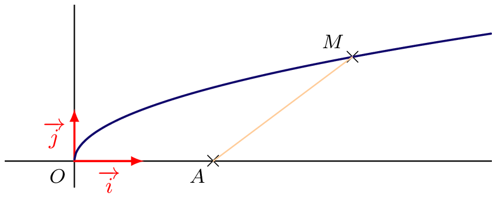{width=45%}

1. Exprimer $AM$ en fonction de $x$  
2. Dans chacun des cas suivants, déterminer la valeur de $x$ :  
   a. $AM = 4$  
   b. $AM = 1$  
3. Soit $a$ un réel strictement positif. Montrer qu’il existe un point $M$ appartenant à la représentation graphique de $f$ tel que $AM = a$ si et seulement si $a \geqslant \dfrac{\sqrt{7}}{2}$

:::

## Exercice
::: {.bloc .exo}

Soit $m$ un nombre réel. Déterminer suivant les valeurs de $m$, le nombre de points d’intersection de la parabole $\mathscr{P} : y = x^2$ et de la droite $\mathscr{D}_m : y = mx - 1$
:::

## Exercice
::: {.bloc .exo}

Un jardin est de forme carrée. Son côté mesure 20 m. Deux allées rectilignes de même largeur, l’une horizontale, l’autre verticale, se croisent en son centre et délimitent quatre parterres de fleurs identiques. On souhaite semer des fleurs dans les zones en vert sur le schéma ci-dessous (les quatre parterres).

On note $x$ la largeur (en mètres) de chaque allée.

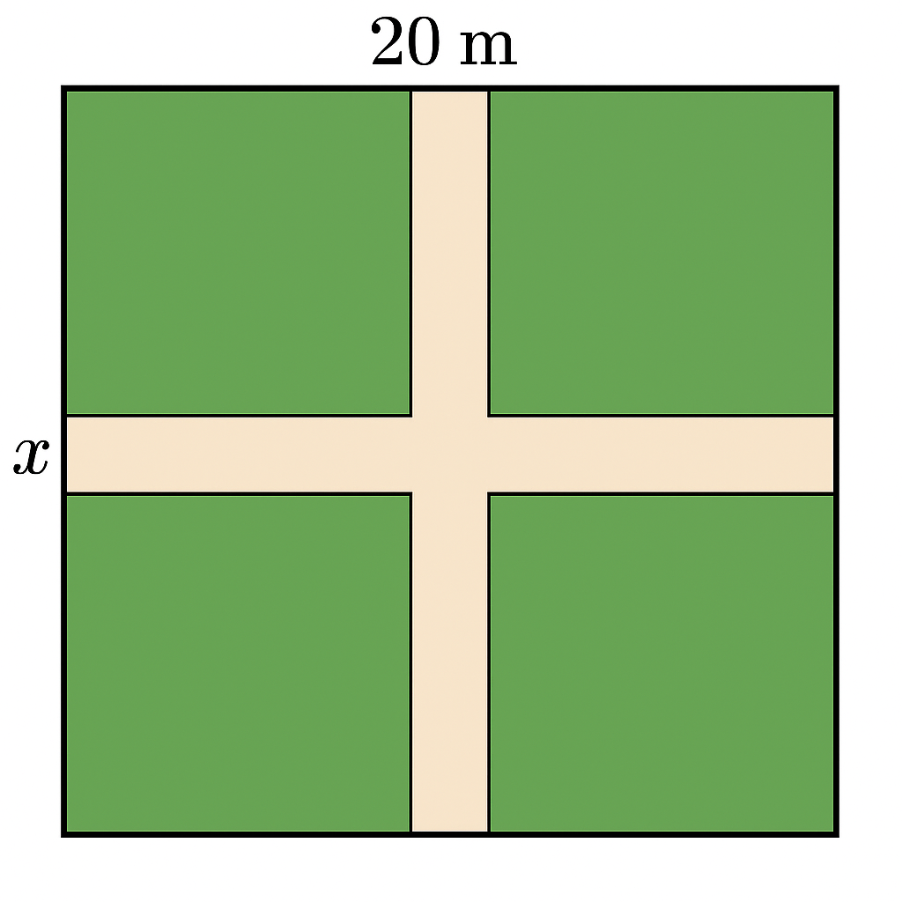{width=20%}

1. Exprimer l’aire totale des allées en fonction de $x$.  
2. Montrer que l’aire des parterres de fleurs est donnée par :  
   $$A(x) = 400 - 40x + x^2$$
3. Quelle largeur $x$ faut-il choisir pour que les fleurs occupent exactement les trois quarts du jardin ?
:::

## Exercice
::: {.bloc .exo}

(Extrait DST 2024-2025)

Un miroir peut être représenté par la figure ci-dessous. Le rectangle $ABCD$ symbolise le cadre du miroir.  
$AEFD$ est un trapèze et constitue le miroir proprement dit.  
Les deux triangles $ABE$ et $DFC$ sont des pièces de bois ouvragées.

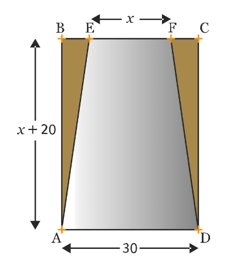{width=20%}

L’unité est le centimètre. On pose $EF = x$, et on a $BE = FC$, $AB = x + 20$ et $AD = 30$.

1. Montrer que l’expression de l’aire de $AEFD$ en fonction de $x$ est :  
   $$0{,}5x^2 + 25x + 300$$
2. Quelle valeur de $x$ faut-il choisir pour que le miroir $AEFD$ ait une aire égale aux neuf dixièmes de l’aire totale du rectangle $ABCD$ ?
:::

## Exercice
::: {.bloc .exo}

Un terrain carré $ABCD$ a pour côté 10 m.  
Un paysagiste souhaite planter du gazon sur deux parties de ce terrain représentées par le carré $AEFG$ et le triangle $BFC$ de telle sorte que l’aire de la partie restante soit d’au moins 30 m². On note $AE = x$.

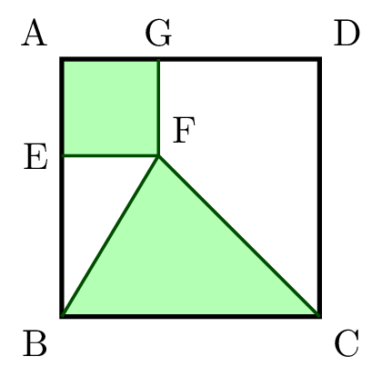{width=15%}

1. À quel intervalle le nombre $x$ appartient-il ?  
2. Résoudre le problème du paysagiste.
:::

## Exercice
::: {.bloc .exo}

On dispose d’une corde de 12 cm de longueur.  
Déterminer le triangle isocèle d’aire maximale que l’on peut construire avec cette corde.
:::

# Problèmes de recherche
## Exercice
::: {.bloc .exo}

On considère $f$ une fonction polynôme de degré 2 telle que $f(1) = 1$, $f(-2) = 4$ et $f(0) = 6$.  
Soit $g$ la fonction définie pour tout réel $x$ par :  
$$g(x) = f(x) - x^2$$

1. Déterminer $g(1)$, $g(2)$ et $g(0)$. En déduire une factorisation de $g(x)$.  
2. En déduire alors l’expression de $f(x)$ sous forme développée puis canonique.
:::

## Exercice
::: {.bloc .exo}

La fonction $f$ est une fonction polynôme de degré $98$, telle que pour tout entier $k$ compris entre 1 et 99 on ait :  
$$f(k) = \frac{1}{k}$$

1. On considère la fonction $g$ définie pour tout réel $x$ par :  
   $$g(x) = x f(x) - k$$
   a. Déterminer le degré de $g$.  
   b. Que peut-on dire de $g(k)$ pour $k \in \{1, 2, \dots, 99\}$ ?  
   c. En déduire que $g$ admet 99 zéros entiers distincts.  
   d. Donner l’expression de $g(x)$.  
2. Donner l’expression de $g(x)$, puis en déduire $f(x)$.
:::

## Exercice
::: {.bloc .exo}

La fonction $f$, polynôme du troisième degré, est telle que :  
$$|f(1)| = |f(2)| = |f(3)| = |f(-1)| = |f(-2)| = |f(-3)| = 12$$

Trouver $|f(0)|$.  
*Indication : on pourra introduire les fonctions $x \longmapsto f(x) - 12$ et $x \longmapsto f(x) + 12$.*
:::

## Exercice
::: {.bloc .exo}

Soit $f$ définie par $f(x) = 2(x - 3)(x - 5)$ et soit $(P)$ la parabole représentant $f$ dans un repère orthonormé.  
Déterminer le réel $k$ tel que la droite d’équation $y = k$ coupe $(P)$ en deux points $A$ et $B$ tels que $AB = 6$.
:::

## Exercice
::: {.bloc .exo}

(Kangourou des maths, 2016)  
Déterminer les solutions de l’équation :  
$$(x^2 - 7x + 11)^{x^2 - 3x + 2} = 1$$
:::

# Représentation graphique : Parabole

## Exercice
::: {.bloc .exo}

Sans utiliser la calculatrice, associer chaque fonction ci-dessous à la courbe qui lui correspond :

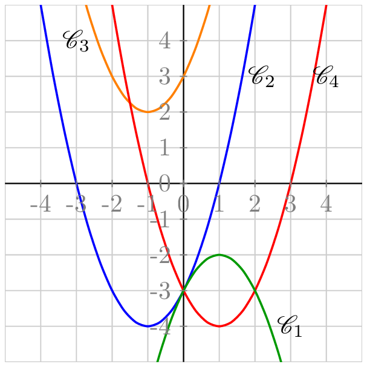{width=35%}

- $f(x) = x^2 - 2x - 3$  
- $g(x) = x^2 + 2x - 3$  
- $h(x) = x^2 + 2x + 3$  
- $i(x) = -x^2 + 2x - 3$

:::

## Exercice
::: {.bloc .exo}

Les courbes données ci-dessous sont les représentations graphiques de fonctions polynômes de degré 2 sous la forme canonique  
$$f(x) = a(x - \alpha)^2 + \beta$$

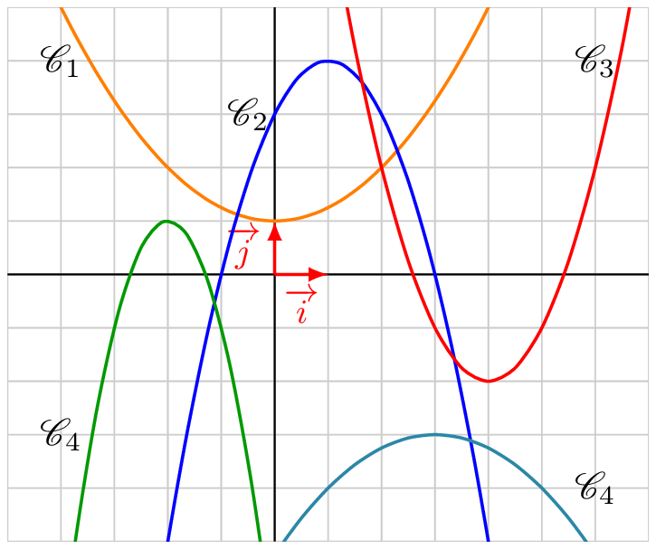{width=35%}

1. Déterminer pour chacune d’elles le signe de $\alpha$, $\beta$ et $a$.  
2. Déterminer les formes canoniques de chacune de ces fonctions.

:::

## Exercice
::: {.bloc .exo}

**À la pêche** 🎣  
On souhaite attraper une carpe koi qui ne sort de sa cachette que pour manger.  

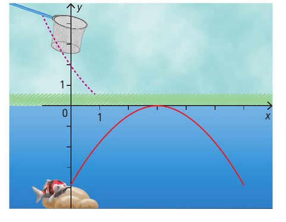{width=25%}

Sa trajectoire est un arc de parabole d'équation :  
$$y = -x^2 + 4x - 4$$  
L’épuisette suit la parabole d’équation :  
$$y = x^2 - 4x + 2$$  

Est-il possible d’atteindre la carpe ? Si oui, combien de fois ?
:::

## Exercice
::: {.bloc .exo}

**Convexité de la fonction carré**  
On considère la parabole $\mathscr{P} : y = x^2$ et un point $A(a\,;\,a^2)$ sur $\mathscr{P}$.  
On considère une droite $\mathscr{D}$ de coefficient directeur $m$ passant par $A$.

1. Montrer que $\mathscr{D} : y = mx - ma + a^2$  
2. Démontrer que $\mathscr{D}$ et $\mathscr{P}$ ont $A$ comme unique point commun si et seulement si $m = 2a$  
3. En déduire que $\mathscr{P}$ est au-dessus de chacune de ses tangentes.
:::

## Exercice
::: {.bloc .exo}

**À la piscine** 🏊‍♀️  
Emma plonge de 2 m de haut. Sa trajectoire suit une parabole $\mathcal{P}$ ayant pour sommet $S(1\,;\,2{,}4)$.

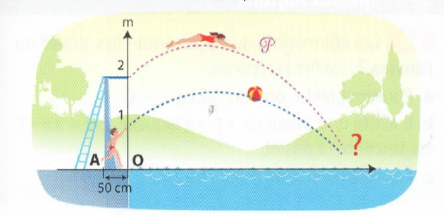{width=35%}

1. Déterminer une équation de $\mathcal{P}$.  
2. À quelle distance du pied du plongeoir Emma va-t-elle toucher l’eau ?  
3. Son frère Damien lui lance une balle pendant son plongeon. La balle suit une trajectoire parabolique :  
   $$y = -0{,}25x^2 + 0{,}6x + 1$$  
   Emma peut-elle l’attraper ? Si oui, à quelle hauteur ?
:::

## Exercice
::: {.bloc .exo}

**Projet de rampe de skate** 🛹  
Quentin présente un projet de rampe de skate modélisée par un arc de parabole, avec les conditions suivantes :  

- Plateforme hauteur 70 cm, largeur 30 cm  
- Point B à 20 cm du sol, projeté orthogonalement à 230 cm du pied de la plateforme  
- Hauteur entre les extrémités de la plateforme : 1,50 m  

{width=45%}

À quelle distance du point H faut-il placer le pied de la seconde plateforme pour respecter toutes les conditions ?  
(On utilisera des valeurs exactes.)
:::

## Exercice
::: {.bloc .exo}

On considère la parabole $\mathscr{P} : y = x^2$. Soit $A$ et $B$ deux points de $\mathscr{P}$.  
On cherche à déterminer l’ordonnée du point d’intersection de la droite $(AB)$ avec l’axe des ordonnées.

1. Cas particulier : $A(3; 9)$, $B(-5; 25)$  
   a. Conjecturer avec GeoGebra l’ordonnée de l’intersection.  
   b. Déterminer l’équation de $(AB)$, puis résoudre.  
2. Cas général : $A(a; a^2)$ et $B(b; b^2)$  
   a. Déterminer l’équation de $(AB)$ en fonction de $a$ et $b$  
   b. En déduire la solution du problème.
:::

# Variations - Axe de symétrie

## Exercice
::: {.bloc .exo}

Pour chacune des fonctions suivantes, tracer le tableau des variations :

- $f(x)= 3(x - 2)^2 - 5$  
- $g(x)= -5(x + 1)^2 + 2$  
- $h(x)= -2^2 + 1$  
- $i(x)= -\dfrac{2}{3}(x - 3)(x + 5)$  
- $j(x)= x^2 - 4x - 4$  
- $k(x)= -2x^2 - 5x + 1$
:::

## Exercice
::: {.bloc .exo}

On considère la fonction $f$ définie sur $\mathbb{R}$ par  
$$f(x) = 3(x - 4)(x + 2)$$  
et on note $\mathscr{C}$ sa courbe représentative.

1. Déterminer l'équation de l’axe de symétrie.  
2. Déterminer le tableau des variations de la fonction $f$.  
3. À l’aide du tableau des variations, déterminer les solutions de $f(x) < 0$.
:::

## Exercice
::: {.bloc .exo}

(Extrait Évaluation)  
*Dans cet exercice les questions sont indépendantes. 1. et 2. sont indépendantes.*

1. On considère la fonction $f$ dont on donne le tableau de variations suivant :

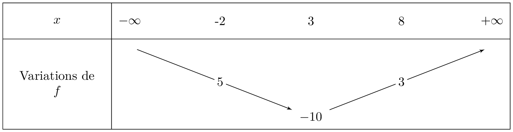{width=60%}

La fonction $f$ peut-elle être une fonction du second degré ? Justifier la réponse.

2. On considère une fonction du second degré $g$ vérifiant $g(4)=g(-2)=5$.  
   a. Déterminer l’équation de l’axe de symétrie de la représentation graphique de $g$.  
   b. On sait de plus que $g(-1)=0$.  
   Déterminer la valeur de l’autre racine si elle existe. Justifier votre réponse.
:::

# Equations - Inéquations , et paramètres

## Exercice
::: {.bloc .exo}

Soit $a$ un nombre réel. On considère l'équation :
$$(E_a) : x^2 + (2 - a)x - a - 3 = 0$$

1. Montrer que, pour tout réel $a$, l'équation $(E_a)$ admet deux racines réelles $x_1$ et $x_2$.  
2. Exprimer, en fonction de $a$, la somme et le produit des racines.  
3. En déduire que $x_1^2 + x_2^2 = a^2 - 2a + 10$  
4. Déterminer le réel $a$ pour lequel la somme des carrés des racines est minimale. Déterminer $x_1$ et $x_2$ dans ce cas.
:::

## Exercice
::: {.bloc .exo}

On considère la fonction du second degré $h_m$ définie sur $\mathbb{R}$ par :  
$$h_m(x) = (m - 1)x^2 - 2x + m - 1$$

On note $\Delta_m$ le discriminant de $h_m$.

1. Pour quelles valeurs de $m$, $h_m$ est-elle une expression du second degré ?  
2.  a. Déterminer les valeurs de $m$ pour lesquelles $h_m(x)$ est factorisable par $(x - 3)$.  
   b. Démontrer que le produit des racines est constant.
3. a. Montrer que $\Delta_m = -4m(m - 2)$  
   b. Discuter, suivant les valeurs de $m$, le nombre de solutions de $h_m(x) = 0$  
   *(On ne demande pas de calculer les racines)*  
   c. Déterminer, si elles existent, les valeurs de $m$ pour lesquelles $h_m(x)$ est strictement positif.
:::

## Exercice
::: {.bloc .exo}

1.  a. Résoudre dans $\mathbb{R}$ l'équation $3m^2 + 7m - 6 = 0$  
   b. Préciser le signe de $3m^2 + 7m - 6$ selon les valeurs de $m$  

2. Soit l'équation $(E): (m - 1)x^2 - 4mx + m - 6 = 0$, où $m$ est un réel donné.
   a. Déterminer $m$ pour que $(E)$ ne soit pas une équation du second degré, puis résoudre $(E)$ dans ce cas.  
   b. On suppose désormais que $(E)$ est une équation du second degré. Déterminer les valeurs de $m$ dans chacun des cas suivants :  
      - $-1$ est une solution de $(E)$  
      - $(E)$ admet une solution double  
      - $(E)$ n’admet aucune solution réelle  
      - Pour tout $x$, $(m - 1)x^2 - 4mx + m - 6 < 0$
:::

# Mise en problème 2, Approfondissement

## Exercice
::: {.bloc .exo}

Pour fêter la fin de leur année d'étude à Poudlard, Fred et Georges tirent un feu d’artifice. La trajectoire est donnée par :  
$$y = -\frac{g}{2v^2}(1 + \tan^2\theta)x^2 + x \tan\theta$$  
avec $v = 50\,\text{m/s}$, $g = 9{,}8$ et $\theta = 80^\circ$.  

1. Quelle est la hauteur maximale atteinte par les fusées et à quelle distance ?  
2. Le professeur Rogue situé à 100 m sera-t-il touché si la portée est de 10 m autour du point de chute ?  
3. Calculer l'angle $\theta$ pour que les fusées tombent pile sur le professeur Rogue.
:::

## Exercice
::: {.bloc .exo}

On considère un segment $[AB]$ de longueur $1$ mètre. Un point $M$ est sur $[AB]$, et on construit deux disques $D_1$ et $D_2$ de diamètres respectifs $[AM]$ et $[MB]$.  

{width=45%}

Déterminer le ou les emplacements du point $M$ tels que la **somme des aires** des disques $D_1$ et $D_2$ soit minimale.
:::

## Exercice
::: {.bloc .exo}

On considère la parabole $\mathscr{C}$ d'équation :
$$y = -x^2 + 11x - 18$$

Un triangle $ABM$ est dessiné avec $A(2,0)$, $B(9,0)$, et $M$ sur $\mathscr{C}$.  

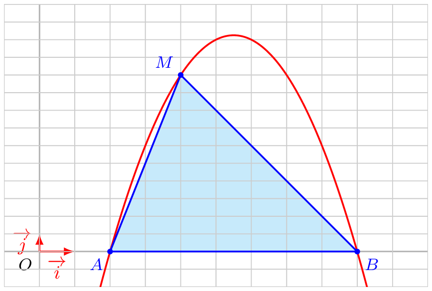{width=45%}

Déterminer **où placer le point $M$** pour que **l’aire du triangle $ABM$ soit maximale**.
:::

## Exercice
::: {.bloc .exo}

*Distance d’un point à une droite*

Dans un repère, on considère $A(-4\,; -3)$, $B(6\,; 2)$, $C(0\,; 4)$.

1. Montrer que $A$, $B$, $C$ sont alignés.  
2. On pose $\vec{AM} = t\vec{AB}$ et $f(t) = CM^2$.  
   a. Justifier l'existence de $t$  
   b. Montrer que $M(-4 + 10t\,;\, -3 + 5t)$  
   c. Montrer que $f(t) = 125(t - \frac{3}{5})^2 + 20$  
   d. En déduire le tableau des variations de $f$  
   e. Déterminer $M$ tel que $CM$ soit minimale  
   f. Calculer l’aire du triangle $ABC$
:::

## Exercice
::: {.bloc .exo}

On considère le polynôme :  
$$P(x) = 4x^2 - (\sqrt{6} + 4\sqrt{3})x + 3\sqrt{2}$$

1.  
   a. Montrer que $\frac{\sqrt{6}}{4}$ est une racine de $P$  
   b. En déduire l’autre racine par factorisation  

2.  
   a. Calculer le discriminant $\Delta$ de $P$  
   b. Déduire une forme simplifiée de $\sqrt{\Delta}$
:::

## Exercice
::: {.bloc .exo}

On pose :  
$$t = \sqrt[3]{\sqrt{5}+2} - \sqrt[3]{\sqrt{5}-2}$$

1. Montrer que $t$ est solution de $t^3 + 3t - 4 = 0$  
2. À l’aide d’une racine évidente, factoriser $t^3 + 3t - 4$  
3. En déduire que $t$ est un nombre entier
:::

# Exercices Bilan
## Exercice

::: {.bloc .exo}
  
On considère la fonction $f$ définie sur $\R$ par $f(x)=-3x^2+6x-4$, de représentation graphique $\mathscr{C}$.
1.  
   1. Résoudre l'équation $f(x)=<0$ .
   2. En déduire la position de $\mathscr{C}$ par rapport à l'axe des abscisses.
2. Déterminer la forme canonique de $f$.
3. Déterminer l'équation de l'axe de symétrie de $\mathscr{C}$ ainsi que les coordonnées du sommet.
4.  
   1. Dresser le tableau de variations de $f$.
   2. En déduire, suivant les valeurs du réel $m$, le nombre de solution de l'équation $f(x)=m$.
5. Déterminer les coordonnées des points d'intersection de $\mathscr{C}$ avec la droite d'équation $y=-4$.
6. Étudier la position relative de $\mathscr{C}$ et de la droite d'équation $y=-4x+3$.
:::

---

## Exercice

::: {.bloc .exo}
  
Soient $f$ et $g$ deux fonctions définies sur $\R \backslash \{3\}$ respectivement par  
$$f(x) = x^2-3x-1\quad \text{et} \quad g(x) = 1 +\frac{2}{x-3}$$  
dont on note $\mathcal{P}$ et $\mathcal{H}$ les représentations graphiques respectives.  
On donne ci-dessous les représentations graphiques de ces deux fonctions.

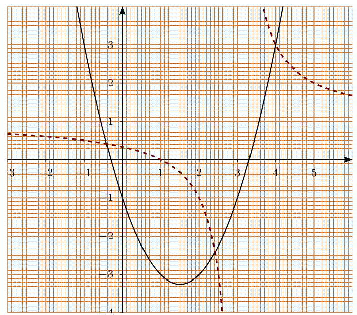{width=45%}

1. Résolution graphique :  
   1. Déterminer graphiquement les solutions de $f(x) = 2$.  
   2. Déterminer graphiquement les solutions de $f(x) = g(x)$.
2. Résolution algébrique :  
   1. Déterminer les antécédents de $-1$ par $f$ et de $1$ par $g$ si ils existent.  
   2. Démontrer que $M(x,y) \in \mathcal{P} \cap \mathcal{H}$ si et seulement si  
   $$
   \frac{(x-4)(x^2 -2x -1)}{x-3} = 0
   $$
   (On remarquera que $x^2 - 2x - 1 = (x-1)^2 - 2$)
   3. En déduire les abscisses des éléments de $\mathcal{P} \cap \mathcal{H}$.
   4. En utilisant (1), déterminer les positions relatives de $\mathcal{P}$ et $\mathcal{H}$.
:::

---

## Exercice

::: {.bloc .exo}
  
On considère la fonction $f$ définie sur $]-1\,;\,+\infty[$ par  
$$f(x)= \frac{x^2 - x + 1}{x + 1}$$  
On note $\mathscr{C}$ sa courbe représentative.

1. Montrer que la courbe $\mathscr{C}$ est située au-dessus de l'axe des abscisses.
2. Résoudre $f(x) \geqslant 1$
3.  a. Démontrer que pour tout $x \in ]-1 \,;\,+\infty[$,  
   $$f(x) = x - 2 + \frac{3}{x+1}$$
   b. En déduire la position relative de $\mathscr{C}$ par rapport à la droite $\mathscr{D}\,:\, y = x - 2$
4. Étudier la position relative de $\mathscr{C}$ par rapport à la droite $\mathscr{D}\,:\, y = -x + 3$
:::

---

## Exercice

::: {.bloc .exo}
  
On considère la fonction $f$ définie sur l'intervalle $[-2;2]$ par :  
$$f(x) = 4 - x^2$$  
On note $\mathcal{P}$ sa courbe représentative.

Pour $x \in [0;2]$, on note $M$ le point de la courbe $\mathcal{P}$ d'abscisse $x$, $N$ le symétrique de $M$ par rapport à l'axe des ordonnées, $Q$ et $P$ les projetés orthogonaux de $M$ et $N$ sur l'axe des abscisses.

On s'intéresse au périmètre $p(x)$ du rectangle $MNPQ$.

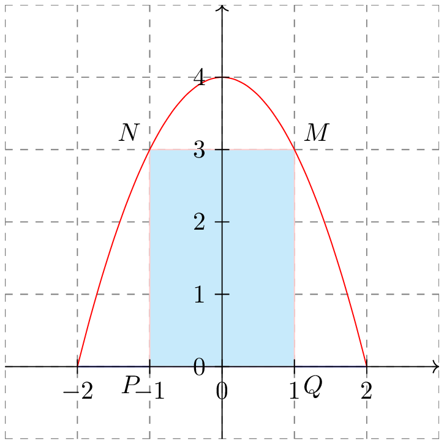{width=45%}

1. Montrer que pour tout $x \in [0;2]$ :  
   $$p(x) = -2x^2 + 4x + 8$$
2. Déterminer la forme canonique de la fonction $p$.
3. En déduire la position du point $M$ sur la courbe $\mathcal{P}$ pour laquelle le périmètre du rectangle $MNPQ$ est maximum. Quel est ce périmètre maximum ?

:::

