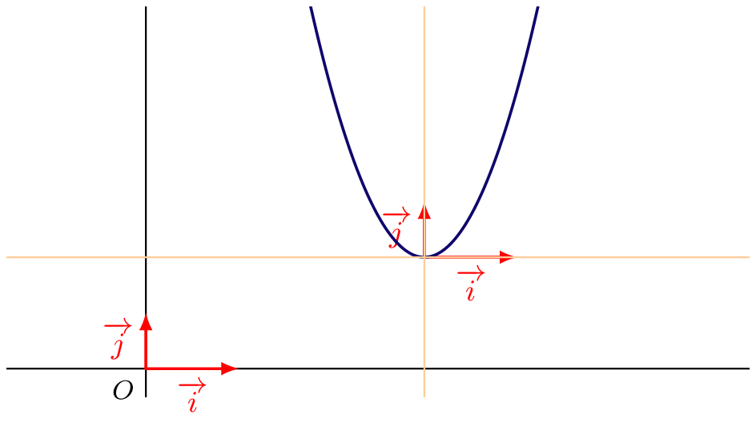

## La parabole

### Représentation graphique des fonctions polynômes du second degré

::: {.bloc .rem}
On considère, sur $\R$, les fonctions $f$ définie par $f(x)=ax^2+bx+c$ et $h$ définie par $h(x)=ax^2$, où $a$ est un réel non nul.\\
Soit alors le vecteur $\ve{u}(\alpha \, ; \, \beta)$, où $\alpha=-\dfrac{b}{2a}$ et $\beta=f(\alpha)$.

Montrons que $\mathscr{C}_f = t_{\ve{u}}(\mathscr{C}_h)$.

Pour cela, on va montrer que $\mathscr{C}_f \subset t_{\ve{u}}(\mathscr{C}_h)$ et que $ t_{\ve{u}}(\mathscr{C}_h) \subset \mathscr{C}_f$.

- Soit $M'(x' \, ;\, y') \in t_{\ve{u}}(\mathscr{C}_h)$.  
  Il existe $M(x\, ;\,y) \in \mathscr{C}_h$ tel que $t_{\ve{u}}(M)=M'$.
  
  On a alors, puisque $y=ax^2$ :
$$\begin{pmatrix}
x'\\
y'
\end{pmatrix} = \begin{pmatrix}
\alpha\\
\beta
\end{pmatrix} + \begin{pmatrix}
x\\y
\end{pmatrix} = \begin{pmatrix}
x+\alpha\\
ax^2+\beta
\end{pmatrix}   = \begin{pmatrix}
x+\alpha\\
a(x-\alpha+\alpha)^2+ \beta
\end{pmatrix}  
= \begin{pmatrix}
x'\\
a(x'-\alpha)^2+ \beta
\end{pmatrix}  
$$
Ainsi $$y'=a(x'-\alpha)^2+ \beta.$$
Donc $$(\forall M \in \mathscr{P}, \, M \in t_{\ve{u}}(\mathscr{C}_h) \Longrightarrow M \in \mathscr{C}_f) \Longrightarrow t_{\ve{u}}(\mathscr{C}_h) \subset \mathscr{C}_f.$$

- Réciproquement, soit $N'(x'\, ;\,y') \in \mathscr{C}_f$. 
  On considère alors $N (x'-\alpha \,;\, y'-\beta)$.
  
  On a donc  $\ve{NN'}= \ve{u}$, d'où $t_{\ve{u}}(N)=N'$

  Ainsi $N$ est l'antécédent de $N'$ par la translation de vecteur $\ve{u}$.

  Reste à montrer que $N \in \mathscr{C}_h$.

  Pour tout réel $x$, puisque $N'(x'\, ;\, y') \in \mathscr{C}_f$ :
$$
ax^2 =a(x'-\alpha)^2 = a(x'-\alpha)^2 + \beta - \beta = y'- \beta = y.
$$

Donc $N \in \mathscr{C}_h$, d'où $\mathscr{C}_f \subset t_{\ve{u}}(\mathscr{C}_h)$.
\end{itemize}
Des inclusions réciproques, on déduit donc que $\mathscr{C}_f = t_{\ve{u}}(\mathscr{C}_h)$.
:::

::: {.bloc .thm}
Théorème :  

Dans un repère orthonormé, la représentation graphique de $f(x) = ax^2 + bx + c$ (avec $a \ne 0$) est une parabole de sommet  
$S(\alpha \, ; \, \beta)$  
avec $$\alpha = -\dfrac{b}{2a} \et \beta = f(\alpha) = -\dfrac{\Delta}{4a}$$
:::

Démonstration

La démonstration correspond à ce qui précède.

::: {.bloc .ex}
Exemple :  

Soit $f(x) = 3x^2 - 18x + 29$.  
On a :   
$$f(x) = 3(x - 3)^2 + 2$$  
Donc la parabole a pour sommet $S(3\, ;\, 2)$.  
Dans le repère $(S \, ; \, \ve{i}, \ve{j})$, l’équation devient $y = 3x^2$.  

{width=40%}

 
:::

::: {.bloc .rem}
Remarque :
En appliquant une transformation appelée **affinité**, on peut passer au repère  
$(S \, ; \, \ve{i}, \, \tfrac{1}{3} \ve{j})$, où l’équation devient $y = x^2$.  
Il s’agit d’un changement d’échelle dans une seule direction.
:::

### Axe de symétrie

::: {.bloc .thm}
Théorème :  

Soit $f$ une fonction du second degré, telle que $f(x) = a(x - \alpha)^2 + \beta$, où $\alpha$ et $\beta$ sont des réels et $a$ est non nul.

Alors la droite $(d)$ d'équation $x = \alpha$ est un axe de symétrie de la représentation graphique de la fonction $f$.
:::

Démonstration

Soit $d:x =\alpha$ et $\mathscr{C}$ la représentation graphique d'une fonction $f$ du second degré. 
Or, lLa droite $d$ est un axe de symétrie de  $\mathscr{C}$ si et seulement si pour tout $x \in \R$, $M( \alpha - x, f(\alpha - x ))$  et $M'(x + \alpha, f(x + \alpha))$ sont symétriques par rapport à la droite $d$ si et seulement si $\forall x \in \R,\;f(\alpha-x) = f(\alpha +x')$ 
De plus, pour tout réel $x$
$$f( \alpha - x) = a(\alpha - x - \alpha)^2 + \beta = ax^2 + \beta~~~~\text{et}~~~~f( \alpha + x) = a(\alpha + x - \alpha)^2 + \beta = ax^2 + \beta$$
On déduit donc que les points $M$ et $M'$ sont symétriques par rapport à $d$.

::: {.bloc .ex}
Exemple :  

Soit $f(x) = 2x^2 - 5x + 3$.

1. Déterminer l'équation de l'axe de symétrie  

  

Afficher la correction

  L'axe de symétrie a pour équation :
  $$x = \frac{-(-5)}{2 \times 2} = \tfrac{5}{4}$$
  

2. Vérifier que 1 est racine et en déduire l'autre solution.
   

Afficher la correction

L'axe de symétrie a pour équation : $$x = \frac{5}{4}$$

Or 
$$1,25 - 0,25 = 1 \et 1,25+0,25 = 1,5$$
Ainsi $1$ et $1,5$ sont symétriques par rapport à $1,25$.  
Donc $f(1) = f(1,5)$ 
Ainsi l'autre racine est $1,5$

:::

::: {.bloc .thm}
Théorème : 
Soit $f$ une fonction du second degré définie par $f(x)=ax^2+bx+c$. 
Les racines de $f$, si elles existent, ont pour milieu $-\frac{b}{2a}$.
:::

Démonstration

Immédiat

::: {.bloc .ex}
Exemple : 
Soit $f:x \longmapsto ax^2+bx+c$, $a \neq 0$ une fonction polynôme de degré $2$, dont la représentation graphique admet 
$S(4\, ; \, -2)$ comme sommet.  
On suppose de plus que $f(-3)=0$.

1. Déterminer la valeur de la seconde racine.
   

Afficher la correction
$S(4\, ; \, -2)$ est le sommet de la représentation graphique de $f$, donc la droite $x=4$ est un axe de symétrie de cette représentation. 
On a $-3 = 4-7$ et $f(-3)=0$, donc par symétrie $f(4+7)=0$. Ainsi la seconde racine est $11$.

2. Déterminer le signe de $a$ et celui de $b$.
   

Afficher la correction

On a, pour tout réel $x$, $f(x)=a(x-4)^2-2$. 
Ainsi $f(x)=0 \Longleftrightarrow (x-4)^2=\frac{2}{a}$. 
Or cette équation n'admet deux solutions que si et seulement si $a>0$. 
$f$ admettant deux racines, on déduit alors que $a>0$, et donc puisque 
$$4=\alpha=-\frac{b}{2a}$$

On déduit de la règle des signes que $b<0$.

:::

### Variations

::: {.bloc .thm}
Théorème :  

Soit $f(x) = ax^2 + bx + c$ :

1. Si $a > 0$ :  
$f$ est décroissante sur $\left]-\infty \, ; \, -\tfrac{b}{2a} \right]$ et croissante sur $\left[-\tfrac{b}{2a} \, ; \, +\infty \right[$  

2. Si $a < 0$ :  
$f$ est croissante sur $\left]-\infty \, ; \, -\tfrac{b}{2a} \right]$ et décroissante sur $\left[-\tfrac{b}{2a} \, ; \, +\infty \right[$
:::

Démonstration

Soit $u < v \le \alpha$ et $a > 0$ :  
$$f(u) - f(v) = a\left(u + \tfrac{b}{2a}\right)^2 - a\left(v + \tfrac{b}{2a}\right)^2 = a(u - v)(u + v + \tfrac{b}{a})$$  

Comme $u - v < 0$ et $u + v + \tfrac{b}{a} < 0$, on a $f(u) - f(v) > 0$.  
Donc $f$ est décroissante sur $\left]-\infty \, ; \, -\tfrac{b}{2a}\right]$.  
Par symétrie, elle est croissante sur $\left[-\tfrac{b}{2a} \, ; \, +\infty\right[$.

::: {.bloc .ex}
Exemple :  

$f(x) = 2x^2 - 7x + 1$  
L'axe de symétrie a pour équation : $x = \tfrac{7}{4}$.  
Comme $a > 0$, $f$ est décroissante sur $\left]-\infty \, ; \, \tfrac{7}{4}\right]$  
et croissante sur $\left[\tfrac{7}{4} \, ; \, +\infty\right[$.  
$f$ admet un minimum en $\tfrac{7}{4}$.
:::

  <a class="prev" href="coefficient.html">⬅️</a>
  <a class="next" href="bilan.html">➡️</a>

