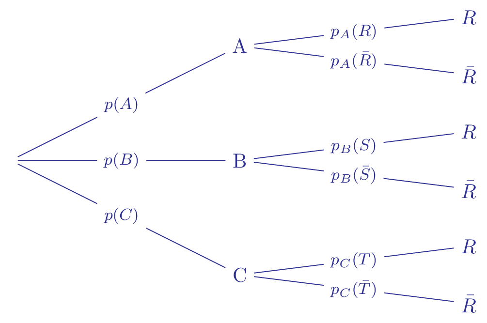
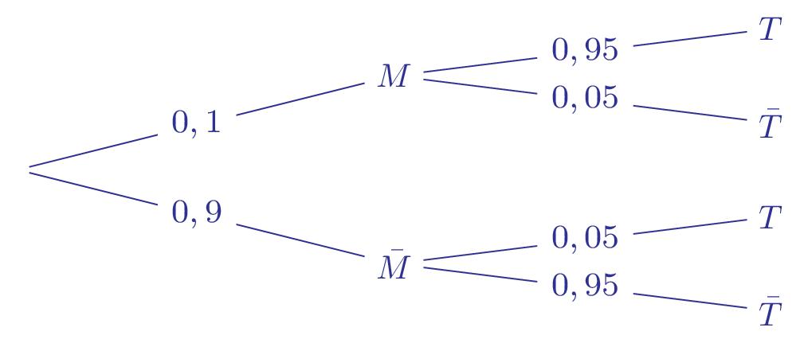

## Notion de probabilité conditionnelle
::: {.bloc .rem}

La notion de probabilité conditionnelle intervient quand pendant le déroulement d'une expérience aléatoire, une information est fournie modifiant ainsi la probabilité d'un événement.
:::

::: {.bloc .def}
Définition :  
Soient $A$ et $B$ deux événements d'un même univers tel que $P(A)\ne 0$.

La probabilité conditionnelle de l'événement $B$ sachant que l'événement $A$ est réalisé se note $P_A(B)$ ou $P(B|A)$ et on a : 
$$P_A(B)= \dfrac{P\left(A \cap B \right)}{P(A)}$$

On lit \og $P$ de $B$ sachant $A$ \fg.
:::

::: {.bloc .rem}
Remarque :  
Le contenu intuitif de cette définition est conforme au nom donné. On est alors amené à calculer la probabilité de $B$ dans un univers  \og restreint \fg, celui où $A$ est réalisé.
:::

::: {.bloc .ex}
Exemple :  
Dans une classe, il y a $35$ élèves, parmi ces élèves il y a $17$ garçons dont $8$ externes.  
On note $G$ l'événement \og l'élève est un garçon \fg et $E$ l'événement \og l'élève est externe \fg.  
Ainsi $$P(G) = \dfrac{17}{35}$ et $P_G(E) = \dfrac{8}{17}$.$ 
En effet, la première probabilité, l'univers est l'ensemble des élèves de la classe alors que dans la deuxième l'univers est l'ensemble des garçons.
:::

::: {.bloc .ex}
Exemple :  
On considère une urne contenant $r$ boules rouges et $v$ boules vertes. On pioche successivement et sans remise deux boules de l'urne, au hasard. Calculer la probabilité que la deuxième boule soit verte lorsque la première boule tirée est verte.

Afficher la correction :

On considère les événements suivants :

*  $V_1$ : la première boule tirée est verte ;
*  $V_2$ : la deuxième boule tirée est verte.

Le tirage étant aléatoire et les boules étant indiscernables on est en situation d'équiprobabilité (dit aussi probabilité uniforme).\\
Ainsi
$$P(V_1) = \dfrac{v}{r+v} \et P(V_1  \cap V_2) = \dfrac{v(v-1)}{v+r-1}$$
Ainsi 
$$P_{V_1}(V_2) = \dfrac{P(V_1 \cap V_2)}{P(V_1)}=  \dfrac{v(v-1)}{v+r-1} \times \dfrac{(v+r}{v} = \dfrac{v-1}{v+r-1}$$

:::

  
::: {.bloc .rem}
Remarque :  
De la définition et de son interprétation, on aurait pu effectuer le calcul d'une autre façon.\\
Après le premier tirage , il ne reste que $v-1$ boules vertes (puisque la première tirée est verte), et donc $n+r-1$ boules.\\
Ainsi 
$$P_{V_1}(V_2) = \dfrac{v-1}{v+r-1}$$

:::

  
::: {.bloc .thm}
Théorème :  
Soit $A$ un événement de $\Omega$, de probabilité non nulle, alors $P_A$ est une probabilité sur $A$  
C'est-à-dire, que pour tout $B \in \Omega$, on a :  
$$0 \leqslant P_A(B) \leqslant 1\quad \text{ et } \quad P_A(B) + P_A(\bar{B)} = 1 $$
:::

Démonstration :

Soient $A$ et $B$ deux événements d'un univers $\Omega$, avec $P(A) \neq 0$

- On a $A \cap B \subset A$.  

   Donc $$0 \leqslant P(B \cap A) \leqslant P(A) $$  
   D'où, en divisant par $P(A) \neq 0$, on a $0 \leqslant P_A(B) \leqslant 1$

- On a $A=(A \cap B) \cup (\bar{A} \cap B)$, 

   Or $(A \cap B)$ et $(\bar{B} \cap A)$ sont incompatibles, donc $$P((A \cap B) \cup (\bar{B} \cap A)) =P(A\cap B) + P(\bar{B} \cap A)$$  
   On en déduit que $$P(A) = P(A \cap B) + P(\bar{B} \cap A)$$  
   On obtient le résultat en divisant par $P(A)$

::: {.bloc .ex}

Exemple    

Une expérience aléatoire est modélisée par une probabilité $P$ sur un
univers $\Omega$. Soit $A$ et $B$ deux événements tels que $P (A) = 0,6$; $P (B) = 0,5$ et $P (A \cap B) = 0,3$.

1. Calculer $P (\bar{A})$. 

Afficher la correction :

$P(\bar{A})=1-P(A)= 1-0,6=0,4$

2. Calculer $P (A \cup B)$.

Afficher la correction :

   D'après la formule fondamentale des probabilités 
   $$P(A \cup B) + P(A \cap B)=P(A)+P(B)$$

   Ainsi $P(A \cup B) = P(A)+P(B) - P(A \cap B) = 0,6+0,5 -0,3 = 0,8$

3. Calculer $P_A(B)$

Afficher la correction :

$P_A(B) = \frac{P(B \cap A)}{P(A)} = \frac{0,3}{0,6} = 0,5$

4. Déterminer $P_A(\bar{B})$

Afficher la correction :

$P_A(\bar{B})= 1 - P_A(B) = 0,5$

:::

::: {.bloc .thm}
Théorème : Probabilité composée   
Soit $A$ et $B$ deux événements d'un même univers vérifiant $p(A)\ne 0$ et $p(B)\ne 0$.\\ Alors :
$$P\left(A \cap B \right) = P_A(B) \times P(A) =  P_B(A) \times P(B)$$
:::

  
::: {.bloc .ex}
Exemple :  
Dans un hôpital, on traite des patients contre un virus $A$, on note alors : 

- $A$ l'événement \og le patient est atteint par le virus A \fg.
-  $V$ l'événement \og On injecte le vaccin du virus A \fg

On sait $P(A) = 0,7$ et $P_A(V) = 0,9$

1. Que signifie ces probabilités ?

Afficher la correction :

- $P(A) = 0,7$ signifie que la probabilité que un patient pris au hasard dans l'hôpital soit atteint du virus $A$ est de $0,7$.
-  $P_A(V) = 0,9$ signifie que sachant que la patient choisit est atteint du virus, la probabilité de lui injecter le vaccin est de $0,9$.

2. Déterminer la probabilité d'injecter le vaccin contre le virus A à une personne atteinte par le virus.

Afficher la correction

On cherche $P(A \cap V)$.
$$P\left(A \cap V \right) = P_A(V) \times P(A) =  0,9 \times 0,7 = 0,63$$

:::

::: {.bloc .thm}
Propriété : Probabilité composée généralisée (admis) 
Soit $(A_1\,;\, A_2 \,;\, A_3 \,;\, \dots \,;\, A_n)$ une famille d'événement d'un même univers vérifiant $$P(A_1 \cap A_2 \cap A_3 \cap \dots \cap A_{n-1} ) \neq  0$$ \\ Alors :
$$
P(A_1 \cap A_2 \cap \cdots \cap A_n)
= P(A_1)\,P_{A_1}(A_2)\,P_{A_1 \cap A_2}(A_3)\,\cdots\,P_{A_1 \cap A_2 \cap \cdots \cap A_{n-1}}(A_n).
$$

:::

::: {.bloc .ex}

Exemple    

On tire successivement, sans remise et au hasard, 4 cartes d’un jeu de 52 cartes.

Quelle est la probabilité de tirer 4 as ?

Afficher la correction :

Soit un entier $i \in \{1,2,3,4\}$.\\
Le tirage étant aléatoire et les cartes étant indiscernables, on est dans le cas d'une probabilité uniforme.\\
Notons $A_i$ l’événement \og  la $i$\up{ième} carte tirée est un as \fg , si bien que la probabilité recherchée est
$$
P(A_1 \cap A_2 \cap A_3 \cap A_4).
$$

On a
$$
P(A_1) = \dfrac{4}{52} \et 
P_{A_1}(A_2) = \dfrac{3}{51} \et 
P_{A_1 \cap A_2}(A_3) = \dfrac{2}{50} \et 
P_{A_1 \cap A_2 \cap A_3}(A_4) = \dfrac{1}{49}
$$

On applique alors la formule des probabilités composées à la famille $(A_1, A_2, A_3, A_4)$ où
$$
P(A_1 \cap A_2 \cap A_3) \neq 0.
$$

On obtient alors
$$
P(A_1 \cap A_2 \cap A_3 \cap A_4)
= \dfrac{4 \times 3 \times 2 \times 1}{52 \times 51 \times 50 \times 49}.
$$

:::

## Représentation avec un tableau
::: {.bloc .rem}

On peut donner les résultats sous la forme d'un tableau à double entrée.

Il en existe de plusieurs types, pour cela il faut être attentif à la lecture et compréhension du tableau.

On considère le tableau suivant qui indique le nombre de reçus au baccalauréat dans une classe .

|        | Reçu | Non reçu | Total |
|--------|------|----------|-------|
| Filles | 18   | 1        | 19    |
| Garçons| 13   | 3        | 16    |
| Total  | 31   | 4        | 35    |

 Dans ce tableau les nombres (ou les proportions indiquées), sont données par rapport à l'effectif total.

 Ainsi
 $$P_F(R)=\frac{P(R \cap F)}{P(F)} = \dfrac{\dfrac{\card{R \cap F}}{\card \Omega}}{\dfrac{\card F}{\card \Omega}} = \dfrac{\card{R \cap F}}{\card F)}= \frac{18}{19}$$

 On peut donner directement toutes les probabilités conditionnelles que l'on souhaite à partir des effectifs donnés.

 $$ P_R(F) = \frac{P(R \cap F)}{P(R)} = \frac{18}{31}$$ 

  Notre partition de l'univers  est dans le premier cas $\{F\, ;\,G\}$ et dans le deuxième  cas $\{R \, ;\, \bar{R}\}$
:::

## Représentation graphique : Arbre pondéré
::: {.bloc .rem}
 Une expérience aléatoire peut être schématisée par un arbre pondéré dont chaque branche est affectée d'un poids qui est une probabilité.

{width=40%}

- La racine de l'arbre est l'univers $\Omega$
- Les évènements qui se trouvent aux extrémités des branches issues d'un même noeud forment une partition de l'évènement situé à ce noeud.
  - $\{ A, B, C\}$ est une partition de l'univers $\Omega$.
  - $\{ S,\overline{S} \}$ est une partition de l'évènement  $B$.
- Un chemin complet qui conduit à un sommet final, représente l'intersection des évènements qui le composent.  
Par exemple, le chemin dont l'extrémité est $R$ représente l'évènement $A \cap R$.
- Le poids d'une branche primaire est la probabilité de l'évènement qui se trouve à son extrémité.
- Le poids d'une branche secondaire est la probabilité conditionnelle de l'évènement qui se trouve à son extrémité sachant que l'évènement qui se trouve à son origine est réalisé.
:::

::: {.bloc .ex}
Exemple :  
Considérons le cas d'une maladie et d'un test censé déterminer si un individu a cette maladie ou pas.  
On note $M$ l’événement \og l'individu est malade\fg \ et $T$ \og le test est positif\fg.  
Supposons qu'un individu ait 1 chance sur 10 d'être malade  et que le test soit fiable à $95\%$, autrement dit il y a 95 chances 100 que le test soit positif sachant que l'individu soit malade et 5 chances sur 100 que le test soit positif sachant que l'individu est sain.

1. Traduire en terme probabiliste : \og 1 chance sur 10 d'être malade\fg et \og 5 chances sur 100 que le test soit positif sachant que l'individu est sain \fg  
   

Afficher la correction

   La première phrase se traduit par $P(M)=0,1$, et la deuxième par $P_{\bar{M}}(T)$
   

2. Construire l'arbre de probabilité associé à la situation  
   

Afficher la correction

{width=40%}

   

3. Calculer $P(T\cap\overline{M})$  
   

Afficher la correction

   $P(T\cap\overline{M})=P_{\bar{M}}(T) \times P(\bar{M}) = 0,9 \times 0,95 = 0,855$
   

4. En déduire, si possible, la probabilité de ne pas être malade sachant que le test est positif.  
   

Afficher la correction

   $P_{T}(\bar{M)} = \dfrac{P(T \cap \bar{M})}{P(T)}$  
   On connaît $P(T \cap \bar{M})$, mais pas $P(T)$.  
   Il nous manque une information pour conclure.
   

:::

 <a class="prev" href="rappels.html">⬅️</a>
  <a class="next" href="fpt.html">➡️</a>

