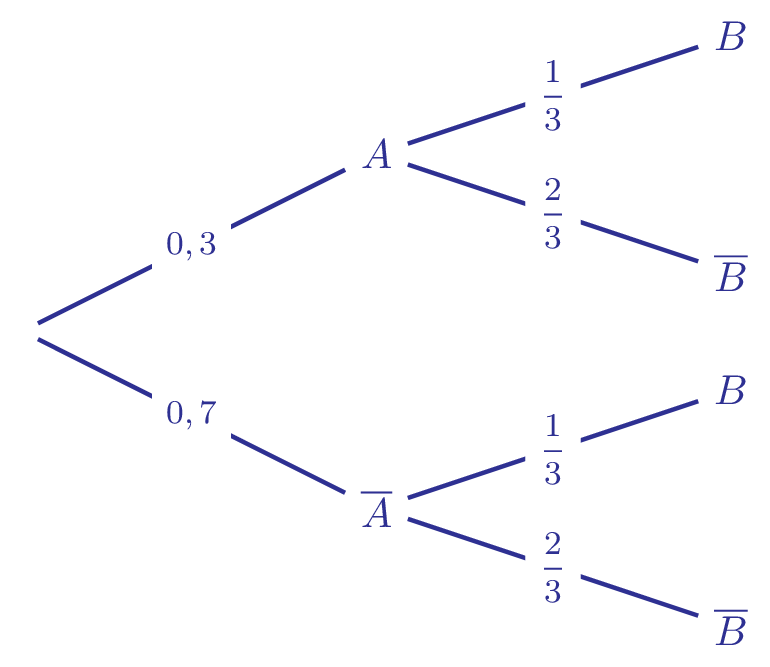
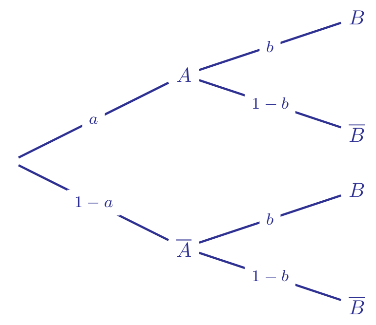
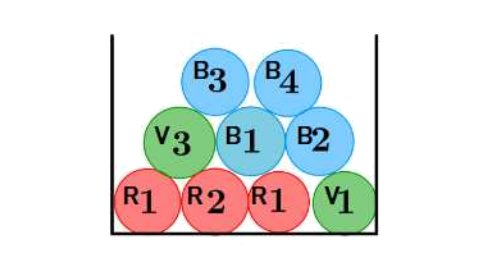
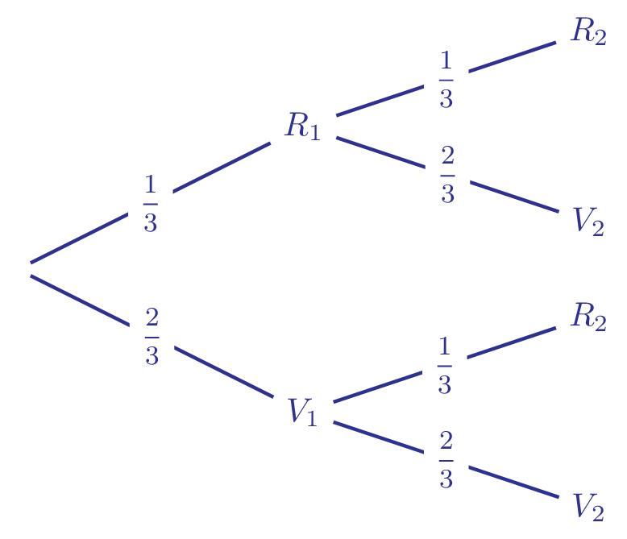

## Notion d'indépendance

::: {.bloc .def}
Définition :  
Soient $A$ et $B$ deux événements d'un même univers de probabilités non nulles.\\
On dit que $A$ et $B$ sont indépendants lorsque 
$$
P(A \cap B) = P(A) \times P(B).
$$
:::

  
::: {.bloc .ex}
Exemple :  
On considère un jeu de 32 cartes. On note $A$ et $B$ les événements \og Obtenir un as \fg et \og Obtenir un coeur \fg .  
Démontrer que les événements $A$ et $B$ sont indépendants.  

Afficher la correction

Les cartes étant indiscernables on est en situation d'équiprobabilité.  
Puisqu'il y a quatre as dans le jeu et huit cartes à coeur, et un seul as de coeur, on a  

$$P(A) = \dfrac{1}{4} \quad ; \quad P(B)= \dfrac{1}{8} \quad ; \quad P(A \cap B) = \dfrac{1}{32}$$  

Ainsi  

$$P(A) \times P(B) = \dfrac{1}{4} \times \dfrac{1}{8} = \dfrac{1}{32} = P(A \cap B)$$  

Donc par définition les événements $A$ et $B$ sont indépendants.

:::

  
::: {.bloc .rem}
Remarque :  

- On voit par cet exemple que la notion d'indépendance et celle d'incompatibilité ne sont pas les mêmes.
  
  Deux événements $A$ et $B$ sont incompatibles lorsque $P(A \cap B) = 0$, c'est-à-dire qu'ils ne peuvent se réaliser en même temps.
- Démontrons-le !
  
   En effet, si $A$ et $B$ sont indépendants, alors $P(A \cap B) = P(A) \times P(B)$.

   Or si $A$ et $B$ sont incompatibles, $P(A \cap B) = 0$.

   Ainsi, on aurait $P(A) = 0$ ou $P(B) = 0$, ce qui est contraire à la définition d'indépendance de deux événements.
:::

  
::: {.bloc .ex}
Exemple :  

- Soit $\Omega = \{1,2,3,4\}$. Considérons les événements $A = \{1,4\}$ et $B = \{2,4\}$. Montrer que $A$ et $B$ sont indépendants. On choisit un numéro au hasard.

   

Afficher la correction :

   On a $A \cap B = \{4\}$. 

   Le choix du numéro étant aléatoire, on est alors en situation d'équiprobabilité. Ainsi 
   $$
   P(A) = \dfrac{1}{2}, \quad P(B) = \dfrac{1}{2} \quad \text{et} \quad P(A \cap B) = \dfrac{1}{4}.
   $$

   Donc 

   $$
   P(A \cap B) = P(A)P(B)
   $$

   Les événements $A$ et $B$ sont indépendants.

   

- Reprenons l’exemple précédent en changeant la probabilité. Nous prenons maintenant la probabilité $P$ définie par
$$
P(\{1\}) = 0,1,\; P(\{2\}) = 0,2,\; P(\{3\}) = 0,3 \; \text{et} \; P(\{4\}) = 0,4.
$$

   

Afficher la correction :

   On a alors, puisque l'on ne peut pas choisir $1$ et $2$, où $2$ et $4$, en même temps 
   $$
   P(A) = P(\{1\}) + P(\{4\}) = 0.5 \et
   P(B) = P(\{2\}) + P(\{4\}) = 0.6
   $$

   Or
   $$
   P(A \cap B) = 0.4.
   $$

   Ainsi
   $$
   P(A \cap B) \neq P(A)P(B)
   $$

   Les événements $A$ et $B$ ne sont pas indépendants.
   Soient $A$ et $B$ vérifiant $P(A) =0,8$, $P(B)= 0,35$ et $P(A \cup B) =0,87$. Montrer que $A$ et $B$ sont indépendants.  
   

:::

::: {.bloc .rem}
Remarque :  

- L'indépendance est une notion mathématique (liée à la mesure P) et non toujours physique.
- L’indépendance sera souvent une donnée de l’énoncé. L’expression \og  d’expériences indépendantes \fg  indiquera que les événements relatifs à ces expériences sont indépendants. Il y aura ici une indépendance intrinsèque des événements.
- Mais les deux exemples précédents montrent que la notion d’indépendance de deux événements n’est en général pas intrinsèque, mais dépend de la probabilité retenue.

:::

  
::: {.bloc .thm}
Théorème :  
On considère $A$ et $B$ deux événements de probabilité non nulles.  
On dit que $A$ et $B$ sont indépendants si et seulement si  

$$P_A(B)=P(B)$$
:::

Démonstration :

Soit $A$ et $B$ deux événements :  

$$ A \text{ et } B \text{ indépendants } \Longleftrightarrow P(A  \cap B) =P(A) \times P(B) \Longleftrightarrow P(B) = \dfrac{P(A \cap B)}{P(A)} \Longleftrightarrow P(B) =  P_A(B)$$

::: {.bloc .rem}
**Comprendre la notion d'indépendance :**   

La propriété établit qu'il y a indépendance si et seulement si $P(A)=P_B(A)$.  
C'est-à-dire que la réalisation de l'événement $B$ ne modifie en rien la probabilité de l'événement $A$.
:::

::: {.bloc .ex}

Exemple    

On considère $A$ et $B$ deux événements indépendants tel que $P(A)=0,3$ et $P(A \cap B) = 0,1$.

Modéliser la situation par un arbre de probabilité.

Afficher la correction :

On a $A$ et $B$ indépendants, donc 
$$P(A \cap B) = P(A) \times P(B)$$

D'où 
$$P(B) = \dfrac{0,1}{0,3}$$

Donc 
$$P(B) =\dfrac13$$

De plus on a 
$$P(B)=P_A(B)$$

On déduit l'arbre suivant :

{width=40%}

:::

::: {.bloc .rem}
Remarque :  
On reconnaît une situation d'indépendance dans les arbres semblables à celui ci-dessus. En effet, considérant l'arbre suivant  :

{width=40%}

On a, puisque $\{A \,;\, \bar{A} \}$ est une partition de l'univers, d'après la formule des probabilités totales
$$P(B) = P(A \cap B) + P(\bar{A} \cap B) = P_A(B) \times P(A) + P_{\bar{A}}(B) \times P(\bar{A}) = ab + (1_a)b = b$$
Ainsi $$P_A(B)=P(B)$$
Donc $A$ et $B$ sont indépendants.

:::

::: {.bloc .thm}
Théorème :  
Si $A$ et $B$ sont deux événements indépendants, alors $A$ et $\bar{B}$ sont indépendants.
:::

Démonstration :

Soient $A$ et $B$ deux événements indépendants, alors  

$$P(A \cap B)= P(A) \times P(B)$$  

De plus $B$ et $\bar{B}$ forment une partition de l'univers, donc  

$$P(A) =P(A \cap B) + P(A \cap \bar{B})$$  

Donc  

$$P(A \cap \bar{B}) =  P(A) - P(A)P(B) = P(A)(1-P(B))=P(A)P(\bar{B})$$  

D'où le résultat.

::: {.bloc .thm}
Propriété :  

:::

Démonstration : 

::: {.bloc .ex}

Exemple    

Soient $A$ et $B$ vérifiant $P(A) = 0,8$, $P(B) = 0,35$ et $P(A \cup B) = 0,87$. Montrer que $A$ et $B$ sont indépendants.

Afficher la correction :

On a la formule $P(A \cup B) = P(A) + P(B) - P(A \cap B)$.\\
Donc 
$$
P(A \cap B) = P(A) + P(B) - P(A \cup B) = 0,8 + 0,35 - 0,87 = 0,28.
$$
Or 
$$
P(A) \times P(B) = 0,8 \times 0,35 = 0,28.
$$
On en déduit que 
$$
P(A \cap B) = P(A ) \times P(B),
$$
donc $A$ et $B$ sont indépendants.

:::

::: {.bloc .ex}
Exemple :  
Dans l'urne ci-dessous, il y a des jetons numérotés de différentes couleurs.

- 4 jetons bleus : 1, 2, 3, 4  
- 2 jetons verts : 1 et 3  
- 3 jetons rouges : deux numérotés 1 et un numéroté 2  

{style="display:block;margin:0 auto;width:40%;"}

On tire au hasard un jeton dans cette urne.  
On considère les évènements suivants :  

- $B$ : « le jeton tiré est bleu »  
- $I$ : « le numéro du jeton tiré est impair »  

1. Les évènements $B$ et $I$ sont-ils indépendants ?  

Afficher la correction

Les jetons étant indiscernables au toucher, on est en situation d'équiprobabilité.  

$$P(B)= \dfrac{4}{9}, \quad P(I) = \dfrac{6}{9} = \dfrac{2}{3}, \quad P(B \cap I) = \dfrac{2}{9}$$  

Ainsi  

$$P(B) \times P(I) = \dfrac{4}{9} \times \dfrac{2}{3} = \dfrac{8}{27} \neq \dfrac{2}{9} = P(B \cap I)$$  

Donc les événements ne sont pas indépendants.

2. On rajoute $n$ jetons bleus numérotés « 1 » dans l'urne.  

   a. Exprimer en fonction de $n$, les probabilités $P(B)$, $P(I)$ et $P(B \cap I)$.  

   

Afficher la correction

   $$P(B) = \dfrac{4+n}{9+n}, \quad P(I) = \dfrac{6+n}{9+n}, \quad P(B \cap I) = \dfrac{2+n}{9+n}$$
   

   b. Déterminer le nombre de jetons à rajouter pour que les événements $I$ et $B$ soient indépendants.  

   

Afficher la correction

   Les événements $I$ et $B$ sont indépendants si et seulement si  

   $$P(B \cap I) = P(B)  \times P(I)$$  

   Or  

   $$\dfrac{4+n}{9+n} \times \dfrac{6+n}{9+n} = \dfrac{2+n}{9+n} \Longleftrightarrow (4+n)(6+n)=(2+n)(9+n)$$  

   $$\Longleftrightarrow 24+10n+n^2=18+11n+n^2 \Longleftrightarrow n=6$$  

   Ainsi, pour que les événements soient indépendants, il faut ajouter $6$ jetons bleus numérotés « 1 ».
   

:::

---

## Réalisation d'épreuves identiques et indépendantes

::: {.bloc .def}
Définition :  
On appelle succession de deux épreuves identiques et indépendantes la répétition à l'identique d'une expérience aléatoire deux fois, les résultats de la première épreuve n'influençant pas ceux de la deuxième.
:::

  
::: {.bloc .ex}
Remarque :  
- Lors de la succession d'épreuves indépendantes, les probabilités de chaque issue ne changent pas.  
- Une succession d'épreuves indépendantes est assimilable à des tirages successifs (avec remise si il s'agit de la même épreuve). Le résultat du premier tirage n'influence pas le deuxième.
:::

  
::: {.bloc .ex}
Exemple :  
Une urne contient deux boules vertes et une boule rouge, indiscernables au toucher. On répète le tirage d'une boule avec remise.

1. Représenter la situation à l'aide d'un arbre pour deux tirages.  

Afficher la correction

{width=40%}

2. Déterminer la probabilité de l'événement $A$ « avoir exactement une boule rouge ».  

   

Afficher la correction

   On a une unique boule rouge, si on tire une boule rouge au premier tirage et une boule verte au second, ou une boule verte au premier tirage et une boule rouge au second tirage, ainsi 
   $$R_{=1} = (R_1 \cap V_2) \cup (V_1 \cap R_2)$$
   Ainsi $R_{=1}$ est union de deux événements disjoints, donc 

   $$\begin{aligned}
   P(R_{=1}) &= P\big((R_1 \cap V_2) \cup (V_1 \cap R_2)\big) \\
   &= P(R_1 \cap V_2) + P(V_1 \cap R_2) \\
   &= P(R_1)\times P(V_2) + P(V_1)\times P(R_2) \\
   &= 2 \times P(R)\,P(V) \\
   &=  \frac{4}{9}
   \end{aligned}$$
   Ainsi, la probabilité d'avoir exactement une boule rouge est $ \frac{4}{9}$.
   

3. On répète $n$ fois l'expérience :  

   a. Déterminer la probabilité de l'événement $B$ « avoir au moins une boule rouge ».  

   

Afficher la correction

   Avoir au moins une boule rouge est l'événement contraire de n'avoir aucune boule rouge, c'est-à-dire n'avoir que des boules vertes.\\
   Ainsi en notant $V_{=n}$ l'événement \og n'avoir que des boules vertes \fg, on a
   $$V_{=n} = V_1 \cap V_2 \cap \dots \cap V_n$$
   D'où de l'indépendance des événéments où tous les $P(V_i)$ sont égaux à $\frac23$.

   $$P(V_{=n}) = P\left(V_1 \cap V_2 \cap \dots \cap V_n \right) P(V_1) \times P(V_2) \times \dots \times P(V_n) = (P(V))^n$$

   Ainsi 
   $$
   P(R_{\geqslant 1}) = 1 - P(V_{=n}) = 1 - P(V)^n = 1 - \left( \frac{2}{3}\right)^n.
   $$
   

   b. Déterminer la probabilité de l'événement $A$ « avoir exactement une boule rouge ».  

   

Afficher la correction

   Tous les événements $(R_1,V_2,\dots,V_n), (V_1,R_2,V_3,\dots,V_n), \dots, (V_1,V_2,\dots,V_{n-1},R_n)$ ont la même probabilité.\\
   Par indépendance :
   $$
   P(R_1 \cap V_2 \cap \dots \cap V_n) = P(R)\,P(V)^{n-1}.
   $$
   De même pour chaque autre position de la boule rouge.\\
   Comme il y a $n$ façons de placer la boule rouge, on a
   $$
   P(R_{=1}) = n \, P(R)\,P(V)^{\,n-1} = n \times \frac{1}{3}\left(\frac{2}{3}\right)^{n-1} = \frac{n\,2^{n-1}}{3^n}.
   $$
   

:::

  <a class="prev" href="fpt.html">⬅️</a>

