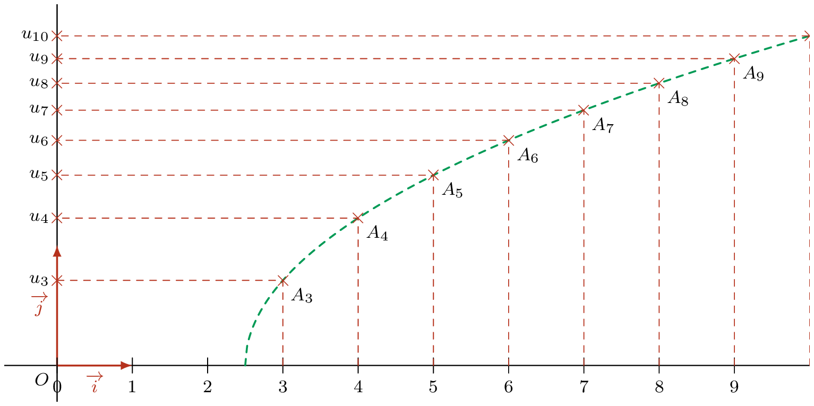
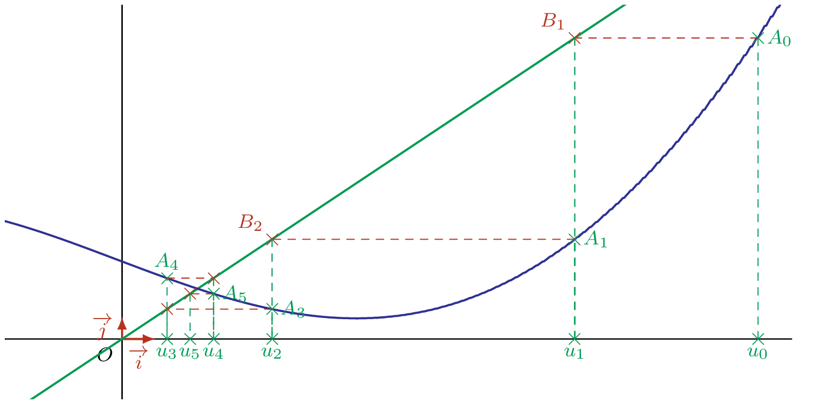

___

## Suites fonctionnelles

### Définition

::: {.bloc .def}
Définition :  

Soit $f$ une fonction définie sur $[a\,;\,+ \infty[$, avec $a$ réel positif ou nul.

On définit une suite $(u_n)$ : 
 $$\forall n \in \N,\; n \geq a,\; u_n = f(n) $$
:::

::: {.bloc .rem}
Remarque :  

- Le premier terme de la suite est $u_{n_0}$ où $n_0$ est le plus petit entier de $[a\, ; \,+ \infty[ \cap \N$.
- Pour qu'une suite soit définie, tous les termes de la suite, à partir de son premier terme, doivent exister.
-  On peut calculer n'importe quel terme de la suite connaissant son indice. On parle alors de suite définie de façon explicite.
:::

::: {.bloc .ex}
Exemples :  

1. Soit la fonction $f$ définie sur $]\R$ par $f(x)  = 2x^2-5$.
   
   Exprimer en fonction de $n$, la suite $u_n=f(n)$ et calculer les premiers termes.

  

Afficher la correction :

  Pour tout $n \geq 0$ la suite $u_n = 2n^2-5$.

  Cette suite admet pour premier terme $u_0= -5$.

  On peut directement calculer n'importe quel terme de la suite :

  $u_5 = 2\times 5^2 - 5 = 45$, $u_{20} = 2 \times 20^2-5 = 795$, \dots}
  

2. Soit la fonction $f$ définie sur $]2\,;\,+\infty[$ par $f(x) = \dfrac{x}{x - 2}$.
   
   Exprimer en fonction de $n$, la suite $u_n=f(n)$ et calculer les premiers termes.

   

Afficher la correction :

  Pour tout $n > 2$ la suite $u_n = \dfrac{n}{n -2}$.

  Le premier terme de la suite est $u_3 = \dfrac{3}{3-2} = 3$.

O n a ensuite $u_4 = 2$, $u_5 = \dfrac{5}{3}$, \dots
  

:::

::: {.bloc .rem}
Remarque :  
On ne peut pas définir la suite à partir de $u_0$, puisque $u_2$ n'est pas défini.
:::

| Caractéristique | Fonction $f$ | Suite $(u_n)$ |
|:---|:---|:---|
| **Variable** | Réelle : $x \in \mathbb{R}$ | Entière : $n \in \mathbb{N}$ |
| **Notation** | $f(x)$ (image de $x$) | $u_n$ (terme de rang $n$) |
| **Domaine** | Continu (intervalle) | Discret (valeurs isolées) |
| **Graphique** | Courbe (ligne continue) | Nuage de points isolés |
| **Calcul** | On peut calculer $f(0,5)$ | $u_{0,5}$ n'existe pas |

::: {.bloc .rem}
Remarque :  
Pour une suite fonctionnelle définie par $u_n = f(n)$, les points de la représentation graphique de la suite sont les points de la courbe de $f$ dont les abscisses sont des nombres entiers.

:::

### Représentation graphique

::: {.bloc .def}
Définition :  

On appelle représentation graphique d'une suite $(u_n)$ l'ensemble des points de coordonnées $(n \, ; \, u_n)$ où $n \in \N$.
:::

::: {.bloc .ex}
Exemple :  

Soit $(u_n)$ définie par $u_n = \sqrt{n - 2{,}5}$, définie pour $n \ge 3$.  
Le premier terme est donc $u_3$.  

{width=50%}

 
:::

## Suites définies par une relation de récurrence

### Définition
::: {.bloc .rem}
On peut aussi définir une suite par une relation de récurrence, c'est-à-dire que le terme $u_{n+1}$ dépend de la ou des valeurs des termes précédents. Il est donc nécessaire de calculer $u_0$, $u_1$, \dots, $u_{n-1}$ pour calculer $u_n$.

Ainsi pour définir une suite par récurrence, il faut une ou des conditions initiales.
:::

::: {.bloc .def}
Définition :  

Soit $f$ une fonction définie sur $I$ et à valeurs dans $I$ (c’est-à-dire que pour tout $x \in I$, $f(x) \in I$).   
Soit $a \in I$. La suite $(u_n)$ vérifiant
$$
\left\{
\begin{array}{l}
u_0 = a \\
u_{n+1} = f(u_n)
\end{array}
\right.
$$
est appelée suite récurrente d’ordre 1.
:::

::: {.bloc .rem}
Remarques :  

- On parle de premier ordre (ou d’ordre 1) car le terme $u_{n+1}$ est exprimé en fonction du terme précédent.
- On peut définir des suites à partir de plusieurs termes précédents (ordre 2, ordre 3, etc.).
- Pour calculer un terme de la suite, on doit calculer tous les termes précédents.
:::

::: {.bloc .ex}
Exemple :  

On considère la suite $(u_n)$ définie par $u_0=2$ et pour tout  $n \in \N$, $$u_{n+1} = \dfrac{u_n -1}{n+1}$$
Déterminer les trois premiers termes de la suite.

Afficher la correction :

$u_0=2 \quad u_1 = \dfrac{u_0-1}{0+1} = 1 \quad u_2 = \dfrac{u_1-1}{1+1} = 0$

:::

::: {.bloc .ex}
Exemple :  

On considère la suite $(u_n)$ définie par $u_0=2$ et pour tout  $n \in \N$, $$u_{n+1} = \dfrac{u_n -1}{n+1}$$
Déterminer les trois premiers termes de la suite.

Afficher la correction :

$u_0=2 \quad u_1 = \dfrac{u_0-1}{0+1} = 1 \quad u_2 = \dfrac{u_1-1}{1+1} = 0$

:::

::: {.bloc .ex}
Exemple :
Soit la fonction $f$ définie sur $\R$ par $f(x) = 3x - 1$.

On définit une suite $(u_n)_{n \in \N}$ par récurrence en posant 

$$
\left\{
\begin{array}{l}
u_0 = 3 \\
u_{n+1} = 3 u_n - 1
\end{array} 
\right.
$$

Ainsi $u_1 = 3 u_0 - 1 = 8$, $u_2 = 3u_1 - 1 = 23$, etc.

Montrer que pour tout $n \in \N$, $$u_n=\dfrac{5}{2} \times  3^n + \dfrac{1}{2}$$

Afficher la correction :

Soit $(v_n)$ la suite définie sur $\N$ par 

$$v_n = \dfrac{5}{2} \times 3^n + \dfrac{1}{2}$$

Montrons que $(v_n)$ vérifie la même relation de récurrence.

Pour tout $n \in \N$, on a $$3 v_n -1 = 3 \times \left( \dfrac{5}{2} \times 3^n + \dfrac{1}{2} \right) -1 = \dfrac{5}{2} \times 3^{n+1} -\dfrac{3}{2}-1 =   \dfrac{5}{2} \times 3^{n+1} + \dfrac{1}{2} =v_{n+1}$$
De plus $$v_0= \dfrac{5}{2} \times 3^0 + \dfrac{1}{2} = 3 = u_0$$

Les suites $(u_n)$ et $(v_n)$ vérifient la même relation de récurrence (du 1ère ordre) et vérifient $u_0=v_0$. 

Ainsi elles coïncident en tout point.

Donc  $(u_n)$ et $(v_n)$ sont égales.

Ainsi  pour tout $n \in \N$, 

$$u_n=\dfrac{5}{2} \times 3^n + \dfrac{1}{2}$$

:::

::: {.bloc .ex}
Exemple :   Suite de Fibonacci  

Soit $F_0=1$ et $F_1=1$, et pour tout $n \in \N$, 
$$F_{n+2}=F_{n+1}+F_n.$$

Chaque terme étant défini en fonction des deux précédents, cette suite est une suite récurrente d'ordre 2 (pour définir cette suite à l'aide d'une fonction, il faudrait introduire des fonctions à deux variables).

On a ainsi 
$$F_3=F_2+F_1=2 \; , \;F_4=F_3+F_2=3 \; , \; F_5=F_4+F_3=3+2=5 \; , \; \dots $$

On peut montrer (Formule de Binet), où $\varphi$ est le nombre d'or, que pour tout $n \in \N$, 
$$F_n= \dfrac{1}{\sqrt{5}} \left(\varphi^n - \left(-\dfrac{1}{\varphi}\right)^n\right).$$
:::

### Construction graphique d’une suite récurrente

::: {.bloc .rem}

Soit une suite $(u_n)$ définie par $u_{n+1} = f(u_n)$ avec $u_0$ donné.

1. On trace $\mathcal{D}$, la droite d’équation $y = x$, et $\mathcal{C}_f$, la représentation graphique de la fonction $f$.  
2. On place $M_0(u_0\,;\,0)$, puis $A_0$ le point de $\mathcal{C}_f$ d’abscisse $u_0$ ($A_0(u_0\,;\,u_1)$ puisque $f(u_0) = u_1$).  
3. On place $B_1(u_1\,;\,u_1)$, le point de $\mathcal{D}$ ayant même ordonnée que $A_0$.  
4. On projette $B_1$ sur l’axe des abscisses et on obtient $M_1(u_1\,;\,0)$.  
5. On réitère le procédé en partant de $M_1(u_1\,;\,0)$ pour construire $M_2(u_2\,;\,0)$.
:::

::: {.bloc .ex}
Exemple :  

Soit $(u_n)$ définie par $u_{n+1} = f(u_n)$.  
Construction graphique des premiers termes sur l’axe des abscisses :  

{width=55%}

:::

  <a class="prev" href="definition.html">⬅️</a>
  <a class="next" href="liste_terme_python.html">➡️</a>

