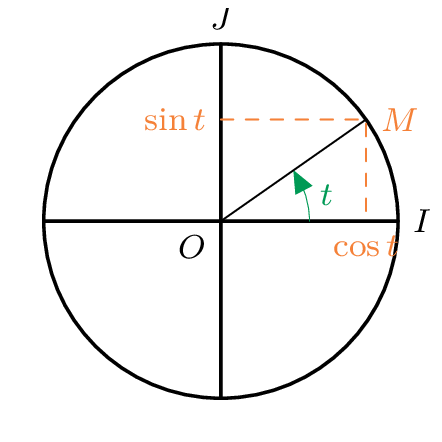
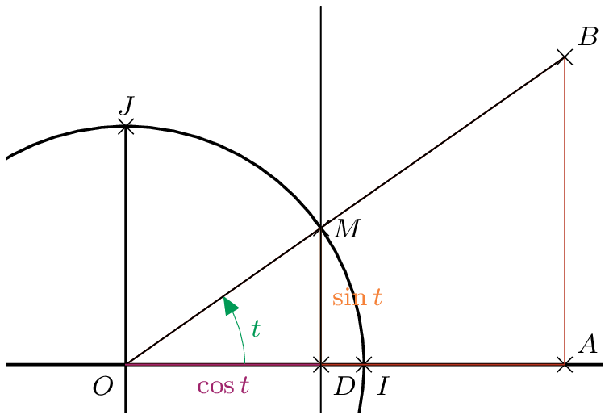
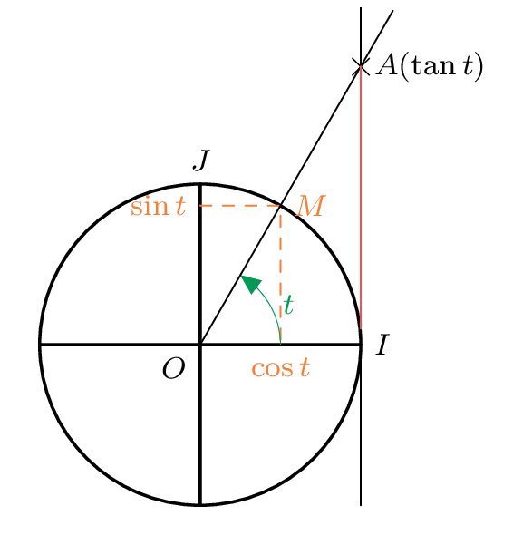

--------------
### Définitions

::: {.bloc .def}
Définition :  
Soit $t$ un nombre réel, et $M$ le point du cercle trigonométrique associé à $t$. \\
On appelle cosinus de $t$ et sinus de $t$ les coordonnées de $M$ dans le repère \Oij.\\
On note $M(\cos t \, ; \, \sin t)$.

:::

  

::: {.bloc .rem}
Remarque :  
Cette définition, pour $t \in \left]0 \, ; \, \frac{\pi}{2} \right[$, revient à celle du cosinus et du sinus d'un angle aigu dans un triangle rectangle. Elle permet de prolonger la définition à tout réel.

On considère le cercle trigonométrique de centre $O$ et le triangle $OAB$ rectangle en $A$. 

On utilise les notations de la figure. Les triangles $OAB$ et $OCD$ sont en configuration de Thalès.

On a 
$$
\cos t = OD = \frac{OD}{1} = \frac{OD}{OC} = \frac{OA}{OB}
$$
et 
$$
\sin t = DC = \frac{DC}{1} = \frac{DC}{OC} = \frac{AB}{OB}.
$$

:::

  

::: {.bloc .def}
Définition :  
On appelle tangente de $t$, $t\neq \frac{\pi}{2}~ [\pi]$, le rapport du sinus et du cosinus :

$$
\tan t = \frac{\sin t}{\cos t}.
$$

:::

::: {.bloc .rem}

Remarque :   **Tangente du collège** 

D'un point de vue géométrique, cela correspond au coefficient directeur de la droite $(OM)$.\\
Cette valeur est aussi l'abscisse du point $A$ sur la tangente en $I$ à $\mathscr{C}$, dans le repère $\left(I~;~\ve{j}\right)$.

 En effet, $(AM)$ et $(IM')$ sont sécantes en $O$ et $(MM') // (AI)$. Donc, d'après le théorème de Thalès :
$$
\frac{OM}{OA} = \frac{OM'}{OI} = \frac{MM'}{IA}.
$$
Donc 
$$
IA = MM' \times \frac{OI}{OM'} = \sin t \times \frac{1}{\cos t} = \tan t.
$$

:::

  

### Valeurs remarquables

::: {.bloc .rem}
Soit $OMI$ un triangle équilatéral et $H$ le projeté orthogonal de $M$ sur $(OI)$. Ainsi, $(MH)$ étant hauteur dans le triangle équilatéral $MOI$, elle est aussi bissectrice de $\widehat{OMI}$. Donc  
$$
\widehat{IMO} = \widehat{MOI} = \frac{\pi}{3}
\quad \text{et} \quad 
\widehat{HMO} = \frac{\pi}{6}.
$$

$H$ étant le pied de la hauteur, il est aussi le milieu de $[OI]$, donc $OH= \dfrac{1}{2}$.

De plus, $IMH$ étant rectangle en $H$ et $OM = 1$, on déduit du théorème de Pythagore que $MH = \dfrac{\sqrt{3}}{2}$. Ainsi : 
$$
\cos \left(\frac{\pi}{3} \right) = \frac{1}{2}
\qquad \text{et} \qquad
\sin \left(\frac{\pi}{3} \right) = \frac{\sqrt{3}}{2}.
$$

On a 
$$
\cos \widehat{MOH}  =\cos \left(\frac{\pi}{3} \right) = \frac{OH}{OM} = \sin \widehat{OMH}  =\sin \left(\frac{\pi}{6} \right).
$$

On en déduit que 
$$
\cos \left(\frac{\pi}{6} \right) = \frac{\sqrt{3}}{2}
\qquad \text{et} \qquad
\sin \left(\frac{\pi}{6} \right) = \frac{1}{2}.
$$

 On regroupe les résultats dans le tableau suivant :
|  | $\LH{0}$ | $\LH{\frac{\pi}{6}}$ | $\frac{\pi}{4}$ | $\frac{\pi}{3}$ | $\frac{\pi}{2}$ |
|---|---|---|---|---|---|
| cos | $1$ | $\LH{\frac{\sqrt{3}}{2}}$ | $\frac{\sqrt{2}}{2}$ | $\frac{1}{2}$ | $0$ |
| sin | $0$ | $\frac{1}{2}$ | $\frac{\sqrt{2}}{2}$ | $\LH{\frac{\sqrt{3}}{2}}$ | $1$ |

:::

### Propriétés élémentaires

::: {.bloc .thm}
Théorème :  
Pour tout $\alpha \in \R$ et $k \in \Z$ :

$$
\cos(\alpha + 2 k\pi) =\cos \alpha, \qquad 
\sin(\alpha + 2 k\pi) =\sin \alpha, \qquad 
\cos^2 \alpha + \sin^2 \alpha = 1, \qquad  
-1 \leq \cos  \alpha \leq 1, \qquad 
-1 \leq \sin\alpha \leq 1.
$$

:::

Démonstration : 

Soit $M$ le point image du réel $\alpha$ sur le cercle trigonométrique de centre $O$. 

Par définition, ses coordonnées dans le repère \Oij sont $(\cos \alpha \, ; \, \sin \alpha)$.

- Périodicité :  
  L'enroulement de la droite réelle sur le cercle associe le même point $M$ aux réels $\alpha$ et $\alpha + 2k\pi$ (où $k \in \mathbb{Z}$ correspond au nombre de tours complets). Les coordonnées du point $M$ étant uniques, on en déduit que :
$$\cos(\alpha + 2k\pi) = \cos \alpha \quad \text{et} \quad \sin(\alpha + 2k\pi) = \sin \alpha$$

- Relation fondamentale : 
  
  Le point $M$ appartient au cercle trigonométrique de centre $O(0;0)$ et de rayon $1$. La distance $OM$ est donc égale à $1$, d'où $OM^2 = 1$.
  
  En utilisant la formule de la distance entre deux points, on a :
  $$(x_M - x_O)^2 + (y_M - y_O)^2 = 1$$
  $$(\cos \alpha - 0)^2 + (\sin \alpha - 0)^2 = 1$$
  Ce qui donne : $\cos^2 \alpha + \sin^2 \alpha = 1$.

- Encadrement : 
  
  Comme la somme de deux carrés est égale à $1$, chaque carré est nécessairement inférieur ou égal à $1$. 
  
  Ainsi, $\cos^2 \alpha \leqslant 1$ et $\sin^2 \alpha \leqslant 1$.
  
  D'après les propriétés de la fonction carrée, cela implique :
  $$-1 \leqslant \cos \alpha \leqslant 1 \quad \text{et} \quad -1 \leqslant \sin \alpha \leqslant 1$$

  Graphiquement, cela se justifie par le fait que le cercle est contenu dans le carré délimité par les droites d'équations $x=-1$, $x=1$, $y=-1$ et $y=1$.

::: {.bloc .ex}
Exemple :  
On donne $\cos  \frac{\pi}{5} =  \frac{\sqrt{5} + 1}{4}$. Déterminer $\sin \frac{\pi}{5}$.

Afficher la correction : 

$$\begin{aligned}
\cos^2  \frac{\pi}{5}+\sin^2 \frac{\pi}{5}=1 
&\Longleftrightarrow \sin^2 \frac{\pi}{5}=1-\cos^2 \frac{\pi}{5} \\
&\Longleftrightarrow \sin^2 \frac{\pi}{5}=1-\left( \frac{\sqrt{5} + 1}{4}\right)^2\\
&\Longleftrightarrow \sin^2 \frac{\pi}{5}=1- \frac{5+1+2\sqrt{5}}{16} \\
&\Longleftrightarrow \sin^2 \frac{\pi}{5}=1- \frac{6+2\sqrt{5}}{16}\\
&\Longleftrightarrow \sin^2 \frac{\pi}{5}= \frac{16-6-2\sqrt{5}}{16} \\
&\Longleftrightarrow \sin^2 \frac{\pi}{5}= \frac{10-2\sqrt{5}}{16}.
\end{aligned}
$$
Or $\frac{\pi}{5} \in \left[0 \, ; \,  \frac{\pi}{2} \right[$, donc $\sin \frac{\pi}{5} > 0$. 
Donc 
$$
\sin \frac{\pi}{5} =  \frac{\sqrt{10-2\sqrt{5}}}{4}.
$$

:::

  <a class="prev" href="enroulement.html">⬅️</a>
  <a class="next" href="fct_trigo.html">➡️</a>

