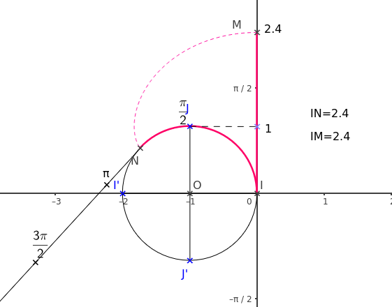

## Enroulement de la droite

::: {.bloc .def}
Définition :  
Soit $\Oij$ un repère du plan. 

On appelle cercle trigonométrique le cercle de rayon $1$ unité et de centre l'origine du repère et muni d'un sens de parcours.

On appelle alors sens direct le sens contraire au sens des aiguilles d'une montre et sens indirect l'autre sens.
:::

::: {.bloc}
On considère $\mathscr{C}$ un cercle trigonométrique de centre $O(O\,;\,0)$ et $d$ la tangente à $\mathscr{C}$ en $I(1\,;\,0)$. On muni la droite du repère  $\left(I,\ve{j} \right)$.

Cette droite est appelée axe des réels.

  

On enroule cette droite autour du cercle. Ainsi, à chaque point $N$ d'abscisse $t$ de la droite réelle $d$, muni du repère $\left(I ; \ve{j} \right)$, correspond un point $M$ unique  du cercle $\mathscr{C}$.

Un tel point $M$ est alors appelé image de $t$ sur  $\mathscr{C}$ 

- dans le sens direct si $t > 0$.
- dans le sens indirect si $t < 0$.

:::

::: {.bloc .rem}
Remarque :  

- L'arc $\wideparen{IJ}$, dans le sens direct, fait un quart de cercle. La circonférence du cercle trigonométrique étant de $2 \pi$, l'arc $\wideparen{IJ}$ a pour mesure  $\dfrac{\pi}{2}$ unités. Donc $J$ est l'image de $\dfrac{\pi}{2}$.  
  
- Le symétrique du point $I$ par rapport au centre du cercle est l'image de $\pi$. 

- Dans le sens indirect, l'arc $\wideparen{IJ}$ ayant une mesure de $\dfrac{3 \pi}{2}$, il est l'image de $-\dfrac{3\pi}{2}$.
  
  Le symétrique de $I$ par rapport à l'origine est alors l'image de $- \pi$.

:::

::: {.bloc .thm}
Théorème :  
Soient $x$ et $y$ deux nombres réels. Alors, $x$ et $y$ ont la même image sur le cercle trigonométrique
si et seulement s'il existe un entier relatif $k$ tel que $y - x = 2k \pi$. 

On dit alors que $x$ et $y$ sont égaux modulo $2 \pi$ et on note $x  = y \,[2\pi]$.

:::

Démonstration : 

$x$ et $y$ ont pour image le même point $M$ si et seulement si, de $t$ à $t'$, l'enroulement de la droite réelle sur le cercle trigonométrique correspond à un nombre entier de tours.

Le périmètre du cercle étant $2\pi$, alors $x = y + 2k\pi$, où $k \in \Z$. (Si $k > 0$, les tours sont dans le sens direct, sinon dans le sens indirect.

::: {.bloc .rem}
Remarque : 

- Tout point du cercle trigonométrique est l'image d'une infinité de réels.
- Dans la propriété et la démonstration précédentes : $\abs{k}$ correspond au nombre de tours

:::

::: {.bloc .ex}
Exemple : 

1. Montrer que $\dfrac{7\pi}{11}$ et $\dfrac{51\pi}{11}$ ont la même image sur le cercle trigonométrique.

Afficher la correction :

On calcule la différence entre les deux mesures :
$$\dfrac{51\pi}{11} - \dfrac{7\pi}{11} = \dfrac{44\pi}{11} = 4\pi = 2 \times 2\pi$$
La différence est un multiple de $2\pi$, par conséquent, les deux réels ont la même image sur le cercle.

2. Déterminer l'ensemble des réels qui ont pour image $\dfrac{7\pi}{11}$.

Afficher la correction :

Tous les réels ayant la même image que $\dfrac{7}{11} \pi$ sur le cercle trigonométrique sont les réels de la forme :
$$\dfrac{7}{11} \pi + 2k \pi, \quad k \in \mathbb{Z}$$

:::

::: {.bloc .ex}
Exemple : 

Sur le cercle trigonométrique on a placé  $A$ image du réel $\dfrac{\pi}{7}$.

Sans justifier, placer les points $B$, $C$, $D$ et $E$ images des réels $$-\dfrac{\pi}{7}\quad ; \quad \dfrac{8\pi}{7}\quad ; \quad \dfrac{33\pi}{7}\quad ; \quad \dfrac{9\pi}{14}$$

Afficher la correction :

  

- $B$ se construit par symétrie de $A$ par rapport à l'axe des abscisse.
- $\dfrac{8\pi}{7} =\pi+ \dfrac{\pi}{7}$. 
  
  Donc $C$ se construit par symétrie de $A$ par rapport à l'origine.
- $\dfrac{33\pi}{7} = \dfrac{5\pi + 28\pi}{7} = \dfrac{5\pi}{7} + 2 \pi$.
  
  Donc $D$ se construit en reportant 5 fois la mesure de l'arc $IA$, à partir de $I$.
- $\dfrac{9\pi}{14} = \dfrac{\pi}{7} + \dfrac{\pi}{2}$. Donc $E$ est  l'image de $A$ par une rotation de $90^\circ$ de centre $O$.

:::

## Mesure en radian
### Définition

::: {.bloc .def}
Définition : 

On considère le cercle trigonométrique et $M$ un point de ce cercle trigonométrique. 

Tout nombre $a$ dont l'image sur le cercle est $M$ est appelé une mesure en radian de l'angle $\widehat{IOM}$.

:::

::: {.bloc .rem}
Remarque : 
1. Le symbole du radian est *rad*. 
2. Un même angle admet une infinité de mesures en radian différentes, elles sont alors toutes égales modulo $2 \pi$.
   
:::

::: {.bloc .rem}
Remarque : 

En appliquant les règles d'opérations sur les angles, comme pour les degrés, pour deux points $M (a)$ et $N (b)$ du cercle trigonométrique, une mesure en radian de l'angle $\widehat{MON}$ est  
$$\widehat{MON} = \widehat{ION} - \widehat{IOM} = b - a \, [2\pi]$$

:::

**Cas du $1\; rad$ :**  
On considère un cercle de rayon $R$, et un arc de cercle $AB$ de longueur $R$. D'après la définition, l'angle au centre qui intercepte cet arc de cercle a pour mesure $1~rad$. 
La mesure du segment $[AB]$ est inférieure à $R$, ainsi un angle dont la mesure est $1\,rad$ est plus petit qu'un angle dont la mesure est de $60^{\circ}$. 
On montre que $1~rad \approx 57^{\circ}17'44''$.

::: {.bloc .def}
Définition : 

La mesure principale d'un angle en radian est la mesure qui, parmi toutes les autres, se situe dans l'intervalle $]-\pi \, ; \, \pi]$.

:::

::: {.bloc .rem}
Remarque : 

L'intervalle $]-\pi \, ; \, \pi]$ est privilégié pour la mesure principale car il permet de parcourir l'ensemble du cercle trigonométrique une unique fois en restant, en valeur absolue, au plus proche de l'origine $0$.

- On exclut $-\pi$ et on inclut $\pi$ car ces deux valeurs correspondent au même point du cercle (le point diamétralement opposé à $I$). En garder une seule assure l'unicité de la mesure principale.
- Les valeurs positives correspondent au demi-cercle supérieur (sens direct).
- Les valeurs négatives correspondent au demi-cercle inférieur (sens indirect).
:::

::: {.bloc .ex}
Exemple :  

- Sur un petit angle $\dfrac{-57}{7} \pi$ 
  Méthode 1 : pas à pas : 

Afficher la correction

  $\dfrac{-57}{7} \pi < -\pi$ (on n’a donc pas assez de tours …)
  - $\dfrac{-57}{7} \pi + 2\pi = \dfrac{-57+14}{7}\pi = \dfrac{-43}{7} \pi$ et $\dfrac{-43}{7} \pi < -\pi$
  - $\dfrac{-43}{7} \pi + 2\pi = \dfrac{-43+14}{7}\pi = \dfrac{-29}{7} \pi$ et $\dfrac{-29}{7} \pi < -\pi$
  - $\dfrac{-29}{7} \pi + 2\pi = \dfrac{-29+14}{7}\pi = \dfrac{-15}{7} \pi$ et $\dfrac{-15}{7} \pi < -\pi$
  - $\dfrac{-15}{7} \pi + 2\pi = \dfrac{-15+14}{7}\pi = \dfrac{-1}{7} \pi$ et $- \pi < \dfrac{-1}{7} \pi \leqslant  \pi$  
  Ainsi la mesure principale de l'angle est $\dfrac{-\pi}{7}$. 

- Sur un angle « grand » : $\dfrac{192}{7} \pi$   
  Méthode 2 : On cherche le nombre de tours à rajouter ou à retirer. 

Afficher la correction

  Pour tout $k \in \Z$, 
  $$
  \begin{aligned}
  -\pi <\dfrac{192}{7} \pi +2k\pi \leqslant \pi &\Longleftrightarrow -\pi - \dfrac{192}{7} \pi  \leqslant  2k\pi \leqslant \pi - \dfrac{192}{7} \pi \\
  &\Longleftrightarrow - \dfrac{199}{7} \pi  \leqslant  2k\pi \leqslant - \dfrac{185}{7} \pi \\
  &\Longleftrightarrow - \dfrac{199}{14} \leqslant  k \leqslant - \dfrac{185}{14}\\
  &\Longleftrightarrow -14,2 < k <-13,2
  \end{aligned}
  $$
  On déduit donc que $k=-14$. 
  $\dfrac{192}{7} \pi - 14 \times 2 \pi = \dfrac{192}{7} \pi - 28 \pi = \dfrac{192}{7} \pi - \dfrac{196}{7} \pi = - \dfrac{4}{7} \pi$. 
  Cette dernière valeur est la mesure principale. 

- Méthode 3 : On cherche un multiple. 
  

Afficher la correction

  On a, pour tout $k \in \Z$, $\dfrac{192}{7} \pi - 2k\pi = \dfrac{192\pi - 14k\pi}{7}$. 
  On cherche dans la table de $14$ le multiple le plus proche de $192$. 
  $13 \times 14 = 182$ et $14 \times 14 = 196$, le multiple le plus proche est donc $196$. 
  Ainsi on prend $k=14$.
  

:::

---

### Lien radian - degré

::: {.bloc .thm}
Théorème :  
Les mesures d'un angle en radians et en degrés sont proportionnelles

:::

Démonstration : 

La circonférence du cercle trigonométrique est  $2\pi$.

Par convention, un tour complet correspond à $360^{\circ}$. 

La mesure d'un angle étant proportionnelle à la longueur de l'arc intercepté, on en déduit que les mesures en degrés ($D$) et en radians ($\alpha$) sont proportionnelles. 

| Angle | Demi-tour | Mesure quelconque |
|:---:|:---:|:---:|
| **Degrés** | $180$ | $D$ |
| **Radians** | $\pi$ | $\alpha$ |

: Tableau de proportionnalité entre degrés et radians {#tbl-conversion}

D'après le produit en croix, on obtient la relation : 
$$180 \times \alpha = \pi \times D$$

Ce qui permet d'établir les formules de conversion :
$$\alpha = \dfrac{D \times \pi}{180} \quad \text{et} \quad D = \dfrac{\alpha \times 180}{\pi}$$

::: {.bloc .ex}
Exemple :  
- À un angle de $60^{\circ}$ correspond un angle de $\dfrac{60 \times 2 \pi}{360} = \dfrac{\pi}{3}~rad$.  
- À un angle de $\dfrac{11 \pi}{8}~rad$ correspond un angle de $\dfrac{\dfrac{11 \pi}{8} \times 360}{2 \pi} = 247,5^{\circ}$.

:::

::: {.bloc}
On peut retenir le tableau de correspondance suivant :

| Mesure en radian | $0$ | $\dfrac{\pi}{6}$ | $\dfrac{\pi}{4}$ | $\dfrac{\pi}{3}$ | $\dfrac{\pi}{2}$ | $\pi$ | $2\pi$ |
|---|---|---|---|---|---|---|---|
| Mesure en degré  | $0$ | $30$ | $45$ | $60$ | $90$ | $180$ | $360$ |
:::

::: {.bloc .thm}
Propriété :  
Dans le cercle trigonométrique, la longueur de l'arc de cercle intercepté est égale à la mesure de l'angle au centre en radians.

:::

Démonstration : 

La longueur d'un arc de cercle est proportionnelle à la mesure de l'angle au centre qui l'intercepte. Dans un cercle de rayon $R=1$, le périmètre complet mesure $2\pi$ et correspond à un angle au centre de $2\pi$ radians. 
Soit $L$ la longueur d'un arc correspondant à un angle $\alpha$ en radians. On a le rapport de proportionnalité suivant :
$$\dfrac{L}{\alpha} = \dfrac{2\pi}{2\pi} = 1$$
On en déduit immédiatement que $L = \alpha$. La longueur de l'arc est donc égale à la mesure de l'angle en radians.

  <a class="next" href="cosinus_sinus.html">➡️</a>

