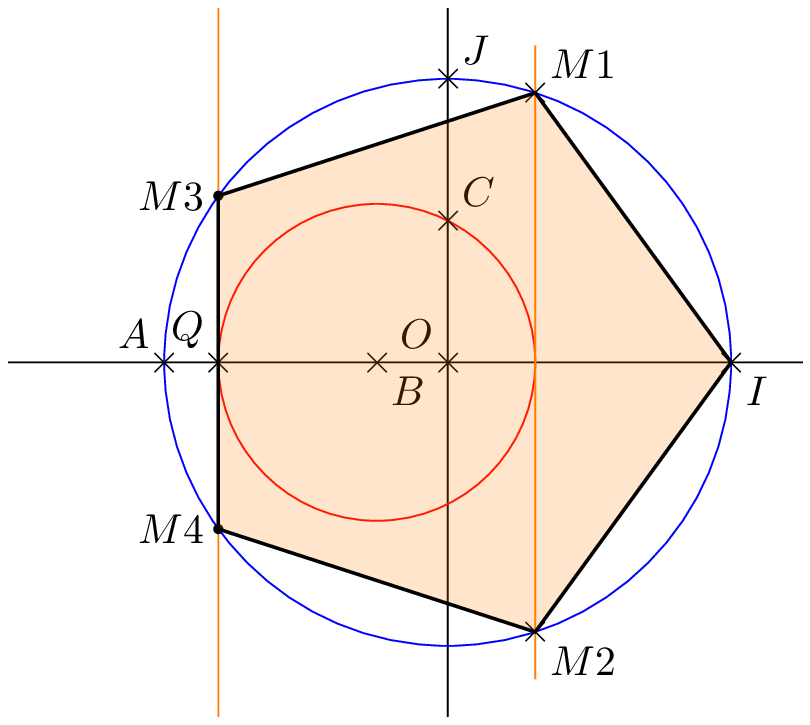
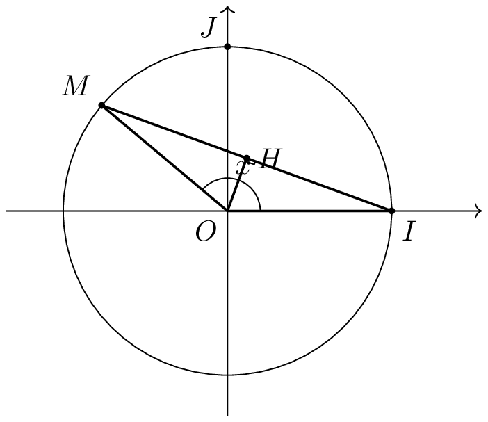
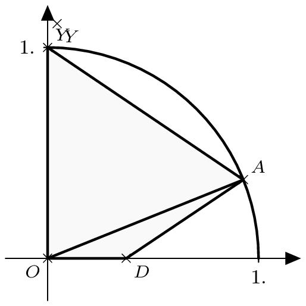
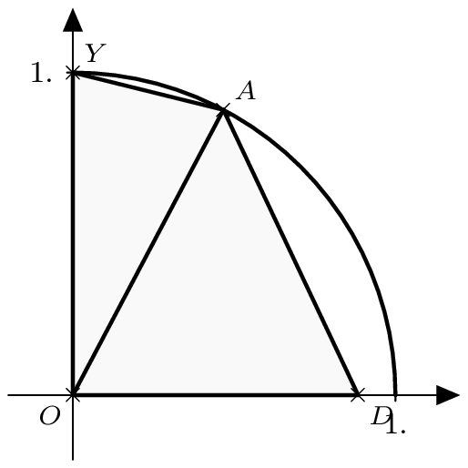
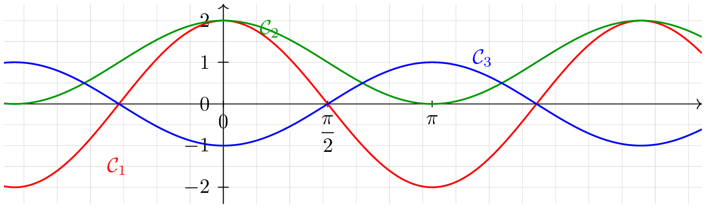
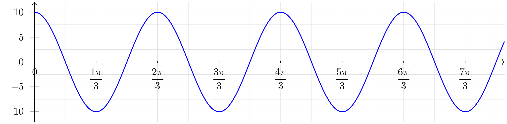
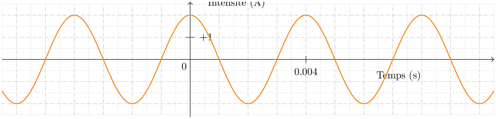

# Enroulement de la droite graduée, mesure en radianIL f

## Exercice
::: {.bloc .exo}
  <!-- titre exercice eventuel--> 

Parmi les nombres suivants, indiquer ceux qui ont la même image sur le cercle trigonométrique que $-\dfrac{\pi}{12}$ :

$$
\dfrac{47\pi}{12}\quad ; \quad-\dfrac{49\pi}{12}\quad ; \quad\dfrac{11\pi}{12}\quad ; \quad-\dfrac{241\pi}{12} \quad ; \quad -\dfrac{37\pi}{12}
$$

:::

## Exercice
::: {.bloc .exo}

Donner la mesure principale de :

$$\dfrac{11\pi}{4}
\,;\, -\dfrac{11\pi}{4}
\,;\,-\dfrac{13\pi}{4}
\,;\, \dfrac{27\pi}{4}
\,;\, \dfrac{2005\pi}{4}
\,;\, \dfrac{37\pi}{6}
\,;\, \dfrac{178\pi}{8}$$
:::

## Exercice
::: {.bloc .exo}
  <!-- titre exercice eventuel--> 

Reprendre l'exercice précédent, en donnant l'unique réel de l'intervalle $\left[0\,;\, 2\pi\right[$ ayant le même point-image par enroulement de la droite des réels sur le cercle trigonométrique.

:::

## Exercice
::: {.bloc .exo}
  <!-- titre exercice eventuel--> 

Écrire un programme Python permettant de déterminer la mesure principale d'un angle en radian.

~~~{=html}

  

    
Valeur principal

    <textarea id="code">
</textarea>
    
<pre></pre>

    

      <button class="btn" id="run" disabled></button>
      <button class="btn" id="check" disabled></button>
      <button class="btn" id="download"></button>
      <button class="btn" id="reset"></button>
      <button class="btn" id="clear"></button>
      <button class="btn" id="save"></button>
    

  

~~~

:::

## Exercice
::: {.bloc .exo}
  <!-- titre exercice eventuel--> 

Dans chaque cas, colorier sur le cercle trigonométrique l'ensemble des points $M$ repérés par des réels de :

1. $\left[-\dfrac{\pi}{3}~;~\dfrac{\pi}{4} \right]$
2. $\left]-\dfrac{\pi}{6}~;~\dfrac{5\pi}{4} \right]$
3. $\left[-\dfrac{3\pi}{2}~;~-\pi\right]$
4. $\left[-2\pi~;~-\dfrac{\pi}{2} \right[$

:::

## Exercice
::: {.bloc .exo}
  <!-- titre exercice eventuel--> 

Dans chacun des cas suivants, $M$ et $N$ sont les points-images des réels indiqués par l’enroulement de la droite des réels sur le cercle trigonométrique.

Dans chacun des cas, déterminer :

- la mesure de l’arc de cercle $\wideparen{MN}$ parcouru dans le sens trigonométrique ;
- la mesure en radians de l’angle $\widehat{MON}$ correspondant.

1. $M$ image de $\dfrac{\pi}{4}$ et $N$ image de $\dfrac{4\pi}{3}$.
2. $M$ image de $-\dfrac{5\pi}{6}$ et $N$ image de $\dfrac{7\pi}{3}$.
3. $M$ image de $-\dfrac{\pi}{3}$ et $N$ image de $\dfrac{17\pi}{6}$.

:::

# Cosinus et sinus d'un réel

## Exercice
::: {.bloc .exo}

Déterminer le signe des nombres suivants.

$$\cos\left(\dfrac{\pi}{5}\right) \quad ; \quad 
\sin\left(\dfrac{5\pi}{8}\right)\quad ; \quad 
\cos\left(\dfrac{13\pi}{12}\right)\quad ; \quad 
\sin\left(-\dfrac{\pi}{7}\right)\quad ; \quad 
\cos\left(\dfrac{31\pi}{9}\right)$$

:::

## Exercice
::: {.bloc .exo}

Vrai ou faux ? Préciser si les égalités suivantes sont vraies ou fausses. Justifier.

::: {.columns}
::: {.column width="33%"}
1. $\sin\left(\dfrac{\pi}{3}\right)=\cos\left(-\dfrac{\pi}{6}\right)$
:::
::: {.column width="33%"}
2. $\cos\left(-\dfrac{\pi}{3}\right)=-\cos\left(\dfrac{\pi}{3}\right)$
:::
::: {.column width="33%"}
3. $\cos\left(\dfrac{3\pi}{4}\right)=\cos\left(-\dfrac{3\pi}{4}\right)$
:::
:::

:::

## Exercice
::: {.bloc .exo}

Donner la valeur exacte des nombres suivants en s’aidant du cercle trigonométrique.

::: {.columns}
::: {.column width="20%"}
1. $\sin\left(\dfrac{2\pi}{3}\right)$
:::
::: {.column width="20%"}
2. $\cos\left(-\dfrac{\pi}{4}\right)$
:::
::: {.column width="20%"}
3. $\sin\left(\dfrac{3\pi}{4}\right)$
:::
::: {.column width="20%"}
4. $\cos\left(\dfrac{17\pi}{6}\right)$
:::
::: {.column width="20%"}
5. $\sin\left(-\dfrac{14\pi}{3}\right)$
:::
:::

:::

## Exercice
::: {.bloc .exo}

Après avoir placé sur le cercle trigonométrique les différents angles, calculer les nombres suivants :

$$
A=3 \sin  \dfrac{7\pi}{6} \cos  \dfrac{\pi}{4} - 2 \sin  \dfrac{7\pi}{4} \cos  \dfrac{5\pi}{3} \et 
B= \dfrac{2 \sin^2 \dfrac{\pi}{6} - \cos^2 \dfrac{5 \pi}{6} + \cos^2 \dfrac{2\pi}{3}}{\sin^2\dfrac{7\pi}{3}- \cos^2 \dfrac{\pi}{4}}
$$

:::

## Exercice
::: {.bloc .exo}

1. Soit $x \in \left[0;\dfrac{\pi}{2}\right]$ tel que $\cos x=\dfrac{\sqrt{7}}{4}$. Que vaut $\sin x$ ?
2. Soit $x \in \left[-\dfrac{\pi}{2};\dfrac{\pi}{2}\right]$ tel que $\sin x=-0.6$. Que vaut $\cos x$ ?
3. Soit $x \in \left[\dfrac{\pi}{2};\dfrac{3\pi}{2}\right]$ tel que $\sin x=\dfrac{4}{5}$. Que vaut $\cos x$ ?

:::

## Exercice
::: {.bloc .exo}

1. a. La calculatrice étant en mode radian, choisir plusieurs nombres réels $x$ et calculer l’expression
   $$
   (\cos x+\sin x)^2+(\cos x-\sin x)^2.
   $$

   b. Quelle conjecture peut-on formuler ?

   c. Démontrer le résultat conjecturé.

2. Démontrer que, pour tout réel $x$, on a :
   $$
   (\cos x)^4-(\sin x)^4=(\cos x)^2-(\sin x)^2.
   $$

:::

## Exercice
::: {.bloc .exo}

1. Démontrer que
   $$
   \cos \dfrac{\pi}{8} + \cos \dfrac{3\pi}{8} + \cos \dfrac{5\pi}{8} +\cos \dfrac{7\pi}{8} =0
   $$
2. Déterminer la valeur de
   $$
   B= \cos^2 \dfrac{\pi}{8} + \cos^2 \dfrac{3\pi}{8} + \cos^2 \dfrac{5\pi}{8} +\cos^2 \dfrac{7\pi}{8}
   $$
3. Exprimer en fonction de $\cos x$ et/ou $\sin x$,
   $$
   C=\cos x  + \cos \left(x+\dfrac{\pi}{2} \right) + 2 \sin x  + \sin(x+\pi) - \cos(x+ 2 \pi) + \sin \left(\dfrac{3\pi}{2} -x \right)
   $$

:::

## Exercice
::: {.bloc .exo}

Calculer sans la calculatrice :

1. $A=\cos ~\dfrac{\pi}{10} +\cos ~\dfrac{2\pi}{5} +\cos ~\dfrac{3\pi}{5} +\cos ~\dfrac{9\pi}{10}$
2. $B=\cos ~\dfrac{\pi}{10} +\sin~\dfrac{2\pi}{5} +\cos ~\dfrac{3\pi}{5} +\sin~\dfrac{9\pi}{10} +\sin~\dfrac{7\pi}{5} +\cos ~\dfrac{8\pi}{5} +\sin~\dfrac{19\pi}{10}$
3. $C=\sin~\dfrac{\pi}{10} +\sin~\dfrac{2\pi}{5} +\sin~\dfrac{3\pi}{5} +\sin~\dfrac{9\pi}{10}$

:::

## Exercice
::: {.bloc .exo}

1. On considère les sommes suivantes
   $$
   S=\cos \dfrac{2\pi}{7} +\cos \dfrac{4\pi}{7} +\cos \dfrac{6\pi}{7} \et 
   S'=\cos \dfrac{8\pi}{7} +\cos \dfrac{10\pi}{7} +\cos \dfrac{12\pi}{7}
   $$
   Comparer ces deux sommes.

2. On considère les sommes suivantes
   $$
   \Sigma=\sin \dfrac{2\pi}{7} +\sin \dfrac{4\pi}{7} +\sin \dfrac{6\pi}{7} \et  
   \Sigma'=\sin \dfrac{8\pi}{7} +\sin \dfrac{10\pi}{7} +\sin \dfrac{12\pi}{7}
   $$

   Calculer $\Sigma + \Sigma'$.

:::

## Exercice
::: {.bloc .exo}

On se place dans un repère orthonormé $(O;I;J)$ et on appelle $\mathcal{C}$ le cercle trigonométrique de centre $O$.

On considère les points $A(-1;0)$, $B\!\left(-\dfrac{1}{4};0\right)$ et $C\!\left(0;\dfrac{1}{2}\right)$.  
Le cercle $\mathcal{C}_1$, de centre $B$ et de rayon $BC$, coupe l’axe $(OI)$ en $P$ et $Q$.

La perpendiculaire à la droite $(OI)$ en $P$ coupe le cercle $\mathcal{C}$ en $M_1$ et $M_4$.  
La perpendiculaire à la droite $(OI)$ passant par $Q$ coupe le cercle $\mathcal{C}$ en $M_2$ et $M_3$.

On admet que le pentagone $IM_1M_2M_3M_4$ est régulier.

  

1. Déterminer les nombres réels associés aux points $M_1$ et $M_2$.
2. En utilisant la longueur $BC$, déterminer les coordonnées exactes des points $P$ et $Q$.
3. Déterminer les coordonnées exactes des points $M_1$ et $M_2$.
4. En déduire les valeurs exactes des cosinus et sinus des réels $\dfrac{\pi}{5}$ et $\dfrac{2\pi}{5}$.
5. Vérifier les résultats précédents à l’aide de la calculatrice.

:::

## Exercice
::: {.bloc .exo}

Le plan étant muni d’un repère orthonormé $(O;I;J)$, on note $\mathcal{C}$ le cercle trigonométrique.

**Partie A — Établissement de formules**

Soit un réel $x \in [0;\pi]$.
On note $M$ le point du cercle $\mathcal{C}$ associé à $x$, et $H$ le pied de la hauteur issue de $O$ dans le triangle $OIM$.

1. a. Rappeler les coordonnées des points $I$ et $M$.
   b. En déduire la distance $IM$ en fonction de $x$.
2. Démontrer que $MH=\sin \dfrac{x}{2}$.
3. En déduire l’expression de $\sin \dfrac{x}{2}$ en fonction de $\cos x$.
4. Démontrer que $\cos \dfrac{x}{2}=\sqrt{\dfrac{1+\cos x}{2}}$.

  

**Partie B — Cas général** \\
Expliquer comment on peut calculer $\cos \dfrac{x}{2}$ et $\sin \dfrac{x}{2}$ à partir des formules précédentes dans le cas où $x$ est un réel quelconque, pas forcément dans l’intervalle $[0;\pi]$.

**Partie C — Applications numériques**

1. Justifier les résultats obtenus par le logiciel Xcas ci-contre.
2. En déduire les valeurs exactes des cosinus et sinus de :
   $$
   \dfrac{7\pi}{8}\,;\, \dfrac{9\pi}{8}\,;\, \dfrac{5\pi}{8}\,;\,\dfrac{3\pi}{8}.
   $$

:::

## Exercice
::: {.bloc .exo}

ABC est un triangle isocèle en $A$ dont les angles de la base valent le double de l'angle principal. On note $\widehat{A}=\alpha$, et on considère $D$ le point de $[AC]$ tel que $BD=BC$. On pose alors $BC=a$ et $BD=b$.

1. Démontrer que $\alpha=\dfrac{\pi}{5}$
2. Démontrer que $ADB$ est isocèle et exprimer la mesure de chacun des côtés de tous les triangles en fonction de $a$ et $b$.
3. En déduire que $b=2a \cos 2\alpha$ et $a=(2b+a) \cos 2\alpha$
4. En déduire que $\cos 2\alpha$ est solution d'une équation du second degré.
5. En déduire les valeurs de $\cos \dfrac{2\pi}{5}$ et de $\cos \dfrac{\pi}{5}$

:::

## Exercice
::: {.bloc .exo}

1. On donne la valeur exacte :
   $$
   \cos \dfrac{\pi}{8}=\dfrac{\sqrt{2+\sqrt{2}}}{2}.
   $$
   a. En utilisant la formule $(\cos x)^2+(\sin x)^2=1$, déterminer la valeur exacte de $\sin \dfrac{\pi}{8}$.
   b. En déduire la valeur exacte de $\cos \dfrac{5\pi}{8}$ en justifiant votre démarche.
   c. Établir l’égalité :
   $$
   \tan \dfrac{\pi}{8}=\sqrt{3-2\sqrt{2}}.
   $$

2. On considère l’expression suivante :
   $$
   A=\cos \dfrac{9\pi}{8}-3\sin \dfrac{5\pi}{8}+2\cos \dfrac{7\pi}{8}.
   $$
   Déterminer une écriture de l’expression $A$ en fonction des rapports trigonométriques de l’angle $\dfrac{\pi}{8}$.

:::

## Exercice
::: {.bloc .exo}

On donne $\cos~\dfrac{\pi}{12} = \dfrac{\sqrt{2} + \sqrt{6}}{4}$.

1. Déterminer $\sin~\dfrac{\pi}{12}$
2. Placer sur le cercle trigonométrique les points images de $-\dfrac{\pi}{12}$, de $\dfrac{5\pi}{12}$ et de $\dfrac{11\pi}{12}$\\
   Déterminer alors les coordonnées de ces points.
3. Résoudre dans $\left]-\dfrac{9\pi}{2}~;~\pi \right]$, $\sin~x =  - \dfrac{\sqrt{2} + \sqrt{6}}{4}$

:::

## Exercice
::: {.bloc .exo}

1. En justifiant les calculs, calculer
   $$
   A=\cos \dfrac{\pi}{5} + \cos \dfrac{2\pi}{5} + \cos \dfrac{3\pi}{5} + \cos \dfrac{4\pi}{5}
   $$
2. On admet que $\cos \dfrac{\pi}{8} = \dfrac{\sqrt{2+\sqrt{2}}}{2}$
   a. Démontrer que $\sin \dfrac{\pi}{8}=\dfrac{\sqrt{2-\sqrt{2}}}{2}$
   b. Utiliser ce qui précède pour calculer
   $$
   B= \sin\left(\dfrac{\pi}{8} \right) \cos\left(\dfrac{5 \pi}{8}\right) \sin\left(\dfrac{3 \pi}{8} \right) \cos\left(\dfrac{7\pi}{8} \right)
   $$

:::

## Exercice
::: {.bloc .exo}

**Partie A :**

1. Déterminer l'extrémum de $f$ définie par $f(x) = -x^2+x+1$ sur $[-1~;~1]$.
2. Résoudre dans $\R$, $\cos\alpha = \frac{1}{2}$

**Partie B :**\\
Soit $\mathscr{C}$ le quart de cercle trigonométrique dans le repère \Oij.\\
Soit $A$ le point de $\mathscr{C}$ associé au réel $\alpha \in \left[0~;~\frac{\pi}{2} \right]$. On considère $D$ de coordonnées $(\sin \alpha~;~0)$ et $Y(0~;~1)$.
L'objectif du problème est de déterminer $\alpha$ pour que l'aire de $YODA$ soit maximale.\\
On donne en annexe deux configurations pour deux valeurs $\alpha$ différentes.

  
  

1. Donner les coordonnées de $A$
2. Justifier que l'aire de $ADO$ est $\frac{1}{2} \sin^2 \alpha$ et que l'aire de $OYA$ est $\frac{1}{2} \cos \alpha$.
3. En déduire que l'aire du quadrilatère $YODA$ est donnée par $\frac{1}{2} \left(-\cos^2 \alpha + \cos \alpha +1 \right)$.
4. En déduire la valeur de $\alpha$ pour que l'aire du quadrilatère soit maximale.

:::

# Fonctions trigonométriques

## Exercice
::: {.bloc .exo}

On considère les fonctions $f$, $g$ et $h$ définies sur $\mathbb{R}$ par
$$
f(x)=\cos x+1,\qquad g(x)=2\cos x,\qquad h(x)=-\cos x.
$$
Associer chaque fonction à sa courbe représentative, en expliquant le choix fait.

  

:::

## Exercice
::: {.bloc .exo}

1. Soient deux réels $a$ et $b$. Comparer dans chacun des cas suivants les nombres $\cos a$ et $\cos b$.

   ::: {.columns}
   ::: {.column width="33%"}
   1. $a=\dfrac{\pi}{7}$ et $b=\dfrac{\pi}{5}$
   :::
   ::: {.column width="33%"}
   2. $a=\dfrac{\pi}{10}$ et $b=-\dfrac{\pi}{5}$
   :::
   ::: {.column width="33%"}
   3. $a=\dfrac{4\pi}{9}$ et $b=-\dfrac{5\pi}{9}$
   :::
   :::

2. Soient deux réels $a$ et $b$. Comparer dans chacun des cas suivants les nombres $\sin a$ et $\sin b$.

   ::: {.columns}
   ::: {.column width="33%"}
   1. $a=\dfrac{\pi}{10}$ et $b=\dfrac{\pi}{7}$
   :::
   ::: {.column width="33%"}
   2. $a=\dfrac{\pi}{5}$ et $b=-\dfrac{\pi}{5}$
   :::
   ::: {.column width="33%"}
   3. $a=-\dfrac{4\pi}{7}$ et $b=-\dfrac{\pi}{7}$
   :::
   :::

:::

## Exercice
::: {.bloc .exo}

Pour chacune des fonctions suivantes, donner des encadrements des fonctions suivantes : \\
leurs minimum et maximum s'ils existent.

::: {.columns}
::: {.column width="33%"}
1. $f_1(x)=1-2\sin x$
:::
::: {.column width="33%"}
2. $f_2(x)=4\cos^2 x-3$
:::
::: {.column width="33%"}
3. $f_4(x)=\dfrac{-2}{1+\sin^2 x}$
:::
:::

:::

## Exercice
::: {.bloc .exo}

On considère la fonction $f:x\mapsto \dfrac{1}{2+\cos x}$.

1. Déterminer le domaine de définition $D$ de $f$.
2. Étudier la périodicité et la parité de la fonction.
3. Déterminer le minimum et le maximum de $f$ sur son domaine de définition. Pour chacun d’eux, donner une valeur où il est atteint.

:::

## Exercice
::: {.bloc .exo}

Pour chacune des fonctions suivantes, définies sur $\mathbb{R}$, montrer qu'elles sont $\pi$-périodiques :
$$
f:x\mapsto \cos x\sin x\qquad g:x\mapsto \sin(2x) - \cos x \sin x 
$$

:::

## Exercice
::: {.bloc .exo}

1. Soit $k\in]0;+\infty[$. Montrer que la fonction $f:x\mapsto \cos(kx)$, définie sur $\mathbb{R}$, est $\dfrac{2\pi}{k}$-périodique.
2. Soit $m$ et $n$ deux entiers naturels non nuls. Montrer que la fonction
   $$
   f:x\mapsto \cos\left(\dfrac{x}{m}\right)+\cos\left(\dfrac{x}{n}\right)
   $$
   est périodique. Préciser une période de cette fonction.

:::

## Exercice
::: {.bloc .exo}

(Ressort sans amortisseur)\\
On considère une masse $m$ suspendue à un ressort. On note $y$ la hauteur relative de la masse ; $y=0$ correspondant à l'équilibre lorsque la masse est immobile.\\
On amène la masse à une hauteur de $A$ puis on la lâche. On suppose qu'il n'y a pas d'amortisseur des oscillations, ces dernières étant données par
$$
y(t)=A\cos(\omega t + \phi)
$$
On donne la représentation graphique associée à l'expérience.

  

1. Pour quel temps $t_1$ la masse passe pour la première fois par sa position d'équilibre $y=0$ ?
2. Pour quel temps $t_2$ la masse passe pour la deuxième fois par sa position d'équilibre ?
3. Quelle est la période des oscillations de la masse ?
4. Quelles seront les hauteurs maximale et minimale de la masse ?
5. En déduire les valeurs des paramètres $A$ et $\omega$.

:::

## Exercice
::: {.bloc .exo}

En électricité, en courant alternatif, l’intensité $i$ du courant électrique à un temps $t$, exprimé en secondes, peut être décrite à l’aide de fonctions trigonométriques.
$$
i(t)=i_0\sin(\omega t+\varphi)
$$
où $i_0$ désigne l’amplitude du signal en ampères, $\omega$ est la pulsation du signal, en $\mathrm{rad.s^{-1}}$ et $\varphi$ est le déphasage, exprimé en radians.

1. Montrer que l’intensité $i$ est $\dfrac{2\pi}{\omega}$-périodique.
2. Déterminer, sur l’exemple suivant, les valeurs de $i_0$, $\varphi$ et $\omega$.

  

3. La valeur $\cos(\varphi)$ est appelée facteur de puissance. Quel est le facteur de puissance de ce signal ?

:::

# Equations et inéquations trigonométriques
## Exercice
::: {.bloc .exo}

Résoudre les équations suivantes, d’inconnue $x\in]-\pi\,;\,\pi]$.

::: {.columns}
::: {.column width="25%"}
1. $\cos x=\frac{1}{2}$
:::
::: {.column width="25%"}
2. $\cos x=-\frac{\sqrt{2}}{2}$
:::
::: {.column width="25%"}
3. $\sin x=-\frac{1}{2}$
:::
::: {.column width="25%"}
4. $\sin x=\frac{\sqrt{2}}{2}$
:::
:::

:::

## Exercice
::: {.bloc .exo}

1. Résoudre sur $]-\pi\,;\,\pi]$.

   ::: {.columns}
   ::: {.column width="33%"}
   1. $\sin(2x)=1$
   :::
   ::: {.column width="33%"}
   2. $\cos(3x)=-\frac{1}{2}$
   :::
   ::: {.column width="33%"}
   3. $\cos(3x+1)=\frac{\sqrt{2}}{2}$
   :::
   :::

2. Résoudre dans $\R$

   ::: {.columns}
   ::: {.column width="50%"}
   1. $\sin \left(3x + \frac{\pi}{2}\right) =\sin~x$
   :::
   ::: {.column width="50%"}
   2. $\sin~3x =\cos  \left(x - \frac{\pi}{6} \right)$
   :::
   :::

3. Résoudre sur $]-3\pi\,;\,\pi]$.
   $$
   \sin\left(2x- \frac{\pi}{5} \right)=-\frac{\sqrt{3}}{2}
   $$

:::

## Exercice
::: {.bloc .exo}

1. Résoudre dans $\R$,
   $$
   (E_1)\, :\, \cos \left(x+ \frac{\pi}{3} \right) = \frac{1}{2} \et (E_2) \, :\, \sin (2x-3)=\sin \left(\frac{\pi}{6} -x \right)
   $$
2. En déduire les solutions dans $]-\pi \,;\, \pi]$

:::

## Exercice
::: {.bloc .exo}

1. Résoudre les équations suivantes
   $$
   (E_1) \,:\, 
   \frac{\sqrt{2}}{2}x^2-\sqrt{2}x-\frac{\sqrt{2}}{2}=0
   \et 
   (E_2) \,:\,\frac{1}{2}x^2-\sqrt{3}x-\frac{1}{2}=0
   $$

2. a. Soit $a$ un réel. Résoudre l’équation :
   $$
   \sin(a)x^2-2\cos(a)x-\sin(a)=0.
   $$
   b. En quoi cette dernière équation généralise les équations de la question 1 ?

:::

## Exercice
::: {.bloc .exo}

À l’aide d’un changement de variable bien choisi, résoudre les équations suivantes, d’inconnue $x\in]-\pi\,;\,\pi]$.
$$
(E_1) \,:\,\cos^2 x+\frac{\sqrt{3}}{2}\cos x-\frac{3}{2}=0 \et 
(E_2) \,:\, \sin^2 x+\frac{3\sqrt{2}}{2}\sin x+1=0
$$

:::

## Exercice
::: {.bloc .exo}

On cherche à résoudre l'équation
$$
(E) : \cos(2x)=(\sqrt{3}-2)\sin x - \sqrt{3}+1
$$

1. On admet que $\cos(2x) = 2\cos^2x - 1$. \\
   Montrer que $(E)$ est équivalent à
   $$
   -2\sin^2 x+(2-\sqrt{3}) \sin x + \sqrt{3} = 0
   $$
2. a. Déterminer $a$ et $b$ tel que $7+4\sqrt{3} =(a+b\sqrt{3})^2$
   b. En déduire les racines de
   $$
   -2x^2+(2-\sqrt{3})x+\sqrt{3}
   $$
   c. Résoudre $(E)$

:::

## Exercice
::: {.bloc .exo}

On considère sur $\R$, l'équation
$$
E_1 : \, 4 \cos^2 x -2(1+\sqrt{3}) \cos x + \sqrt{3} = 0
$$
On effectue le changement de variables $X=\cos x$

1. Quelle équation, $E_1$, du second degré est équivalente à l'équation $E_0$ ?
2. Montrer que son discriminant peut s'écrire $4(\sqrt{3}-1)^2$
3. Déterminer les solutions $E_2$
4. En déduire les solutions dans $]-\pi \, ;\,  \pi]$.

:::

## Exercice
::: {.bloc .exo}

On admet que pour tout $x \in \R$, $$\cos(2x)= \cos^2 x - \sin^2 x$$

1. Démontrer que pour tout réel $t$, $\cos 4t = 8\cos^4 t -8 \cos^2 +1$
2. On considère les fonctions $f$ et $g$ définies par
   $$
   f(x)=\cos 4x - \cos x\quad et \quad g(x)=8x^4-8x^2-x+1
   $$
   a. Établir une relation simple entre $f$ et $g$
   b. Résoudre dans $\R$, $f(x)=0$ et représenter les images sur le cercle trigonométrique.
   c. Sans calcul, déterminer les racines de $g$.
3. a. Montrer que $g$ est factorisable par $2x^2-x-1$, et en déduire la forme factorisée de $g$.
   b. Déduire des questions précédentes, les valeurs exactes de $\cos \frac{2\pi}{5}$ et $\cos \frac{4\pi}{5}$

:::

## Exercice
::: {.bloc .exo}

Résoudre les inéquations suivantes dans $]-\pi~,~\pi]$, en visualisant les solutions sur le cercle trigonométrique.

$$(I_1) \,:\, \cos x \leq \frac{1}{2} \quad ; \quad
(I_2) \,:\,\sin x \geq \frac{\sqrt{2}}{2} \quad ; \quad
(I_3) \,:\,\frac{1}{2} \leq\sin x \leq \frac{ \sqrt{3}}{2} \quad ; \quad
(I_4) \,:\,\sin^2 x \geq \frac{1}{2} \quad ; \quad 
(I_5) \,:\,\cos^2x <\sin^2 x
$$

:::

## Exercice
::: {.bloc .exo}

1. Résoudre sur $]-\pi \, ; \, \pi]$ et à l'aide du cercle trigonométrique
   $$
   (I_1)  \, :\,\cos x \geqslant \frac{\sqrt{3}}{2} \quad \text{ et } \quad 
   (I_2) \, :\, 2 \sin x-1 \leqslant 0
   $$
2. En déduire, sur $]-\pi\, ;\, \pi]$, les solutions de
   $$
   (I_3) \, : \, \frac{2 \sin x -1}{2 \cos x - \sqrt{3}} \leqslant 0
   $$

:::
