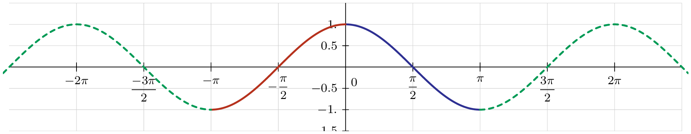
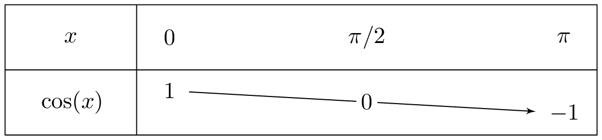
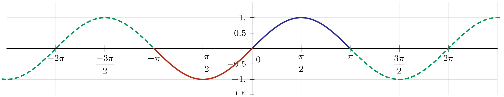
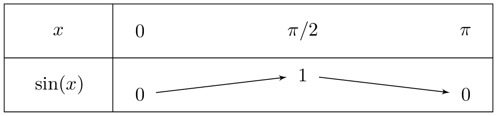
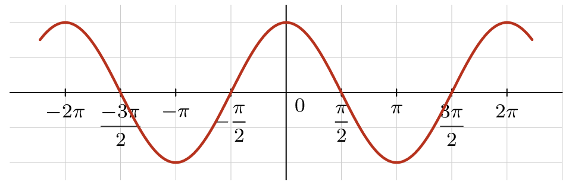
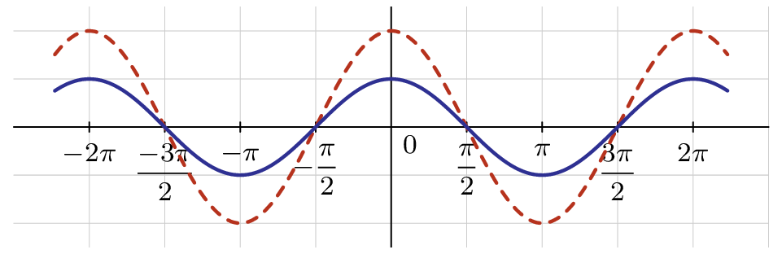
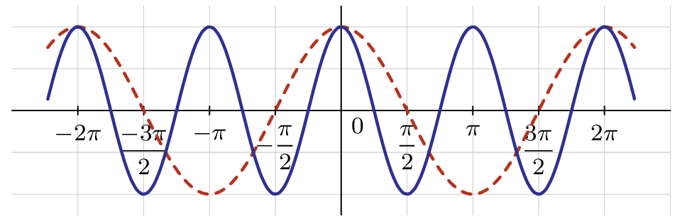
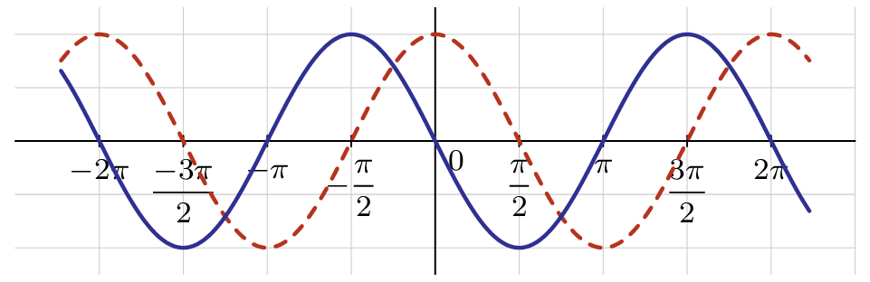
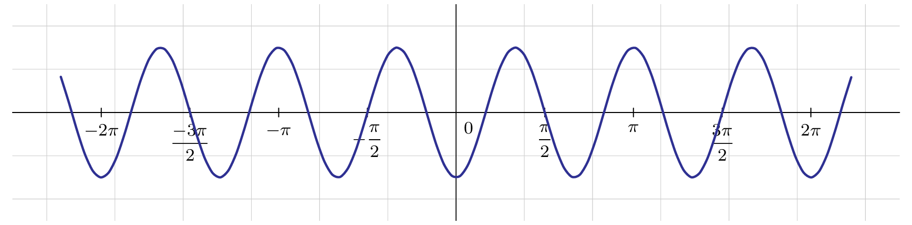

## Définitions

::: {.bloc .def}
Définition :  
On appelle fonction cosinus et fonction sinus les fonctions notées respectivement $\cos$ et $\sin$, définies sur $\R$ et à valeurs dans $[-1~;~1]$, par :
$$
\cos : x \longmapsto \cos(x) \quad \text{et} \quad \sin : x \longmapsto \sin(x).
$$
:::

::: {.bloc .rem}
Remarque :  
- Ces fonctions sont bien définies sur $\R$ puisque, à tout point de la droite des réels, on associe un unique point du cercle trigonométrique dont les coordonnées sont le cosinus et le sinus. 
- Ces fonctions prennent leurs valeurs dans $[-1~;~1]$ d'après la propriété précédente.
:::

**Courbe de la fonction $\cos$** 

  

::: {.bloc .thm}
Théorème :  
La fonction cosinus est : 
- paire ;
- $2\pi$-périodique ;
- décroissante sur $[0~;~\pi]$.
:::

Démonstration : 

La parité et la $2\pi$-périodicité proviennent de la propriété précédente. 
Le sens de variation de la fonction sur $[0~;~\pi]$ provient de la définition même du cosinus (on parcourt les abscisses de $1$ à $-1$ lorsque l'on parcourt le cercle trigonométrique de $0$ à $\pi$).

**Tableau des variations de la fonction cosinus** 

  

**Courbe de la fonction $\sin$** 

  

::: {.bloc .thm}
Théorème :  
La fonction sinus est : 
- impaire ;
- $2\pi$-périodique ;
- croissante sur $\left[0~;~\dfrac{\pi}{2}\right]$ puis décroissante sur  $\left[\dfrac{\pi}{2}~;~\pi \right]$.
:::

Démonstration : 

La parité et la $2\pi$-périodicité proviennent de la propriété précédente. 
Le sens de variation de la fonction sur $[0~;~\pi]$ provient de la définition même du sinus (on parcourt les ordonnées de $0$ à $1$ lorsque l'on parcourt le cercle trigonométrique de $0$ à $\pi/2$, puis de $1$ à $0$ pour les valeurs de $\pi/2$ à $\pi$).

**Tableau des variations de la fonction sinus** 

  

::: {.bloc .ex}
Exemple :  
Comparer les sinus de $-\dfrac{2\pi}{5}$ et $\dfrac{22 \pi}{6}$. 

Afficher la correction

On a
$$
\sin\left(-  \dfrac{2 \pi}{5} \right) = - \sin  \dfrac{2\pi}{5}, 
\quad 
\sin\left( \dfrac{22 \pi}{6} \right) = \sin\left(- \dfrac{2\pi}{6} + 4 \pi \right) = \sin\left(- \dfrac{\pi}{3} \right) = - \sin  \dfrac{\pi}{3}.
$$
Or :
$$
0 <  \dfrac{\pi}{3} <  \dfrac{2 \pi}{5} <  \dfrac{\pi}{2}.
$$
La fonction sinus est croissante sur $\left[0~;~ \dfrac{\pi}{2}\right]$.  
Ainsi $\sin  \dfrac{\pi}{3}  < \sin  \dfrac{2 \pi}{5}$, donc, en multipliant par $-1$, on déduit que :
$$
\sin \left(- \dfrac{\pi}{3}\right)  > \sin \left( \dfrac{22 \pi}{6} \right).
$$

:::

### Influence des différents paramètres
On considère dans la suite uniquement la fonction $\cos$, mais on obtiendrait des résultats similaires avec la fonction $\sin$.

Partons de la représentation graphique de la fonction cosinus :
$$
\begin{array}{crcl} 
f: & \mathbb{R}&\rightarrow & \mathbb{R}\\ 
& t &\mapsto & \cos(t)\\ 
\end{array} 
$$

  

$\bullet$ Testons l'influence du paramètre $A$ en traçant la courbe représentative de la fonction :
$$
\begin{array}{crcl} 
g: & \mathbb{R}&\rightarrow & \mathbb{R}\\ 
& t &\mapsto & 0.5\cos(t)\\ 
\end{array} 
$$

  

On remarque que les valeurs minimales et maximales de la fonction ont été impactées. La période, par contre, ne subit aucun changement. Le coefficient $A$ représente \textbf{l'amplitude} de la fonction.

$\bullet$ Testons l'influence du paramètre $\omega$ en traçant la courbe représentative de la fonction :
$$
\begin{array}{crcl} 
g: & \mathbb{R}&\rightarrow & \mathbb{R}\\ 
& t &\mapsto & \cos(2t)\\ 
\end{array} 
$$

  

On remarque que les valeurs minimales et maximales de la fonction n'ont pas été impactées. Par contre, la fréquence (et donc la période) a été modifiée. Le coefficient $\omega$ représente la \textbf{pulsation} (exprimée en radians par seconde, rad/s). Elle est proportionnelle à la fréquence : $\omega = 2 \pi f$. En connaissant la formule $f=\dfrac{1}{T}$, on a aussi la relation $\omega = \dfrac{2 \pi}{T}$.

$\bullet$ Testons l'influence du paramètre $\varphi$ en traçant la courbe représentative de la fonction :
$$
\begin{array}{crcl} 
g: & \mathbb{R}&\rightarrow & \mathbb{R}\\ 
& t &\mapsto & \cos\left(t + \dfrac{\pi}{2}\right)\\ 
\end{array} 
$$

  

On remarque que la courbe s'est \og décalée \fg{} de $\dfrac{\pi}{2}$ vers la gauche. Le coefficient $\varphi$ représente la \textbf{phase à l'origine} (exprimée en radians, rad). Elle peut également se noter $\Phi$ (phi majuscule), $\psi$ (psi minuscule) ou $\Psi$ (psi majuscule).

::: {.bloc .ex}
Exemple :  
Soit $f$ une fonction dont la courbe est donnée sur le graphique ci-dessous.  

  

Cette courbe est de la forme $t \mapsto A\sin\left(\omega t + \varphi\right)$. L'objectif est de déterminer les valeurs des trois paramètres $A$, $\omega$ et $\varphi$.

Afficher la correction :

On représente la fonction $\sin t$ (ici en rouge sur le graphique).

- Déterminons l’amplitude $A$  :
  
  D'après les formules des angles associés, on sait que pour tout réel $X$ :
    $$\sin\left(X + \dfrac{3\pi}{2}\right) = -\cos(X)$$

  Ainsi , en posant $X = 3t$, l'expression de la fonction devient :
    $$f(t) = -0,75 \cos(3t)$$
  Pour $t=0$, on a $f(0) = -0,75 \cos(0) = -0,75 \times 1 = -0,75$.

- Déterminons la pulsation $\omega$ : 
  
  On compare la période de la fonction $f$, notée $T_f$, à celle de la fonction sinus de référence ($T = 2\pi$). \\
    On observe sur le graphique que sur un intervalle de $2\pi$, la fonction $f$ effectue exactement $3$ cycles complets. Sa période est donc $T_f = \dfrac{2\pi}{3}$, ainsi  $\omega = \dfrac{2\pi}{T_f}$.\\
    Donc $\omega = 3$.
- Détermination de la phase à l'origine $\varphi$ : 
  
  On regarde la valeur de la fonction en $t=0$. 
    Ici, $f(0) = 0,75 \sin(\varphi)$. 
    Graphiquement, on voit que pour $t=0$, la courbe bleue est à son minimum, soit $f(0) = -0,75$.
    On doit donc résoudre $\sin(\varphi) = -1$, ce qui donne $\varphi = -\dfrac{\pi}{2}$
     (ou $\dfrac{3\pi}{2}$).

:::

  <a class="prev" href="cosinus_sinus.html">⬅️</a>
  <a class="next" href="lignes_trigo.html">➡️</a>

