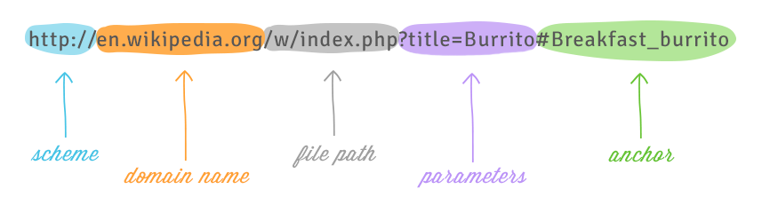

----

### Objectifs et compétences : {#objectifs-et-compétences}

**Objectifs de séance**

::: {.competence}

- Comprendre la différence entre adresse symbolique et adresse IP.
- Savoir identifier les composants d’une URL.
  
:::

**Compétences travaillées**

::: {.competence}

  - Différencier web et Internet.
  - Décomposer et comprendre une adresse Web (URL).
  - Réaliser une recherche documentaire ciblée.
  
:::

----

# 🧭 Pour prendre un bon départ

1. 🔍 Chercher la définition des termes suivants :  
   - **Web :**  
   - **Internet :**  

2. Donner différents services d'Internet :  

#  Deux types d'adresses ?

## 🔎 d'un URL

::: {.boitedoc}

📘 Document 1 : Comprendre un URL

Les documents du Web sont repérés par des adresses URL qui ont la forme suivante :  

{fig-align="center" width=70%}

- Le protocole indique le type de connexion ;  
- Le nom du serveur est son adresse dans le système DNS ;  
- Le chemin indique l'adresse du document dans le serveur ;  
- Les paramètres d'affecter certaines valeurs ;  
- L'ancre montre une position dans le document (un élément dont l'id est Architecture ici).

:::

3. 🔍 Identifier les composants des URL suivants :  
   - https://www.larousse.fr/dictionnaires/anglais-francais/request  
   - https://developer.mozilla.org/fr/docs/Web/HTML/Element/Form#Exemples  
   - Faire une recherche d'une musique sur Youtube, et décomposer la réponse.  

## 📺 Une adresse numérique

📘 **Vidéo :** [Internet, IP un protocole universel ?](https://www.yout-ube.com/watch?v=aX3z3JoVEdE)

<iframe src="https://www.yout-ube.com/embed/watch?v=aX3z3JoVEdE" allowfullscreen style="width:70%;aspect-ratio:16/9;border:0;"></iframe>

4. Réponds aux questions suivantes :  
5. 
   - Comment sont localisées les machines (ou hôtes) sur Internet ?  
   - Quels équipements permettent d'acheminer les données de l'émetteur au destinataire sur Internet ?  
   - Comment nomme-t-on les règles qui normalisent les échanges de données sur Internet et permettent aux différents hôtes du réseau de communiquer ?  

---
# 🖥️ Derrière un site web : un ordinateur connecté à Internet

::: {.boitedoc}

📘 Document : Derrière un site web

Un site web est un ensemble de fichiers (pages HTML, images, vidéos, scripts) **stockés sur un ordinateur** appelé **serveur**.  
Ce serveur est connecté à Internet, comme votre propre ordinateur, et possède une **adresse IP unique**.  

Quand vous tapez une adresse comme `www.openai.com`, votre navigateur interroge un **serveur DNS**, qui fournit l'**adresse IP correspondante**.  
Ensuite, votre machine **contacte directement cet ordinateur distant**, qui héberge le site web.

:::

5.  Avec un navigateur et un terminale 
    a. Tape dans ton navigateur : `https://www.openai.com`  
    b.  Ouvre un terminal et tape la commande suivante : `ping www.openai.com`  
    b.  Quelle adresse IP apparaît dans la réponse ?  

6. Que peux-tu en conclure sur le lien entre nom de domaine et adresse IP ?  

