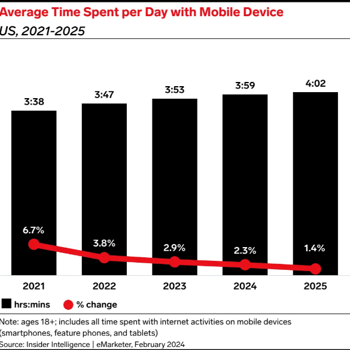
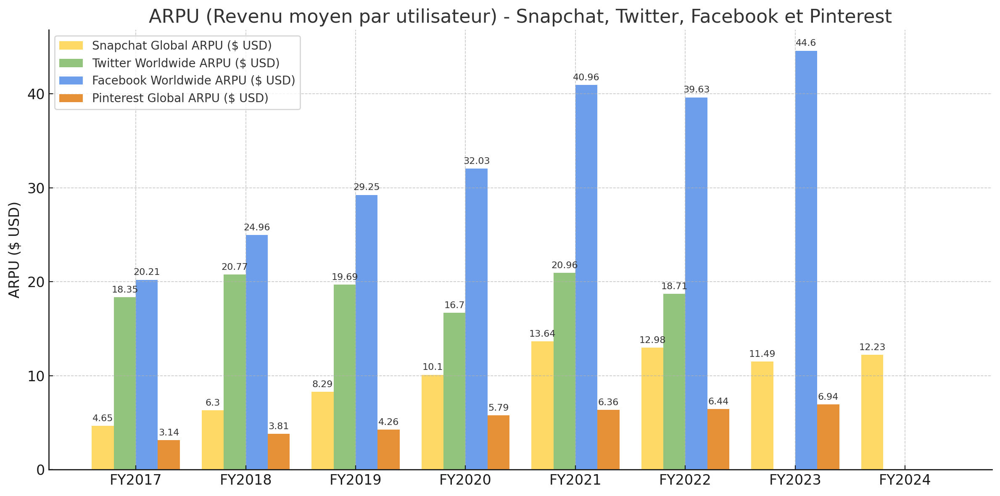

# 🔑 Objectifs et compétences :

**Objectifs de séance**
::: {.competence}
1. Identifier les différents modèles économiques : publicité, abonnements, freemium, vente de données.
2. Analyser les sources de revenus des principales plateformes.
3. Comprendre la stratégie de rachat de concurrents (cas Instagram).
:::

**Compétences développées :**
::: {.competence}
1. Analyser des documents statistiques et financiers.
2. Travailler en groupe pour produire une synthèse.
3. Interpréter des données économiques.
:::

# Modèle économique des réseaux sociaux

## Temps de connexion
📘 **Document :**
{style="display:block;margin:0 auto;width:40%;"}

1. Expliquer la valeur $3:47$.

2. Comment évolue le temps moyen de connexion aux réseaux sociaux entre 2023 et 2024 ?

3. Interpréter la courbe (tendance - cause - conséquence).

## Des revenus et des modèles

📘 **Document : ARPU (Average Revenue Per User)**
{style="display:block;margin:0 auto;width:70%;"}

📘 **Document : Part de la publicité en 2024**
<table style="border-collapse: collapse; width: 50%;">
  <tr>
    <th style="border: 1px solid #000; text-align: left;">Plateforme</th>
    <th style="border: 1px solid #000; text-align: left;">Part de la publicité dans le CA</th>
  </tr>
  <tr>
    <td style="border: 1px solid #000;"><strong>Meta (Facebook, Instagram...)</strong></td>
    <td style="border: 1px solid #000; text-align: right;"><strong>≈ 97–99 %</strong></td>
  </tr>
  <tr>
    <td style="border: 1px solid #000;"><strong>X (ex-Twitter)</strong></td>
    <td style="border: 1px solid #000; text-align: right;"><strong>≈ 68 %</strong></td>
  </tr>
  <tr>
    <td style="border: 1px solid #000;"><strong>Snapchat</strong></td>
    <td style="border: 1px solid #000; text-align: right;"><strong>≈ 99–100 %</strong></td>
  </tr>
</table>

4. 👥 📊 À l'aide des documents ci-dessus, répondre aux questions suivantes :
   1. Quelle plateforme gagne le plus par utilisateur (ARPU) ? Pourquoi à votre avis ?
   2. Quelle place occupe la publicité dans les revenus de Meta et Snapchat ?

5. 🔎 En déduire les différents modèles économiques possibles pour un réseau social.

6. Pourquoi les publicitaires s'intéressent-ils autant aux réseaux sociaux ?

# Rachat d'Instagram
📘 **Documents :** [Lien Orson](https://blog-fr.orson.io/reseaux-sociaux/facebook-rachete-instagram) | [Lien Phonandroid](https://www.phonandroid.com/instagram-100-milliards-dollars.html)

7. Sur quel support (mobile, ordinateur) étaient majoritairement utilisés les services Instagram en 2019 ? En quoi cela explique-t-il le rachat par Facebook ?

8. Que craignait Facebook de son principal concurrent ?

9. Connaissez-vous d'autres rachats du même type ?
