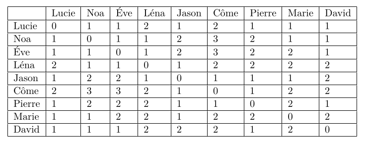

---

# 🔑 Objectifs et compétences :
**Objectifs de séance :**

::: {.competence}
1. Comprendre la notion de graphe et savoir représenter un réseau social sous forme de nœuds et d’arêtes.
2. Identifier les propriétés d’un graphe : connexité, distance, excentricité, centre, rayon, diamètre.
3. Analyser les mécanismes de partage sur un réseau social et leurs conséquences (diffusion volontaire/involontaire).
4. Découvrir le fonctionnement des algorithmes de recommandation et leur rôle dans les réseaux sociaux.
5. Réfléchir aux enjeux éthiques liés à la collecte de données et à la publicité ciblée.
:::

**Compétences développées  :**

::: {.competence}
1. Utiliser un langage de programmation pour expérimenter un algorithme de recommandation.
2. Analyser un tableau de distances pour interpréter la structure d’un réseau.
3. Développer un esprit critique sur les enjeux de vie privée et d’éthique dans l’usage des réseaux sociaux.
:::

# Réseau Social et Graphe
## Notion de Graphe

::: {.boitedoc}
<div class="titre">📘 Document  :  J. A. Barnes, Class and committes in a Norvwegian Island , Parish 1953</div>
<div class="contenu">
\og each person has a number of friends, and these friends have their own friends; some of any one person's friends know
each other, others do not. I find it convenient to talk of a social field of this kind as a network. The image I have is of a set of
points some of which are joined by lines. The points of the image are people, or sometimes groups, and the lines indicate
which people interact with each other. […] one of the principal formal differences between simple, primitive, rural or smallscale societies as against modem, civilized, urban or mass societies is that in the former the mesh of the social network is
small, in the latter it is large. \fg
</div>
:::

On considère alors  Lucie, Noa, \'Eve, Léna, Jason, Pierre, Côme, Marie et David sont inscrits sur MonSuperLycéebook.

::: {.columns}
::: {.column width="50%"}
- Côme est ami avec Jason et Pierre.
- Marie est amie avec Jason, Lucie et Noa.
- Ève est amie avec Noa, David, Lucie et Léna.
- Léna est amie avec Ève, Noa et Jason.
- Lucie est amie avec Noa, Ève, Jason, Pierre, Marie et David.
:::

::: {.column width="50%"}
- David est ami avec Pierre, Lucie, Ève et Noa.
- Noa est ami avec David, Marie, Lucie et Ève.
- Jason est ami avec Léna, Lucie, Marie, Pierre et Côme.
- Pierre est ami avec Jason, Côme, David et Lucie.
:::
:::
A l'aide des informations précédentes, répondre aux questions suivantes :

1. Qui a le plus d’amis et qui en a le moins dans le réseau donné ?
1. Modéliser le réseau suivant les propos de Barnes.


::: {.boitedoc}
<div class="titre">📘 Document  : </div>
<div class="contenu">
En mathématiques, et plus précisément en théorie des graphes, un graphe est une structure composée d'objets dans laquelle certaines paires d'objets sont en relation. Les objets correspondent à des abstractions mathématiques et sont appelés sommets (ou nœuds ou points), et les relations entre sommets sont des arêtes (ou liens ou lignes). On distingue les graphes non orientés, où les arêtes relient deux sommets de manière symétrique, et les graphes orientés, où les arêtes, alors appelées flèches, relient deux sommets de manière asymétrique.
</div>
:::

3. Tous les participants peuvent-ils être reliés directement ou indirectement ? Expliquer votre réponse.

*En mathématiques, on dit alors que le graphe est connexe (il est en un seul tenant).*

::: {.boitedoc}
<div class="titre">📘 Document  : 🧠 📘 Quelques définitions ...</div>
<div class="contenu">

1. La distance entre deux sommets est le nombre minimum arêtes qu'il faut parcourir pour aller d'un sommet à un autre.
1. On appelle excentricité d'un sommet la distance maximale existant entre ce sommet et les autres sommets du graphe
1. On appelle centre d'un graphe, l'ensemble des sommets d'excentricité minimale.
1. On appelle rayon d'un graphe G, l'excentricité d'un centre de G.
1. On appelle diamètre  d'un graphe la distance maximale entre deux sommets de ce graphe.

</div>
:::

On donne (pour gagner du temps) le tableau des distances :
En vous répartissant les lignes, compléter le tableau donnant la distance entre deux sommets.

{style="display:block;margin:0 auto;width:75%;"}


4. Justifier la ligne de Jason
1. Quel est le diamètre et le rayon du graphe ? Qui est (ou sont) le(s) centre(s) du graphe ?
2. Expliquer dans ce réseau, pourquoi le tableau est symétrique par rapport à la diagonale NO-SE ?

# RS : partage, recommandations et enjeux

## Partage dans un réseau social
On suppose que dans ce réseau, un utilisateur peut partager une photo avec certains de ses amis. Les amis avec qui la photo est partagée peuvent voir et commenter la photo. Si un ami commente une photo, tous ses propres amis peuvent à leur tour voir le commentaire de la photo. Par contre, ils ne peuvent pas commenter la photo (sauf si le propriétaire l'avait partagée initialement avec eux).

7. Si Lucie publie une photo à tous ses amis directs, Côme pourra-t-il visualiser la photo ? Justifier

1. Quel point de vigilance faut-il avoir lors de la publication d'une photo sur un réseau social ?

## Algorithme de recommandation
On représente les relations d'amitiés d'un réseau en Python à l'aide d'un dictionnaire.

```python
graphe_relations = {
"Abdel": ["Elia", "Sacha"], "Béa": ["Elia", "Coline", "Noé"],  ...}
```

9. Dans le dictionnaire Python, que signifie l’entrée `"Abdel": ["Elia", "Sacha"]`
10. Dans le fichier, à ouvrir avec un éditeur python exécuter l'instruction

<iframe
  src="https://notebook.basthon.fr/?from=https://raw.githubusercontent.com/chris-deguil/site_deguil1/refs/heads/main/code_python/snt/Application_reseau.py"
  title="Basthon Notebook"
  style="width:100%;height:640px;border:1px solid #ddd;border-radius:12px;">
</iframe>


 `recommandation(graphe_relations_reseau1)` <br>
Quel est l'objectif principal de cet algorithme de recommandation pour la plateforme et quel est son mode de fonctionnement ?
1. Dans le fichier Python fourni, exécuter la fonction `recommandation(graphe_relations)` <br> Vérifier alors le tableau des distances.

## \logoAutonomie Lien avec Instagram et les réseaux sociaux réels

::: {.boitedoc}
<div class="titre">📘 Document  : CGU des réseaux sociaux</div>
<div class="contenu">
« Lorsque vous utilisez notre service, nous collectons des informations telles que votre localisation, vos interactions (likes, commentaires), vos contacts et les contenus que vous consultez. Ces données nous permettent de personnaliser votre expérience et de proposer des publicités ciblées. »
</div>
:::

12. Quels parallèles peut-on faire entre l'algorithme Python, le réseau  et le fonctionnement d'Instagram ?
1. Pourquoi Instagram recommande-t-il certains comptes à suivre plutôt que d'autres ?
1. Quels sont les enjeux en termes de vie privée et d’éthique ? (ie privée, données personnelles, publicité ciblée.)
