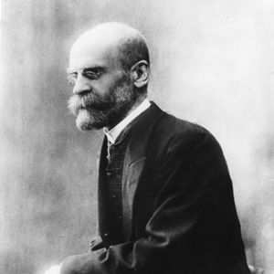
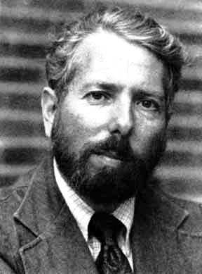
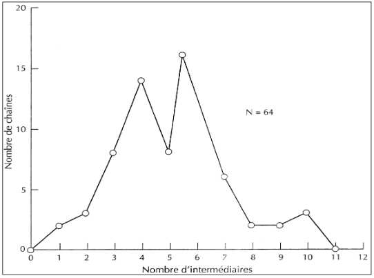
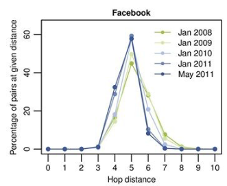
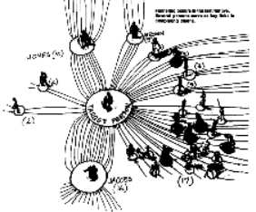

---

# 🔑 Objectifs et compétences :
**Objectifs de séance :**

::: {.competence}
1. Comprendre la théorie du « Petit Monde » et la notion de « six degrés de séparation ».
2. Savoir modéliser un réseau social par un graphe et utiliser les notions associées.
3. Analyser l’évolution des réseaux sociaux numériques par rapport aux réseaux classiques.
4. Découvrir le rôle des influenceurs et leur impact dans la diffusion de l’information.
5. Comprendre le fonctionnement des algorithmes de recommandation et le phénomène des bulles informationnelles.
:::

**Compétences développées :**

::: {.competence}
1. Analyser des données statistiques et sociologiques (Milgram, Facebook, Messenger).
2. Faire des liens entre mathématiques et sciences sociales (réseaux sociaux et diffusion d’informations).
3. Collaborer pour construire des graphes et calculer des indicateurs.
4. Développer l’esprit critique face aux recommandations et aux bulles de filtre.
5. Argumenter sur les avantages et risques des réseaux sociaux numériques.
:::

# Introduction : La théorie du Petit Monde

::: {.boitedoc}

📘 Document : L'expérience des six degrés de séparation

En 1967, le psychologue Stanley Milgram a mené une expérience consistant à faire parvenir un courrier à une personne cible dans le Massachusetts, en partant de personnes choisies au hasard au Nebraska. Les participants ne pouvaient envoyer le courrier qu'à une connaissance directe. 
Résultat : la longueur moyenne des chaînes de connaissances était d'environ 6 personnes. C'est ce qu'on appelle les « six degrés de séparation ».

:::

📘 **Document :**
<https://www.youtube.com/watch?v=gOiIQ0qGiCc>

📘 **Document : vidéo MOOC SNT**
<https://www.youtube.com/watch?v=nn1mIqW9oYQ>

1. Qu'est-ce qu'un graphe « petit monde » ?

2. Expliquez l'expérience de Milgram. Quelle est sa conclusion sur le nombre d'intermédiaires entre deux humains ?

4. Quelles critiques peut-on formuler sur cette théorie ?

# L'origine : L'intuition de Durkheim

::: {.columns}
::: {.column width="65%"}
::: {.boitedoc}

📘 Document 2 : Émile Durkheim, 1913

« Les hommes sont enserrés dans de vastes réseaux de relations sociales. Ainsi, supposons que A connaît B, que B connaît C, que C connaît D : nous pouvons alors faire passer un message de A à D. Mais ici aussi nous sommes arrêtés court, quand nous choisissons mal l'un de nos intermédiaires : si par hasard B ne connaît pas C, le message n'arrive pas à destination. »

:::

:::

::: {.column width="35%"}
{style="display:block;margin:0 auto;width:70%;"}

:::

:::

4. Selon Durkheim, quelle est la condition indispensable pour qu'un message arrive à destination dans un réseau ?

# L'expérience de Milgram (1967)

::: {.columns}
::: {.column width="65%"}
::: {.boitedoc}

📘 Document 3 : Milgram, psychologue social

L'idée était d'obtenir un échantillon d'hommes et de femmes de tous horizons. On donnerait à chacun le nom et l'adresse d'un même individu cible. On demanderait à chaque personne de transmettre un message à l'ami qu'elle penserait le mieux à même de connaître l'individu

:::
:::
::: {.column width="35%"}
{style="display:block;margin:0 auto;width:60%;"}
:::
:::

**Analyse statistique :**

::: {.columns}
::: {.column width="50%"}
**Chaînes ayant atteint la cible**
{width="70%"}
:::
::: {.column width="50%"}
**Le petit « monde » de Facebook**
{width="65%"}
:::
:::

5. Sur le graphique de Milgram (à gauche), quelle est la longueur de la chaîne la plus fréquente ? Quelle est la longueur moyenne d'une chaîne ?

7. Sur Facebook, la distance moyenne est de **4,7**. En 1913, Durkheim soulignait que les réseaux sociaux physiques étaient limités par la géographie. En quoi les réseaux numériques (Facebook, WhatsApp) modifient-ils cette « distance moyenne » ?

# Les influenceurs et les bulles de filtres

::: {.boitedoc}

📘 Document 4 : Les "Stars" sociales

Milgram remarquait que les chaînes forment des « entonnoirs », passant souvent par des personnes très connectées. Aujourd'hui, un **influenceur** est un sommet (nœud) central du graphe qui possède des milliers d'arêtes vers d'autres utilisateurs.

:::

{style="display:block;margin:0 auto;width:20%;"}

7. **Sur les influenceurs**
    - Pourquoi un influenceur permet-il de raccourcir les distances dans un graphe ?
    - Quels sont les avantages et risques des influenceurs (abonnés, marques, société en général) ?

9. **Recommandations et bulles :** Les algorithmes nous proposent souvent des contenus qui plaisent à nos amis.
    - Qu'est-ce qu'une « bulle de filtre » ?
    - Quel est le danger de ne rester qu'avec des personnes qui pensent comme nous ?

# Bilan (Paragraphe argumenté)

9. À l'aide de l'ensemble de vos connaissances et des documents travaillés, choisir une des deux questions suivantes et y répondre sous la forme d'un paragraphe argumenté.
    - Les algorithmes renforcent-ils le concept de « petit monde » ou le limitent-ils ?
    - Un influenceur peut-il faire sortir son audience de sa bulle ?