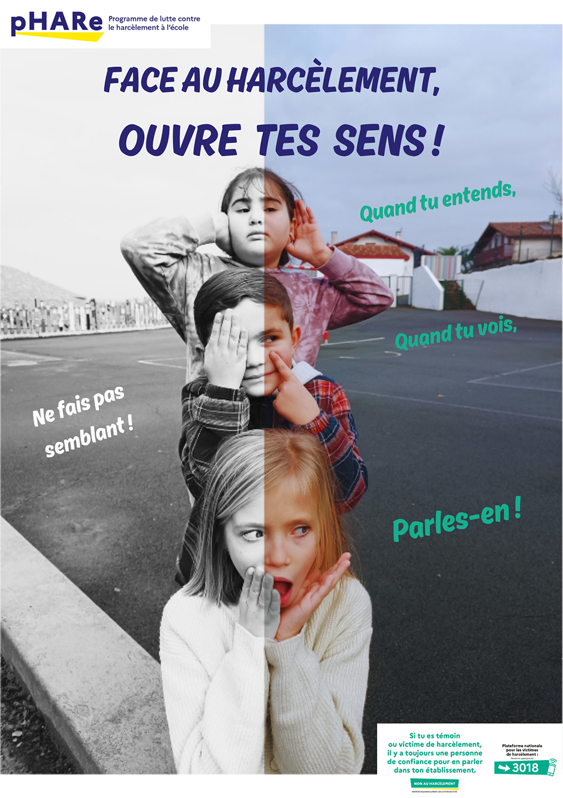

# 🔑 Objectifs et compétences :
**Objectifs de séance :**

::: {.competence}
1. Définir la cyberviolence et le cyberharcèlement et en identifier les différentes formes.
2. Analyser des situations réelles ou mises en scène (vidéos, articles de presse) pour comprendre les mécanismes du harcèlement.
3. Reconnaître les spécificités du cyberharcèlement;
4. Analyser des vidéos et des témoignages pour comprendre le rôle des victimes, des auteurs et des témoins.
5. Découvrir le cadre légal et connaître les peines encourues.
6. Savoir comment réagir en tant que victime ou témoin de cyberviolences :
7. Développer l’esprit citoyen et prendre conscience du rôle des témoins.
:::

**Compétences développées  :**

::: {.competence}
1. Analyser et interpréter des documents variés (vidéos, témoignages, textes législatifs).
2. Travailler en groupe pour analyser des situations et construire des solutions.
3. Développer l’esprit critique et argumenter à l’oral sur des enjeux sociétaux.
4. Savoir alerter et solliciter de l’aide dans des situations de cyberharcèlement(CNIL, 3018, lois))

:::

# Rentrer dans l'activité ...

1. Quels mots vous viennent quand vous entendez cyberviolence ?

  

___

# Différentes formes de harcèlement
## Analyse de vidéos

📘 **Document :**

- Vidéo :  Meilleure vidéo lutte contre le harcèlement, niveau collège
  
<iframe src="https://youtu.be/wz4Su0hwJSs" title="Prix 2020 — Prix spécial cyberharcèlement" allowfullscreen style="width:70%;aspect-ratio:16/9;border:0;"></iframe>

- Prix "Non au harcèlement" 2022 : catégorie meilleure vidéo - lycée\\

<iframe src="https://youtu.be/5KGXviEEe1E" title="Prix 2018 — Mention Coup de cœur" allowfullscreen style="width:70%;aspect-ratio:16/9;border:0;"></iframe>

- Prix Non au harcèlement 2025 : Prix spécial "prévention du cyberharcèlement" 

<iframe src="https://youtu.be/Ep9x8VGGNEw" title="Prix 2018 — Mention Coup de cœur" allowfullscreen style="width:70%;aspect-ratio:16/9;border:0;"></iframe>

<!---
- Vidéo :  Prix « Non au harcèlement » 2020 - Prix spécial cyberharcèlement. <https://youtu.be/YYoPSUiPT90>
- Vidéo Prix « Non au harcèlement » 2018 - Mention Coup de cœur des professionnels de la communication. <https://www.yout-ube.com/watch?v=c0HR4X5G3IE>

\setcounter{enumi}{1}
-->
1. A l'aide des deux films, répondre aux questions suivantes :
   a. Quels sont les personnages ou groupes de personnages présents dans les films ?
   b. Pourquoi peut-on parler de harcèlement pour ces élèves ?
   d. Qu'est-ce qui peut empêcher la victime de se défendre ?
   e. Pourquoi est-il difficile, en tant que témoin, d'agir ?
2. Comparaison des films.
   a. Quelle(s) différence(s) entre les deux films observez vous ?
   b. En quoi la réaction d'un témoin change-t-elle la situation (film 1) ?
   c. Qu'est ce qui a pu conduire à la diffusion des photos dans (film 2) ?

Une proposition de réponse, avec une autre fin : <!--<https://youtu.be/l1oSY0RdK_M> -->

<iframe
  src="https://www.youtube-nocookie.com/embed/l1oSY0RdK_M"
  title="Prix 2018 — Mention Coup de cœur"
  allow="accelerometer; autoplay; clipboard-write; encrypted-media; gyroscope; picture-in-picture; web-share"
  allowfullscreen
  style="width:70%;aspect-ratio:16/9;border:0;display:block;margin:0 auto;">
</iframe>

## Définir le cyberharcèlement ...

📘 **Document**

- [https://e-enfance.org/informer/cyber-harcelement/](https://e-enfance.org/informer/cyber-harcelement/ )

- [https://www.education.gouv.fr/non-au-harcelement/outils-de-sensibilisation-323028](https://www.education.gouv.fr/non-au-harcelement/outils-de-sensibilisation-323028)

3. Donner une définition du cyberharcélement
1. Citer d'autres formes de harcèlement.
1. Quelles sont les spécificités de la cyberviolence ? Du cyberharcèlement ?
1. Pourquoi peut-on dire que l'utilisation des multimédias facilite et accentue le phénomène de harcèlement ?
1. Quels liens voyez-vous entre bulle de filtre (algorithmes) et cyberharcèlement ?

## Apporter des solutions

8. Que faire pour limiter le harcèlement ?
1. Que faire quand on est victime de cyberviolences ?
2. Quels leviers permettraient de  stopper de tels situations
3. En tant que témoin, qu’est-ce qu’il ne faut pas faire ?
4. Pourquoi est-il important de garder des traces ?

---

# Le harcèlement et la loi

📘 **Document :**

- [Article 222-332-2 du code pénal concernant le cyberharcèlement](https://www.legifrance.gouv.fr/codes/article\_lc/LEGIARTI000037289658/2018-08-06)
- [Sanctions concernant le harcèlement scolaire](https://www.service-public.fr/particuliers/vosdroits/F31985)

📘 [Le Blog de Mehdi](https://www.dailymotion.com/video/xfsteu)

<iframe
  src="https://www.dailymotion.com/embed/video/xfsteu?autoplay=0&queue-enable=false&queue-autoplay-next=false"
  title="Dailymotion"
  allow="fullscreen; picture-in-picture"
  style="width:70%;aspect-ratio:16/9;border:0;display:block;margin:0 auto;"
  allowfullscreen>
</iframe>

::: {.boitedoc}

📘 Document  : La Dépêche, le 29/11/13, Pierre-Jeau Pyrda

Entre le désarroi de la victime, déposant en pleurs à la barre, et le malaise du prévenu, le tribunal qui examinait hier un dossier de cyber-harcèlement a largement penché en faveur de la première. Et prononcé un jugement  qui fera parler dans tous les lycées du Tarn [\dots] Une affaire partie d’une rumeur : Laure, une lycéenne soi-disant peu farouche aurait tourné une vidéo porno avec un rugbyman. Des garçons de l’établissement se seraient lancé le pari de récupérer cette vidéo. Mais Serge, 21 ans, était seul à comparaître hier, poursuivi pour \og usurpation de l’identité d’un tiers ou usage de données permettant de l’identifier en vue de troubler sa tranquillité ou celle d’autrui ou de porter atteinte à son honneur ou à sa considération \fg. Il a piraté le compte Facebook de Laure, créant de nouvelles pages à son nom ainsi qu’un faux compte Skyblog : un subterfuge qui lui a permis d’envoyer des messages à caractère sexuel pour (dé)faire la réputation de la jeune fille, l’inondant aussi de textos formulés comme autant d’ultimatums ...

:::

1. Qui a réalisé la vidéo ?
2. Expliquer la fin de la vidéo.
3. En quoi cet article de loi protège-t-il les mineurs et pourquoi ?
4. Quel article de loi est mis en jeu dans l'article de la [Ladepeche.fr](https://www.ladepeche.fr/) ?
5. Rechercher les peines encourues par Serge.

