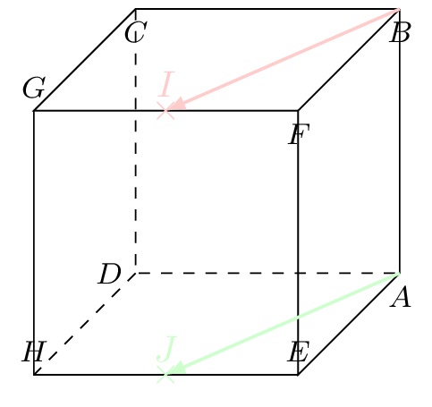
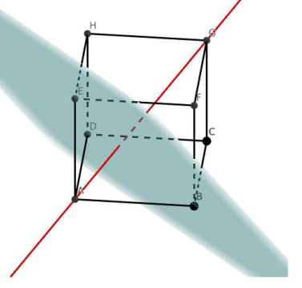
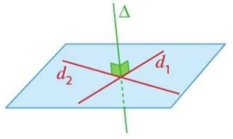
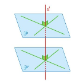

## Orthogonalité de deux droites

::: {.bloc .def}
Définition : 

Soient $\ve{u}$ et $\ve{v}$ deux vecteurs de l'espace.

1. $\ve{u}$ et $\ve{v}$ sont orthogonaux lorsque $\ve{u} \cdot \ve{v} = 0$.
2. Deux droites sont orthogonales lorsqu'un vecteur directeur de l'une des droites est orthogonal à un vecteur directeur de l'autre droite.

:::

::: {.bloc .rem}
Remarque : 

* La notion d'orthogonalité généralise la notion de droites perpendiculaires.
* Deux droites orthogonales ne sont pas nécessairement coplanaires.
* Deux droites orthogonales et coplanaires sont perpendiculaires.

:::

::: {.bloc .ex}

Exemple :   

On considère un triangle tel que $AB=5$, $BC=13$ et $AC=12$.
Déterminer $\ve{AC} \cdot \ve{AB}$.

Afficher la correction :

On a $13^2 = 169$ et $AB^2 + AC^2 = 5^2 + 12^2 = 25 + 144 = 169$.
On en déduit, d'après la réciproque du théorème de Pythagore, que $ABC$ est un triangle rectangle en $A$, donc que $(AB) \perp (AC)$.
Ainsi, $\ve{AB} \cdot \ve{AC} = 0$.

:::

::: {.bloc .thm}
Propriété : 

1. Deux droites $d_1$ et $d_2$ sont orthogonales si et seulement s’il existe une droite $d'$ parallèle à $d_1$, coplanaire à $d_2$ et perpendiculaire à $d_2$.
2. Si deux droites sont parallèles, alors toute droite orthogonale à l'une est orthogonale à l'autre.
3. Si deux droites sont orthogonales, alors toute droite parallèle à l'une est orthogonale à l'autre.

:::

Démonstration : 

Soient $d_1$, $d_2$ et $d'$ de vecteurs directeurs respectifs $\ve{v_1}$, $\ve{v_2}$ et $\ve{v'}$.

1. C'est la définition.
2. Soit $d_1 // d_2$, alors il existe $k \in \mathbb{R}^*$ tel que $\ve{v_1} = k \cdot \ve{v_2}$. Soit $d' \perp d_1$, alors $\ve{v'} \cdot \ve{v_1} = 0$. Ainsi, $\ve{v'} \cdot (k \cdot \ve{v_2}) = 0$, donc $d_2 \perp d'$.
3. Soit $d_1 \perp d_2$, alors $\ve{v_1} \cdot \ve{v_2} = 0$. Soit $d' // d_1$, alors il existe $k \in \mathbb{R}^*$ tel que $\ve{v_1} = k \cdot \ve{v'}$. Ainsi, $k \cdot \ve{v'} \cdot \ve{v_2} = \ve{v_1} \cdot \ve{v_2} = 0$, donc $d_2 \perp d'$.

::: {.bloc .ex}

Exemple :   

Dans le cube $ABCDEFGH$, démontrer que les droites $(CD)$ et $(EH)$ sont orthogonales.

Afficher la correction :

La droite $(AD)$ est parallèle à la droite $(EH)$ et passe par $D$.
Les droites $(AD)$ et $(CD)$ sont coplanaires (elles appartiennent au plan de la face $ABCD$).
Dans ce plan, $ABCD$ étant un carré, les droites $(AD)$ et $(CD)$ sont perpendiculaires.
On en déduit que la droite $(CD)$ est orthogonale à la droite $(EH)$.

:::

::: {.bloc .ex}

Exemple :   

On considère le cube $ABCDEFGH$ de côté 1 ci-dessous. On note $I$ le milieu de $[FG]$ et $J$ le milieu de $[EH]$.

Les droites $(AI)$ et $(BJ)$ sont-elles orthogonales ?

::: {.bloc .ex}

Exemple :   

On considère le cube $ABCDEFGH$ de côté 1 ci-dessous. On note $I$ le milieu de $[FG]$ et $J$ le milieu de $[EH]$.
Les droites $(AI)$ et $(BJ)$ sont-elles orthogonales ?

  

Afficher la correction :

On a :
$$ \begin{aligned}
\ve{AJ} \cdot \ve{BI} &= (\ve{AB} + \ve{BF} + \ve{FJ}) \cdot (\ve{BA} + \ve{AE} + \ve{EI}) \\
&= \ve{AB} \cdot \ve{BA} + \ve{AB} \cdot \ve{AE} + \ve{AB} \cdot \ve{EI} + \ve{BF} \cdot \ve{BA} + \ve{BF} \cdot \ve{AE} + \ve{BF} \cdot \ve{EI} + \ve{FJ} \cdot \ve{BA} + \ve{FJ} \cdot \ve{AE} + \ve{FJ} \cdot \ve{EI}
\end{aligned} $$

Or :
* $\ve{AB} \cdot \ve{BA} = -AB^2 = -1$
* $\ve{AB} \cdot \ve{AE} = 0$ car $(AB) \perp (AE)$
* $\ve{AB} \cdot \ve{EI} = \ve{AB} \cdot (\frac{1}{2}\ve{EG}) = 0$ car $(AB) \perp (EG)$
* $\ve{BF} \cdot \ve{BA} = 0$ car $(BF) \perp (BA)$
* $\ve{BF} \cdot \ve{AE} = \ve{AE} \cdot \ve{AE} = AE^2 = 1$
* $\ve{BF} \cdot \ve{EI} = \ve{BF} \cdot (\frac{1}{2}\ve{EG}) = 0$ car $(BF) \perp (EG)$
* $\ve{FJ} \cdot \ve{BA} = 0$ car $(FJ) \perp (BA)$
* $\ve{FJ} \cdot \ve{AE} = 0$ car $(FJ) \perp (AE)$
* $\ve{FJ} \cdot \ve{EI} = (\frac{1}{2}\ve{FH}) \cdot (\frac{1}{2}\ve{EG}) = \frac{1}{4} \ve{FH} \cdot \ve{EG} = 0$ car les diagonales d'un carré sont perpendiculaires.

On en déduit que $$\ve{AJ} \cdot \ve{BI} = -1 + 0 + 0 + 0 + 1 + 0 + 0 + 0 + 0 = 0$$
Les vecteurs sont donc orthogonaux, ainsi les droites $(AJ)$ et $(BI)$ sont orthogonales.

:::

____________________________

## Orthogonalité d'une droite et d'un plan

::: {.bloc .def}
Définition : 

Une droite $d$ est perpendiculaire (ou orthogonale) à un plan $\mathscr{P}$ lorsqu’elle est orthogonale à deux droites sécantes de $\mathscr{P}$.

:::

::: {.bloc .rem}
Remarque : 

Ainsi, soit $\ve{w}$ un vecteur directeur de $d$ et $(\ve{u}\, ; \, \ve{v})$ une base de $\mathscr{P}$, alors :
$$d \perp \mathscr{P} \quad \Longrightarrow \quad \ve{u} \cdot \ve{w}=0 \quad \text{et} \quad \ve{v} \cdot \ve{w}=0$$

:::

::: {.bloc .ex}

Exemple :   

On considère un cube $ABCDEFGH$ de côté $1$.
Montrons que $(AG)$ est perpendiculaire au plan $(EBD)$.

  

Afficher la correction :

Toutes les faces du cube sont des carrés de côté $1$, donc ont pour diagonales $d=\sqrt{2}$.
De plus :

* D'une part,
$$ \begin{aligned}
\ve{AG} \cdot \ve{ED} &= \ve{AE} \cdot \ve{ED} + \ve{EG} \cdot \ve{ED} \\
&= -AE^2 + \dfrac{1}{2} \left( EG^2 + ED^2 - GD^2 \right) \\
&= -1 + \dfrac{1}{2} (2 + 2 - 2) = 0
\end{aligned} $$
Donc $\ve{AG}$ et $\ve{ED}$ sont orthogonaux.

* D'autre part,
$$ \begin{aligned}
\ve{AG} \cdot \ve{EB} &= (\ve{AE} + \ve{EG}) \cdot (\ve{EA} + \ve{AB}) \\
&= \ve{AE} \cdot \ve{EA} + \ve{AE} \cdot \ve{AB} + \ve{EG} \cdot \ve{EA} + \ve{EG} \cdot \ve{AB} \\
&= -EA^2 + \ve{EG} \cdot \ve{AB} = -EA^2 + \ve{AC} \cdot \ve{AB} \\
&= -EA^2 + \ve{AB} \cdot \ve{AB} = 0
\end{aligned} $$
Donc $\ve{AG}$ et $\ve{EB}$ sont orthogonaux.

Les vecteurs $\ve{EB}$ et $\ve{ED}$ n'étant pas colinéaires, ils forment une base du plan $(EBD)$.
On en déduit donc qu'un vecteur directeur de $(AG)$ est orthogonal à deux vecteurs formant une base de $(EBD)$ donc que la droite $(AG)$ est perpendiculaire au plan $(EBD)$.

:::

::: {.bloc .thm}
Propriété : 

1. Une droite $d$ est orthogonale à un plan $\mathscr{P}$ si et seulement si elle est orthogonale à toute droite de $\mathscr{P}$.
2. Si deux droites sont parallèles, alors tout plan orthogonal à l'une est orthogonal à l'autre.

:::

:::{.block}

  

:::

Démonstration : 

Soit $\ve{w}$ un vecteur directeur de $d$, $\ve{w'}$ un vecteur directeur de $d'$ et $(\ve{u}\, ; \,\ve{v})$ une base de $\mathscr{P}$.

1. 
    * Si $d$ est orthogonale à $\mathscr{P}$, alors $\ve{u} \cdot \ve{w}=0$ et $\ve{v} \cdot \ve{w}=0$.
    Soit $\Delta$ une droite quelconque de $\mathscr{P}$ de vecteur directeur $\ve{\Delta}$, alors il existe deux réels $a$ et $b$ tels que $\ve{\Delta} = a \ve{u}+b\ve{v}$.
    Ainsi $\ve{w} \cdot \ve{\Delta} = a(\ve{w} \cdot \ve{u}) + b(\ve{w} \cdot \ve{v}) = 0$, donc $d$ est orthogonale à $\Delta$.
    * Réciproquement, si $d$ est orthogonale à toute droite de $\mathscr{P}$, alors $d$ est orthogonale à deux droites sécantes de $\mathscr{P}$, donc par définition elle est orthogonale à $\mathscr{P}$.

2. On suppose que $d // d'$, alors il existe $k \in \mathbb{R}$ tel que $\ve{w'}=k\ve{w}$.
Ainsi :
$$d \perp \mathscr{P} \quad \Longleftrightarrow \quad \ve{u} \cdot \ve{w}=0 \quad \text{et} \quad \ve{v} \cdot \ve{w}=0 \quad \Longleftrightarrow \quad \ve{u} \cdot \ve{w'}=0 \quad \text{et} \quad \ve{v} \cdot \ve{w'}=0$$
Ainsi $d'$ est orthogonale à $\mathscr{P}$.

::: {.bloc .thm}
Propriété : 

1. Si deux plans sont parallèles, alors toute droite orthogonale à l'un est orthogonale à l'autre.
2. Si deux plans sont orthogonaux à une même droite, alors ils sont parallèles entre eux.

:::

:::{.block}

  

:::

Démonstration : 

Soit $\mathscr{P}$ et $\mathscr{P'}$ deux plans et $d_3$ une droite de vecteur directeur $\ve{w}$.

1. On suppose que les plans sont parallèles, et on considère alors le repère vectoriel $(\ve{u}\, ; \, \ve{v})$.
Soit $d_1$ et $d_2$ les droites de $\mathscr{P}$ de vecteurs directeurs $\ve{u}$ et $\ve{v}$, et $d_1'$ et $d_2'$ les droites de $\mathscr{P'}$ de vecteurs directeurs $\ve{u}$ et $\ve{v}$.
Si $d_3$ est orthogonale à $\mathscr{P}$, alors $d_3$ est orthogonale à $d_1$ et $d_2$, donc $\ve{w} \cdot \ve{u} = \ve{w} \cdot \ve{v}=0$. Par conséquent, $d_3$ est orthogonale à $d_1'$ et $d_2'$, donc $d_3$ est orthogonale à $\mathscr{P'}$.

2. On raisonne par l'absurde. On suppose que les plans ne sont pas parallèles. Soit alors $(\ve{u}\, ; \, \ve{v})$ un repère vectoriel de $\mathscr{P}$ et $(\ve{u'} \, ; \, \ve{v'})$ de $\mathscr{P'}$ tel que l'un des vecteurs (par exemple $\ve{v'}$) n'est pas une combinaison linéaire de $\ve{u}$ et $\ve{v}$. Ainsi $(\ve{u}\, ; \, \ve{v}\, ; \, \ve{v'})$ forme une base de l'espace.
Si $d_3 \perp \mathscr{P}$ et $d_3 \perp \mathscr{P'}$, alors $\ve{w} \cdot \ve{u} = \ve{w} \cdot \ve{v} = \ve{w} \cdot \ve{v'} = 0$. Donc pour tout $a, b, c \in \mathbb{R}$, $\ve{w} \cdot (a\ve{u}+b\ve{v}+c\ve{v'}) = 0$.
Cela signifie que $d_3$ est orthogonale à tout vecteur de l'espace, ce qui est impossible pour un vecteur non nul (un vecteur ne peut pas être orthogonal à lui-même). On en déduit que les plans sont parallèles.

:::

 <a class="prev" href="def_norme_propriete.html">⬅️</a>
  <a class="next" href="ps_repere.html">➡️</a>

