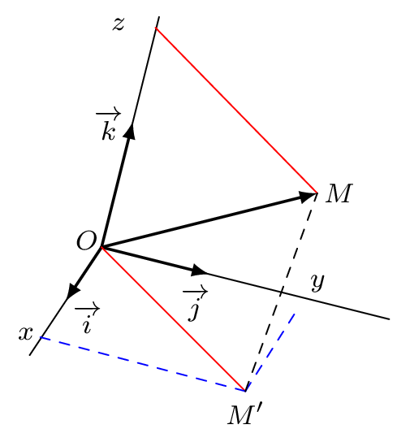

::: {.bloc .def}
Définition : 

Un repère $(O \, ; \, \ve{i}, \ve{j}, \ve{k})$ de l'espace est dit orthonormé lorsque les vecteurs $\ve{i}$, $\ve{j}$ et $\ve{k}$ sont deux à deux orthogonaux et de norme unitaire.

:::

::: {.bloc .rem}
Remarque : 

Avoir trois vecteurs deux à deux orthogonaux implique d'avoir des vecteurs non coplanaires, ce qui permet de définir une base de l'espace.

:::

::: {.bloc .thm}
Propriété : 

Soient $\ve{u}$, $\ve{v}$ deux vecteurs de coordonnées respectives 
$\begin{pmatrix}x\\y\\z\end{pmatrix}$ et $\begin{pmatrix}x'\\y'\\z'\end{pmatrix}$.
Alors :
$$\ve{u} \cdot \ve{v} = xx'+yy'+zz'$$

:::

Démonstration : 

On a $\ve{u}=x\ve{i}+y\ve{j}+z\ve{k}$ et $\ve{v}=x'\ve{i}+y'\ve{j}+z'\ve{k}$.
Alors :
$$ \begin{aligned}
\ve{u} \cdot \ve{v} &= (x\ve{i}+y\ve{j}+z\ve{k}) \cdot (x'\ve{i}+y'\ve{j}+z'\ve{k}) \\
&= xx'\ve{i}^2 + yy'\ve{j}^2 + zz'\ve{k}^2 \\
&= xx'+yy'+zz'
\end{aligned} $$

:::{.block}

  

:::

::: {.bloc .ex}

Exemple :   

Reprendre l'exercice précédent avec les coordonnées.

Afficher la correction :

On se place dans le repère $(A \, ; \, \ve{AB} \, , \, \ve{AD} \, , \, \ve{AE})$. Ainsi $A(0;0;0)$, $B(1;0;0)$, $I \left(1;\frac{1}{2};1\right)$ et $J\left(0;\frac{1}{2};1\right)$.

Donc $\ve{AJ} \begin{pmatrix} 0\\ \frac{1}{2}\\1 \end{pmatrix}$ et $\ve{BI} \begin{pmatrix} 0\\\frac{1}{2}\\1 \end{pmatrix}$ et $\ve{AJ} \cdot \ve{BI} = 0\times 0 + \frac{1}{2} \times \frac{1}{2} + 1 \times 1 = \dfrac{5}{4}$.

Donc les droites ne sont pas orthogonales.

:::

::: {.bloc .ex}

Exemple :   

On considère deux droites $d$ et $d'$ dont les représentations paramétriques sont :
$$d:\left\{\begin{array}{l}x=-1+2t\\y=3-t\\z=1+3t\end{array}\right. , t \in \mathbb{R} \qquad \quad \text{et} \quad \qquad d':\left\{\begin{array}{l} x=-1-4t'\\y=4+t'\\z=-8+3t'\end{array} \right. , t' \in \mathbb{R}$$
Les droites sont-elles perpendiculaires ?

Afficher la correction :

$\ve{u}(2;-1;3)$ et $\ve{u'}(-4;1;3)$ sont des vecteurs directeurs de $d$ et $d'$ respectivement.
$$\ve{u} \cdot \ve{u'} = 2 \times (-4) + (-1)\times 1 + 3 \times 3 = 0$$
Donc les vecteurs sont orthogonaux, donc les droites supports sont orthogonales.
Les droites $d$ et $d'$ étant orthogonales, elles sont perpendiculaires si et seulement si elles sont sécantes.
On a :
$$\left\{\begin{array}{l}
-1+2t=-1-4t'\\
3-t=4+t'\\
1+3t=-8+3t'\end{array}\right. t,t' \in \mathbb{R} \Longleftrightarrow 
\left\{\begin{array}{l}
t'=-1-t\\
-1+2t=-1-4(-1-t)\\
1+3t=-8+3(-1-t)
\end{array}\right.
\Longleftrightarrow 
\left\{\begin{array}{l}
t=-2\\
t'=1
\end{array}\right.
$$
On en déduit donc que $M \in d \cap d' \Longleftrightarrow t=-2$ et $t'=1$.
On en déduit que les droites sont donc perpendiculaires et que les coordonnées du point d'intersection sont $(-5;5;-5)$.

:::

::: {.bloc .thm}
Propriété : 

On munit l'espace d'un repère orthonormé et on considère $\ve{u}\begin{pmatrix}x\\y\\z\end{pmatrix}$ et $A(x_A \, ; \, y_A \, ;\, z_A)$ et $B(x_B \, ; \, y_B \, ;\, z_B)$ deux points de l'espace.

1. $\norm{\ve{u}} = \sqrt{x^2+y^2+z^2}$
2. $\norm{\ve{AB}}=\sqrt{(x_B-x_A)^2+(y_B-y_A)^2+(z_B-z_A)^2}$

:::

::: {.bloc .ex}

Exemple : (Extrait Antilles - Guyane 2017) 

L'espace est muni d'un repère orthonormé $(O \, ; \, \ve{i}, \ve{j}, \ve{k})$ et on considère les points $A(-1\,;\,2\,;\,0)$, $B(1\,;\,2\,;\,4)$ et $C(-1\,;\,1\,;\,1)$.

1. Démontrer que les points A, B et C ne sont pas alignés.

Afficher la correction :

$\ve{AB}\begin{pmatrix} 2\\0\\4 \end{pmatrix} \quad \text{et} \quad \ve{AC}\begin{pmatrix} 0\\-1\\1 \end{pmatrix}$

Il n'existe pas de réel $k$ non nul tel que $\ve{AB}=k\ve{AC}$, donc les vecteurs ne sont pas colinéaires, ce qui entraîne que les points A, B et C ne sont pas alignés.

2. Calculer le produit scalaire $\ve{AB} \cdot \ve{AC}$.

Afficher la correction :

$\ve{AB} \cdot \ve{AC}=2\times 0+0\times (-1)+4\times 1=4$

3. En déduire la mesure de l'angle $\widehat{BAC}$, arrondie au degré.

Afficher la correction :

$\ve{AB} \cdot \ve{AC}=AB\times AC \times \cos\left(\widehat{\text{BAC}}\right)=4$
Or $AB=\norm{\ve{AB}}=\sqrt{2^2+0^2+4^2} = \sqrt{20}$ et $AC=\norm{\ve{AC}}=\sqrt{0^2+(-1)^2+1^2} = \sqrt{2}$.
On a alors $\cos\left(\widehat{\text{BAC}}\right)=\dfrac{4}{AB\times AC}=\dfrac{4}{\sqrt{20}\sqrt{2}}=\dfrac{4}{\sqrt{40}}=\dfrac{2}{\sqrt{10}}=\dfrac{\sqrt{10}}{5}$.
On en déduit $\widehat{\text{BAC}}\approx 51^\circ$.

:::

 <a class="prev" href="orthogonalite.html">⬅️</a>
  <a class="next" href="Equat_cart.html">➡️</a>

