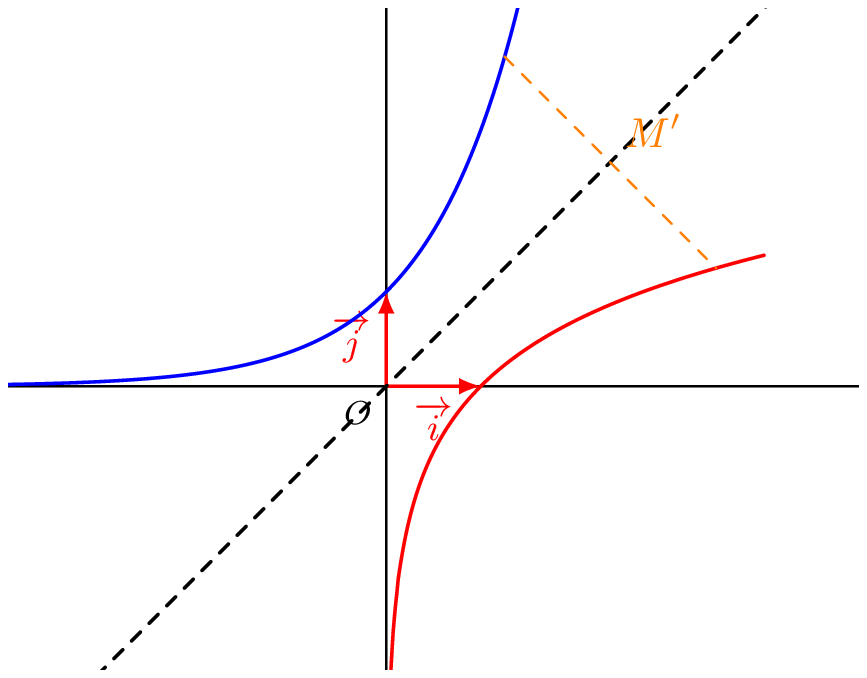

## Exponentielle et bijection

La fonction exponentielle est continue sur $\R$ et à valeurs dans $\R^*_+$.
Ainsi pour tout réel $b \in \R^*_+$, d'après le théorème des valeurs intermédiaires, il existe au moins un réel $a \in \R$ solution de l'équation $\exp(x) = b$.  
De plus, étant strictement croissante, pour tout $b \in \R^*_+$, il existe au plus un réel $a \in \R$ solution de l'équation $\exp(x)=b$.  
Donc l'équation $\exp(x)=b$ admet une unique solution.

On dit alors que la fonction exponentielle réalise une bijection de $\R$ sur $\R^*_+$.  
C'est-à-dire que tout élément de $\R$ est associé à un unique élément de $\R^*_+$ et réciproquement.

## Définition logarithme népérien

Ce qui précède peut s'écrire avec des quantificateurs :
$$\forall k \in \R_+^*, \, \exists ! \, x \in \R, \, \exp(x)=k$$
On peut alors définir une fonction réciproque à la fonction exponentielle, c'est-à-dire une fonction $f$ telle que :
$$\forall x \in \R, (\exp(x)=k \Longleftrightarrow f(k)=x)$$
La fonction $f$ est appelée la fonction réciproque de l'exponentielle.

::: {.bloc .def}
Définition : 
On appelle fonction logarithme népérien la fonction notée $\ln$, la fonction réciproque de la fonction exponentielle.  
La fonction $\ln$ est définie sur $]0 \, ; \, +\infty[$ et est à valeurs dans $\R$.
:::

::: {.bloc .rem}
On déduit de la définition que :

* $\forall x \in \R^*_+$, $\exp(\ln(x))=x$
* $\forall y \in \R, \, \ln(\exp(y)) = y$
* $\forall x \in \R, \, \forall y \in \R^*_+$, $\exp(x)=y \Longleftrightarrow x = \ln(y)$
:::

::: {.bloc .ex}

Exemple :   

Résoudre $(e^x-3)(e^x+2) = 0$.

Afficher la correction :

Soit $(e^x-3)(e^x+2) = 0$ alors $e^x = 3$ ou $e^x = -2$.

Or l'exponentielle est strictement positive, donc l'équation équivaut à résoudre $e^x= 3$.

D'après la définition du logarithme népérien, $x = \ln 3$.

Ainsi l'équation admet une unique solution $x = \ln 3$.

:::

::: {.bloc .ex}

Exemple :   

Démontrons que $\ln\left(\dfrac{1}{x}\right) = - \ln(x)$.

Afficher la correction :

Pour tout $x >0$,
$$\dfrac{1}{x} = \exp\left(\ln\left(\dfrac{1}{x} \right)\right) \Longrightarrow x=\dfrac{1}{\exp\left(\ln\left(\dfrac{1}{x} \right)\right)} \Longrightarrow x = \exp\left(-\ln\left(\dfrac{1}{x}\right)\right) \Longrightarrow \ln(x) = - \ln \left(\dfrac{1}{x} \right)$$

:::

## Représentation graphique

::: {.bloc .thm}
Propriété : 
Les représentations graphiques des fonctions exponentielle et logarithme népérien sont symétriques par rapport à la droite d'équation $y=x$.
:::

Démonstration : 

On note $\mathscr{C}_{\exp}$ et $\mathscr{C}_{\ln}$ les représentations graphiques respectives des fonctions exponentielle et logarithme népérien.
$$M(x \, ; \, y) \in \mathscr{C}_{\exp} \Longleftrightarrow \exp(x)=y \Longleftrightarrow x=\ln(y) \Longleftrightarrow M'(y\,; \, x) \in \mathscr{C}_{\ln}$$
Reste alors à montrer que $M$ et $M'$ sont symétriques par rapport à la droite $\Delta : y=x$.  
Soit $\vec{u} (1\,;\,1)$ un vecteur directeur de $\Delta$.
* D'une part, $\vec{MM'}\cdot\vec{u} = \begin{pmatrix} y-x \\ x-y \end{pmatrix}\cdot\begin{pmatrix} 1 \\ 1 \end{pmatrix} =(y-x) + (x-y)= 0$.  
Donc $\vec{u}$ et $\vec{MM'}$ sont orthogonaux, donc $\Delta$ et $(MM')$ sont orthogonales.
* Soit $I$ le milieu de $[MM']$, alors $I\left(\dfrac{x+y}{2} \, ; \, \dfrac{y+x}{2} \right)$, et donc $I \in \Delta$.

On en déduit que $\Delta$ est médiatrice, donc axe de symétrie de $[MM']$.  
Ainsi les deux représentations graphiques sont symétriques par rapport à $\Delta$.

:::{.block .rem}
**Représentation graphique et conjecture :**

  

:::

::: {.bloc .thm}
Propriétés : 

* La fonction $\ln$ est strictement croissante ;
* La fonction $\ln$ est continue ;
* La fonction $\ln$ est concave ;
* $\lim_{x \to +\infty} \ln(x)= + \infty$ ;
* $\lim_{x \to 0^+} \ln(x) = -\infty$ ;
* La droite d'équation $x=0$ est une asymptote verticale à la représentation graphique de la fonction $\ln$ ;
* La fonction $\ln$ est « dominée » par la fonction $x \longmapsto x$ au voisinage de $+\infty$, donc :
$$\lim_{x \to +\infty} \dfrac{\ln(x)}{x} = 0$$
:::

 <a class="prev" href="historique.html">⬅️</a>
  <a class="next" href="variation_limite.html">➡️</a>

