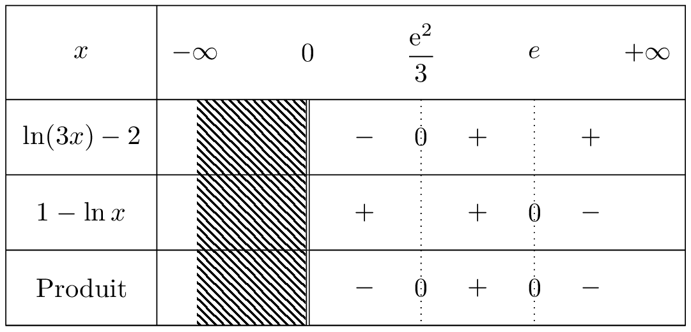
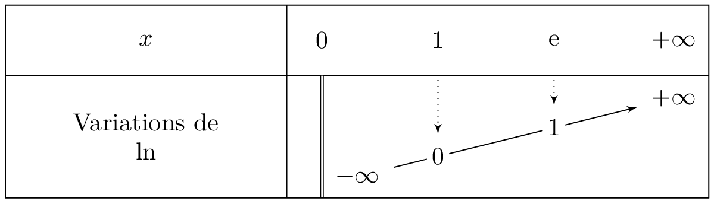

::: {.bloc .thm}
Propriété : 
La fonction logarithme népérien est strictement croissante.
:::

Démonstration : 

Soient $x, y \in \R^*_+$, alors :
$$x < y \Longrightarrow \e^{\ln x} < \e^{\ln y} \underset{\exp \nearrow}{\Longrightarrow} \ln x < \ln y$$
Ainsi la fonction $\ln$ est strictement croissante.

::: {.bloc .rem}
La stricte croissance de la fonction $\ln$ permet de déduire les relations suivantes :
$$\ln a = \ln b \Longleftrightarrow a=b \quad \text{et} \quad \ln a < \ln b \Longleftrightarrow a < b$$
:::

::: {.bloc .ex}

Exemple :   

Résoudre $(\ln(3x) - 2)(1-\ln x) > 0$.

Afficher la correction :

L'ensemble de définition impose $x > 0$. Pour tout $x \in ]0 \, ; \, +\infty[$ :

* $\ln(3x) - 2 < 0 \Longleftrightarrow \ln(3x) < 2 \Longleftrightarrow \ln(3x) < \ln(\e^2) \underset{\ln \nearrow}{\Longleftrightarrow} 3x < \e^2 \Longleftrightarrow x < \dfrac{\e^2}{3}$.
* $1-\ln x < 0 \Longleftrightarrow \ln x > 1 \Longleftrightarrow \ln x > \ln \e \underset{\ln \nearrow}{\Longleftrightarrow} x > \e$.

On dresse ensuite un tableau de signes sur $]0 \, ; \, +\infty[$ pour conclure.

  

:::

::: {.bloc .ex}

Exemple :   

Soit $f$ la fonction définie par $f(x)=\ln(2-x)$.

1. Déterminer l'ensemble de définition de $f$.  

Afficher la correction :

$D_f=\{x \in \R, \, 2-x > 0\} = ]-\infty \, ; \, 2[$.

2. Déterminer les antécédents de $1$ par $f$.  

Afficher la correction :

Pour tout $x \in D_f$ :
$$\ln(2-x) = 1 \Longleftrightarrow \ln(2-x) = \ln \e \underset{\ln \nearrow}{\Longleftrightarrow} 2-x = \e \Longleftrightarrow x = 2-\e$$
Ainsi $1$ admet un unique antécédent : $2-\e$.

:::

::: {.bloc .thm}
Propriété : 
$$\lim_{x \to +\infty} \ln(x)= + \infty \qquad ; \qquad \lim_{x \to 0^+} \ln(x) = -\infty$$

:::

Démonstration : 

Pour tout réel $A$, et pour tout réel $x$ vérifiant $x > \e^{A}$, on a $\ln(x) > A$.  
Ainsi, par définition :
$$\lim_{x \to + \infty} \ln(x) = + \infty$$
De plus, pour tout $x >0$, $\ln\left(\dfrac{1}{x} \right)= - \ln(x)$.  
Or $\lim_{x \to 0^+} \dfrac{1}{x} = + \infty$ et $\lim_{X \to +\infty} - \ln(X) = -\infty$.  
Donc, par composition des limites, on a :
$$\lim_{x \to 0^+} \ln(x) = -\infty$$

::: {.bloc .rem}
Remarque : 
La droite d'équation $x=0$ est une asymptote verticale à la représentation graphique de la fonction logarithme népérien.

On peut donc établir le tableau de variations de la fonction $\ln$.

  

:::

__________

## Croissances comparées

::: {.bloc .thm}
Propriété : 
$$\lim_{x \to + \infty} \dfrac{\ln(x)}{x} = 0 \qquad ; \qquad \lim_{x \to 0^+} x \ln(x) = 0^-$$
:::

Démonstration : 

- On a 
$$\left. \begin{array}{l}
\lim_{x \to + \infty} \ln x = + \infty\\
\lim_{x \to +\infty} \frac{x}{\e^x} = 0^+
\end{array} \right\} \begin{array}{l}
\text{ Par composition }\\
\lim_{x \to + \infty} \dfrac{ln x}{x} = \lim_{x \to + \infty} \dfrac{\ln x }{\e^{\ln x}} = 0^+$$

- On a 
$$\left. \begin{array}{l}
\lim_{x \to 0^+} \dfrac{1}{x} = + \infty\\
\lim_{x \to + \infty} \frac{\ln x }{x } = 0^+
\end{array} \right\} \begin{array}{l}
\text{ Par composition }\\
\lim_{x \to 0^+} \dfrac{\ln \left(\frac{1}{x}}{\dfrac{1}{x}}= \lim_{x \to 0^+} -x \ln x  = 0^+$$
 Donc 
 $$\lim_{x \to 0^+} x \ln x  = 0^-$$

::: {.bloc .thm}
Propriété : 
Soit $n$ un entier strictement positif, alors :
$$\lim_{x \to + \infty} \dfrac{\ln(x)}{x^n} = 0 \qquad ; \qquad \lim_{x \to 0^+} x^n \ln(x) = 0^-$$
:::

Démonstration : 

On a pour tout $n >0$, $\dfrac{\ln(x^n)}{x^n}= n \dfrac{\ln(x)}{x^n}$, donc $\dfrac{\ln(x)}{x^n} = \dfrac{1}{n} \dfrac{\ln(x^n)}{x^n}$.  
Or $\lim_{x \to + \infty} x^n = + \infty$ et $\lim_{u \to + \infty} \dfrac{\ln(u)}{u} = 0$.  
On en déduit par composition des limites que $\lim_{x\to + \infty} \dfrac{\ln(x^n)}{x^n} = 0$, donc $\lim_{x \to +\infty} \dfrac{\ln(x)}{x^n} = 0$.  
On obtient la deuxième limite par composition en posant $y=\dfrac{1}{x}$.

::: {.bloc .ex}

Exemple :   

Calculer les limites suivantes : $\lim_{x \to +\infty} \dfrac{\ln(x)}{x^2+x}$ et $\lim_{x \to + \infty} \dfrac{\e^x}{\ln(x)}$.

Afficher la correction :

* Pour tout $x \neq 0$, $\dfrac{\ln x}{x^2+x} = \dfrac{\ln x}{x^2} \times \dfrac{1}{1+\dfrac{1}{x}}$.  
Or $\lim_{x \to + \infty} \dfrac{1}{x} = 0$, donc $\lim_{x \to + \infty} \dfrac{1}{1+\dfrac{1}{x}} = 1$.  
Or pour tout $n \geqslant 1$, $\lim_{x \to + \infty} \dfrac{\ln x}{x^n} = 0$.  
On en déduit alors par produit que $\lim_{x \to +\infty} \dfrac{\ln(x)}{x^2+x}=0$.

* Pour tout $x > 1$, $\dfrac{\e^x}{\ln x} = \dfrac{\e^{x}}{x} \times \dfrac{x}{\ln x}$.  
Or $\lim_{x \to + \infty} \dfrac{x}{\ln x} = + \infty$ et $\lim_{x \to + \infty} \dfrac{\e^x}{x} = + \infty$.  
Par produit des limites, on en déduit que :
$$\lim_{x \to + \infty} \dfrac{\e^x}{\ln(x)} = + \infty$$

:::

 <a class="prev" href="definition.html">⬅️</a>
  <a class="next" href="propriete.html">➡️</a>

