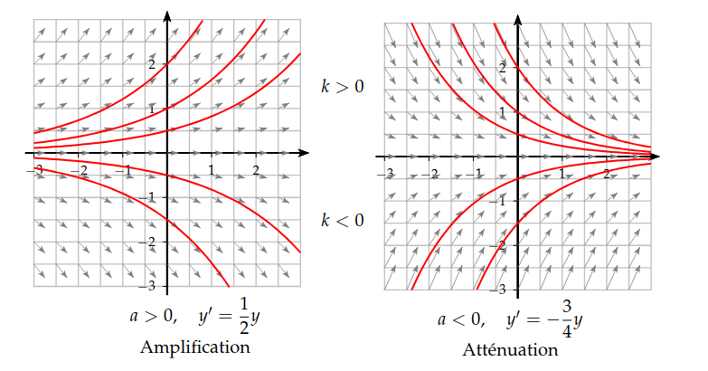

## Définition

::: {.bloc .def}
Définition : 

* Soient $a,b$ deux réels. L'équation 
$$(E) : y'+ay=b$$
où l'inconnue est la fonction $y$, est appelée une équation différentielle linéaire d'ordre $1$ à coefficients constants.
* L'équation 
$$(E_0) : y'+ay=0$$
est appelée l'équation différentielle **homogène** associée à $(E)$.
* Une solution de $(E)$ est une fonction dérivable $y$ définie sur $\mathbb{R}$ à valeurs dans $\mathbb{R}$.
:::

::: {.bloc .ex}

Exemple :   

* $3y'-2y=5$ est une équation différentielle linéaire du premier ordre.
* $y''-2y'+y=5$ est une équation différentielle linéaire du second ordre.
* $y'-\dfrac{2}{t} y = t^2$ est une équation différentielle du premier ordre linéaire mais n'est pas à coefficients constants. 
* $y'=1+y^2$ est une équation différentielle du premier ordre mais non linéaire.

Afficher la correction :

:::

## Résolution de l'équation homogène

::: {.bloc .thm}
Propriété : 

Soit $a \in \mathbb{R}$. L'équation linéaire homogène $(E_0) : y'+ay=0$ admet comme ensemble de solutions $$S_0=\left\{t \longmapsto K \e^{-at}, \, K \in \mathbb{R} \right\}$$
:::

Démonstration : 

Soit $\varphi$ une solution de $(E_0)$ et soit $g$ la fonction définie sur $\mathbb{R}$ par $g(t)=\varphi(t) \e^{at}$, ainsi $\varphi(t)= g(t) \e^{-at}$, d'où $\varphi'(t) = \e^{-at} g'(t) - a \e^{-at} g(t)$.

Or, $\varphi$ étant solution de $(E_0)$, on a :
$$\begin{aligned}
\varphi'(t) = -a \varphi(t) &\Longleftrightarrow \e^{-at} g'(t) - a \e^{-at} g(t) = - a\e^{-at} g(t) \\
&\Longleftrightarrow \e^{-at} g'(t) = 0 \\
&\Longleftrightarrow g'(t)=0
\end{aligned}$$
Ainsi $\varphi$ est solution de $(E_0)$ si et seulement si $g$ est constante sur $\mathbb{R}$, d'où le résultat.

::: {.bloc .ex}

Exemple : Courbes solutions suivant le signe de $a$ et celui de $K$ 

  

Afficher la correction :

:::

::: {.bloc .ex}

Exemple : Exercice : Désintégration radioactive 

Soit $N(t)$ le nombre de noyaux présents dans un échantillon d'isotopes radioactifs à une date $t$. On admet que $N$ est solution de l'équation différentielle :
$$N'(t) = -\lambda N(t)$$
où $\lambda > 0$ est la constante de désintégration.

1. Déterminer l'expression de $N(t)$ en fonction de $t$, sachant que $N(0) = N_0$.

Afficher la correction :

*Le nombre de désintégrations nucléaires spontanées $|dN(t)|$ qui se produisent pendant un temps infiniment petit $dt$ est proportionnel au nombre de noyaux $N(t)$ et à $dt$. Il dépend également de la nature du noyau considéré par la constante radioactive (ou constante de désintégration), notée $\lambda$.*

L'équation $N' = -\lambda N$ est une équation homogène du premier ordre. Ses solutions sont de la forme $N(t) = K \e^{-\lambda t}$.
La condition initiale $N(0) = N_0$ donne $K = N_0$. Ainsi : $$N(t) = N_0 \e^{-\lambda t}$$

2. On appelle demi-vie $t_{1/2}$ le temps nécessaire pour que la moitié des noyaux se désintègrent. Montrer que $t_{1/2} = \dfrac{\ln 2}{\lambda}$.

Afficher la correction :

On résout $N(t_{1/2}) = \dfrac{N_0}{2}$ :
$$N_0 \e^{-\lambda t_{1/2}} = \dfrac{N_0}{2} \iff \e^{-\lambda t_{1/2}} = \dfrac{1}{2} \iff_{\ln \nearrow} -\lambda t_{1/2} = -\ln 2 \iff t_{1/2} = \dfrac{\ln 2}{\lambda}$$

3. Application : Calculer $\lambda$ pour le carbone 14 ($t_{1/2} = 5\,730$ ans).

Afficher la correction :

$\lambda = \dfrac{\ln 2}{5\,730} \approx 1,21 \times 10^{-4} \text{ an}^{-1}$.

*Par exemple, la demi-vie de l'iode 131 est de 8,2 jours, celle du carbone 14 est de $5\,730$ années et celle de l'uranium $235$ environ $70$ millions d'années.*

:::

 <a class="prev" href="Generalite.html">⬅️</a>
  <a class="next" href="EquaDiff_2.html">➡️</a>

