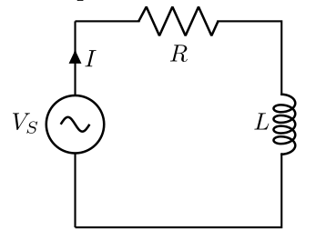

## Résolution de $y'+ay=b$, $b$ constznte

::: {.bloc .thm}
Propriété : 

Soient $a,b \in \mathbb{R}$. L'équation $(E) : y'+ay=b$ admet comme ensemble de solutions :

* Si $a \neq 0$ : $S=\left\{t \longmapsto K \e^{-at} + \dfrac{b}{a}, \, K \in \mathbb{R} \right\}$
* Si $a=0$ : $S=\left\{t \longmapsto bt + K, \, K \in \mathbb{R} \right\}$
:::

Démonstration : 

* **Si $a \neq 0$ :**
  
    * Soit $g$ une fonction constante solution de $(E)$. Sa dérivée étant nulle, on a $0+a\times g = b$, d'où $g=\dfrac{b}{a}$.
    * Soit $f$ une solution de $(E)$. Posons $h = f - g$, soit $f = h + g$.
  
  $$\begin{aligned}
    f \in (E) &\iff f' + af = b\\
    &\iff (h + g)' + a(h + g) = b\\
    &\iff h' + g' + ah + ag = b\\
    &\iff h' + ah + \underbrace{g' + ag}_{b} = b\\
    &\iff h' + ah + b = b\\
    &\iff h' = -ah
    \end{aligned}$$
    Ainsi $h \in S_0$, donc $h(t) = K \e^{-at}$ et $f(t)= K \e^{-at} + \dfrac{b}{a}$.

* **Si $a=0$ :**
L'équation $(E)$ devient $y'=b$. Les fonctions dont la dérivée est une constante sont les fonctions affines $t \longmapsto bt + K$.

::: {.bloc .ex}

Exemple :   

Soit $(E): y'-2y=3$ et $y(0)=2$. Résoudre $(E)$.

Afficher la correction :

Ici $a=-2$ et $b=3$. Les solutions de $(E)$ sont les fonctions $\phi(t) = K \e^{2t} + \dfrac{3}{-2} = K \e^{2t} - \dfrac{3}{2}$.

D'après la condition initiale $\phi(0)= 2 $, on a $K \e^0 - \dfrac{3}{2} = 2$, d'où $K = 2 + \dfrac{3}{2} = \dfrac{7}{2}$.

La solution de l'équation $(E)$ est la fonction $t \longmapsto \dfrac{7}{2}\e^{2t} - \dfrac{3}{2}$.

:::

::: {.bloc .ex}

Exemple : Un circuit RL 

::: {layout="[15, 85]"}

On rappelle que l'intensité du courant est une fonction du temps, et que la relation liant la tension du courant et l’inductance de la bobine est $u_L=L \dfrac{di}{dt}$.
Établir l'équation différentielle dont l'intensité est solution.

:::

Afficher la correction :

D'après la loi des mailles, $E = u_L + u_R$. Comme $u_R = Ri$, l'intensité du courant électrique en fonction du temps est solution de l'équation différentielle :
$$L \dfrac{di}{dt} + Ri = E$$

En divisant par $L$, on obtient $\dfrac{di}{dt} + \dfrac{R}{L}i = \dfrac{E}{L}$. 
C'est une équation de la forme $y' + ay = b$ avec $a = \dfrac{R}{L}$ et $b = \dfrac{E}{L}$. 
La solution constante est $g = \dfrac{b}{a} = \dfrac{E}{R}$.

Les solutions sont donc de la forme $i(t)= K\e^{-\frac{R}{L}t} + \dfrac{E}{R}$.
Or $i(0)=0$, donc $K + \dfrac{E}{R} = 0 \implies K = -\dfrac{E}{R}$.

D'où $i(t)= \dfrac{E}{R} \left(1-\e^{-\frac{R}{L}t} \right)$.

:::

::: {.bloc .rem}
Remarque : 

On remarque $$\lim_{t \to + \infty} i(t)= \dfrac{E}{R}$$
Ainsi, lorsque l'on ferme le circuit, un courant électrique se met en place. Son intensité augmente progressivement jusqu'à une valeur limite. On a d'abord un **régime transitoire** puis un **régime stationnaire**.
:::

__________________________

## Résolution de $y'+ay=f$, $f$ constznte

::: {.bloc .def}
Définition : 

Soit $a \in \mathbb{R}$ et $f$ une fonction continue sur $\mathbb{R}$.
L'équation
$$(E) : y'+ay= f(x)$$
est appelée équation différentielle linéaire d'ordre 1.

1. L'équation $(E_0) : y'+ay=0$ est appelée équation homogène associée à $(E)$.
2. Une fonction $g$ vérifiant $(E)$ est appelée **solution particulière** de $(E)$.
:::

::: {.bloc .ex}

Exemple :   

Soit $b$ la fonction définie par $f(x) = 4x^2+4$.
On considère l'équation différentielle $(E_1) : y'+4y=b(x)$

1. Résoudre l'équation homogène associée.

Afficher la correction :

L'équation homogène associée est $(H_1) : y'+4y=0$. Cette équation admet comme solutions les fonctions $\varphi(x) = K \e^{-4x}$ avec $K \in \mathbb{R}$.

2. Vérifier que $g:x\longmapsto x^2-\dfrac{1}{2}x+\dfrac{9}{8}$ est une solution particulière.

Afficher la correction :

Pour tout $x \in \mathbb{R}$, on a $g'(x) = 2x - \dfrac{1}{2}$. Alors :
$$g'(x) + 4g(x) = 2x - \dfrac{1}{2} + 4\left(x^2 - \dfrac{1}{2}x + \dfrac{9}{8}\right) = 2x - \dfrac{1}{2} + 4x^2 - 2x + \dfrac{9}{2} = 4x^2 + 4$$
Ainsi $g$ est bien une solution particulière.

3. Vérifier que $g + \varphi$ est solution de $(E_1)$, où $\varphi$ est une solution générale de l'équation homogène.

Afficher la correction :

On sait que $g' + 4g = b$ et $\varphi' + 4\varphi = 0$. Par linéarité :
$$\begin{aligned}
(g+\varphi)'(x) + 4(g(x)+\varphi(x)) &= (g'(x) + 4g(x)) + (\varphi'(x) + 4\varphi(x)) \\
&= b(x) + 0 \\
&= 4x^2 + 4
\end{aligned}$$
Ainsi $g+\varphi$ est aussi solution de $(E_1)$.

:::

::: {.bloc .thm}
Propriété : 

Soit $y_p$ une solution particulière de $(E)$. L'ensemble des solutions de $(E)$ est 
$$S=\left\{t \longmapsto K\e^{-at}+ y_p(t), \, K \in \mathbb{R}  \right\}$$
:::

Démonstration : 

Soit $g$ une solution particulière de $(E)$, alors $b(t)=g'(t)+ag(t)$.
Or :
$$\begin{aligned}
\varphi \text{ solution de } (E)&\Longleftrightarrow \varphi'(t)+a\varphi(t)=b(t)\\
&\Longleftrightarrow\varphi'(t)+a\varphi(t) = g'(t)+ag(t) \\
&\Longleftrightarrow(\varphi-g)'(t) + a(\varphi-g)(t) = 0\\
&\Longleftrightarrow \varphi-g \text{ solution de } (E_0)
\end{aligned}$$
Ainsi, on déduit qu'une solution générale de $(E)$ s'obtient en ajoutant une solution particulière de $(E)$ à une solution de l'équation homogène associée.

::: {.bloc .ex}

Exemple : Bac S, Métropole Juin 2010 

On considère l'équation différentielle $(E) :\quad  y' + y = \e^{-x}.$

1. Montrer que la fonction $u$ définie sur $\mathbb{R}$ par $u(x) = x\e^{-x}$ est une solution de l'équation différentielle $(E)$. 

Afficher la correction :

La fonction $u$ est dérivable sur $\mathbb{R}$ comme produit de fonctions dérivables.
Pour tout $x\in\mathbb{R}$, $u'(x)=\e^{-x}-x\e^{-x}$. On en déduit :
$$u'(x)+u(x)=\e^{-x}-x\e^{-x}+x\e^{-x}=\e^{-x}$$
$u$ est donc une solution particulière de l'équation différentielle $(E)$.

2. On considère l'équation différentielle $(E') :  y' + y = 0$. Résoudre cette équation homogène. 

Afficher la correction :

Les solutions de l'équation différentielle $y'+ay=0$ sont les fonctions $h_K(x)=K\e^{-ax}$. Ici $a=1$, donc les solutions de $(E')$ sont les fonctions $h_K$ définies sur $\mathbb{R}$ par $h_{K}(x)=K\e^{-x}$, où $K\in\mathbb{R}$.

3. Soit $v$ une fonction dérivable sur $\mathbb{R}$. Montrer que $v$ est solution de $(E)$ si et seulement si $v - u$ est solution de $(E')$. 

Afficher la correction :

D'après la question 1, $u'(x)+u(x)=\e^{-x}$. On a :
$$\begin{aligned}
v \text{ solution de } (E)&\Longleftrightarrow v'(x)+ v(x)=\e^{-x}\\
&\Longleftrightarrow v'(x)+ v(x) = u'(x)+ u(x) \\
&\Longleftrightarrow(v-u)'(x) + (v-u)(x) = 0\\
&\Longleftrightarrow v-u\text{ solution de } (E')
\end{aligned}$$

4. En déduire toutes les solutions de l'équation différentielle $(E)$. 

Afficher la correction :

On note $S$ l'ensemble des solutions de $(E)$ et $S_0$ celui de $(E')$.
$$v \in S \Longleftrightarrow (v-u) \in S_0 \Longleftrightarrow \exists K \in \mathbb{R}, \, v(x)-u(x)=K \e^{-x} \Longleftrightarrow \exists K \in \mathbb{R}, \, v(x)=u(x) + K\e^{-x}$$
Les solutions de $(E)$ sont les fonctions $v_K$ définies sur $\mathbb{R}$ par $v_{K}(x)=(x+K)\e^{-x}$, où $K\in\mathbb{R}$.

5. Déterminer l'unique solution $g$ de $(E)$ telle que $g(0) = 2$.

Afficher la correction :

On a $g(0)=2 \Longleftrightarrow (0+K)\e^{0}=2 \Longleftrightarrow K=2$. L'unique solution $g$ de l'équation $(E)$ vérifiant $g(0)=2$ est définie sur $\mathbb{R}$ par $g(x)=(x+2)\e^{-x}$.

:::

 <a class="prev" href="EquaDiff.html">⬅️</a>
  <a class="next" href="cauchy.html">➡️</a>

