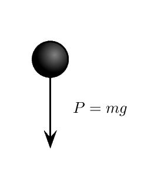
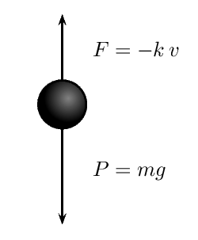

## Repères Historiques

L'histoire des équations différentielles est intimement liée à l'invention du calcul infinitésimal à la fin du XVIIe siècle.

### 1. La naissance (Fin du XVIIe siècle)
Tout commence avec **Isaac Newton** et **Gottfried Wilhelm Leibniz**. 
* **Newton** les utilise pour formuler ses lois de la dynamique (comme la relation fondamentale de la dynamique $F = ma$, qui est une équation différentielle du second ordre).
* **Leibniz** introduit la notation différentielle ($dy/dx$) que nous utilisons encore aujourd'hui et résout les premières équations par séparation des variables.

### 2. L'âge d'or des Bernoulli et d'Euler (XVIIIe siècle)
Les frères **Bernoulli** (Jacques et Jean) appliquent ces équations à des problèmes de géométrie et de mécanique (courbe de la chaînette, brachistochrone). 
**Leonhard Euler** systématise ensuite les méthodes de résolution et pose les bases des équations différentielles linéaires.

### 3. La rigueur et le chaos (XIXe et XXe siècles)
* **Augustin-Louis Cauchy** démontre les conditions d'existence et d'unicité des solutions (Théorème de Cauchy-Lipschitz).
* **Henri Poincaré**, à la fin du XIXe siècle, comprend que certaines équations (comme le problème des trois corps) ne peuvent pas être résolues par des formules simples. Il fonde alors l'analyse qualitative et l'étude des **systèmes dynamiques**, ouvrant la voie à la théorie du chaos.

::: {.bloc}
#### Chute d'un corps dans le vide

::: {layout="[15, 85]"}

Si $v(t)$ désigne la vitesse du corps à l'instant $t$, alors l'accélération du corps est la dérivée $v'(t)$. Dans le vide, le corps est soumis uniquement à la force de pesanteur (son poids) et la loi de Newton (principe fondamental de la dynamique) donne : 

$$mv'(t)=P=mg$$

soit aussi, 

**$v'(t)=g$**

C'est une équation dont l'inconnue est la fonction $v$.

:::
:::

::: {.bloc}
#### Chute d'un corps dans un liquide visqueux

::: {layout="[15, 85]"}

  

Pour un modèle plus complet et réaliste, on peut aussi prendre en compte les frottements : ceux-ci peuvent être modélisés par une force opposée au mouvement du corps, et proportionnelle à sa vitesse. La loi de Newton s'écrit maintenant : 
$$mv'(t)=F+P=-kv(t)+mg$$

ou, 

> **$v'(t)=-\dfrac{k}{m}v(t)+g$**

L'équation relie cette fois la fonction inconnue $v$ et sa dérivée.

:::
:::

:::{.bloc}
#### Radioactivité

À la toute fin du XIXème siècle, Marie et Pierre Curie mettent en évidence des éléments radioactifs autres que l'uranium : le polonium et le radium. Des atomes de ces éléments radioactifs se désintègrent en permanence. 

Si on désigne par $N(t)$ le nombre d'atomes de radium à l'instant $t$, alors la quantité d'atomes qui se désintègrent à un instant donné est proportionnelle à la quantité d'atomes encore présente : 

> **$N'(t)=-aN(t)$**

En résolvant cette équation, on peut donc connaître à chaque instant $t$ le nombre d'atomes $N(t)$. 

Ceci est par exemple appliqué pour la *datation au carbone 14* de matière organique. Le carbone 14 est un isotope radioactif du carbone. Connaissant le nombre d'atomes de carbone 14 présents et ceux qui se sont désintégrés, on détermine la durée qu'a prise cette désintégration, c'est-à-dire l'âge de la matière organique.
:::

 <a class="prev" href="Operations.html">⬅️</a>
  <a class="next" href="Generalite.html">➡️</a>

