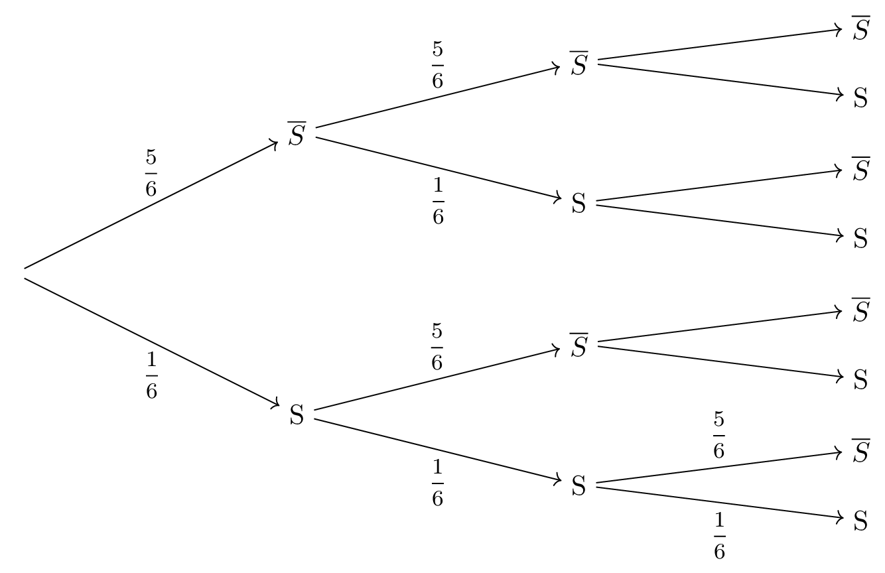

::: {.bloc .def}
Définition : 

On appelle **schéma de Bernoulli** la répétition de $n$ épreuves de Bernoulli de paramètre $p$, indépendantes les unes des autres et identiques.  
On parle alors de schéma de Bernoulli de paramètres $n$ et $p$.
:::

::: {.bloc .rem}
Remarque : 

* Ainsi si $X$ est une variable aléatoire suivant une loi de Bernoulli de paramètre $p$, on a : 
  $$P(X=1) = p \qquad \text{et} \qquad P(X=0)=1-p$$

* L'univers associé à un schéma de Bernoulli de paramètres $n$ et $p$ est le produit cartésien :
  $$\{S \, ; \, \bar{S} \}^n = \underbrace{\{S \, ; \, \bar{S} \}\times \{S \, ; \, \bar{S} \} \times \dots \times \{S \, ; \, \bar{S} \}}_{n \text{ fois}}$$ 
  Les éléments sont les $n$-listes ou mots de $n$ lettres composés des lettres $S$ et $\bar{S}$.  
  Il y a exactement $2^n$ mots ou listes différents.
:::

::: {.bloc .ex}

Exemple :   

On reprend l'exemple précédent du dé à $6$ faces et on décide de répéter à trois reprises l'expérience de façon identique et indépendante.

1. Justifier que l'on a un schéma de Bernoulli et tracer l'arbre de probabilité associé.

Afficher la correction :

Cette répétition constitue un schéma de Bernoulli, puisque pour chaque lancer on se retrouve dans des conditions identiques au lancer précédent. De plus, ils sont indépendants les uns des autres. 
En notant $S$ l'événement « Obtenir un $5$ » et $\bar{S}$ l'événement contraire, on a pour chaque lancer :
$$P(S) = \dfrac{1}{6} \qquad \text{et} \qquad P(\bar{S}) = \dfrac{5}{6}$$
Chaque issue est un « mot » de trois lettres constitué de $S$ et de $\bar{S}$.

  

2. Lister les issues réalisant l'événement « Obtenir exactement deux $5$ » et établir la loi de probabilité de $X$, la variable aléatoire comptant le nombre de succès.

Afficher la correction :

On peut déterminer à l'aide de l'arbre qu'il y a trois chemins, donc trois issues possibles pour l'événement « Obtenir exactement deux $5$ ».
Si on considère la variable aléatoire $X$ donnant le nombre de $5$ lors de $3$ lancers, on a :
$$(X = 2) = \{SS\bar{S} \, ; \, S\bar{S}S \, ; \, \bar{S}SS\}$$

La loi de probabilité de $X$ est :

| $k$ | $0$ | $1$ | $2$ | $3$ |
|:---:|:---:|:---:|:---:|:---:|
| $P(X = k)$ | $\left(\dfrac{5}{6}\right)^3$ | $3 \times \dfrac{1}{6} \times \left(\dfrac{5}{6}\right)^2$ | $3 \times \dfrac{5}{6} \times \left(\dfrac{1}{6}\right)^2$ | $\left(\dfrac{1}{6}\right)^3$ |

3. Déterminer l'espérance et interpréter le résultat.

Afficher la correction :

En utilisant la définition de l'espérance :
$$E(X) = 0 \times \dfrac{125}{216} + 1 \times \dfrac{75}{216} + 2 \times \dfrac{15}{216} + 3 \times \dfrac{1}{216} = 0,5$$
**Interprétation :** Sur un très grand nombre de séries de 3 lancers, on peut espérer obtenir en moyenne $0,5$ fois le chiffre $5$ par série (soit un « $5$ » toutes les deux séries).

:::

::: {.bloc .rem}
Remarque : 

Ici, déterminer le nombre d'issues favorables à l'obtention de deux $5$ est facile. Il en est tout autre de devoir déterminer le nombre d'issues favorables pour obtenir sept fois le chiffre « $5$ » sur vingt lancers. (On est alors dans le cas d'un schéma de Bernoulli de paramètres $20$ et $\dfrac{1}{6}$).

La construction d'un arbre, dans un tel cas, serait à proscrire puisqu'il comporterait alors $2^{20}$ feuilles (c'est-à-dire $1\,048\,576$ mots différents de longueur $20$).
:::

 <a class="prev" href="bernoulli1.html">⬅️</a>
  <a class="next" href="binomiale1.html">➡️</a>

