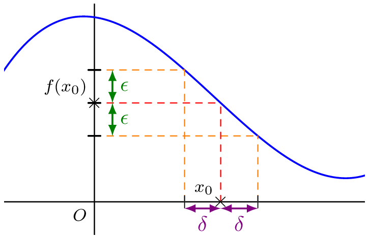
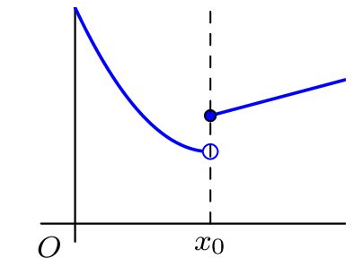
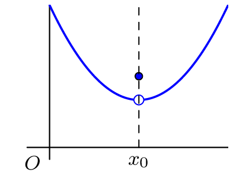
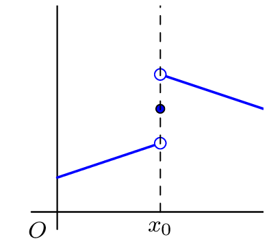
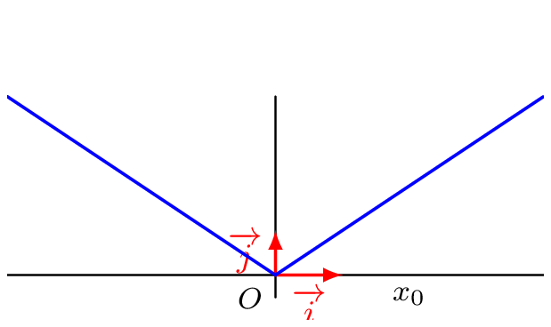

_____

### Définition 
::: {.bloc .def}
Définition : 

Soit $f$ une fonction définie sur un ensemble $\mathscr{D}$ et $x_0 \in \mathscr{D}$.  
On dit qu'une fonction est **continue** en $x_0$ lorsque :
$$\lim_{x \to x_0} f(x) = f(x_0)$$
Une fonction qui n'est pas continue est dite discontinue.
:::

::: {.bloc .rem}
Remarque : 

Si une fonction est continue en un point $x_0$, alors elle est définie en ce point (et dans un voisinage de ce point).
:::

::: {.bloc .thm}
Propriété : 

Soit $f$ une fonction définie sur $I$ et $x_0 \in I$. On a équivalence entre les propriétés suivantes :

1. $f$ est continue en $x_0$
2. $\lim_{h \to 0} f(x_0+h)=f(x_0)$
3. $\forall \epsilon >0, \, \exists \eta >0, \, \forall x \in I, (|x-x_0| < \eta \Longrightarrow |f(x)-f(x_0)| < \epsilon)$
:::

Démonstration : 

On démontre que $1. \Longrightarrow 2. \Longrightarrow 3. \Longrightarrow 1.$

* **$1. \Longrightarrow 2.$** :  
  $f$ est continue en $x_0$, donc $\lim_{x \to x_0} f(x)= f(x_0)$.  
  On pose alors $h=x-x_0$, il vient alors que, par composition :
  $$\lim_{h \to 0} f(x_0+h)= \lim_{x\to x_0} f(x)=f(x_0)$$

* **$2. \Longrightarrow 3.$** :  
  On a :
  $$\forall \epsilon >0, \, \exists \eta >0, \forall h \in \mathbb{R}, \, x_0+h \in I, \, (|h| < \eta \Longrightarrow |f(x_0+h)-f(x_0)| < \epsilon)$$
  En posant $h=x-x_0$, on obtient :
  $$\forall \epsilon >0, \, \exists \eta >0, \, \forall x \in I, (|x-x_0| < \eta \Longrightarrow |f(x)-f(x_0)| < \epsilon)$$

* **$3. \Longrightarrow 1.$** : C'est la définition formelle de la limite (et donc de la continuité).

::: {.bloc}
**Illustration graphique**

  

:::

::: {.bloc .rem}
Remarque :  
Intuitivement, une fonction est continue sur un intervalle, si on peut tracer son graphe « sans lever le crayon »,
c’est-à-dire si sa courbe représentative n’admet pas de « saut » ou de « trou ».

  
  
    

:::

### Lien avec la dérivée

::: {.bloc .thm}
Propriété : 

Si $f$ est dérivable en $x_0$, alors elle est continue en $x_0$.
:::

Démonstration : 

On considère $f$ une fonction dérivable en $x_0$. Soit $x$ dans un voisinage de $x_0$ et $x \neq x_0$, alors :
$$f(x) = f(x_0) + \dfrac{f(x)-f(x_0)}{x-x_0} (x-x_0)$$

On a par passage à la limite :
$$\lim_{x \to x_0} \dfrac{f(x)-f(x_0)}{x-x_0} = f'(x_0) \quad \text{et} \quad \lim_{x \to x_0} (x-x_0) = 0$$

Donc, par opérations sur les limites :
$$\lim_{x \to x_0} f(x) = f(x_0) + f'(x_0) \times 0 = f(x_0)$$
La fonction $f$ est donc continue en $x_0$.

::: {.bloc .rem}
Remarque : 

La réciproque de ce théorème est fausse. Une fonction peut être continue en $x_0$ sans y être dérivable (par exemple, la fonction valeur absolue en $0$).
:::

::: {.bloc .rem}
Remarque :  
La réciproque de ce théorème est fausse. On peut considérer pour le montrer la fonction valeur absolue 
  

La fonction n'est clairement pas dérivable en $0$, puisque les demi-tangentes n'ont pas le même coefficient directeur, et $\lim_{x \to 0} \abs{x} = 0 = \abs{0}$
:::

::: {.bloc .rem}
On déduit que : 

- La fonction valeur absolue est continue sur $\R$ ;
- La fonction racine carrée est continue sur $\R^+$ ;
- La fonction exponentielle est continue sur $\R$ ;
- La fonction partie entière est continue sur $\R \backslash \Z$.
:::

 <a class="prev" href="historique.html">⬅️</a>
  <a class="next" href="operation.html">➡️</a>

