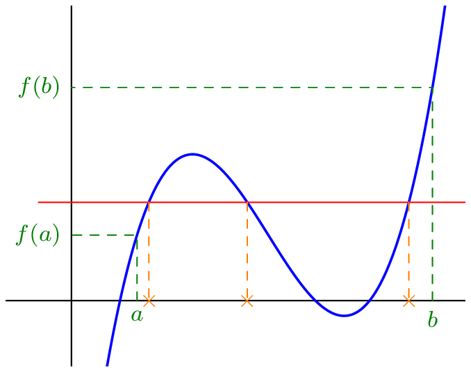

_____

::: {.bloc .thm}
Propriété :  
Soit $f$ une fonction continue sur $[a\,;\,b]$. Pour tout $k \in [f(a)\,;\, f(b)]$ l'équation $f(x)=k$ admet au moins une solution.
:::

::: {.bloc}

  

En général, $f([a\,;\,b]) \neq [f(a)\,;\, f(b)]$, par contre, on a 
$$[f(a)\,;\, f(b)] \subset f([a\,;\,b])$$

$f([a\,;\,b])$ désigne l'image de l'intervalle $[a\,;\, b]$ par la fonction $f$.

:::

::: {.bloc .rem}
Remarque :  

- Si $f$ est une fonction continue, alors elle ne peut pas changer de signe sans s'annuler.
- On peut à l'aide du théorème justifier, pour une fonction continue de signe non constant,  l'existence d'au moins une solution, sans pour autant en donner sa valeur ni le nombre de solutions.
:::

::: {.bloc .ex}
Exemple : 
On considère la fonction $f$ définie par $f(x)=(x-1)\e^{-x}+1$.  
Montrer que la fonction $f$ admet au moins une racine

Afficher la correction :

- On a $\lim_{x \to -\infty} (x-1) = - \infty$ et $\lim_{x \to -\infty} \e^{-x} = +\infty$. 
Par produit des limites, $\lim_{x \to - \infty} f(x) = -\infty$
- Pour tout réel $x$, $f(x) = x\e^{-x} - \e^{-x} +1$.\\
Or $\lim_{x \to + \infty} \e^{-x} = 0$ et $\lim_{x \to + \infty} x \e^{-x} = 0$. 
Par produit et somme de limites, on déduit que $\lim_{x \to +\infty} f(x) = 1$.

La fonction $f$ est continue sur $\R$ et $0\in  \left]\lim_{x \to-\infty} f(x) \, ; \, \lim_{x \to +\infty} f(x) \right[$.

On déduit du théorème des valeurs intermédiaires l'existence d'au moins un $\alpha \in \R$, tel que $f(\alpha)=0$

:::

::: {.bloc .rem}
Remarque :  
Soit $f$ une fonction continue strictement croissante sur $I$, alors : 

- Si $f$ est strictement positive, $f(x) = 0$ n'admet aucune solution ;
- Si $f$ change de signe, alors il existe $x, x' \in I$ tel que $f(x) < 0 < f(x')$.\\
Supposons qu'il existe au moins deux valeurs annulant $f$ que l'on note $\alpha$ et $\beta$, alors on a 
$$\alpha < \beta \quad \text{ et }\quad f(\alpha) = f(\beta)$$
Ce qui contredit la stricte {croissance} de $f$.\\
Donc $f$ admet une seule racine.

On déduit de ces remarques que si la fonction est strictement croissante, et plus généralement strictement monotone, alors $f$ admet au plus une racine.
:::

::: {.bloc .ex}
Exemple : 
Montrer que $f(x)=0$ (la fonction $f$ précédente) admet exactement une racine.

Afficher la correction :

$f$ est dérivable sur $\R$ comme produit et somme de fonctions dérivables.

Pour tout $x \in \R$, $$f'(x)= \e^{-x} - x \e^{-x} + \e^{-x} = (2-x)\e^{-x}$$
Or la fonction exponentielle étant à valeurs strictement positives, on déduit que $f'(x)$ est du signe de $2-x$.

Ainsi $f'(x)$ est positive sur $]-\infty\,; \, 2[$ et donc la fonction est croissante sur cet intervalle et $f'(x)$ est négative sur $[2 \, ; \,+\infty[$ et donc décroissante sur cet intervalle.

Ainsi la fonction $f$ admet un maximum en $2$ qui vaut $f(2) = \e^{-2} >0$.

On déduit de la question précédente que $f$ admet au moins un zéro sur $]-\infty \, ; \, 2]$ et comme $f$ est strictement croissante sur cet intervalle, elle y admet au plus un zéro, soit un unique zéro sur l'intervalle $]-\infty \,; \, 2]$.

Sur $[2 \, ; \, +\infty[$, la fonction $f$ est strictement décroissante avec $\lim_{x \to + \infty} f(x) = 1$, ainsi pour tout réel $x$, $f(x)  > 1$,  donc $f(x)=0$ n'admet aucune solution sur $[2\, ;\, +\infty[$.

Ainsi $f(x)=0$ admet une unique solution sur $\R$.

:::

::: {.bloc .thm}
Propriété (admise)  :  
 L'image d'un intervalle par une fonction continue est un intervalle
:::

::: {.bloc .rem}
Remarque :  
Soient $I$ un intervalle et $f$ une fonction continue, alors $I$ et $f(I)$ ne sont pas forcément des intervalles de même nature.

On peut par exemple étudier la fonction $f$ définie sur $]-\infty\,;\, +\infty[$ par $f(x)= \frac{2}{x^2+1}$ et, \textcolor{red}{elle est} à valeur dans $[0\,;\,2]$.

Cependant si $I$ est un intervalle fermé, alors $f(I)$ est un intervalle fermé et $f(I) = \left[\min f ,\, \max f\right]$
:::

 <a class="prev" href="operation.html">⬅️</a>
  <a class="next" href="tvi_python.html">➡️</a>

