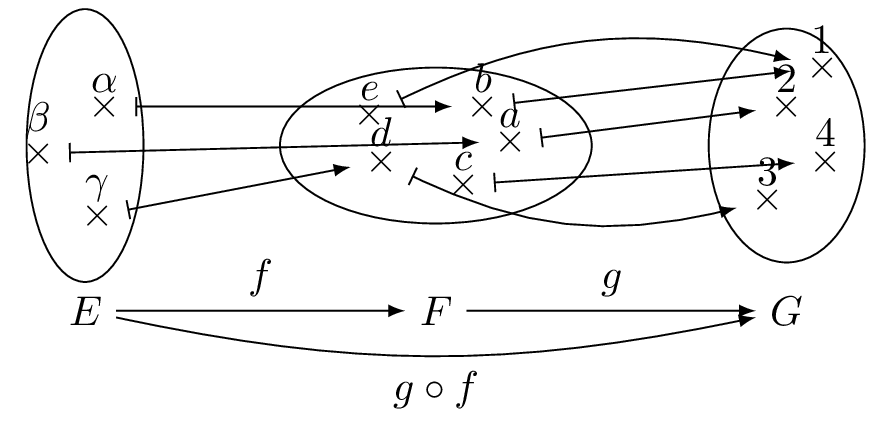

----

## Définition
::: {.bloc .def}
Définition : 

Soient $f$ une fonction définie sur $I$ et $g$ une fonction définie sur $J$. On suppose que $f(I) \subset J$.  
On appelle composée de $f$ par $g$, et on note $g \circ f$ (lire $g$ rond $f$), la fonction définie par :
$$(g \circ f)(x)=g(f(x))$$
:::

::: {.bloc .rem}
Remarque : 

Pour pouvoir définir $g\circ f$, il faut et il suffit que $f(x) \in J$. C'est-à-dire que les images par $f$ soient dans l'ensemble de définition de $g$.

$$\begin{matrix}
f: & I & \longrightarrow & f(I) & & \\
   & x & \longmapsto & f(x) & & \\
   & & g : & J & \longrightarrow & g(J) \\
   & & & f(x) & \longmapsto & g(f(x))
\end{matrix}$$

Ainsi, en notant $\mathscr{D}_f$ et $\mathscr{D}_g$ les ensembles de définition respectifs de $f$ et $g$, on a  
$$\mathscr{D}_{g \circ f} =\{x \in \mathscr{D}_f, f(x) \in \mathscr{D}_g \}$$
:::

::: {.bloc .ex}
Exemple :  

  

On a :  

- $\mathscr{D}_f=\{\alpha \, ; \, \beta \, ; \,\gamma\}$ et $\mathscr{D}_g=\{a\, ; \,b\, ; \,c \, ; \,d\, ; \,e\, ; \,f\}$  
- $f(\mathscr{D}_f) =\{b \, ; \, a \, ; \, d\}$  et $f(\mathscr{D}_f) \subset \mathscr{D}_g$  
- $f(\alpha)=b$ et $g(b) =1$ donc $(g \circ f)(\alpha)=1$  
- $f(\beta)=a$ et $g(b) =2$ donc $(g \circ f)(\beta)=2$  
- $f(\gamma)=d$ et $g(d) =3$ donc $(g \circ f)(\gamma)=3$  
:::

::: {.bloc .ex}

Exemple :   

On considère la fonction $f$ définie par $f(x)= x^2-9$ sur $\color{red}{[2 \,;\,+\infty[}$ et la fonction $g$ définie par $g(x) = \dfrac{1}{x}$ sur $\color{blue}{\mathbb{R}^*}$.

1. Soit $h=g \circ f$.
    * $D_h = \{x \in {\color{red}{[2 \,;\,+\infty[}}, \, f(x) \in {\color{blue}{\mathbb{R}^*}} \} = \{x \in {\color{red}{[2 \,;\,+\infty[}}, \, x^2-9 \neq 0\} = \{x \in \color{red}{[2 \,;\,+\infty[}, \, \color{green}{x \neq 3 \text{ et } x \neq -3}\}$.
    * Donc $D_h = \color{red}{[2 \,;\,+\infty[} - \color{green}{\{-3\, ;\, 3\}} = [2\, ; \, 3[ \cup ]3\, ; \, + \infty[$.
    * La fonction $h$ est définie sur $[2\, ; \, 3[ \cup ]3\, ; \, + \infty[$ par $h(x) = \dfrac{1}{x^2 - 9}$.

2. Soit $k=f \circ g$.
    * $D_k = \{x \in {\color{red}{\mathbb{R}^*}} \, g(x) \in {\color{blue}{[2 \,;\,+\infty[}} \} = \left\{x \in {\color{red}{\mathbb{R}^*}}, \, {\color{blue}{\dfrac{1}{x} \geqslant 2}} \right \} = \left\{x \in \color{red}{\mathbb{R}^*}, \, \color{green}{0 < x \leqslant \dfrac{1}{2}} \right\}$.
    * Donc $D_k = \left]0 \, ; \, \dfrac{1}{2}\right]$.
    * La fonction $k$ est définie sur $\left]0 \, ; \, \dfrac{1}{2}\right]$ par $k(x) = \left(\dfrac{1}{x} \right)^2-9$.
:::

::: {.bloc .rem}
Remarque : 

D'une façon générale, $f \circ g \neq g \circ f$.
:::

## Composée et variations

:::: {.bloc .thm}
Propriété : 

Soient $f$ et $g$ deux fonctions monotones telles que la fonction composée $h= g \circ f$ existe.

* Si $f$ et $g$ ont même monotonie alors $h$ est croissante.
* Si $f$ et $g$ sont de monotonies contraires alors $h$ est décroissante.
:::

Démonstration : 

*On démontre dans le cas de monotonies contraires.* On suppose $f$ croissante sur $I$ et $g$ décroissante sur $J$ et $f(I) \subset J$.  
$\forall x, y \in I$,
$$
\begin{aligned}
x < y & \underset{f \, \nearrow \, \text{sur} \, I}{\Longrightarrow} f(x) < f(y)\\
& \underset{g \searrow \, \text{sur} \, f(I)}{\Longrightarrow} g \circ f(x) > g \circ f(y) \\
& \Longrightarrow h(x) > h(y).
\end{aligned}
$$
Ainsi, par définition $h$ est décroissante sur $I$.

::: {.bloc .ex}

Exemple :   

Étudions les variations de la fonction $h:x \longmapsto - \dfrac{1}{1-x}$ définie sur $]1\, ; \, + \infty[$.

* La fonction $f : x \longmapsto 1-x$ est décroissante sur $]1\, ; \, + \infty[$ et à valeurs dans $]-\infty \,; \, 0[$.
* La fonction $g : x \longmapsto - \dfrac{1}{x}$ est croissante sur $]-\infty \, ; \, 0[$.

On en déduit que la fonction $h$ est décroissante sur $]1\, ; \, + \infty[$.

:::

  <a class="prev" href="parite.html">⬅️</a>
  <a class="next" href="comp_derivation.html">➡️</a>

