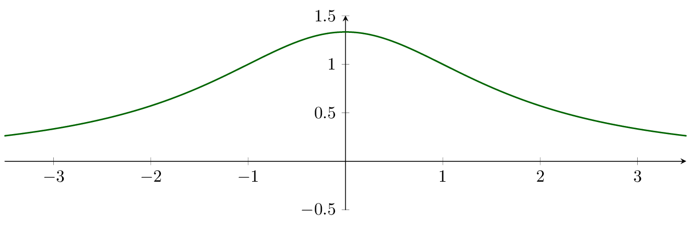
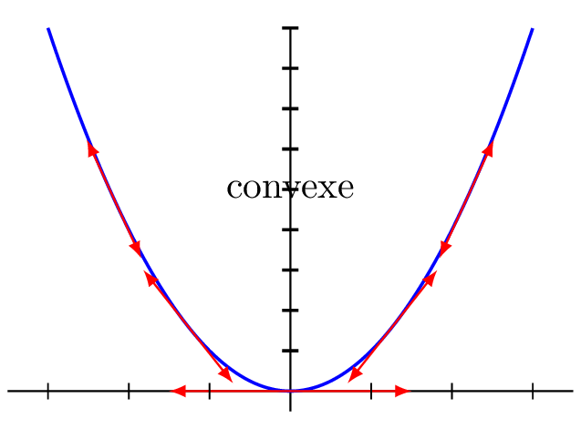
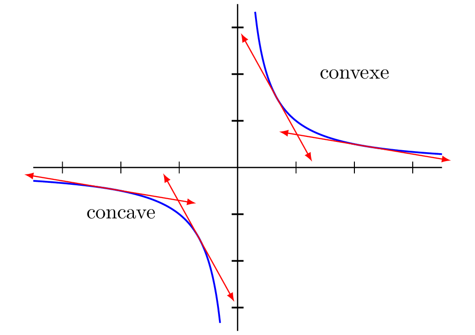
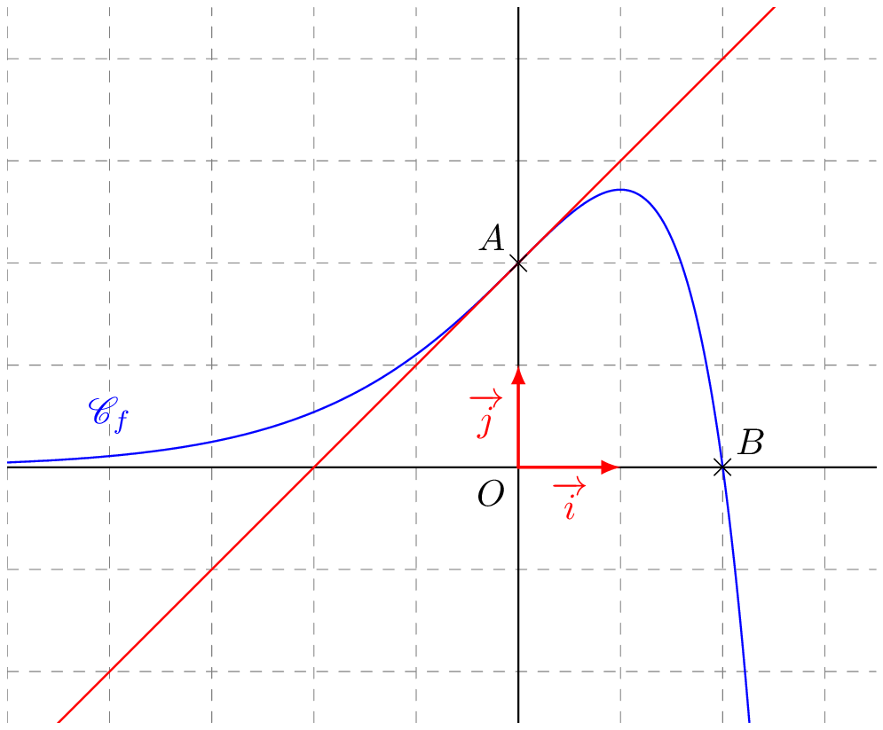

----

## Convexité et dérivées

::: {.bloc .thm}
Propriété (admise) : 

Soit $f$ une fonction définie, deux fois dérivable sur un intervalle $I$.  
Les propositions suivantes sont équivalentes :

1. $f$ est convexe (concave) sur $I$ ;
2. $f''$ est positive (négative) sur $I$ ;
3. $f'$ est croissante (décroissante) sur $I$.
:::

::: {.bloc .ex}

Exemple :   

Déterminer la convexité de la fonction $f$ définie sur $\mathbb{R}$ par $$f(x) = \dfrac{4}{x^2+3}.$$

Afficher la correction :

$f$ est une fonction rationnelle donc dérivable sur tout intervalle de son ensemble de définition.  
Pour tout réel $x$, $$f'(x) = -\dfrac{8x}{(x^2+3)^2}.$$
De même, $f'$ étant rationnelle, elle est dérivable sur tout intervalle de son ensemble de définition, donc sur $\mathbb{R}$.  
Ainsi, pour tout réel $x$, $$f''(x) = \dfrac{24(x^2-1)}{(x^2+3)^3}.$$
On en déduit que :

* Pour tout $x \in ]-\infty \, ; \, -1]\cup [1 \, ;\, + \infty[$, $f''(x) \geqslant 0$.  
Donc la fonction $f$ est **convexe** sur ces deux intervalles.
* Pour tout $x \in [-1 \, ;\, 1]$, $f''(x) \leqslant 0$.  
La fonction est donc **concave** sur cet intervalle.
* Pour $x \in \{-1\, ; \,1 \}$, $f''(x)=0$.

:::

::: {.bloc .rem }
On peut retrouver le résultat graphiquement, mais il est difficile de voir, que le changement de convexité se fait en $1$ et $-1$.

  

:::

::: {.bloc .thm}
Propriété : 

Soit $f$ une fonction définie sur $I$ et dérivable sur $I$.

* $f$ est convexe sur $I$ si et seulement si sa représentation graphique est au-dessus de chacune de ses tangentes.
* $f$ est concave sur $I$ si et seulement si sa représentation graphique est au-dessous de chacune de ses tangentes.
:::

Démonstration : 

* **Sens direct :** Soit $a \in I$. On pose $d(x) = f(x)- \left[f'(a)(x-a)+f(a)\right]$. Puisque $d$ est la somme de fonctions dérivables, elle est dérivable. On a alors, pour tout $x$, $d'(x)= f'(x)- f'(a)$.  
On suppose alors que $f$ est convexe. On en déduit que $f'$ est croissante sur $I$. Ainsi :
    * Si $x<a$, on a $f'(x) < f'(a)$, donc $d'(x) < 0$, donc $d$ est décroissante sur $I \cap ]-\infty\,;\, a[$. 
    * Si $x>a$, on a $f'(x) > f'(a)$, donc $d'(x) > 0$, donc $d$ est croissante sur $I \cap ]a\,;\, +\infty[$. 

    On en déduit que $d$ admet un minimum en $a$, et $d(a)=0$.  
    Ainsi, pour $a$ fixé, la tangente en $a$ est au-dessous de la représentation graphique de la fonction.  
    D'où $\mathscr{C}_f$ est au-dessus de chacune de ses tangentes.

* **Sens indirect :** On suppose que pour tout $x,a \in I$, $f(x) \geqslant f'(a) (x-a)+f(a)$.  
Alors, pour tout $x,y \in I$ tels que $x < y$, on a :
$$f(x) \geqslant f(y)+(x-y)f'(y) \quad \text{et} \quad f(y) \geqslant f(x) + (y-x)f'(x)$$
Donc 
$$\dfrac{f(x)-f(y)}{x-y} \leqslant f'(y) \quad \text{et} \quad \dfrac{f(x)-f(y)}{x-y} \geqslant f'(x)$$
Ainsi, $f'(x) \leqslant f'(y)$.  
On en déduit que $f'$ est croissante, donc $f$ est convexe.

::: {.bloc .ex}
Exemple :  
La fonction carré est une fonction convexe sur $\R$ et la fonction inverse est concave sur $]-\infty \, ; \ , 0[$ et sur $]0 \, ; \, + \infty[$.

  
  

:::

::: {.bloc .ex}

Exemple : Exponentielle et Tangente en $0$  

Démontrer que pour tout réel $x$, $\e^x \geqslant x +1$.

Afficher la correction :

La fonction $\exp$ est dérivable de dérivée elle-même. La fonction exponentielle étant strictement croissante, on en déduit alors qu'elle est convexe.

Elle est donc située au-dessus de chacune de ses tangentes, en particulier de la tangente en $0$ :
$$T_0: y = \exp'(0)(x-0)+\exp(0)$$
Ainsi, $\e^x \geqslant x+1$.

:::

::: {.bloc .ex}

Exemple : Inégalité de Bernoulli  

En utilisant la convexité, démontrer l'inégalité de Bernoulli : $$\forall a \geqslant -1, \, \forall n \in \mathbb{N}, \, (1+a)^n \geqslant 1+ na$$

Afficher la correction :

Soit $f$ la fonction définie sur $I=]-1 \, ; \, +\infty[$ par $f(x)=(1+x)^n$ avec $n$ un entier supérieur ou égal à $2$.
Cette fonction, étant un polynôme de degré $n \geqslant 2$, est au moins deux fois dérivable.  
Pour tout $x \in I$ : 
$$f'(x)=n(1+x)^{n-1} \quad \text{et} \quad f''(x) = n(n-1)(1+x)^{n-2}$$

De plus, pour tout $x \in I$, $f''(x) \geqslant 0$ puisque $1+x > 0$ et $n \geqslant 2$.  
On en déduit que la fonction $f$ est convexe. Elle est donc située au-dessus de chacune de ses tangentes, en particulier de sa tangente en $0$.  
Or, la tangente en $0$ à la représentation graphique de $f$ a pour équation réduite :
$$y =f'(0)(x-0)+f(0)$$
c'est-à-dire $$y=nx+1$$
On en déduit que $(1+x)^n \geqslant 1+nx$.

La démonstration est faite pour $n \geqslant 2$. Il reste à étudier le cas $n=1$ et $n=0$ :

* Pour $n=0$, $(1+x)^0=1$ et $1+nx = 1$. L'inégalité large est donc démontrée.
* Pour $n=1$, $(1+x)^1=1+x$ et $1+nx=1+x$. L'inégalité large est donc démontrée.

On a donc démontré la propriété pour tout entier $n$.

:::

::: {.bloc .rem}
Synthèse des liens : 

Le tableau suivant résume les relations entre la fonction $f$ et ses dérivées :

| Fonction $f$ | Dérivée $f'$ | Dérivée seconde $f''$ |
| :--- | :--- | :--- |
| **Croissante** | Positive ($+$) | / |
| **Décroissante** | Négative ($-$) | / |
| **Convexe** | Croissante | Positive ($+$) |
| **Concave** | Décroissante | Négative ($-$) |
| **Point d'inflexion** | Extremum | S'annule et change de signe |
:::

________________________

## Points d'inflexions

::: {.bloc .thm}
Propriété (admise) : 

Soit $f$ une fonction définie, deux fois dérivable sur un intervalle $I$. On note $\mathscr{C}_f$ sa représentation graphique.  
Soit $a \in I$.

* Si $f'$ change de sens de variation en $a$, alors $\mathscr{C}_f$ admet un point d'inflexion au point d'abscisse $a$.
* Si $f''$ change de signe en $a$ en s'annulant, alors $\mathscr{C}_f$ admet un point d'inflexion au point d'abscisse $a$.
:::

::: {.bloc .rem}
Remarque graphique : 

Au point d'inflexion, la courbe $\mathscr{C}_f$ **traverse sa tangente**. 

* D'un côté du point, la courbe est au-dessus de la tangente (partie convexe).
* De l'autre côté, la courbe est au-dessous de la tangente (partie concave).

  

:::

::: {.bloc .ex}

Exemple :

On considère $f:x \longmapsto x^3-3x^2+5$.  
Montrer que $f$ admet un point d'inflexion.

Afficher la correction :

$f$ est une fonction polynôme de degré $3$, donc dérivable sur $\mathbb{R}$.  
Pour tout réel $x$, $$f'(x)=3x^2-6x = 3x(x-2).$$

Pour étudier les variations de $f'$, calculons $f''(x) = 6x - 6 = 6(x-1)$.  
On a $f''(x) < 0$ pour $x < 1$ et $f''(x) > 0$ pour $x > 1$.  
Donc $f'$ est décroissante sur $]-\infty, 1[$ et croissante sur $]1, +\infty[$.  
Ainsi, $f'$ change de sens de variation en $x = 1$.  
On en déduit alors que $\mathscr{C}_f$ admet un point d'inflexion en $x=1$.

:::

::: {.bloc .ex}

Exemple :

Soit $g$ définie sur $\mathbb{R}$ par $g(x) = \e^{-x^2}$. Étudier sa convexité.

Afficher la correction :

$g$ est de la forme $\e^{u}$ avec $u(x)=-x^2$.  
$g'(x) = u'(x)\e^{u(x)} = -2x\e^{-x^2}$.

Calculons la dérivée seconde  :  
$g''(x) = -2\e^{-x^2} + (-2x)(-2x\e^{-x^2}) = (-2 + 4x^2)\e^{-x^2}$.

Comme $\e^{-x^2} > 0$, $g''(x)$ est du signe de $4x^2-2$.  

* $g''(x) = 0 \iff x^2 = \dfrac{1}{2} \iff x = \dfrac{\sqrt{2}}{2}$ ou $x = -\dfrac{\sqrt{2}}{2}$.
* $g$ est donc convexe sur $]-\infty ; -\dfrac{\sqrt{2}}{2}]$ et $[\dfrac{\sqrt{2}}{2} ; +\infty[$.
* $g$ est concave sur $[-\dfrac{\sqrt{2}}{2} ; \dfrac{\sqrt{2}}{2}]$.

La représentation graphique de $f$ change de convexité deux fois, donc elle admet deux points d'inflexion.

:::

  <a class="prev" href="convexité.html">⬅️</a>

