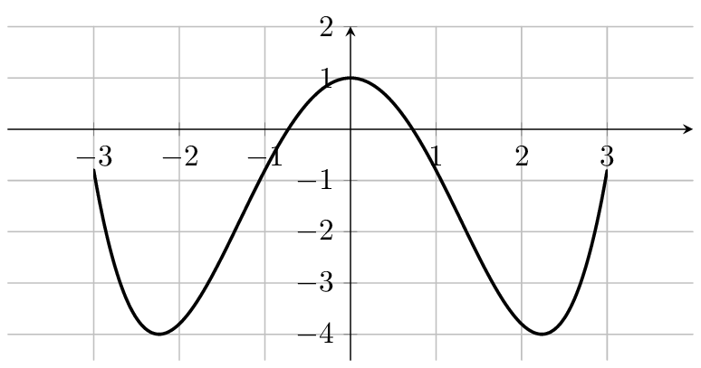
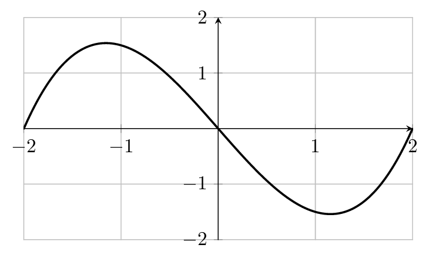

----

::: {.bloc .def}
Définition : 

On dit qu'un ensemble $E$ de $\mathbb{R}$ est centré en $a$ ou est symétrique par rapport à $a$ lorsque $a$ est le centre de l'ensemble $E$.
:::

::: {.bloc .ex}

Exemple :   

* Les intervalles centrés en $a$ sont de la forme $[a-r \,;\, a+r]$. 
    * C'est l'ensemble des réels solutions de $|x-a| \leqslant r$.
    * Ainsi, les intervalles centrés de la forme $]-r \,;\, r[$ sont centrés en $0$.
* Soit $r>0$, alors les ensembles de la forme $]-\infty \,;\, -r[ \cup ]r \,;\, +\infty[$ sont centrés en $0$.
* L'intervalle $[8 \,;\, 12]$ est centré en $10$.
:::

::: {.bloc .def}
Définition : 

Soit $f$ une fonction définie sur un ensemble $I$ centré en $0$.

1. On dit qu'une fonction est paire lorsque : $\forall x \in I, \, f(x) = f(-x)$
2. On dit qu'une fonction est impaire lorsque : $\forall x \in I, \, f(-x) = -f(x)$
:::

::: {.bloc .ex}

Exemple :   

* La fonction $f: x \longmapsto \dfrac{-2}{1+x^2}$ est définie sur $\mathbb{R}$ qui est centré en $0$.  
C'est une fonction paire, en effet,  
$\forall x \in \mathbb{R}$, $$f(-x) = \dfrac{-2}{1+(-x)^2} = \dfrac{-2}{1+x^2} = f(x).$$
* La fonction $f: x \longmapsto \dfrac{x^2+1}{x}$ est définie sur $\mathbb{R}^*$, qui est centré en $0$.  
Cette fonction est une fonction impaire, en effet,  
$\forall x \in \mathbb{R}^*$, $$f(-x) = \dfrac{(-x)^2+1}{-x} = -\dfrac{x^2+1}{x} = -f(x)$$
:::

::: {.bloc .rem}
Remarque : 

1. Si $f$ est impaire et que $0 \in I$, alors $f(0) = 0$.  
Cependant, une fonction paire comme une fonction impaire peut ne pas être définie en $0$.  
En effet, les fonctions $f$ et $g$ définies sur $]-\infty \,;\, -2[ \cup ]2 \,;\, +\infty[$ par
$$f(x) = \dfrac{1}{\sqrt{x^2-4}} \quad \text{et} \quad g(x) = \dfrac{x}{\sqrt{x^2-4}}$$
ne sont pas définies en $0$ et sont respectivement paire et impaire.

2. Une fonction peut être ni paire ni impaire, par exemple la fonction $f: x \longmapsto x+1$ n'est ni l'une ni l'autre.
:::

::: {.bloc .thm}
Propriété : 

Toute fonction se décompose comme somme d'une fonction paire et d'une fonction impaire.
$$f = i + p \quad \text{où} \quad i(x) = \dfrac{f(x) - f(-x)}{2} \quad \text{et} \quad p(x) = \dfrac{f(x) + f(-x)}{2}.$$
:::

Démonstration : 

voir chapitre Les Raisonnements

### Parité et représentation graphique

::: {.bloc .thm}
Propriété : 

Soit $f$ une fonction définie sur un ensemble $E$ centré en $0$.

1. $f$ est paire si et seulement si $\mathscr{C}_f$ admet l'axe des ordonnées comme axe de symétrie.
2. $f$ est impaire si et seulement si $\mathscr{C}_f$ admet l'origine comme centre de symétrie.
:::

Démonstration : 

Soit $f$ une fonction définie sur un ensemble $E$ centré en $0$. On note $\mathscr{C}_f$ sa représentation graphique.

1. $f$ est paire si et seulement si pour tout $x \in E$, $f(x) = f(-x)$ si et seulement si pour tout $x \in E$, les points $M(x; f(x))$ et $M'(-x; f(-x))$ sont symétriques par rapport à l'axe des ordonnées, ce qui équivaut à dire que $\mathscr{C}_f$ admet l'axe des ordonnées comme axe de symétrie.

2. $f$ est impaire si et seulement si pour tout $x \in E$, $f(x) = -f(-x)$ si et seulement si pour tout $x \in E$, les points $M(x; f(x))$ et $M'(-x; f(-x))$ sont symétriques par rapport à l'origine du repère, ce qui équivaut à dire que $\mathscr{C}_f$ admet l'origine du repère comme centre de symétrie.

::: {.bloc .ex}

Exemple :   

:::: {layout-nw="[[1,1]]"}
::: {#first-column}
La fonction $f$ définie par $f(x) = \dfrac{1}{5}x^4 - 2x^2 + 1$ a sa représentation graphique symétrique par rapport à l'axe des ordonnées.  
Elle est donc paire.
:::

::: {#second-column}
La fonction $f$ définie par $f(x) = \dfrac{1}{2}x^3 - 2x$ a sa représentation graphique symétrique par rapport à l'origine.  
Elle est donc impaire.
:::
::::

  
  

:::

  <a class="prev" href="historique.html">⬅️</a>
  <a class="next" href="composee.html">➡️</a>

