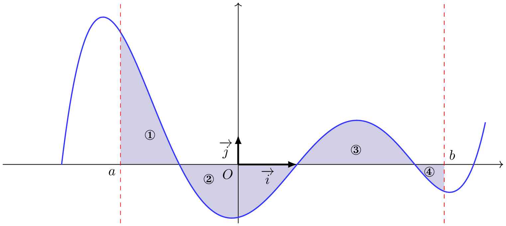
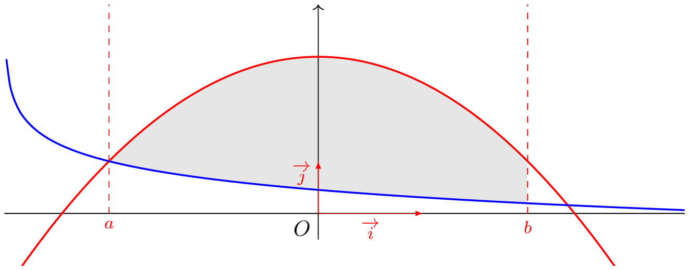
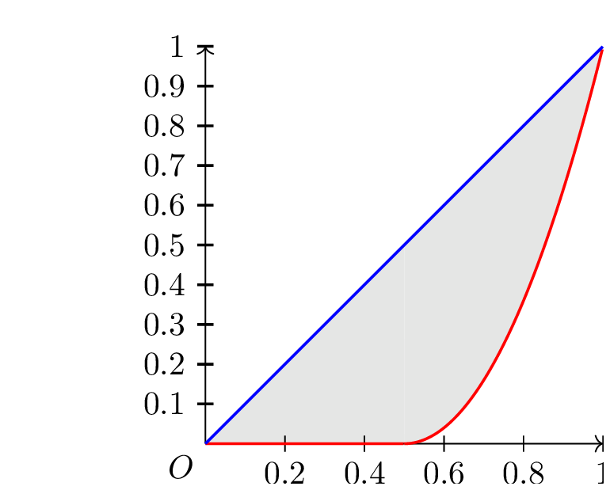
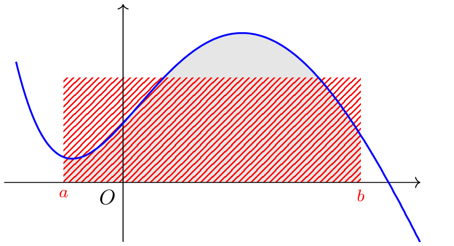

## Aire sous la courbe

::: {.bloc .thm}
Propriété : 

Soit $f$ une fonction continue sur $[a \, ; \, b]$. On note $\mathscr{A}$ l'aire de la partie du plan délimitée par le graphe de $f$, l'axe des abscisses et les droites d'équations $x=a$ et $x=b$. Alors

- Si  $f \geqslant 0$ sur $[a\, ; \, b]$, $\mathscr{A}= \int_a^b f(t) \dd t$
- Si  $f \leqslant 0$ sur $[a\, ; \, b]$, $\mathscr{A}= -\int_a^b f(t) \dd t$

:::

Démonstration : 

Voir la discussion de D. Perrin

::: {.bloc .rem}
Remarque : 

Une autre façon de calculer l'aire sous la courbe est de calculer $$\int_a^b \abs{f(t)} \dd t$$

:::

::: {.bloc .ex}

Exemple :   

  

$$
 \int_a^b \abs{f(x)} \dd x = 
\mbox{aire}\left(\mathcal{D}_1\right)
-\mbox{aire}\left(\mathcal{D}_2\right)
+\mbox{aire}\left(\mathcal{D}_3\right)
-\mbox{aire}\left(\mathcal{D}_4\right)
$$

:::

::: {.bloc .ex}

Exemple :   (Extrait Bac Polynésie 2010)

On considère la fonction $f$ définie par $f(t) = (t-1)\e^{1-t}$ sur $[0 \, ; \, +\infty[$.

1. Déterminer une primitive de $f$.

Afficher la correction :

$f$ est continue sur son ensemble de définition, elle y admet donc des primitives. Soit $F$ celle s'annulant en $0$, alors $$F(x)= \int_0^x f(t) \dd t$$
On pose : 

<table style="border-collapse:collapse; margin:auto;">
<tr>
<td style="border:1px solid black; padding:6px;">$u(t) = t - 1$</td>
<td style="border:1px solid black; padding:6px;">$u'(t) = 1$</td>
</tr>
<tr>
<td style="border:1px solid black; padding:6px;">$v'(t) = \e^{1 - t}$</td>
<td style="border:1px solid black; padding:6px;">$v(t) = - \e^{1 - t}$</td>
</tr>
</table>

Toutes les fonctions étant continues car dérivable sur $[1~;~+ \infty[$, on a par intégration par parties :

$$
\begin{aligned}
F(x) &= \left[-(t-1)\e^{1 - t}  \right]_1^x - \int_1^x
-\e^{1 - t}\dd t \\
&= \left[- (t - 1)\e^{1 - t}  \right]_{1}^x - \left[\e^{1 - t} \right]_{1}^x \\
&= \left[-t \e^{1 - t} \right]_{1}^x\\
&= - x\e^{1 - x} - (1\e^0) \\
&= 1 -  x\e^{1 - x}.
\end{aligned}
$$

2. Déterminer l'aire de la partie du plan plan délimitée entre la représentation graphique de $f$, l'axe des abscisses et les droites d'équations $x=0$ et $x=a$

Afficher la correction :

Cette fonction est négative sur $[0 \, ; \,1]$ et positive sur $[1 \, ; +\infty[$. 
On cherche à déterminer l'aire sur $[0 \, ; \, a]$, où $a >1$. On a d'après la relation de Chasles 
$$\int_0^a f(t) \dd t =\int_0^1 f(t) \dd t + \int_1^a f(t) \dd t $$
Donc en notant $\mathscr{A}(a)$ l'aire de la partie du plan délimitée entre la représentation graphique de $f$, l'axe des abscisses et les droites d'équations $x=0$ et $x=a$, on a $$\mathscr{A}(a) = -\int_0^1 f(t) \dd t + \int_1^a f(t) \dd t $$
D'après la question précédente, on déduit que 

$$
\begin{aligned}
\mathscr{A}(a) &= -(F(1)-F(0)) + (F(a)- F(1)) \\
&= -2F(1) + F(0) + F(a) \\
&= -2(1 - 1 \e^0) + (1- 0 \e^{-1} ) + (1- a \e^{1-a}) \\
&= 2 - a \e^{1-a}
\end{aligned}
$$

3. Que peut-on dire de cette aire lorsque $a \rightarrow +\infty$ ?

Afficher la correction :

Pour tout réel $a> 1$, $2-a\e^{1-a} = 2 - (1-a)\e^{1-a} + \e^{1-a}$
Or $\lim_{a \to + \infty} 1-a=-\infty$ et $\lim_{y \to -\infty} y \e^y = 0$, donc par composition $\lim_{a \to +\infty}(1-a) \e^{1-a} = 0$. 
De plus $\lim_{a \to + \infty}  \e^{1-a} b=0$. 
On déduit que $\lim_{a \to + \infty} \mathscr{A}(a) = 2$. 
Ainsi, l'aire est finie.

:::

## Aire entre deux courbes

::: {.bloc .thm}
Propriété : 

Soit $f$ et $g$ deux fonctions continues sur un intervalle $[a~;~b]$. 
On suppose que pour tout $x \in [a~;~b],~f(x) \leqslant g(x)$. 
Alors l'aire comprise entre les deux courbes et les droites d'équation $x=a$ et $x=b$ est $$\int_a^b g(x) \dd x - \int_a^b f(x)~ \dd x = \int_a^b (g(x)-f(x))~ \dd x$$

:::

::: {.bloc .rem}
Remarque : 

Il n'est pas nécessaire que les fonctions $f$ et $g$ soient positives. 
L'unique condition est que la représentation graphique de l'une soit toujours au-dessus de celle de l'autre.

:::

::: {.bloc .ex}

Exemple :   

On considère les fonctions $f$ et $g$ définies sur $ ]-3~;~+\infty[$ par $$f(x) = -\frac{1}{2}\ln (x + 3) + 1~~~~~~et~~~~~~g(x) =-0.5x^2+3$$
On montre, en étudiant les variations de $g-f$  sur $[-2~;~2]$, que pour tout $x \in[-2~;~2]$, $g(x) \geqslant f(x)$. 

Ainsi l'aire comprise entre les deux courbes, et les droites d'équations $x=-2$ et $x=2$ est donné, en unité d'aire, par 

$$
\int_{-2}^2 -\frac{1}{2}x^2+3 +\frac{1}{2}\ln(x+3) -1 \dd x
$$

  

:::

::: {.bloc .ex}

Exemple :   L'indice de Gini

Dans une région française, la répartition de l'impôt sur le revenu dans l'ensemble des loyers fiscaux est modélisée par la fonction $f$ telle que 

$$f(x) = \left\{\begin {array}{l}0~;~x \in [0~;~0,5]\\
4x^2-4x+1~;~x \in[0,5~;~1]\end{array} \right.$$
La représentation graphique de la fonction est une courbe de Lorenz. 
On mesure la concentration de l'impôt par l'indice de Gini $$\gamma = 2 \mathscr{A}$$
Où $\mathscr{A}$ est l'aire comprise entre les droites d'équations $y=x$, $x=0$, $x=1$ et la représentation graphique de la fonction $f$.
  Détermienr l'indice de Gini correspondant

Afficher la correction :

  

$$
\mathscr{A} = \int_0^1 x-f(x)\dd x
$$

La fonction $x \longmapsto x- f(x)$ est continue sur $[0~;~1]$, donc y admet des primitives. 
De plus pour tout $x \in [0~;~1],~~x \geqslant f(x)$. 
(Sinon la représentation graphique de $f$ ne serait pas une courbe de Lorenz). 
Ainsi $\mathscr{A}$ est l'aire comprise entre les deux courbes et les droites d'équations $x=0$ et $x=1$. 
On déduit de la relation de Chasles que :

$$
\mathscr{A} = \int_0^{0.5} (x-f(x))\dd x + \int_{0.5}^1 (x-f(x))
$$

Or sur $[0~;~0,5]$, $f(x) = 0$. 
Donc 

$$
\mathscr{A} = \dd x = \int_0^{0.5} x-0\dd x +
 \int_{0.5}^1 (x-f(x))\dd x
$$

Soit $h(x) = x-f(x) = -4x^2+5x -1$. 
$h$ étant continue, elle admet des primitives sur $[0,5~;~1]$. 
 Soit $H$ une de ses primitives, alors 
 $$H(x) = -\frac{4}{3}x^3 + \frac{5}{2}x^2-x$$
 Ainsi 
 
 $$\mathscr{A} = \dfrac{1}{2}0.5^2 -\frac{1}{2}0 + H(1) - H(0.5) = \dfrac{1}{3}$$
Donc 

$$\gamma = 2 \mathscr{A} = \frac{2}{3} \approx 0.667$$

 
:::
	 

## Valeur Moyenne

::: {.bloc .def}
Définition : 

Soit $f$ une fonction continue sur un intervalle $\left[ a ~;~ b \right]$ de $\R$. 
On appelle valeur moyenne de $f$ sur $\left[ a ; b \right]$ le réel $\mu = \dfrac{1}{b-a}\displaystyle\int_{a}^{b}f(x)\dd x$

:::

**Interprétation graphique :** 
Dans le cas où $f$ est une  fonction  continue et positive sur $[a;b]$. 
L'aire du domaine compris entre la courbe $\mathcal{C}_f$, l'axe des abscisses et les droites d'équation $x=a$ et $x=b$ est égale à l'aire du rectangle de côtés $\mu$ et $b-a$

  

 

::: {.bloc .ex}

Exemple :   Valeur moyenne du bénéfice

Le bénéfice, en milliers d'euros, qui à une production de $q$ kg de produit est donné par la fonction $f$ définie sur $[0~;~2]$ par $f(q) = -3q^2+6q-1.5$. 
Cette fonction étant un polynôme, alors elle admet des primitives sur $[0~;~2]$. 
Dé"termienr la valeur moyenne du bénéfice.

Afficher la correction :

Soit $F$ l'une d'entre elles, $F(x)= -q^3+3q^2-1.5q$. 
Ainsi la moyenne des bénéfices est donnée par $m = \dfrac{1}{2-0} \int_0^2 f(q) \dd q = 0.5$. 
Ainsi la valeur moyenne du bénéfice de $0$ à $2$ kg est de $500$ euros. 

::: {.bloc .rem}
Remarque : 
Il ne faut pas confondre le bénéfice moyen $\dfrac{f(q)}{q}$ et la moyenne du bénéfice !!

:::

:::