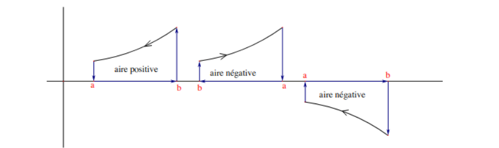
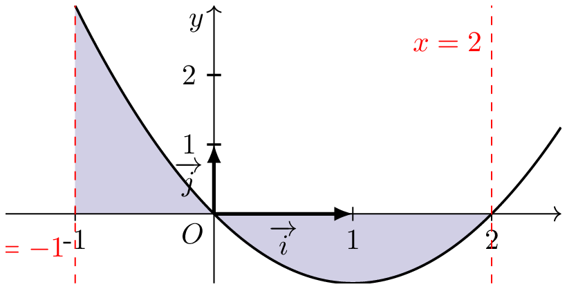

# Définition et discussion
## Définittion 

:::{.bloc .def}

Définition : 

Soit $f$ une fonction continue sur un intervalle $[a \, ; \, b]$.  
Soit $F$ une primitive de $f$, alors  
$$
\int_a^b f(t)\,\dd t = F(b) - F(a)
$$

:::

::: {.bloc .rem}

Remarque : 

- La définition est cohérente avec la définition donnée pour les fonctions continues positives ;
- les $:=$ indique qu'il s'agit d'une définition : on définit l'intégrale de $a$ à $b$ de $f(x) \dd x$ comme étant la différence de $F(b)$ et $ F(a)$ ;
- la fonction $F:x \mapsto \int_a^x f(t) \dd t $ est une primitive de $f$ s'annulant en $a$.
  
:::

::: {.bloc .ex}

Exemple :   

Soit $$I=\int_{-2}^2 \frac{2x}{(x^2-6)^2} \dd x$$

On remarque d'abord que la fonction à intégrer est parfaitement continue sur $[-2 \, ; \ 2]$. 
De plus $f=\dfrac{u'}{u^2}$ où $u(x)= x^2-6$ et $u'(x)= 2x$. 
Ainsi $F = - \dfrac{1}{u}$. 
On déduit alors que 
$$I= \left[- \frac{1}{x^2-6}\right]_{-2}^2 = - \frac{1}{4-6} - \frac{-1}{(-2)^2 - 6} = \frac{1}{2} - \frac{1}{2} = 0$$

:::

## Discussion sur la définition (D. Perrin)
::: {.bloc .rem}
On peut donner une justification supplémentairement de la définition ci-dessus
en voyant l’intégrale comme une aire \og orientee \fg.  

- On considère une fonction continue définie sur sur un intervalle $I$, de
signe constant, mais pas nécessairement positive, et deux points $a, b \in I$ (on ne
suppose pas $a<b$). 
- On considère son hypographe $H$ et le bord orienté $\partial H $
qui est la courbe fermée simple constituée du segment $[a, b]$, mais parcouru de
$a$ vers $b$, puis du segment vertical qui va de $(b, 0)$ à $(b, f (b))$, puis du graphe
de $f$ allant jusqu’à $(a, f (a))$ puis du segment vertical qui joint ce point à
$(a, 0)$.  

L’intégrale $\int_a^b f(t) \dd t$ sera alors l’aire de l’hypographe, mais comptée
positivement (resp. négativement) si $\partial H$ tourne dans le sens trigonométrique
(resp. dans le sens des aiguilles d’une montre). En particulier, l’aire sera
négative si on a $a < b$ et $f \leqslant  0$ ou $a > b et f \geqslant 0$.  
 
 
Examinons ces deux cas
et montrons que l’intégrale est encore donnée par la formule $F (b) - F (a)$ où
$F$ est une primitive de $f$ . 

- Si on a $a < b$ et $f$ négative :  
  l’aire de l’hypographe, en valeur absolue est
la même que celle de l’hypographe de $-f$ en vertu de l’invariance de l’aire
par symétrie. Notons $\alpha$ cette aire. Si $F$ est une primitive de $f$ , $-F$ en est une
de $-f$ et on a $\alpha = (-F )(b) - (F- )(a)$. 
Comme l’intégrale,
par convention, doit être négative, c’est bien $- \alpha = F (b) - F (a)$.
- Si maintenant on a $a > b$, mais $f \geqslant 0$, c’est l’intégrale de $b$ à $a$ qui est
positive et vaut $F (a) - F (b)$. Comme l’intégrale de $a$ à  $b$ correspond à la
même aire, comptée négativement, c’est donc encore $F (b) - F (a)$. 
[ Lien cours Perrin ](https://www.imo.universite-paris-saclay.fr/~perrin/CAPES/analyse/inte%CC%81grales-e%CC%81qua-diff/primitives-et-integrales.pdf)
:::

  

::: {.bloc .ex}

Exemple :   

Déterminons l'intégrale $\int_{-1}^2 x^2-2x  \dd x$. 
Une primitive de $f:x \longmapsto x^2-2x $ est la fonction $F$ définie par $F(x)= \frac{1}{3}x^3 -x^2$. 
Ainsi 
$$\int_{-1}^2  f(x) \dd x =
 \left[F(x) \right]_{-1}^2 = F(2) - F(-1) = \frac{8}{3} - 4 -1 - (-  \frac{1}{3}   + 2 ) = 0 $$

  

Interprétation : 
On a ainsi $F(2)=-F(-1)$. 
On peut donc déduire que l'aire entre la courbe, l'axe de abscisses et les droites d'équation $x=-1$ et $x=0$ est égale l'aire entre la courbe, l'axe de abscisses et les droites d'équation $x=0$ et $x=2$

:::