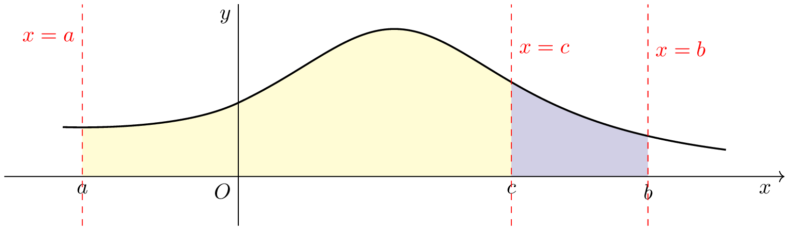
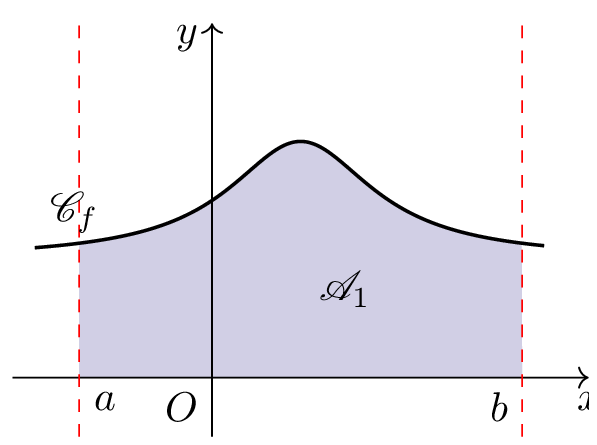
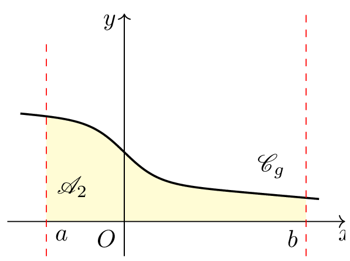
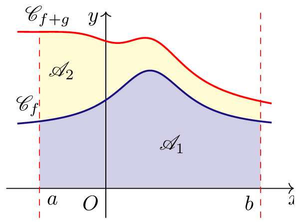
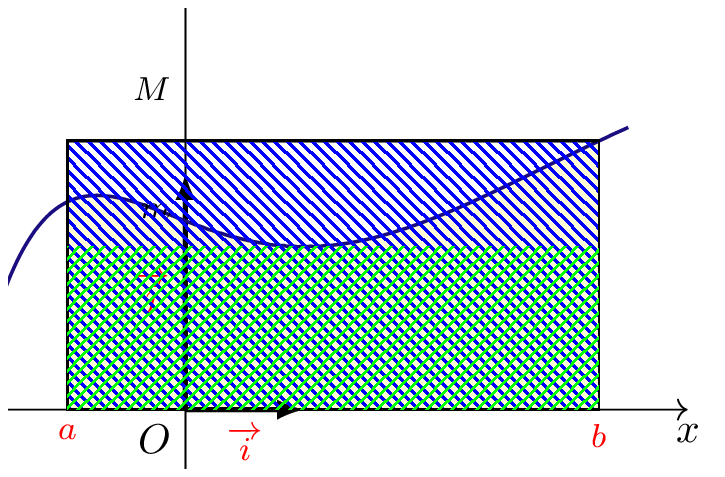

## Propriétés \og vectorielles \fg

::: {.bloc .thm}
Propriété : 

Soit $f$ une fonction continue sur un intervalle $I$.

- $\forall a \in I, \,\int_a^a f(t) \dd t = 0$
- $\forall a, b \in I, \, \int_a^b f(t) \dd t=-\int_b^a f(t) \dd t$
- **Relation de Chasles** : $\forall a,b,c \in I, \, \displaystyle\int_{a}^{b}f(t)\dd t = \displaystyle\int_{a}^{c}f(t)\dd t + \displaystyle\int_{c}^{b}f(t)\dd t$

:::

Démonstration : 

Donnons par exemple la preuve de la relation de Chasles .  
Soit $F$ une primitive de $f$ sur $I$ Pour tous réels $a$, $b$ et $c$ appartenant à $I$ 

$$
\begin{split} 
\displaystyle\int_{a}^{c} f(t)\dd  t+ \displaystyle\int_{c}^{b} f(t)\dd t
&=\left(F(c)-F(a)\right)+\left(F(b)-F(c)\right)\\
&=F(b)-F(a)\\
&= \displaystyle\int_{a}^{b}f(t)\dd  t
\end{split}
$$

**Illustration graphique de la relation de Chasles**

  

::: {.bloc .rem}
Remarque : 

On parle de relations vectorielles pour le lien avec les vecteurs : $$\ve{AA}=\ve{0} \, ; \, \ve{AB} = - \ve{BA} , \, , \ve{AB} = \ve{AC} + \ve{CB}$$

:::

::: {.bloc .ex}

Exemple :   

On a montré précédemment que $\int_{-1}^2  f(x) \dd x = 0$.  
D'après la relation de Chasles 

$$\int_{-1}^2  f(x) \dd x = \int_{-1}^0 f(x) \dd x  + \int_0^2 f(x) \dd x$$

Or 

$$ \int_{-1}^0 f(x) \dd x = F(0) - F(-1) = 2 \quad \text{et} \quad  \int_0^2 f(x) \dd x = F(2) - F(0) = -2$$

Ainsi l'aire entre la représentation graphique de la fonction $f$, l'axe des abscisses et les droites d'équations $x=-1$ et $x=0$ est la même que l'aire entre la représentation graphique de $-f$, l'axe des abscisses et les droites d'équation $x=0$ et $x=2$

:::

---

## Linéarité de l'intégrale

::: {.bloc .thm}
Propriété : 

Soit $f$ et $g$ deux fonctions continues sur un intervalle $[a~;~b]$ de $\R$ et $k \in \R$.

$$
\displaystyle\int_{a}^{b}\left({f(t)+g(t)}\right)\dd t
=
\displaystyle\int_{a}^{b}f(t)\dd t
+
\displaystyle\int_{a}^{b}g(t)\dd  t
\qquad
\text{et}
\qquad
\displaystyle\int_{a}^{b} kf(t) \dd t
=
k \displaystyle\int_{a}^{b}f(t)\dd t
$$

:::

Démonstration : 

Soit $F$ et $G$ deux primitives respectives des fonctions $f$ et $g$ sur $I$ et $k$ un réel. 
Alors $F+G$ et $kF$ sont des primitives respectives sur $I$ de $f+g$ et de $kf$.

$$
\begin{aligned} 
\int_{a}^{b}\left({f(t)+g(t)}\right)\dd t 
&= \Bigl[(F+G)(t)\Bigr]_{a}^{b}\\
&=\left(F(b)+G(b)\right)  -\left(F(a)+G(a)\right)\\
&=\left(F(b)-F(a)\right)  +\left(G(b)-G(a)\right)\\
&=\int_{a}^{b}f(t)\dd t + \int_{a}^{b}g(t)\dd t
\end{aligned}
$$

$$
\int_{a}^{b} kf(t)\dd  t
=
k\left(F(b)-F(a)\right)
=
k\displaystyle\int_{a}^{b}f(t)\dd  t
$$

(Le reste du document continue exactement avec la même structure, tous les blocs correctement fermés.)

::: {.bloc .rem}

**Interprétation graphique linéarité :**

  
  
  

Alors $\int_a^b f(t)+g(t) \dd $ est la somme des aires comprises sous les courbes représentatives des fonctions $f$ et $g$.
:::

::: {.bloc .ex}

Exemple :   

Soit $f$ et $g$ deux foncions continues vérifiant $\int_0^1 f(x) \dd x = 1$ et $\int_0^1 g(x) \dd x = 2$, alors 

$$\int_0^1 (5f(x)-3 g(x)) \dd x  = 5 \int_0^1 f(x) \dd x - 3 \int_0^1 g(x) \dd x = 5 - 6 = -1$$

:::

::: {.bloc .ex}

Exemple :   

On souhaite calculer $I=\int_0^1 \dfrac{1}{\e^x+1} \dd x$

1. Calculer $J=\int_0^1 \dfrac{\e^x}{1+\e^x} \dd x$
   

Afficher la correction :

En posant $u(x)=1+\e^x$, on a $u'(x)= v\e^x$, donc $\dfrac{\e^x}{1+\e^x} = \dfrac{u'(x)}{u(x)}$. 
Donc $$\int_0^1 \dfrac{\e^x}{\e^x+1} \dd x= \left[\ln \left(\e^x + 1\right) \right]_0^1 = \ln(\e+1)-\ln 2 = \ln \left(\frac{\e+1}{2} \right)$$

2. En déduire la valeur de $I$

Afficher la correction :

On a 

$$I+J = \int_0^1 \dfrac{1}{\e^x+1} \dd x + \int_0^1 \dfrac{\e^x}{1+\e^x} \dd x = \int_0^1 \dfrac{1+ \e^x}{\e^x+1} \dd x = \int_0^1 1 \ dd x = [x]_0^1 = 1$$

D'où 

$$I=(I+J)-J = 1 - \ln \left(\dfrac{\e+1}{2} \right)$$

:::

_______
## Ordre et Inégalité 

::: {.bloc .thm}
Propriété : 
Soit $f$ une fonction continue sur un intervalle $[a~;~b]$ $$\forall x  \in [a~;~b],~ f(x) \geqslant 0 \Longrightarrow  \displaystyle\int_{a}^{b}f(t)\dd t \geqslant 0$$
:::

Démonstration : 

Il s'agit d'un calcul d'aire, et une aire a une mesure positive

::: {.bloc .rem}
Remarque : 
La réciproque est fausse.  
Soit $f$ la fonction définie sur $\R$ par $f(x)=2x-x^2+1$.  
 Cette fonction est continue sur $\R$ comme fonction polynôme, elle y admet donc des primitives.
  
Soit $F$ l'une d'elle, 

$$F(x) = -\frac{1}{3}x^3+x^2+x$$
Ainsi 

$$\int_{0}^{3} 2x-x^2+1~ \dd x = F(3) - F(0) = (-9 + 9 + 3 ) - 0 = 3$$
Or 
$f(3) = -2$

:::

::: {.bloc .thm}
Propriété : 

Soit $f$ et $g$ deux fonctions continues sur $[a~;~b]$.\\
$$\forall x \in \left[ a ; b \right], \, f(x) \leqslant g(x) \Longrightarrow \displaystyle\int_{a}^{b}f(x)\dd x \leqslant \displaystyle\int_{a}^{b}g(x)\dd x$$
:::

Démonstration : 

Si pour tout réel $x$ appartenant à $\left[ a~;~ b \right]$, $f(x) \leqslant g(x)$, alors $g(x)-f(x) \geqslant 0$.  
Comme $f$ et $g$ sont deux fonctions continues sur $\left[ a ~;~b \right]$, la fonction $g-f$ est continue sur $\left[ a ; b \right]$. 
De plus, sur $[a~;~b]$ , $g-f \geqslant 0$ alors 
	
$$\displaystyle\int_{a}^{b} (g-f)(x)\dd x \leqslant 0 \Leftrightarrow \displaystyle\int_{a}^{b} g(x)\dd x -  \displaystyle\int_{a}^{b} f(x)\dd x \leqslant 0
$$

::: {.bloc .ex}

Exemple :Obtention d'inégalité    

Soit $f$ la fonction définie par $f(x)= \ln x $

1. Démontrer que pour tout $x >0$, $f(x) \leqslant x-1$.
   

Afficher la correction :

La droite d'équation $y=x-1$ est une tangente à la représentation graphique de la fonction $f$ en $x=1$. 
La fonction $\ln$ étant concave elle est située sous chacune de ses tangentes, donc en particulier, $$\forall x >0, \, \ln x \leqslant x-1$$

2. On admet qu'une primitive de $f(x)$ est $F(x)= x \ln x - x$. 
Déduire de la question précédente que  $x \ln x \leqslant \frac{1}{2} x^2$

Afficher la correction :

On a pour tout $x \leqslant  1$, $$f(x) \leqslant x-1$$
donc $$\int_1^t f(x) \dd x \leqslant \int_1^t x-1 \dd x$$

donc 
$$t \ln t - t  +1 \leqslant \frac{1}{2} t^2 - t +\frac{1}{2}$$
D'où on déduit $$t \ln t\leqslant \frac{1}{2} t^2 - \frac{1}{2} \leqslant \frac{1}{2} t^2$$

::: {.bloc .rem}
Remarque : 
La réciproque est fausse. 

Considérons les fonctions $f$ et $g$  définies sur $\R$ par $f(x)=x^2-x-1$ et $g(x)=\dfrac{3x+1}{4}$.  
Ces fonctions sont continues sur $\R$, elles y admettent donc des primitives.
 
Soit $F$ et $G$ une de leur primitive respective, alors

$$F(x) = \dfrac{x^3}{3}-\dfrac{x^2}{2}-x~~\text{et}~~G(x) = \dfrac{3x^2}{8} + \dfrac{x}{4}$$

Ainsi

$$\begin{split} 
\displaystyle\int_{-1}^{3} x^2-x-1 \dd x & = F(3) - F(-1) \\
&=\left(9-\dfrac{9}{2}-3\right)-\left(\dfrac{-1}{3}-\dfrac{1}{2} +1\right)  \\
&=\dfrac{4}{3}\\
\end{split}$$
et 
$$\begin{split} 
\displaystyle\int_{-1}^{3} \dfrac{3x}{4} + \dfrac{1}{4} \dd x & = G(3) - G(-1) \\
&=\left(\dfrac{27}{8}+\dfrac{3}{4}\right)-\left(\dfrac{1}{8}-\dfrac{1}{4}\right)  \\
&=4
\end{split}$$

Donc   $$\displaystyle\int_{-1}^{3} f(x) \dd x \leqslant \displaystyle\int_{-1}^{3} g(x) \dd x$$
Mais on ne peut pas conclure que sur pour tout $x \in [-1~;~3]$, $f(x) \leqslant g(x)$. 

:::

:::

::: {.bloc .thm}
Propriété : 

Soit $f$ une fonction continue sur un intervalle $\left[ a ; b \right]$ de $\R$ ($a < b$ ). Soit $m$ et $M$ deux réels.
Si pour tout réel $x$ appartenant à l'intervalle $\left[ a ; b \right]$, $m \leqslant f(x) \leqslant M$, alors :
$$m \times (b-a) \leqslant \displaystyle\int_{a}^{b}f(x)\dd x \leqslant M \times (b-a)$$ 
:::

Démonstration : 

Les fonctions définies sur $\left[ a ; b \right]$ par $x \longmapsto m$ et $x \longmapsto M$ sont constantes donc continues.
Si pour tout réel $x$ appartenant à $\left[ a ; b \right]$ ($a < b$ ), $m \leqslant f(x) \leqslant M$, alors d'après la propriété de l'intégration d'une inégalité :
	$$\begin{split} 
\displaystyle\int_{a}^{b} m \;\dd x \leqslant \displaystyle\int_{a}^{b} f(x)\dd x \leqslant  \displaystyle\int_{a}^{b} M \;\dd x &\Leftrightarrow m\displaystyle\int_{a}^{b}  \dd x \leqslant \displaystyle\int_{a}^{b} f(x)\dd x \leqslant  M\displaystyle\int_{a}^{b} \dd x\\
&\Leftrightarrow m \times (b-a) \leqslant \displaystyle\int_{a}^{b}f(x)\dd x \leqslant M \times (b-a)
\end{split}$$

**Interprétation graphique :**
Soit $f$ est une  fonction  continue et positive sur $[a\,;\,b]$ 
L'aire du domaine compris entre la courbe $\mathscr{C}_f$, l'axe des abscisses et les droites d'équation $x=a$ et $x=b$ est comprise entre les aires des rectangles $R_1$ et $R_2$. 
Soit $m$ et $M$ respectivement le minimum et le maximum de la fonction sur $[a~;~b]$
$R_1$ de côtés $m$ et $b-a$ et$R_2$ de côtés $M$ et $b-a$.

  

::: {.bloc .ex}

Exemple :   

Afficher la correction :

:::

::: {.bloc .ex}

Exemple :   

On considère la suite $(u_n)$ définie par $I_n=\int_1^2 \frac{1}{(1+x^2)^n} \dd x$. 

1. a) Etudier le sens de variation de la suite $(I_n)$

Afficher la correction :

Pour tout $n \geqslant 0$,

$$
\begin{aligned}
I_{n+1} - I_n 
&= \int_1^2 \frac{1}{(1+x^2)^{n+1}} \dd x - \int_1^2 \frac{1}{(1+x^2)^n} \dd x\\
&= \int_1^2 \frac{1}{(1+x^2)^{n+1}} - \frac{1}{(1+x^2)^n} \dd x \\
&= \int_1^2 \frac{-x^2}{(1+x^2)^n} \dd x
\end{aligned}
$$

Donc par linéarité de l'intégrale  
$I_{n+1} - I_n = - \int_1^2 \frac{x^2}{(1+x^2)^n} \dd x$. 

Or, pour tout $x \in [1 \, ; \, 2]$, $\frac{x^2}{(1+x^2)^n} \geqslant 0$, ainsi par positivité de l'intégrale, on déduit que $I_{n+1}-I_n \leqslant 0$, donc que la suite $(I_n)$ est décroissante.

   b) Montrer que la suite $(I_n)$ est convergente.

Afficher la correction :

On a pour tout $x \in [1 \, ; \, 2]$, $\frac{1}{(1+x^2)^n} > 0$, d'où par positivité $I_n > 0$. 
Ainsi la suite $(I_n)$ est décroissante minorée, elle est donc convergente.

2. Déterminer la limite de la suite $(I_n)$

Afficher la correction :

On a pour tout $x \in [1 \, ; \, 2]$, $2^n \leqslant 1+x^2 \leqslant 5^n$. 

$$
\frac{1}{(1+x^2)^n} \leqslant \frac{1}{2^n}
$$

D'où par passage à l'intégrale  

$$
I_n \leqslant \int_1^2 \frac{1}{2^n} \dd x = \frac{1}{2^n}
$$

Or $\frac{1}{2} \in ]0\, ; \,1[$, donc $\lim_{n \to +\infty} \frac{1}{2^n}=0$. 
Par théorème d'encadrement, on déduit que $\lim_{n \to +\infty} I_n =0$.

:::

