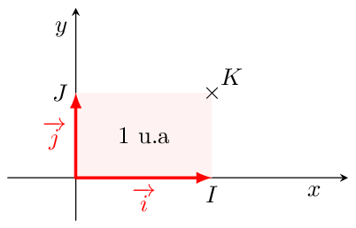
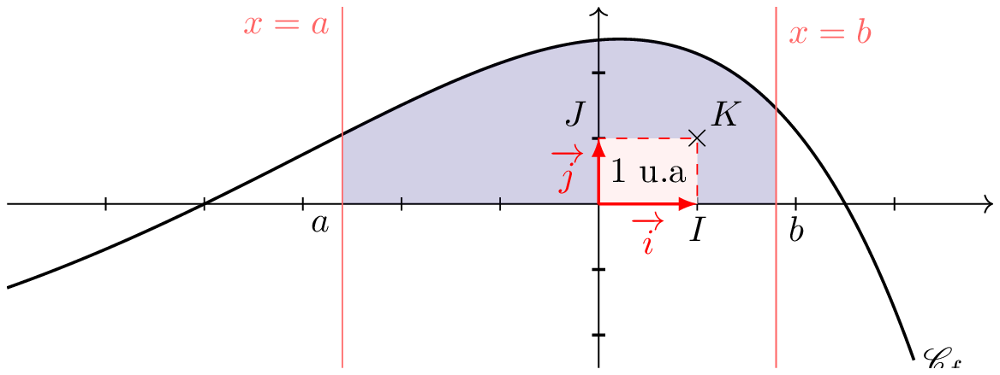
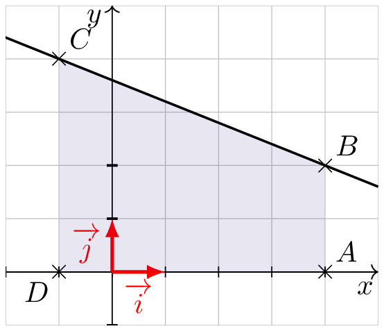
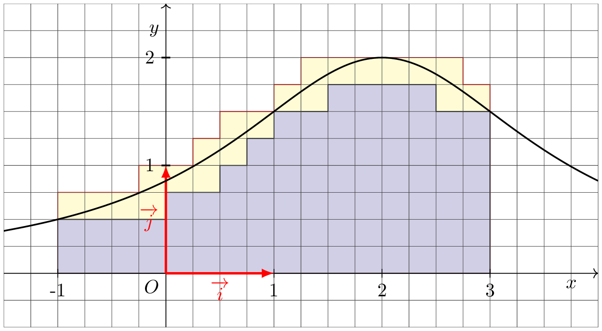
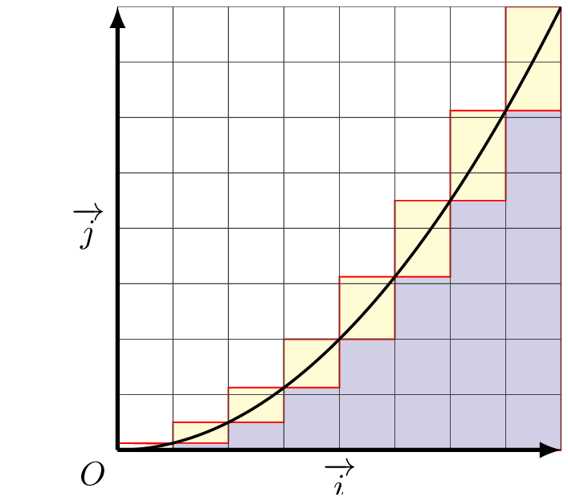

## Unité d'aire
Soit$ $\Oij$ un repère orthogonal du plan.   
L'unité d'aire, notée u.a, est l'aire du rectangle unitaire OIJK avec $\mathrm{I}(0\,;\,1)$, $\mathrm{J}(0\,;\,1)$ et $\mathrm{K}(1\,;\,1)$.

  

______

## Définition 

::: {.bloc .def}
Définition : 

Soit $f$ une fonction continue et positive sur un intervalle $[a \, ; \, b]$, et $\mathscr{C}_f$ sa représentation graphique dans un repère orthogonal $\OIJ$.
 

On appelle intégrale de $f$ entre $a$ et $b$ l'aire, exprimée en unité d'aire, du domaine délimité la courbe $\mathscr{C}_f$, l'axe des abscisses et les droites d'équations $x=a$ et $x=b$.  
Cette intégrale se note $$\int_{a}^{b}f(x)\dd x$$
On lit intégrale entre $a$ et $b$ de $f(x) \dd x$ ou plus simplement somme de $a$ à $b$ de $f(x)\dd x$
:::

Soit $\Oij$ un repère orthogonal du plan et $f$ une fonction continue et positive.  

  

- L'aire coloriée a pour valeur en unité d'aire $\int_a^b f(t)  \dd t$.
- L'unité d'aire est la surface du rectangle $OIKJ$.

::: {.bloc .rem}
Remarque : 

- Le nombre $\int_a^b f(x) \dd x$ ne dépend que de $a$, $b$ et $f$. $x$ est une variable muette.
- Les réels $a$ et $b$ sont appelés les bornes de l'intégrale $\displaystyle\int_{a}^{b}f(x)\dd x$.
- Comme pour les fonctions, le \og $x$ \fg est une variable muette (appelée variable d'intégration). On pourrait la remplacer par un $t$, ou un $v$.  
Ainsi $$\int_{a}^{b}f(x)\dd x = \int_{a}^{b}f(t)\dd t  = \int_{a}^{b}f(v)\dd v$$
- La méthode des rectangles (voir quadrature de la parabole) permet le calcul approché d'une intégrale. Elle légitime l'utilisation de $\int$ (un S allongé (notation de Leibnitz).  
L'approximation des aires est données par $\sum_{k=1}^n f(x_i) \Delta x_i$, où $\Delta x_i$ est la largeur des rectangles et $f(x_i)$ la hauteur.  
Le théorème sur les sommes de Riemann donne $$\lim_{x \to+ \infty} \frac{b-a}{n} \sum_{k=0}^n f \left(a+k\frac{b-a}{b}\right) = \int_a^b f(x) \dd x$$
- $\displaystyle\int_{a}^{a}f(x)\dd x = 0$, car le domaine $\mathcal{D}_f$ est alors réduit à un segment.
:::

::: {.bloc .ex}

Exemple :   

Calculons $\displaystyle\int_{-1}^{4} \left(-0,4x+3,6\right)\dd x$.  

Afficher la correction

La fonction affine $f$ définie pour tout réel $x$ par $f(x)= -0,4x+3,6$ est continue et positive sur l'intervalle $[-1 ; 4]$  
L'intégrale $\displaystyle\int_{-1}^{4} \left(-0,4x+3,6\right)\dd x$ est égale à l'aire du trapèze $ABCD$.
$$ \displaystyle\int_{-1}^{4} \left(-0,4x+3,6\right)\dd x  = \dfrac{\left( AD + BC\right)\times AB}{2}
 =\dfrac{\left( 4 + 2\right)\times 5}{2}
=15 $$

  

:::

::: {.bloc .ex}

Exemple :   Encadrement entre deux aires

Soit $f$ la fonction définie pour tout réel $x$ par $f(x)=\dfrac{6}{x^2-4x+7}$ dont la courbe $\mathcal{C}_f$ est représentée ci-dessous.  Déterminer un encadrement de l'intégrale  $\displaystyle\int_{-1}^{3} f(x) \dd x$.

  

Sur l'intervalle $[-1 ; 3]$, la fonction $f$ est continue et positive. L'intégrale  $\displaystyle\int_{-1}^{3} f(x) \dd x$ est égale à l'aire, en unités d'aire, du domaine  $\mathcal{D}_f$ compris entre la courbe $\mathcal{C}_f$, l'axe des abscisses et les droites d'équations $x=-1$ et $x=3$.

On peut déterminer un encadrement de l'intégrale  $\displaystyle\int_{-1}^{3} f(x) \dd x$ à l'aide du quadrillage. D'où l'encadrement $$\dfrac{75}{16} \leqslant \displaystyle\int_{-1}^{3} f(x) \dd x \leqslant 6$$

:::

::: {.bloc .rem}
Remarque : 

On peut aussi avoir recours à un logiciel de calcul formel ou à une calculatrice

- À l'aide de la calculatrice, on trouve $\displaystyle\int_{-1}^{3} \left(\dfrac{6}{x^2-4x+7}\right) \dd x \approx 5,44$.
- À l'aide d'un logiciel de calcul formel, on obtient  $\displaystyle\int_{-1}^{3} \left(\dfrac{6}{x^2-4x+7}\right) \dd x = \pi \sqrt{3}$.
- Il existe des intégrales que l'on ne sait pas calculer, et dont on peut donner que des valeurs approchées à l'aide de différentes méthodes (mais on est capable d'en majorer l'erreur, et donc de trouver une valeur approchée aussi proche que l'on veut : analyse numérique)
:::

___________

## Qudrature de la parabole

::: {.bloc .def}
Définition : 

On appelle quadrature de la parabole le calcul de l'aire de la surface délimitée par un segment de parabole et une droite.
:::

::: {.bloc .rem}
On va déterminer l'aire sous la parabole représentant la fonction carré sur $[0 \, ; \, 1]$.  
Pour cela (idée de Riemann), on va encadrer l'aire par deux séries de rectangles :

- On divise $[0\,;\, 1]$ en $n$ parties ;
- On note $S_n$ et $T_n$ les sommes de aires respectives des rectangles inférieurs et des rectangles supérieurs.  
La largeur de chaque rectangle est alors $1/n$, et la longueur respectivement $f(i/n)$ et $f((i+1)/n)$.

  

:::

~~~python
def f(x):
	 return x**2

def A(n):
	s,t=0,0
	for i in range(n):
		s=s+1/n*f(i/n)
		t=t+1/n*f((1+i)/n)
	return s,t
~~~
~~~{=html}

  

    
Qudrture parabole 

    <textarea id="code">
def f(x):
	 return x**2

def A(n):
	s,t=0,0
	for i in range(n):
		s=s+1/n*f(i/n)
		t=t+1/n*f((1+i)/n)
	return s,t
</textarea>
    
<pre></pre>

    

      <button class="btn" id="run" disabled></button>
      <button class="btn" id="check" disabled></button>
      <button class="btn" id="download"></button>
      <button class="btn" id="reset"></button>
      <button class="btn" id="clear"></button>
      <button class="btn" id="save"></button>
    

  

~~~
On obtient

~~~python
>>> A(100)
(0.32835000000000014, 0.33835000000000015)
>>> A(1000)
(0.3328335000000003, 0.3338335000000003)
>>> A(1000000)
(0.3333328333334962, 0.3333338333334962)
~~~

Il semble que les suites $(S_n)$ et $(T_n)$ convergent vers $\frac{1}{3}$

Démonstration : 

 
$S_n = \frac{1}{n} \sum_{k=0}^{n-1} f\left(\frac{i}{n}\right) = \frac{1}{n} \left(0^2+\frac{1^2}{n^2} + \frac{2^2}{n^2} + \dots + \frac{(n-1)^2}{n^2} \right)= \frac{1^2+2^2+\dots + (n-1)^2}{n^3}$
et 
$T_n = \frac{1}{n} \sum_{k=0}^{n-1} f\left(\frac{i+1}{n}\right) = \frac{1}{n} \left(\frac{1^2}{n^2} + \frac{2^2}{n^2} + \dots + \frac{n^2}{n^2} \right)= \frac{1^2+2^2+\dots + n^2}{n^3}$

On peut démontrer par récurrence que $$1^2+2^2+\dots + n^2 = \frac{n(n+1)(2n+1)}{6}$$
D'où
$$S_n = \frac{n(n-1)(2n-1)}{6} = \frac{2n^3-3n^2+1}{6n^3} = \frac{1}{3} - \frac{1}{2n} + \frac{1}{6n^2} \qquad et \qquad T_n = S_n + \frac{1}{n}$$
On déduit que $\lim_{n \to + \infty} S_n = \frac{1}{3}$ et donc $\lim_{n \to +\infty} T_n=\frac{1}{3}$. 

Or $S_n \leqslant \mathscr{A} \leqslant T_n$, par théorème d'encadrement $\mathscr{A}= \frac{1}{3}$.}

