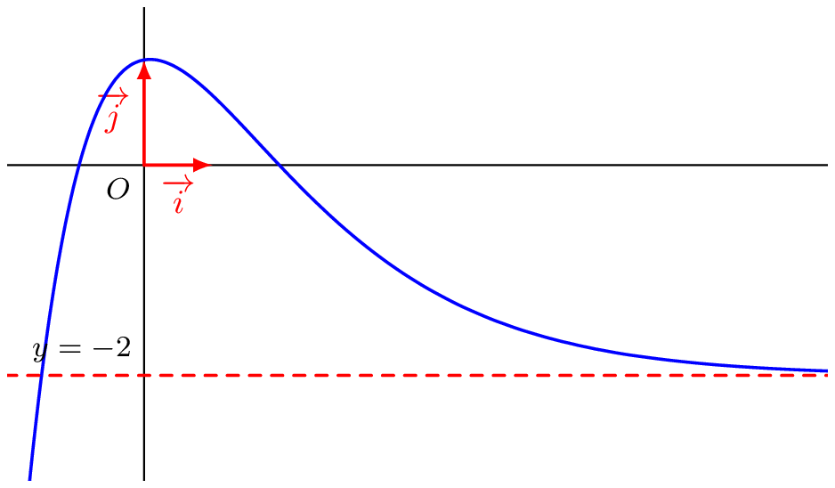
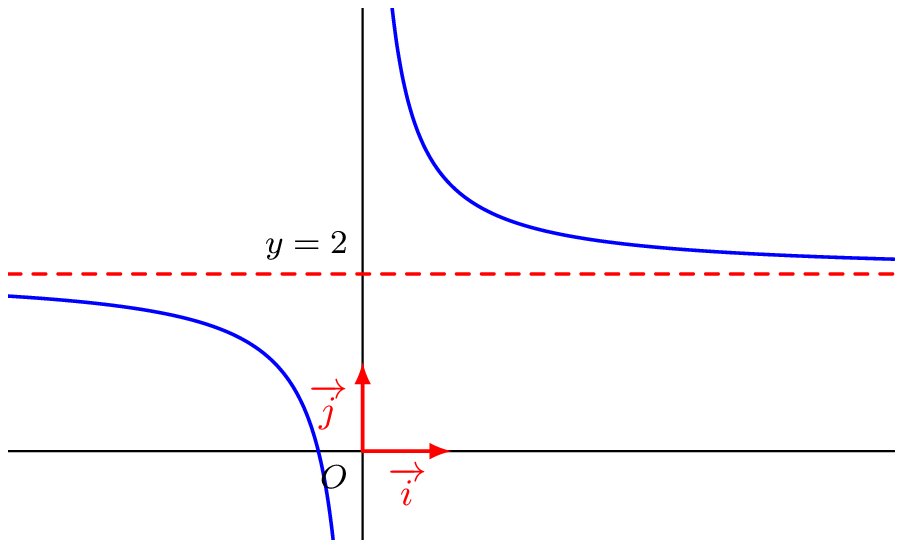
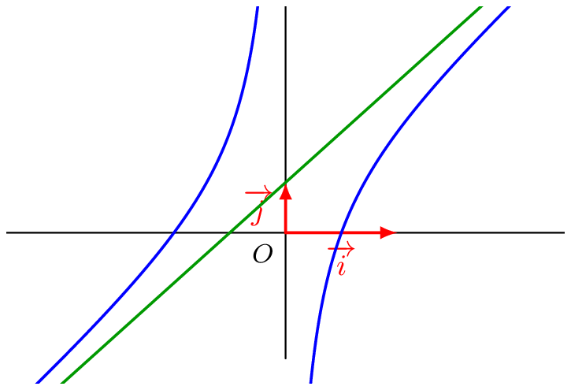

## Notion d'asymptote en l'infini
::: {.bloc .def}
Définition :  
Soient $f$ une fonction et $l \in \R$ tel que $\lim_{x \to +\infty} f(x) = l$ (resp. $\lim_[x \to - \infty} f(x)= l$)

La droite d'équation $y=l$ est une asymptote horizontale à la courbe représentative de la fonction $f$ au voisinage de $+\infty$ (resp. au voisinage de $-\infty$)
:::

::: {.bloc .ex}
Exemple : Asymptote horizontale

- Soit la fonction $f$ définie par $$f(x)=(2x+3)\e^{-0,63x}-2$$ dont on donne ci-dessous la représentation graphique.

  

On conjecture que $$\lim_{x \to + \infty} f(x) = -2$$
Donc que la droite d'équation $y=-2$ est une asymptote horizontale à $\mathscr{C}_f$ au voisinage de $+\infty$.

- Soit la fonction $f$ définie par $$f(x)=\frac{1}{x}+2$$ dont on donne ci-dessous la représentation graphique.

  

On a démontré que  $$\lim_{x \to \pm \infty} f(x) = 2$$
Donc que la droite d'équation $y=2$ est une asymptote horizontale à $\mathscr{C}_f$ au voisinage de $+\infty$ et au voisinage de $-\infty$.

:::

::: {.bloc .def}
Définition :  
Soient $f$ et $g$ deux fonctions définies sur $[a\,;\,+\infty[$. On dit que la représentation graphique de $g$ est asymptotique à la représentation graphique de $f$ (et réciproquement) au voisinage de $+\infty$ lorsque $$\lim_{x \to + \infty} \bigl(f(x)-g(x)\bigr)=0$$
:::

::: {.bloc .ex}
Exemple : Asymptote horizontale
On considère la fonction $f$ définie sur $\R^*$ par $f(x)= 2x+1- \dfrac{1}{x}$.

Pour tout réel $x$ non nul, $f(x)-(2x+1)= -\dfrac{1}{x}$.

Ainsi 
$$\lim_{x \to \pm \infty} \bigl(f(x)-(2x+1)\bigr) = \lim_{x \to \pm \infty} \left(-\dfrac{1}{x}\right) = 0$$

On conclut que la droite d'équation $y=2x+1$ est une asymptote oblique à la représentation graphique de $f$ au voisinage de $+\infty$ et de $-\infty$.

  

:::

 <a class="prev" href="limite_finie_infinie.html">⬅️</a>
  <a class="next" href="limite_en_a.html">➡️</a>

