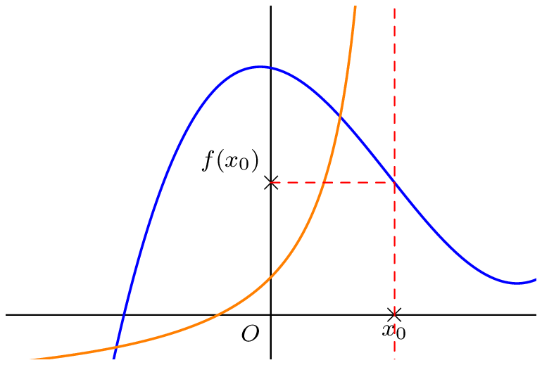

## Notion de limite en $x_0$

::: {.bloc .def}
Définition : 

Soit $x_0$ un réel fini. La limite d’une fonction $f$ en $x_0$ est la valeur vers laquelle $f(x)$ se rapproche quand $x$ se rapproche de $x_0$. On la note $$\lim_{x \to x_0} f(x)$$
:::

::: {.bloc }
On a deux cas de figure qui peuvent se présenter :

  

La limite est finie ou ne l'est pas ...

:::

___

## Cas particulier : Le nombre dérivé

::: {.bloc .rem}
On pose, pour tout $x \in D_f \setminus \{x_0\}$, 
$$\tau_{x_0}(x)=\dfrac{f(x)-f(x_0)}{x-x_0}$$
Ainsi, pour $f$ dérivable en $x_0$, on a 
$$f'(x_0) = \lim_{x \to x_0} \tau_{x_0}(x)$$
:::

::: {.bloc .ex}

Exemple :    

$$\lim_{x \to 0} \dfrac{\e^x-1}{x} = \exp'(0) = 1 \quad \text{ ; } \quad \lim_{x \to \dfrac{\pi}{2}} \dfrac{\cos(x)}{x-\dfrac{\pi}{2}} = \cos'\left(\dfrac{\pi}{2}\right) = -\sin\left(\dfrac{\pi}{2}\right) = -1$$

:::

## Limite finie d'une fonction
::: {.bloc .def}
Définition : 

Soit $f$ une fonction définie sur un intervalle $I$ et $x_0 \in I$.  
On dit que $f$ admet $l$ pour limite au voisinage de $x_0$ (ou en $x_0$) et on note $$\lim_{x \to x_0} f(x) = l$$
lorsque 
$$\forall \epsilon >0, \, \exists \delta >0, \, \forall x \in \mathbb{R}, \, (|x - x_0| \leqslant \delta \Rightarrow |f(x)-l| \leqslant \epsilon)$$
:::

::: {.bloc}

  

:::

::: {.bloc .rem}
 Remarque :  Comprendre la définition 

- l'inégalité $\abs{x-x_0} < \delta$ signifie que $x \in ]x_0-\delta \, ; \, x_0+\delta[$.
- l'inégalité $\abs{f(x)-l} < \epsilon$ signifie que $f(x) \in ]l-\epsilon \, ; \, l+\epsilon[$.
- L'ordre des quantificateurs est important. Le $\delta$ dépend du $\epsilon$.

Il s'agit de dire que si pour tout intervalle ouvert $J$ contenant $l$, il existe un intervalle ouvert $I$ contenant $x_0$, tel que $J$ contient tous les réels $f(x)$ pour $x \in I$.
:::

::: {.bloc .rem}

Donc si pour tout $x$ suffisamment proche de $x_0$, $f(x)$ est proche de $f(x_0)$, alors la limite de $f$ en $x_0$ est $f(x_0)$.
:::

 <a class="prev" href="limite_asymptote.html">⬅️</a>
  <a class="next" href="limite_en_a_proprite.html">➡️</a>

