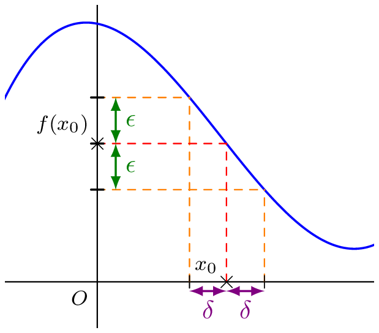
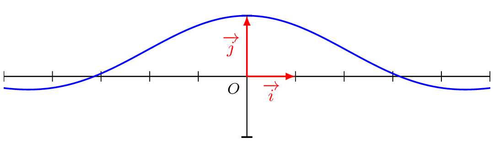
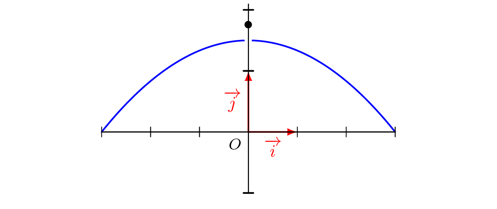

::: {.bloc .def}
Définition :  
Soit $f$ une fonction définie sur un intervalle $I$ et $x_0 \in I$.

On dit que $f$ admet $l$ pour limite au voisinage de $x_0$ (ou en $x_0$) et on note $$\lim_{x \to x_0} f(x) = l$$
lorsque 
$$\forall \epsilon >0, \, \exists  \delta  >0, \, \forall x \in \R, \, (\abs{x - x_0} \leqslant \delta  \Rightarrow \abs{f(x)-l} \leqslant \epsilon)$$
:::

::: {.bloc}

  

:::

::: {.bloc .rem}
 Remarque :  Comprendre la définition 

- l'inégalité $\abs{x-x_0} < \delta$ signifie que $x \in ]x_0-\delta \, ; \, x_0+\delta[$.
- l'inégalité $\abs{f(x)-l} < \epsilon$ signifie que $f(x) \in ]l-\epsilon \, ; \, l+\epsilon[$.
- L'ordre des quantificateurs est important. Le $\delta$ dépend du $\epsilon$.

Il s'agit de dire que si pour tout intervalle ouvert $J$ contenant $l$, il existe un intervalle ouvert $I$ contenant $x_0$, tel que $J$ contient tous les réels $f(x)$ pour $x \in I$.
:::

::: {.bloc .rem}

Donc si pour tout $x$ suffisamment proche de $x_0$, $f(x)$ est proche de $f(x_0)$, alors la limite de $f$ en $x_0$ est $f(x_0)$.
:::

## Propriétés

::: {.bloc .thm}
Propriété : Unicité de la limite 
Soit $f$ une fonction définie sur un intervalle $I$ et $x_0 \in I$. Si $f$ admet une limite finie en $x_0$ alors cette limite est unique.

:::

Démonstration : 

Il s'agit de la même démonstration que précédemment en adaptant à la définition d'une limite finie.

::: {.bloc .ex}
Exemple : 
On considère la fonction $f$, définie sur $\R^*$ par $f(x)=\frac{\sin(x)}{x}$ dont on donne la représentation graphique 

  

On considère la fonction $g$ définie sur $\R$ par $g(x)=\sin(x)$.

On définit $f$ pour tout $x \in \R^*$ par  $$f(x) = \frac{g(x)-g(0)}{x-0}$$

Or la fonction $g$ est dérivable sur $\R$, donc en particulier en $0$, et $\sin'=\cos$.

Ainsi $$\lim_{x \to 0^+} f(x) = \cos(0) = 1$$

Ainsi la fonction $f$ semble posséder une limite en $0$ alors qu'elle n'y est pas définie.
:::

::: {.bloc .ex}
Exemples : 
Montrons, en utilisant la définition, que $$\lim_{x \to 1} \frac{2x+3}{x+4} = 1$$

Afficher la correction :

Pour $x >-4$, on a $$\abs{f(x)- 1} = \abs{\frac{2x+3}{x+4} - 1} = \abs{ \frac{x-1}{x+4}} = \frac{\abs{x-1}}{\abs{x+4}}.$$
Soit $x \in [0\, ;\, 2]$ (intervalle centré en $1$), alors $$\abs{x+4} \geqslant 2$$ 
donc $$\abs{f(x)-1} \leqslant \frac{1}{2} \abs{x-1}.$$
On considère alors $\delta =\min\{1 \, ; \, 2\epsilon\}$, alors 
$\delta  >0$ et $\abs{x-1} \leqslant \delta$.

En particulier, $$\abs{x-1} \leqslant 2 \epsilon \Rightarrow \abs{f(x)-1} \leqslant \epsilon.$$
On en déduit que $$\lim_{x \to 1} \frac{2x+3}{x+4} = 1.$$

Cet exercice est théorique, et l'utilisation de la définition n'est clairement pas pratique.

On a alors le théorème suivant qui permet de simplifier les choses quand tout se passe bien.
:::

::: {.bloc .thm}
Propriété :  
Soit $f$ définie sur $D_f$ et $a \in D_f$ et admettant une limite finie en $a$.

Alors $$\lim_{x \to a} f(x)= f(a)$$

:::

Démonstration : 

Soit $$\lim_{x \to a} f(x) =l \et f(a) \neq l$$

Soit $\epsilon >0$, alors il existe un $\delta  >0$ tel que si $x \in I = ]a-\delta \, ; \,a+ \delta[$ alors $f(x) \in J = ]l - \epsilon  \, ; \ l +\epsilon[$ (en particulier $f(a) \in J$)

On considère $\epsilon =\frac{l-f(a)}{2}$, ainsi 
$J= \left]\frac{f(a)+l}{2}\, ; \, \frac{3l - f(a)}{2} \right[$. 

1.  Si $f(a) < l$ alors $f(a) < \frac{2f(a)}{2} < \frac{f(a)+l}{2}$, donc $f(a)  \notin J$.
2. Si $f(a) > l$ alors $f(a) > \frac{3f(a)-f(a)}{2} > \frac{3l-f(a)}{2}$, donc $f(a)  \notin J$.

Or $f$ étant définie en $a$, alors par définition $f(a)$ appartient à tout intervalle ouvert centré en $l$, donc $f(a)=l$.

::: {.bloc .ex}
Exemple : 
Soit $f$ définie sur $]3\, ; \, +\infty[$ par $f(x)= \frac{2x-3}{x-3}$.

- D'après la propriété on a  $$\lim_{x \to 5} f(x) = f(5) = \frac{2 \times 5 -3}{5-3} = \frac{7}{3}.$$
-  $3 \notin ]3\,;\,+\infty[$, on ne peut pas calculer directement $\lim_{x \to 3} f(x)$. 
  Il faut utiliser la définition ou des propriétés (voir ci-après).

:::

::: {.bloc .rem}
Interprétation graphique :  
Ainsi, plus on se rapproche de $a$, plus $f(x)$ se rapproche de $f(a)$. Il n'y a donc pas de trou !

:::

::: {.bloc .rem}
Remarque :  
Soit $f$ une fonction définie sur $I$ et $a \in I$ tels que $\lim_{x \to a} f(x) \neq f(a)$.

  

Pour tout $x \in [-3\,;\,3]$, 

$$f(x)= \left\{\begin{array}{ll}1,75& \text{ si } x=0\\
\frac{1}{6} \left(9-x^2\right)&\text{ si } x \neq 0
\end{array} \right.$$

Alors la fonction $f$ n'admet pas de limite en $a$.

:::

 <a class="prev" href="limite_en_a.html">⬅️</a>
  <a class="next" href="limite_gauche_droite.html">➡️</a>

