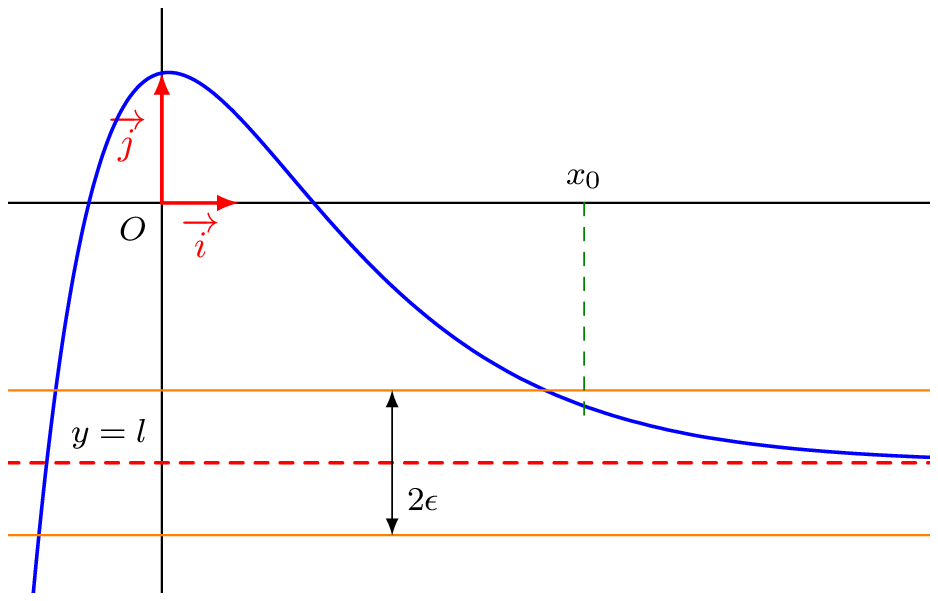
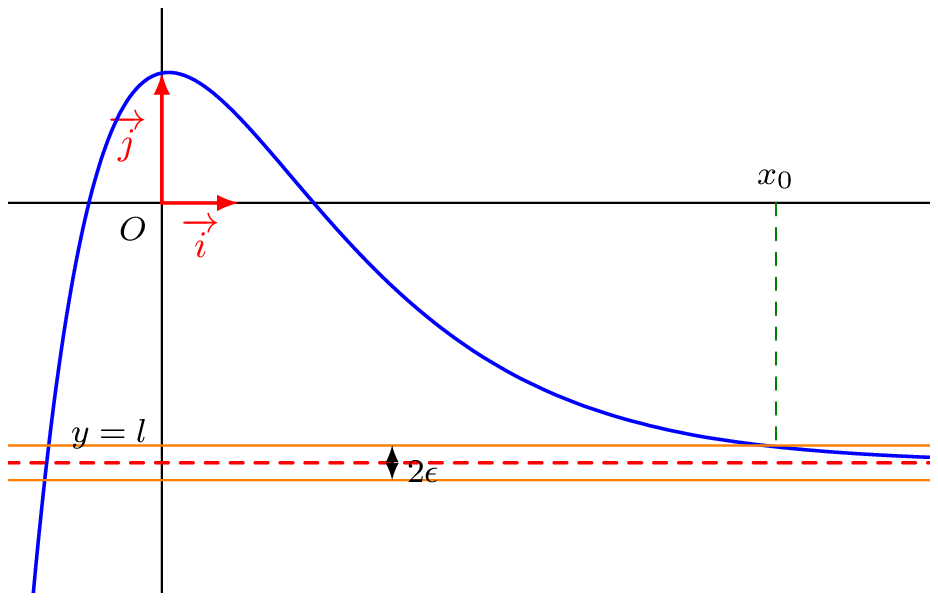
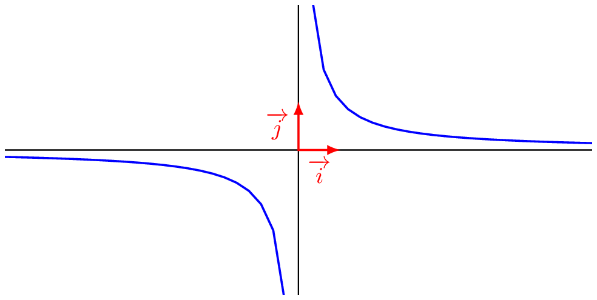

## Limite finie

::: {.bloc .def}
Définition : 

Soit $l \in \mathbb{R}$ et $f$ une fonction définie sur $D_f$.  
On dit que $f$ admet une limite finie $l$ en $+\infty$ (resp. $-\infty$) et on note $$\lim_{x \to +\infty} f(x)= l \quad \left( \text{resp. } \lim_{x \to -\infty} f(x)= l\right)$$
lorsque :
$$\forall \epsilon > 0, \, \exists x_0 \in D_f, \,\forall x \in D_f, \, (x \geqslant x_0 \Rightarrow |f(x)-l| \leqslant \epsilon) \quad \left(\text{resp. } (x \leqslant x_0 \Rightarrow |f(x)-l| \leqslant \epsilon) \right) $$
:::

::: {.bloc .ex}
Soit $f:x \longmapsto (2x+3)\e^{-0,63x}-2$

Illustration : 
   

  
    

 

:::
::: {.bloc .thm}
Propriété : Unicité de la limite

Soit $f$ une fonction admettant une limite finie $l$ en $\pm \infty$.  
Alors le réel $l$ est unique et ce nombre est appelé la limite de $f$ au voisinage de $\pm \infty$.
:::

Démonstration : 

On suppose qu'il existe deux limites distinctes $l$ et $l'$.  
Par définition on a :
$$\forall \epsilon > 0, \, \exists x_0 \in D_f, \,\forall x \in D_f, \, (x \geqslant x_0 \Rightarrow |f(x)-l| \leqslant \epsilon)$$
et 
$$\forall \epsilon > 0, \, \exists x_1 \in D_f, \,\forall x \in D_f, \, (x \geqslant x_1 \Rightarrow |f(x)-l'| \leqslant \epsilon)$$
Soit alors $\epsilon = \dfrac{|l-l'|}{4}$ et $x_{max} = \max(x_0,x_1)$.  
Ainsi pour tout réel $x \geqslant x_{max}$ :
$$|l-l'| = |f(x)-l' - (f(x)-l)| \leqslant |f(x)-l'| + |f(x)-l| \leqslant \dfrac{|l-l'|}{4} + \dfrac{|l-l'|}{4} = \dfrac{|l-l'|}{2}$$
Ce qui est impossible, d'où l'unicité de la limite.

::: {.bloc .ex}

Exemple :   

Soit $f:x \longmapsto 2+\dfrac{1}{x}$ définie sur $\mathbb{R}^*$.  
Démontrer que $$\lim_{x \to + \infty} f(x) = 2$$

Afficher la correction :

La fonction inverse étant décroissante sur $\mathbb{R}^*_+$, on a $$x \geqslant x_0 \Rightarrow \dfrac{1}{x} \leqslant \dfrac{1}{x_0}$$
Soit $x_0 = \dfrac{1}{\epsilon}$, alors :
$$ \forall x \in \mathbb{R}, \, \left(x \geqslant x_0 \Rightarrow |f(x) - 2| \leqslant \dfrac{1}{x_0}\right) \iff |f(x) - 2| \leqslant \epsilon$$
Ainsi, par définition, $\lim_{x \to +\infty} f(x) = 2$.

:::

::: {.bloc .ex}

Exemple :   

On considère la fonction $f$ définie sur $\mathbb{R}$ par $f(x) = \cos(\pi x)$. Montrons qu'elle n'admet pas de limite en l'infini.

Afficher la correction :

Si la fonction admet une limite alors elle est unique et $$\lim_{x \to +\infty} \cos( \pi x) = l$$

* On considère les $x_n = 2n$, alors $\cos(\pi x_n) = \cos(2 \pi n) = 1$, ainsi $$\lim_{n \to +\infty} \cos(2 n \pi) = 1.$$
* On considère les $y_n = 2n+1$, alors $\cos(\pi y_n) = \cos(2 \pi n +\pi) = \cos(\pi) = -1$, ainsi $$\lim_{n \to +\infty} \cos(2 n \pi + \pi) = -1.$$
La fonction admettant alors deux limites différentes selon les valeurs de $x$ en l'infini, elle ne peut en admettre aucune.

:::

::: {.bloc .thm}
Propriété : 

On considère $n \in \mathbb{N}^*$
$$\lim_{x \to +\infty} \dfrac{1}{x^n}= 0  \qquad \lim_{x \to + \infty} \dfrac{1}{\sqrt{x}}= 0    \qquad \qquad \lim_{x \to - \infty} \dfrac{1}{x^n} = \begin{cases}
0^+, \text{ si } n \text{ pair}\\
0^-, \text{ si } n \text{ impair}
\end{cases} $$
:::

::: {.bloc .rem}
Remarque :  

  

On parle de $0^+$ et $0^-$. En effet, il s'agit de savoir si on s'approche de $0$ par des valeurs inférieures ou de $0$ par des valeurs supérieures.
:::

 <a class="prev" href="limite_infini_infinie.html">⬅️</a>
  <a class="next" href="limite_asymptote.html">➡️</a>

