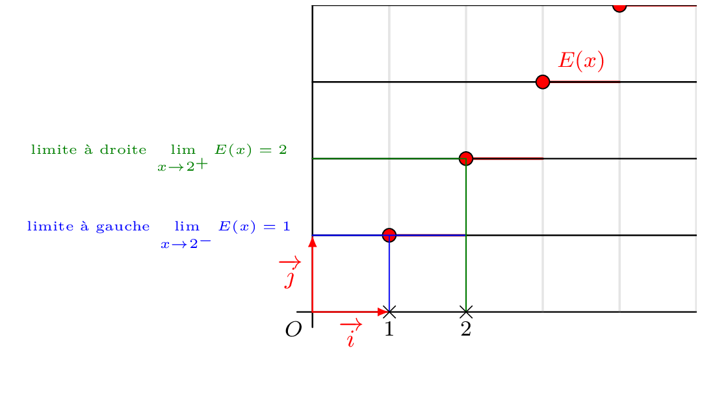

::: {.bloc}
Certaines fonctions n'ont pas le même comportement suivant que $x$ tend vers $a$ par valeurs supérieures ou par valeurs inférieures à $a$. On introduit alors la notion, plus subtile, de limite à gauche et limite à droite.

:::

::: {.bloc .def}
Définition :  
On dit que $f(x)$ tend vers $l$ quand $x$ tend vers $a$ par valeurs supérieures (resp. par valeurs inférieures) si la restriction de $f$ à $]a\, ; \, +\infty[$ (resp. $]-\infty \, ; a [$) tend vers $l$ quand $x$ tend vers $a$.

On note alors $$\lim_{x \to a^+} f(x)= l \quad  \left( \text{resp. } \lim_{x \to a^-} f(x) \right)$$
:::

::: {.bloc .rem}
Remarque :  
On peut évidemment donner une définition quantifiée pour la limite par valeurs supérieures :

$$\forall \epsilon >0, \, \exists \delta  >0,\, \forall x \in I,  (0 \leqslant x - a \leqslant \delta  \Rightarrow \abs{f(x)-l} \leqslant \epsilon)$$
:::

::: {.bloc .ex}
Exemple : 
Soit $f$ définie sur $\R$ par 

$$f(x)=\left\{\begin{array}{l}
x-1 \, ,\text{ si } x \geqslant 0\\
x+1 \, ,\text{ sinon} 
\end{array} \right.$$

Alors 

$$\lim_{x \to 1^+} f(x) = 0 \et  \lim_{x \to 1^-} f(x)=2.$$

On observe que la limite à droite et la limite à gauche ne sont pas les mêmes.
:::

::: {.bloc .thm}
Propriété (admises) :  
Soit $I$ un intervalle et $a \in I$. Soit $f$ une fonction.

- Si $f$ est définie sur $I$ sauf en $a$, alors $f$ possède une limite en $a$ si et seulement si $f$ possède une limite à droite et une limite à gauche, et si elles sont égales.
- Si $f$ est définie sur $I$, alors $f$ possède une limite en $a$ si et seulement si $f$ possède une limite à droite et une limite à gauche, et si elles sont égales à $f(a)$.

:::

::: {.bloc .ex}
Exemple : 
Soit $f$ définie sur $\R$ par 
$$f(x)=\left\{
\begin{array}{l}
x^2-2x\, , \text{ si } x < 0\\
x+1\, , \text{ si } x > 0\\
1\, , \text{ si } x=0\\
\end{array} \right.$$

Afficher la correction :

On a $\lim_{x \to 0^-} f(x)=0$, $\lim_{x \to 0^+} f(x) = 1$ et $f(0)=1$.

D'après la propriété $f$ n'admet donc pas de limite en $0$.

:::

::: {.bloc .ex}
Exemple : 
On considère la fonction partie entière $:x \longmapsto E(x)$, dont on donne la représentation graphique.

  

On peut conclure que la fonction partie entière n'admet aucune limite en $x \in \Z$. 

Elle admet cependant des limites à gauche et à droite en tout point de $\Z$.

:::

 <a class="prev" href="limite_en_a_propriete.html">⬅️</a>
  <a class="next" href="limite_infinie_en_a.html">➡️</a>

