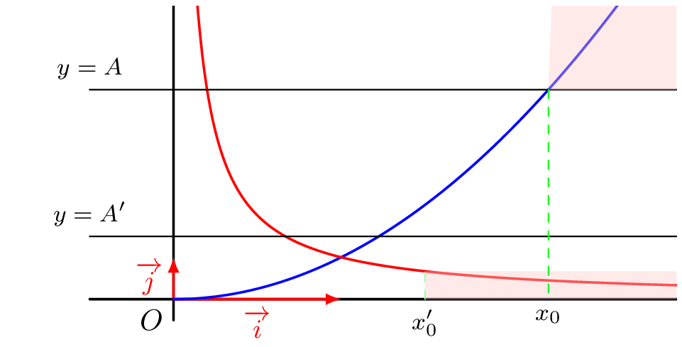
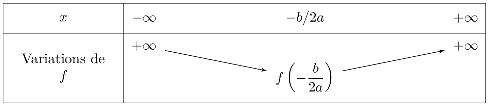

------

## Notion de limite en l'infinie
::: {.bloc .rem}
On considère une fonction $f$ définie sur un ensemble $D_f$, contenant l'intervalle $[a \, ; +\infty[$ (ou $]-\infty \, ; \, a]$.)
:::

::: {.bloc .def}
Définition : 

**La limite** d’une fonction $f$ en $+\infty$ (resp. $-\infty$) est la valeur vers laquelle se rapproche $f(x)$ quand $x$ tend vers $+\infty$  (resp. $-\infty$ ).

On la note $$\lim_{x \to +\infty} f(x) \quad \text{ (resp. }\lim_{x \to -\infty} f(x) \text{ )}$$

:::

::: {.bloc .ex}
Exemple : 
   

  

 
Intuitivement :
$$\lim_{x \to +\infty} \frac{1}{x} = 0 \,\,\, \text{ et } \,\,\, \lim_{x \to +\infty} x^2 = + \infty$$

* En effet, plus $x > 0$ devient grand, plus le rapport $\dfrac{1}{x}$ devient infiniment petit positif.
* Plus $x$ devient grand, plus $x^2$ devient grand !

:::

----

## Limite infinie
::: {.bloc .def}
Définition : 

Soit $f$ une fonction définie sur $D_f$.  
On dit que $f$ tend vers $+\infty$ (resp. $-\infty$) lorsque $x$ tend vers $+\infty$ et on note $$\lim_{x \to +\infty} f(x)= + \infty \quad \left( \text{resp. } \lim_{x \to +\infty} f(x)= -\infty \right)$$
lorsque 
$$\forall A \in \mathbb{R}, \, \exists x_0 \in D_f, \, \forall x \in \mathbb{R}, \, (x \geqslant x_0 \Rightarrow f(x) \geqslant A) \quad \left( \text{resp. } f(x) \leqslant A \right) $$
:::

::: {.bloc .ex}

Exemple : La racine carrée 

Montrer que $$\lim_{x \to + \infty} \sqrt{x} = + \infty$$

Afficher la correction :

On considère $A$ un réel positif, ainsi $x \geqslant A^2 \Rightarrow \sqrt{x} \geqslant A$.  
En prenant $x_0= A^2$, on a déterminé un réel $x_0$ tel que :
$$\forall x \in \mathbb{R}, \, (x \geqslant x_0 \Rightarrow f(x) \geqslant A)$$
Donc par définition $$\lim_{x \to +\infty} \sqrt{x} = +\infty$$

:::

::: {.bloc .def}
Définition : 

Soit $f$ une fonction définie sur $D_f$.  
On dit que $f$ tend vers $+\infty$ (resp. $-\infty$) lorsque $x$ tend vers $-\infty$ et on note $$\lim_{x \to -\infty} f(x)= + \infty \quad \left( \text{resp. } \lim_{x \to -\infty} f(x)= -\infty \right)$$
lorsque $$\forall A \in \mathbb{R}, \, \exists x_0 \in D_f, \, \forall x \in \mathbb{R}, \, (x \leqslant x_0 \Rightarrow f(x) \geqslant A) \quad \left( \text{resp. } f(x) \leqslant A \right) $$
:::

::: {.bloc .ex}

Exemple : Une fonction affine 

Soit $f :x \longmapsto ax+b$, où $a < 0$.  
Montrer que $$\lim_{x \to -\infty} f(x) = + \infty$$

Afficher la correction :

Soit alors $x_0 = \dfrac{A-b}{a}$ (qui est un nombre négatif car $a < 0$ et on peut choisir $A$ tel que $A-b > 0$).  
On a alors $$\forall x \in \mathbb{R}, \, (x \leqslant x_0 \Rightarrow f(x) \geqslant A)$$
Donc par définition $\lim_{x \to -\infty} f(x) = +\infty$.

:::

::: {.bloc .thm}
Propriété (admis) : 

On considère $n \in \mathbb{N}^*$.
$$\lim_{x \to + \infty} x^n= + \infty  \qquad \lim_{x \to + \infty} \sqrt{x}= + \infty    \qquad \qquad \lim_{x \to - \infty}{x^n} = \begin{cases}
+\infty\, \text{ si } n \text{ pair}\\
-\infty\, \text{ si } n \text{ impair}
\end{cases} $$
:::

::: {.bloc .ex}

Exemple : 

On considère une fonction polynôme de degré $2$, $f$ définie sur $\mathbb{R}$ par $f(x)=ax^2+bx+c$ où $a > 0$. 

Montrer que $$\lim_{x \to \pm \infty} f(x)= + \infty$$

Afficher la correction :

On considère $A \in \mathbb{R}$, ainsi pour tout réel $x$, $f(x)- A = ax^2+bx+(c-A)$.  
Ce trinôme admet comme discriminant $\Delta_A=b^2-4a(c-A)$.  
Pour $A$ suffisamment grand, $c-A < 0$ donc $\Delta_A > 0$.  
En notant $x_1$ et $x_2$ les deux racines où $x_1 < x_2$, on a pour tout $x \in ]-\infty\,;\, x_1] \cup [x_2 \,;\, + \infty[$, $f(x)-A \geqslant 0$. 
Ainsi 
$$\lim_{x \to \pm \infty} f(x)= +\infty$$
Le tableau des variations complet de $f$ est alors :

   

  

 

:::

 <a class="prev" href="historique.html">⬅️</a>
  <a class="next" href="limite_finie_infinie.html">➡️</a>

