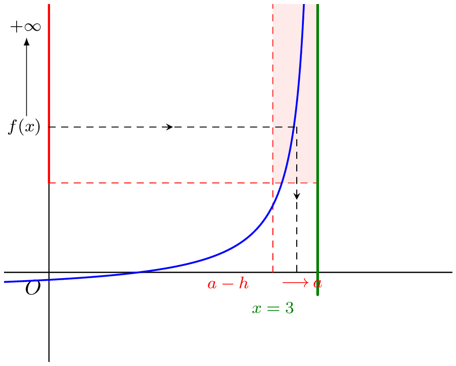
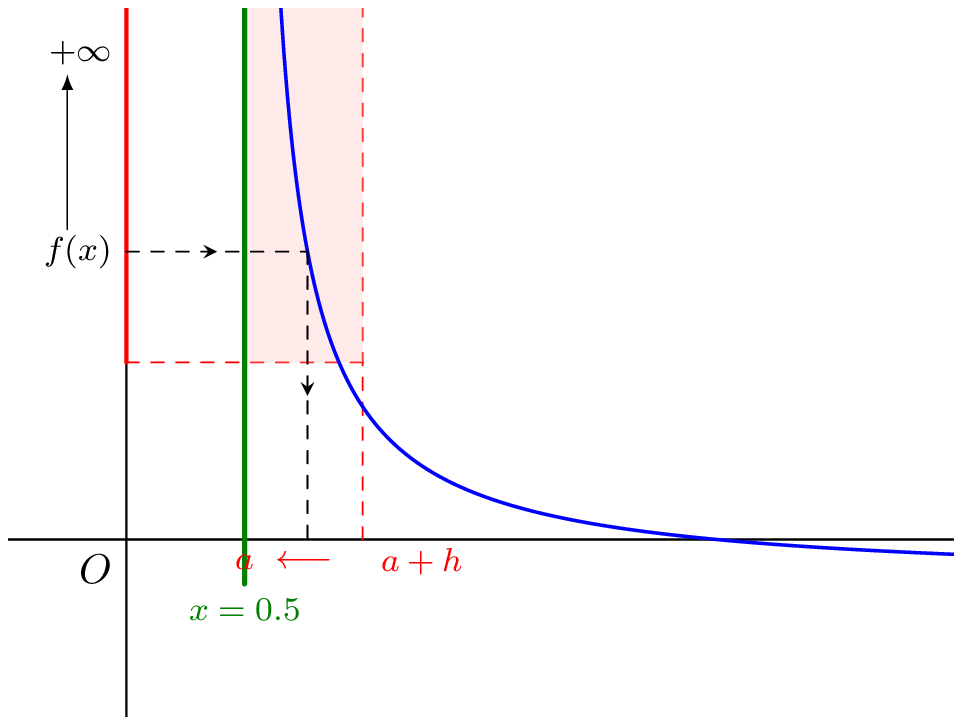
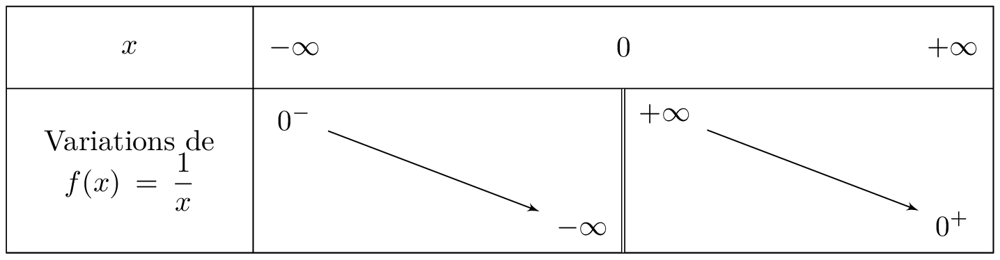

## Définition
::: {.bloc .def}
Definition : 
On dit que $f$ tend vers $+\infty$ quand $x$ tend vers $x_0$ et on note $$\lim_{x \to x_0} f(x) = +\infty$$ lorsque 

$$\forall A >0, \, \exists \delta  >0 , \, \forall x \in \R, \, (\abs{x-x_0} < \delta  \Rightarrow f(x) \geqslant A)$$

:::

::: {.bloc .ex}
Exemples : 
On considère la fonction $f$ définie sur $\R$ par $$f(x) = \frac{1}{x^2}$$.$

la fonction carré étant croissante et la fonction inverse décroissante, on a par composition  

$$\abs{x-0} \leqslant \frac{1}{\sqrt{A}} \Rightarrow f(x) \geqslant A$$
Ce qui prouve, par définition en utilisant $\delta=\frac{1}{\sqrt{A}}$, que 

$$\lim_{x \to 0}\frac{1}{x^2} = +\infty$$

:::

## Interprétation graphique
::: {.bloc .def}
Définition : 
Soit $f$ une fonction définie sur $I-\{a\}$ vérifiant 
$$\lim_{x\to a^+}f(x)=+\infty \quad \text{ou} \quad \lim_{x\to a^-}f(x)=+\infty  \quad \text{ou} \quad  \lim_{x\to a^+}f(x)=-\infty \quad \text{ou} \quad \lim_{x\to a^-}f(x)=-\infty$$

On dit alors que la droite d'équation $x=a$ est une asymptote verticale à la courbe représentative de la fonction $f$. 

:::

::: {.bloc .ex}
Exemple : 

- Cas de la limite en $a^-$ (limite à gauche)

  

On écrit alors $$\lim_{x \to a^-} f(x)= + \infty$$

- Cas de la limite en $a^+$ (limite à gauche)

  

On écrit alors $$\lim_{x \to a^+} f(x)= + \infty$$ 
:::

## Limites de fonctions usuelles

::: {.bloc .thm}
Propriété (admise):  
On considère $n \in \N^*$
$$\lim_{x \to 0^+} \frac{1}{x^n}= +\infty  \qquad \qquad \lim_{x \to 0^+} \frac{1}{\sqrt{x}}= +\infty \qquad \qquad 
\lim_{x \to 0^-}\frac{1}{x^n} = \left\{\begin{array}{l}
+\infty, \text{ si } n \text{ pair}\\
-\infty, \text{ si } n \text{ impair}\\
\end{array} \right.$$

:::

::: {.bloc .ex}
Exemple : 
Tableau des variations de la fonction inverse

  

:::

 <a class="prev" href="limite_gauche_droite.html">⬅️</a>
  <a class="next" href="operations_limites.html">➡️</a>

