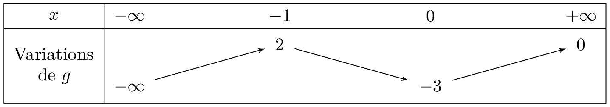

### Somme de limites

::: {.bloc .thm}
Propriété (admis) : 

| Si $\lim_{x\to \alpha}u(x)=$ | $\ell$ | $\ell$ | $\ell$ | $+\infty$ | $-\infty$ | $+\infty$ |
| :--- | :---: | :---: | :---: | :---: | :---: | :---: |
| **et** $\lim_{x\to \alpha}v(x)=$ | $\ell '$ | $+\infty$ | $-\infty$ | $+\infty$ | $-\infty$ | $-\infty$ |
| **alors par somme** $\lim_{x\to \alpha}(u+v)(x)=$ | $\ell + \ell '$ | $+\infty$ | $-\infty$ | $+\infty$ | $-\infty$ | **F.I.** |

:::

::: {.bloc .rem}
Remarque : 
\textbf{F.I.} signifiant forme indéterminée. Ce qui signifie que sans \og traitement \fg on ne peut pas donner la limite de la fonction au point considéré.

Dans ces conditions, il faut lever l'indétermination grâce au calcul pour un autre théorème.
:::

::: {.bloc .ex}

Exemple : Somme de limites 

Soit $f$ la fonction définie sur $]0 ; +\infty[$ par $f(x)=x^2-1+\dfrac{1}{x}$.

* $\lim_{\underset{x>0}{x\to 0}}x^2-1=-1$ et $\lim_{\underset{x>0}{x\to 0}}\dfrac{1}{x}=+\infty$ donc, par somme, $\lim_{\underset{x>0}{x\to 0}}f(x)=+\infty$.  
La courbe représentative de la fonction $f$ admet pour asymptote l'axe des ordonnées.

* $\lim_{x\to +\infty}x^2-1=+\infty$ et $\lim_{x\to +\infty}\dfrac{1}{x}=0$ donc, par somme, $\lim_{x\to +\infty}f(x)=+\infty$.

Afficher la correction :

:::

### Produit de limites
::: {.bloc .thm}
Propriété (admis) : 

| Si $\lim_{x\to \alpha}u(x)=$ | $\ell$ | $\ell \ne 0$ | $+\infty$ ou $-\infty$ | $0$ |
| :--- | :---: | :---: | :---: | :---: |
| **et** $\lim_{x\to \alpha}v(x)=$ | $\ell '$ | $+\infty$ ou $-\infty$ | $+\infty$ ou $-\infty$ | $+\infty$ ou $-\infty$ |
| **alors par produit** $\lim_{x\to \alpha}(u \times v)(x)=$ | $\ell \times \ell '$ | $\pm\infty$ | $\pm\infty$ | **F.I.** |

:::

::: {.bloc .ex}

Exemple :   

Soit $f$ la fonction définie sur $]0 ; +\infty[$ par $f(x)=x^2\times \left(\dfrac{1}{x}-1\right)$.  
Déterminer les limites en $+ \infty$ et en $0$.

Afficher la correction :

* $\lim_{\underset{x>0}{x\to 0}}x^2=0$ et $\lim_{\underset{x>0}{x\to 0}}\left(\dfrac{1}{x}-1\right)=+\infty$. (Nous sommes en présence de la forme indéterminée « $0\times \infty$ ».)  
Pour tout réel $x$ non nul, $x^2\times \left(\dfrac{1}{x}-1\right)=x- x^2$.  
De plus $\lim_{\underset{x>0}{x\to 0}}x- x^2=0$. 

On en déduit que $\lim_{\underset{x>0}{x\to 0}}f(x)=0$.

* $\lim_{x\to +\infty}x^2=+\infty$   
  De plus $\lim_{x t\o + \infty} \dfrac{1}{x}= 0$, donc  $\lim_{x\to +\infty}\left(\dfrac{1}{x}-1\right)=-1$   
  Par produit, $\lim_{x\to +\infty}f(x)=-\infty$.

:::

### Quotient de limites
::: {.bloc .thm}
Propriété (admis) : 

| Si $\lim_{x\to \alpha}u(x)=$ | $\ell$ | $\ell \ne 0$ | $\ell$ | $+\infty$ ou $-\infty$ | $0$ | $+\infty$ ou $-\infty$ |
| :--- | :---: | :---: | :---: | :---: | :---: | :---: |
| **et** $\lim_{x\to \alpha}v(x)=$ | $\ell ' \ne 0$ | $0$ | $+\infty$ ou $-\infty$ | $\ell '$ | $0$ | $+\infty$ ou $-\infty$ |
| **alors par quotient** $\lim_{x\to \alpha}\left(\dfrac{u}{v} \right)(x)=$ | $\dfrac{\ell}{ \ell '}$ | $\pm\infty$ | $0$ | $\pm\infty$ | **F.I.** | **F.I.** |

:::

::: {.bloc .ex}
Exemples : 
Soit $f$ la fonction définie sur $]1 ; +\infty[$ par $f(x)=\dfrac{x^3-1}{x^2-1}$.

Déterminer les limites aux bornes de l'ensemble de définition

Afficher la correction :

- $\lim_{x\to 1}\, x^3-1=0 \et \lim_{x\to 1}  \, x^2-1=0$. 
Nous sommes en présence de la forme indéterminée \og $\dfrac{0}{0}$ \fg.

Or pour tout réel $x \ne 1$, 

$$\dfrac{x^3-1}{x^2-1} = \dfrac{(x-1)(x^2+x+1)}{(x-1)(x+1)} = \dfrac{x^2+x+1}{x+1}$$

Comme 

$$\displaystyle \lim_{x\to 1}\dfrac{x^2+x+1}{x+1}=\dfrac{3}{2}$$ 
    
nous pouvons conclure que, $$\displaystyle \lim_{x\to 1}f(x)=\dfrac{3}{2}$$

- $\displaystyle \lim_{x\to +\infty} \, x^3-1 = +\infty \et \displaystyle \lim_{x\to +\infty} \, x^2-1=+\infty$. 

Nous sommes en présence de la forme indéterminée \og $\dfrac{\infty}{\infty}$\fg.

Or pour pour tout réel $x \ne 0$, 
    
$$\dfrac{x^3-1}{x^2-1} =\dfrac{x^3\left(1-\dfrac{1}{x^3}\right)}{x^2\left(1-\dfrac{1}{x^2}\right)}=\dfrac{x\left(1-\dfrac{1}{x^3}\right)}{1-\dfrac{1}{x^2}}$$ 

Comme 
$$\displaystyle \lim_{x\to +\infty} \, x \left(1-\dfrac{1}{x^3}\right)=+\infty \et \displaystyle \lim_{x\to +\infty}\, 1-\dfrac{1}{x^2}=1$$ 

il s'ensuit que 	$$\displaystyle \lim_{x\to +\infty}\, f(x)=+\infty$$ 

:::

::: {.bloc .ex}
Exemples : 
Soit $g$ la fonction définie sur $\mathbb{R} \setminus \{2\}$ par $g(x) = \dfrac{x+1}{x-2}$.  
Étudier la limite de $g$ en $2$.

Afficher la correction :

* D'une part $$\lim_{x \to 2} (x+1) = 3$$
* D'autre part , $\lim_{x \to 2} (x-2) = 0$. Il faut donc étudier le signe de $x-2$ au voisinage de $2$ :
  
    * Si $x > 2$, $x-2 > 0$, donc $\lim_{x \to 2^+} (x-2) = 0^+$.
    * Si $x < 2$, $x-2 < 0$, donc $\lim_{x \to 2^-} (x-2) = 0^-$.

Par quotient, on conclut :
$$\lim_{x \to 2^+} g(x) = +\infty \quad \text{ et } \quad \lim_{x \to 2^-} g(x) = -\infty$$

:::

### Composée de limites
::: {.bloc .thm}
Propriété : Théorème de composition des limites 
Soit $a,b,c \in \R \cup \{-\infty ; +\infty\}$. 

Si $$\lim_{x \to a} f(x)=b \et \lim_{x \to b} g(x)= c$$ alors $$\lim_{x \to a} (g \circ f)(x) = c$$

:::

Démonstration : 

On considère le cas $a,b,c \in \R$. Par hypothèse on a successivement :

$$\forall \epsilon >0, \; \exists \delta  >0, \forall x \in \R,\; (\abs{f(x)-b} \leqslant \delta  \Rightarrow \abs{(g \circ f)(x)-c} \leqslant \epsilon)$$

et

$$\forall \epsilon' >0, \; \exists \delta'  >0, \forall y \in \R, \; (\abs{x-a} \leqslant \epsilon' \Rightarrow \abs{f(x)-b} \leqslant \delta')$$

Ainsi, en prenant $\epsilon'=\delta$, on a 

$$\forall \epsilon >0, \; \exists \delta, \; \forall x \in I, \; (\abs{x-a} \leqslant \delta  \Rightarrow \abs{g(f(x))-c} \leqslant\epsilon)$$

::: {.bloc .ex}
Exemples : 
On considère la fonction $f$ définie sur $\R$ par $$f(x) = \sqrt{1+x^2}$$
Déterminer sa limite en $+ \infty$

Afficher la correction :

$$
\left . \begin{array}{l}
\lim_{x \to +\infty} 1+x^2 = + \infty\\
\lim_{x \to +\infty} \sqrt{x} = +\infty
\end{array} \right\} \text{ Par composition }
\lim_{x \to + \infty} \sqrt{1+x^2} = + \infty
$$

:::

::: {.bloc .ex}

Exemple :   

Soit $g$ une fonction dérivable sur $\mathbb{R}$ ayant pour tableau de variations :

  

1. Déterminer la limite de $\dfrac{1}{g(x)}$ lorsque $x$ tend vers $-\infty$.

Afficher la correction :

D'après le tableau de variations, on a $$\lim_{x \to -\infty} g(x) = -\infty$$  
Par passage à l'inverse, on déduit que : 
$$\lim_{x \to -\infty} \dfrac{1}{g(x)} = 0$$

2. Déterminer la limite de $g \left(\dfrac{1}{x} \right)$ lorsque $x$ tend vers $+\infty$.

Afficher la correction :

On a $$\lim_{x \to +\infty} \dfrac{1}{x} = 0^+$$  
Or, d'après le tableau, $$\lim_{X \to 0^+} g(X) = -3$$ 
Par composition, on déduit que : 
$$\lim_{x \to +\infty} g \left( \dfrac{1}{x} \right) = -3$$

3. Déterminer la limite de $\dfrac{1}{g(x)-2}$ lorsque $x$ tend vers $-1$.

Afficher la correction :

D'après le tableau des variations, on a $$\lim_{x \to -1} g(x) = 2^-$$  
Ainsi : 
$$\lim_{x \to -1} g(x)-2 = 0^-$$
Or $$\lim_{x \to 0^-} \dfrac{1}{x} = - \infty$$

Donc par composition
$$\lim_{x \to -1} \dfrac{1}{g(x)-2} = -\infty$$

:::

 <a class="prev" href="limite_infinie_en_a.html">⬅️</a>
  <a class="next" href="theoreme_comparaison.html">➡️</a>

