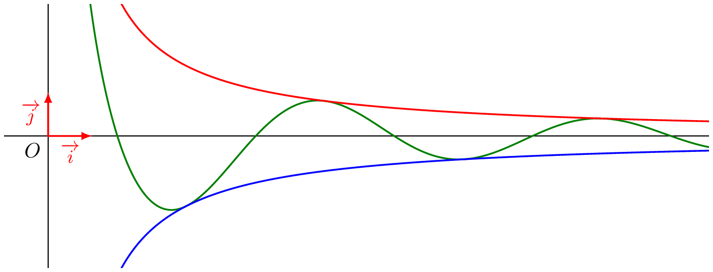

### Théorème d'encadrement

:::: {.bloc .thm}
Propriété : 

On considère $f$, $g$ et $h$ trois fonctions définies sur $D = [a \, ; \, +\infty[$ et telles que $\lim_{x \to +\infty} f(x)= \lim_{x \to +\infty} g(x)=l$.  
Si dans un voisinage de $+\infty$ on a $f \leqslant h \leqslant g$ alors $$\lim_{x \to +\infty} h(x) = l$$
:::

Démonstration : 

Soit $\epsilon >0$ fixé, alors il existe $x_1, x_2 \in D$ tels que :
$$\forall x \in D, \, ( x \geqslant x_1 \Rightarrow |f(x)-l| \leqslant \epsilon ) \qquad \text{ et } \qquad \forall x \in D, \, ( x \geqslant x_2 \Rightarrow |g(x)-l| \leqslant \epsilon)$$
Ainsi pour $x \geqslant x_1$ et $x \geqslant x_2$ on a :
$$l-\epsilon \leqslant f(x) \qquad \text{ et } \qquad g(x) \leqslant l + \epsilon$$
De plus, $$\exists x_3\in D, \,( x \geqslant x_3 \Rightarrow f(x) \leqslant h(x) \leqslant g(x))$$
Soit $x_{max} = \max\{x_1, x_2, x_3\}$, alors :
$$\forall x \geqslant x_{max}, \quad l- \epsilon \leqslant f(x) \leqslant h(x) \leqslant g(x) \leqslant l + \epsilon$$
Ce qui est la définition de $$\lim_{x \to +\infty} h(x) = l$$

::: {.bloc .ex}

Exemple :   

On considère la fonction $f$ définie sur $\mathbb{R}^*_+$ par $f(x)= \dfrac{5\cos(x)}{x}$. Déterminons la limite en $+\infty$.  

Afficher la correction :

Pour tout réel $x>0$ :
$$-1 \leqslant \cos(x) \leqslant 1 \Longrightarrow -5 \leqslant 5 \cos(x) \leqslant 5 \Longrightarrow \dfrac{-5}{x} \leqslant f(x) \leqslant \dfrac{5}{x}$$
Or $$\lim_{x \to +\infty} \dfrac{5}{x} = \lim_{x \to +\infty} \dfrac{-5}{x} = 0$$
On déduit du théorème d'encadrement que $$\lim_{x \to +\infty} f(x) = 0$$

  

:::

::: {.bloc .thm}
Propriété : Prolongement des inégalités

Soient $f$ et $g$ deux fonctions définies au voisinage de $\pm\infty$ et ayant pour limites respectives $l$ et $l'$.  
S'il existe $x_0$, tel que $\forall x \geqslant x_0, \, f(x) < g(x)$ alors $$l \leqslant l'$$
:::

### Théorème de comparaison

::: {.bloc .thm}
Propriété (admis) : 

Soient $f$ et $g$ deux fonctions définies au voisinage de $+\infty$ telles que $\lim_{x \to + \infty}f(x) = +\infty$.  
S'il existe un réel $a$ tel que pour tout $x \in ]a\, ; \, +\infty[, \, f(x) \leqslant g(x)$ alors $$\lim_{x \to +\infty} g(x) = +\infty$$
:::

::: {.bloc .ex}

Exemple :   

1. Soient $f$ et $g$ les fonctions définies respectivement par $f(x)=x+1$ et $g(x)=\e^x$ sur $\R$.  
Déterminer $$\lim_{x \to + \infty} \e^x$$

Afficher la correction :

La droite d'équation $y=x+1$ est la tangente au point d'abscisse $0$ à la représentation graphique de la fonction exponentielle.  
La fonction exponentielle étant convexe sur $\mathbb{R}$, on déduit que pour tout réel $x$ :
$$x+1 \leqslant \e^x$$
Or $\lim_{x \to +\infty} (x+1) = +\infty$.  
Par comparaison, on déduit que :
$$\lim_{x \to +\infty} \e^x = +\infty$$

2. En déduire $\lim_{x \to 0^+} \exp\left(\sqrt{1+\dfrac{1}{x^2}}\right)$ 

Afficher la correction :

$$
\left. \begin{array}{lll}
\left . \begin{array}{l}
\lim_{x \to 0^+} 1+\dfrac{1}{x^2} = + \infty\\
\lim_{y \to +\infty} \sqrt{y} = +\infty
\end{array} \right\} \text{ Par composition } &\lim_{x \to 0^+} \sqrt{1+\dfrac{1}{x^2}} = + \infty&    \\
&\lim_{y \to +\infty} \e^{y} = +\infty &  \end{array} \right\} \text{ Par composition } \lim_{x \to 0^+} f(x) = + \infty$$

:::

::: {.bloc .thm}
Propriété : Prolongement des inégalités 
Soient $f$ et $g$ deux fonctions définies au voisinage de $\pm\infty$ et ayant pour limites respectives $l$ et $l'$.

S'il existe $x_0$, tel que $\forall x \geqslant x_0, \, f(x) < g(x)$ alors 

$$l \leqslant l'$$

:::

Démonstration : 

On raisonne par l'absurde.

On suppose que $l > l'$, alors $l-l' >0$.

Donc par définition dans un voisinage de $\infty$, la fonction $f-g$ est positive ce qui est exclu par hypothèse.

::: {.bloc .rem}
Remarque :  
Par passage à la limite, on passe d'inégalités strictes à des inégalités larges.
:::

 <a class="prev" href="operations_limites.html">⬅️</a>
  <a class="next" href="limite_exponentielle.html">➡️</a>

